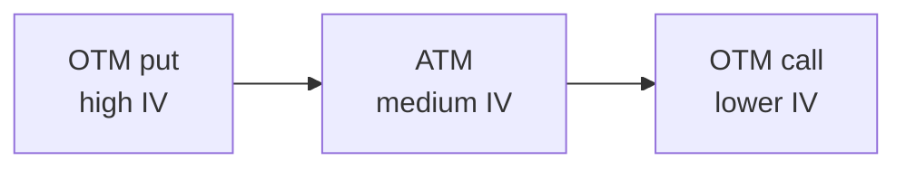

# Black-Scholes and the Greeks

In 1973, two months after the Chicago Board Options Exchange opened, **Fischer Black** and **Myron Scholes** published "The Pricing of Options and Corporate Liabilities". The same year **Robert Merton** developed the same equation with a more rigorous approach. A closed-form model for European option prices was born: the **Black-Scholes-Merton formula**.

The impact was enormous. For the first time traders had a mathematical reference to judge whether an option was rich or cheap. Option desks exploded. Scholes and Merton won the **1997 Nobel** (Black had died two years earlier). And the same year, ironically, the LTCM hedge fund where both worked defaulted on a $100B exposure.

In this chapter: model assumptions, sketch of the PDE, closed-form for European call, step-by-step numerical calculation, put-call parity, the five Greeks (Delta, Gamma, Vega, Theta, Rho), implied volatility, smile/skew, alternative models (Heston, SABR), dynamic hedging, Python implementation.

## 1. Model assumptions

Black-Scholes doesn't work "by magic". It rests on strong assumptions:

1. **Lognormal underlying**: log-returns are normally distributed with constant mean and variance. Equivalently: $S_T$ follows geometric Brownian motion.
2. **Constant volatility $\sigma$** across time and strikes. (False in the real world: see §10.)
3. **Constant risk-free rate $r$** and default-free.
4. **No dividends** (base version; Merton variant adds $q$).
5. **No transaction costs**, no taxes, divisible underlying.
6. **Unlimited short selling** and free funding access.
7. **No arbitrage**.
8. **Continuous markets**: portfolios can be rebalanced continuously.
9. **European option**: exercise only at maturity.

None hold perfectly, but the model works "well enough" for near-the-money options on liquid underlyings.

## 2. Sketch of the Black-Scholes-Merton PDE

Build portfolio $\Pi$ of one option plus $-\Delta$ units of the underlying. Writing $\Pi$'s evolution via Itô's lemma and requiring instantaneous risk-free return (no arbitrage), you obtain the PDE:

$$\frac{\partial V}{\partial t} + \frac{1}{2}\sigma^2 S^2 \frac{\partial^2 V}{\partial S^2} + rS\frac{\partial V}{\partial S} - rV = 0$$

With boundary condition $V(S,T) = \max(S-K,0)$ for a call. The explicit solution is the closed-form below. (See Hull, *Options Futures*, ch. 15 for the rigorous derivation; or Wilmott, *Quantitative Finance*.)

## 3. The closed-form

For a **European call** on a non-dividend-paying underlying:

$$\boxed{C = S_0 \Phi(d_1) - K e^{-rT} \Phi(d_2)}$$

For a **European put**:

$$\boxed{P = K e^{-rT} \Phi(-d_2) - S_0 \Phi(-d_1)}$$

Where:

$$d_1 = \frac{\ln(S_0/K) + (r + \sigma^2/2)T}{\sigma\sqrt{T}}$$

$$d_2 = d_1 - \sigma\sqrt{T} = \frac{\ln(S_0/K) + (r - \sigma^2/2)T}{\sigma\sqrt{T}}$$

And $\Phi(\cdot)$ is the **standard normal CDF** (integral of the Gaussian bell).

### 3.1 Intuitive interpretation

- $\Phi(d_2)$ is (under the risk-neutral measure) the **probability the option ends ITM** (i.e. $S_T > K$).
- $\Phi(d_1)$ is the call's **delta**, i.e. price sensitivity to the underlying.
- $S_0 \Phi(d_1)$ is the expected underlying value conditional on exercise.
- $K e^{-rT} \Phi(d_2)$ is the PV of the strike paid on exercise.

In short: call price = (expected value of receiving the underlying if exercised) − (PV of strike if exercised).

## 4. Step-by-step numerical calculation

Concrete example: $S=100$, $K=100$, $r=4\%$, $\sigma=20\%$, $T=1$ year. Compute the European call price.

**Step 1**: compute $d_1$.

$$d_1 = \frac{\ln(100/100) + (0.04 + 0.20^2/2) \cdot 1}{0.20 \cdot \sqrt{1}}$$

$$d_1 = \frac{0 + (0.04 + 0.02)}{0.20} = \frac{0.06}{0.20} = 0.30$$

**Step 2**: compute $d_2$.

$$d_2 = d_1 - \sigma\sqrt{T} = 0.30 - 0.20 = 0.10$$

**Step 3**: read $\Phi(d_1)$ and $\Phi(d_2)$ from standard normal tables.

| z | Φ(z) |
|---|---|
| 0.00 | 0.5000 |
| 0.10 | 0.5398 |
| 0.20 | 0.5793 |
| 0.30 | 0.6179 |
| 0.40 | 0.6554 |
| 0.50 | 0.6915 |

So $\Phi(0.30) = 0.6179$ and $\Phi(0.10) = 0.5398$.

**Step 4**: compute $e^{-rT}$.

$$e^{-0.04 \cdot 1} = e^{-0.04} \approx 0.9608$$

**Step 5**: assemble the formula.

$$C = 100 \cdot 0.6179 - 100 \cdot 0.9608 \cdot 0.5398$$

$$C = 61.79 - 51.86 = 9.93$$

**Call price ≈ 9.93**.

**Step 6** (bonus): get the put via parity.

$$P = C - S_0 + K e^{-rT} = 9.93 - 100 + 96.08 = 6.01$$

Direct check:

$$P = K e^{-rT} \Phi(-d_2) - S_0 \Phi(-d_1)$$
$$= 96.08 \cdot (1 - 0.5398) - 100 \cdot (1 - 0.6179)$$
$$= 96.08 \cdot 0.4602 - 100 \cdot 0.3821$$
$$= 44.21 - 38.21 = 6.00$$

(The small gap from 6.01 is rounding in the tables.)

## 5. Put-Call Parity (check)

For European options without dividends:

$$C - P = S_0 - K e^{-rT}$$

Our example: $C - P = 9.93 - 6.00 = 3.93$. And $S_0 - Ke^{-rT} = 100 - 96.08 = 3.92$. Matches (rounding error).

If it failed, an arbitrage would exist: sell the rich leg, buy the synthetic, lock the profit.

## 6. The Greeks: price sensitivities

The **Greeks** are partial derivatives of the option price with respect to the various parameters. Used to **manage the risk** of an option book.

### 6.1 Delta

$$\Delta = \frac{\partial C}{\partial S} = \Phi(d_1) \quad \text{(call)}$$

$$\Delta = \Phi(d_1) - 1 = -\Phi(-d_1) \quad \text{(put)}$$

| Type | Delta range |
|---|---|
| Call deep ITM | → 1 |
| Call ATM | ≈ 0.5 |
| Call deep OTM | → 0 |
| Put deep ITM | → −1 |
| Put ATM | ≈ −0.5 |
| Put deep OTM | → 0 |

Interpretation: if underlying rises by $1, a call with $\Delta=0.6$ rises by $0.6. Delta is also the hedge ratio: to hedge 1 short call you buy $\Delta$ units of underlying (delta hedging).

Our example: $\Delta_{\text{call}} = \Phi(0.30) = 0.6179$.

### 6.2 Gamma

$$\Gamma = \frac{\partial^2 C}{\partial S^2} = \frac{\phi(d_1)}{S_0 \sigma \sqrt{T}}$$

Where $\phi(\cdot)$ is the standard normal density: $\phi(z) = \frac{1}{\sqrt{2\pi}} e^{-z^2/2}$.

Gamma is **convexity**: tells how Delta changes when $S$ changes. Maximum ATM, decreases both ITM and OTM. Always positive for long call and long put.

Our example: $\phi(0.30) = \frac{1}{\sqrt{2\pi}} e^{-0.045} \approx 0.3814$. So $\Gamma = 0.3814 / (100 \cdot 0.20 \cdot 1) = 0.01907$. If $S$ rises by 1, $\Delta$ rises by 0.019.

### 6.3 Vega

$$\mathcal{V} = \frac{\partial C}{\partial \sigma} = S_0 \sqrt{T} \cdot \phi(d_1)$$

(Note: Vega isn't a real Greek letter, just a convention.)

Vega measures sensitivity to $\sigma$. A 1 percentage point move (e.g. 20% to 21%) changes the price by Vega/100.

Our example: $\mathcal{V} = 100 \cdot 1 \cdot 0.3814 = 38.14$. With vol moving from 20% to 21%, call goes from 9.93 to ~9.93 + 0.3814 = **10.31**.

### 6.4 Theta

$$\Theta_{\text{call}} = -\frac{S_0 \sigma \phi(d_1)}{2\sqrt{T}} - rK e^{-rT}\Phi(d_2)$$

Theta is the **time derivative** (always negative for long options): time value "decays" as maturity approaches. The famous **time decay**.

Our example (annualized):
$$\Theta = -\frac{100 \cdot 0.20 \cdot 0.3814}{2} - 0.04 \cdot 96.08 \cdot 0.5398 \approx -3.81 - 2.07 = -5.88 \text{ €/year}$$

Divided by 252 trading days: ≈ **−€0.023/day**. Every day, the call loses 2.3 cents (other things equal).

### 6.5 Rho

$$\rho_{\text{call}} = KT e^{-rT} \Phi(d_2)$$

Sensitivity to the risk-free rate. Higher $r$ → higher call price (opportunity cost of holding cash). Rho is the "least important" Greek because $r$ moves little over short horizons.

Our example: $\rho = 100 \cdot 1 \cdot 0.9608 \cdot 0.5398 \approx 51.86$. 1pp change in $r$ → 0.5186 impact on price.

### 6.6 Summary table

Greeks at our point $S=100, K=100, r=4\%, \sigma=20\%, T=1$:

| Greek | Value | Practical meaning |
|---|---|---|
| $\Delta$ (Delta) | 0.6179 | +€1 in S → +€0.62 in C |
| $\Gamma$ (Gamma) | 0.01907 | +€1 in S → +0.019 in $\Delta$ |
| $\mathcal{V}$ (Vega) | 38.14 | +1pp σ → +€0.38 in C |
| $\Theta$ (Theta) | −5.88/year | each day: −€0.023 |
| $\rho$ (Rho) | 51.86 | +1pp r → +€0.52 in C |

## 7. Implied volatility

All formula parameters are observable **except $\sigma$**. So in practice you go the other way: given market price $C_{\text{mkt}}$, find the $\sigma$ that plugged into the formula returns $C_{\text{mkt}}$.

$$\sigma_{\text{implied}} : BS(S, K, r, T, \sigma) = C_{\text{mkt}}$$

Solved numerically (Newton-Raphson or bisection). Implied volatility (IV) is the "market's forecast" of future underlying volatility.

### 7.1 VIX

The **VIX** (CBOE Volatility Index) is a weighted average of 30-day IV from S&P 500 options. The market's "fear gauge":

- VIX < 15: low expected vol, calm market.
- VIX 15–25: normal.
- VIX > 30: stress.
- VIX > 50: panic (e.g. 2008, March 2020 COVID).

## 8. Volatility smile and skew

Implied volatility isn't constant (contrary to Black-Scholes assumption). Plotted against strike $K$ it takes characteristic shapes.

### 8.1 Smile

In FX and indices, deep ITM/OTM options have higher IV than ATM. Smile-shaped curve.

### 8.2 Skew

On equity indices (S&P 500, FTSE MIB), OTM put IV is much higher than OTM call IV. The **volatility skew**, appeared visibly after the **19 October 1987** crash ("Black Monday"). Reflects market fear of downside crashes.



Implication: Black-Scholes with constant $\sigma$ underprices OTM puts and overprices OTM calls vs market. Hence more sophisticated models.

## 9. Alternative models (sketches)

### 9.1 Heston (1993)

**Stochastic** volatility following its own mean-reverting process:

$$dv_t = \kappa(\theta - v_t)dt + \xi\sqrt{v_t}\,dW_t$$

Naturally generates smile/skew. Semi-analytic pricing via Fourier transform. Used by investment banks for FX and equity index.

### 9.2 SABR (2002, Hagan et al.)

4-parameter model ($\alpha, \beta, \rho, \nu$) very popular for interest rate options (swaptions). Good empirical skew fit.

### 9.3 Jump models (Merton 1976, Kou 2002)

Add a Poisson process to the underlying. Capture gaps and crashes.

### 9.4 Local volatility (Dupire 1994)

$\sigma(S,t)$ is a deterministic function of underlying and time. Calibrates perfectly to an observed IV surface, but poor at generating future dynamics.

## 10. Dynamic hedging (delta hedging)

Idea: if you sell a call and want to be "neutral" to the underlying, buy $\Delta$ shares. But since $\Delta$ changes (Gamma!), you must **rebalance** continuously.

Example: sell 100 calls with $\Delta = 0.6$ (60 equivalent shares). Buy 60 shares. Next day $S$ rose, $\Delta$ is 0.65 → buy 5 more shares. Rebalance.

Costs: every rebalance incurs commissions and bid-ask spread. In theory (Black-Scholes) continuous delta hedging perfectly replicates the option. In practice there's replication error + costs. Option desk "P&L attribution" decomposes P&L between Theta (collected by selling options), Vega (IV exposure), Gamma scalping (rebalancing P&L), Rho.

## 11. Python implementation

```python
import numpy as np
from scipy.stats import norm

def bs_call(S, K, r, T, sigma):
    d1 = (np.log(S/K) + (r + 0.5*sigma**2)*T) / (sigma*np.sqrt(T))
    d2 = d1 - sigma*np.sqrt(T)
    C  = S*norm.cdf(d1) - K*np.exp(-r*T)*norm.cdf(d2)
    return C

def bs_put(S, K, r, T, sigma):
    d1 = (np.log(S/K) + (r + 0.5*sigma**2)*T) / (sigma*np.sqrt(T))
    d2 = d1 - sigma*np.sqrt(T)
    P  = K*np.exp(-r*T)*norm.cdf(-d2) - S*norm.cdf(-d1)
    return P

def greeks(S, K, r, T, sigma):
    d1 = (np.log(S/K) + (r + 0.5*sigma**2)*T) / (sigma*np.sqrt(T))
    d2 = d1 - sigma*np.sqrt(T)
    delta = norm.cdf(d1)
    gamma = norm.pdf(d1) / (S*sigma*np.sqrt(T))
    vega  = S*np.sqrt(T)*norm.pdf(d1)
    theta = -S*sigma*norm.pdf(d1)/(2*np.sqrt(T)) - r*K*np.exp(-r*T)*norm.cdf(d2)
    rho   = K*T*np.exp(-r*T)*norm.cdf(d2)
    return dict(delta=delta, gamma=gamma, vega=vega, theta=theta, rho=rho)

# Example
print(bs_call(100, 100, 0.04, 1, 0.20))   # ~9.93
print(greeks(100, 100, 0.04, 1, 0.20))
```

For **implied volatility** use Newton-Raphson:

```python
def implied_vol(C_mkt, S, K, r, T, tol=1e-6, max_iter=100):
    sigma = 0.2  # initial guess
    for _ in range(max_iter):
        price = bs_call(S, K, r, T, sigma)
        d1 = (np.log(S/K) + (r + 0.5*sigma**2)*T) / (sigma*np.sqrt(T))
        vega = S*np.sqrt(T)*norm.pdf(d1)
        diff = price - C_mkt
        if abs(diff) < tol:
            return sigma
        sigma -= diff / vega
    return sigma
```

## 12. Exercises

<details><summary>Exercise: European put price</summary>

$S=100$, $K=110$, $r=3\%$, $\sigma=25\%$, $T=0.5$. Compute the put price.

1. $d_1 = [\ln(100/110) + (0.03 + 0.5\cdot 0.0625)\cdot 0.5] / (0.25 \cdot \sqrt{0.5}) = [-0.0953 + 0.03065] / 0.1768 = -0.0647/0.1768 = -0.366$.
2. $d_2 = -0.366 - 0.1768 = -0.543$.
3. $\Phi(-d_1) = \Phi(0.366) \approx 0.6428$.
4. $\Phi(-d_2) = \Phi(0.543) \approx 0.7065$.
5. $Ke^{-rT} = 110 \cdot e^{-0.015} \approx 108.36$.
6. $P = 108.36 \cdot 0.7065 - 100 \cdot 0.6428 = 76.56 - 64.28 = $ **€12.28**.

</details>

<details><summary>Exercise: delta hedging</summary>

You sold 1000 calls on a stock with $\Delta = 0.45$. How many shares to be delta-neutral?

1000 · 0.45 = **450 shares**. Next day $\Delta$ is 0.52 → 1000·0.52 = 520 shares. Buy 70 more to stay neutral.

P&L between rebalances depends on how much $S$ moved vs what IV predicted (this is **gamma scalping**).

</details>

<details><summary>Exercise: what happens to an ATM call 1 day before maturity?</summary>

$S=K=100$, $r=4\%$, $\sigma=20\%$, $T=1/365$.

1. $d_1 = [0 + (0.04 + 0.02) \cdot 0.00274] / (0.20 \cdot 0.05234) = 0.000164 / 0.01047 = 0.0157$.
2. $d_2 = 0.0157 - 0.01047 = 0.00527$.
3. $\Phi(0.0157) \approx 0.5063$, $\Phi(0.00527) \approx 0.5021$.
4. $C = 100 \cdot 0.5063 - 100 \cdot e^{-0.000109} \cdot 0.5021 \approx 50.63 - 50.20 = $ **€0.43**.

At 1 day, time value is almost zero. The ATM call is worth only the "hope" of moving in the next 24h: roughly $\sim \sigma\sqrt{T}/\sqrt{2\pi} \cdot S \approx 0.20 \cdot 0.0524 \cdot 100 \cdot 0.4 \approx €0.42$.

</details>

## 13. Critiques and limits

- **Constant $\sigma$** is false (see skew/smile).
- **Lognormal distribution** badly underestimates fat tails (crashes are far more frequent than predicted).
- **Continuous markets** are fiction: weekends and holidays can't be hedged.
- **No transaction costs**: continuous delta hedging is unrealistic; you rebalance discretely.
- **Constant rates and dividends**: acceptable over short horizons, problematic for LEAPS (multi-year options).
- **Underlying liquidity**: on illiquid single names the model misfires.

Despite all this, BS is still the **lingua franca** of the options market: even users of Heston or SABR quote and manage in terms of "BS-implied vol", and more sophisticated pricers are refinements of the base model.

## 14. References

- Black, Scholes (1973), "The Pricing of Options and Corporate Liabilities", *Journal of Political Economy*.
- Merton (1973), "Theory of Rational Option Pricing", *Bell Journal of Economics*.
- Hull, *Options, Futures, and Other Derivatives* (chapters 15–19).
- Wilmott, *Paul Wilmott on Quantitative Finance* (3 vols).
- Gatheral, *The Volatility Surface*.

## Key takeaways

- **Black-Scholes (1973)** is the first closed-form model for European options.
- Strong assumptions: lognormal underlying, constant $\sigma$ and $r$, no arbitrage, continuous markets.
- Call formula: $C = S_0 \Phi(d_1) - K e^{-rT} \Phi(d_2)$.
- Numerical example (S=K=100, r=4%, σ=20%, T=1): **call ≈ €9.93**.
- **Put-Call Parity**: $C - P = S_0 - K e^{-rT}$.
- Greeks: $\Delta$ (sensitivity to S), $\Gamma$ (convexity), $\mathcal{V}$ (Vega, sensitivity to σ), $\Theta$ (time decay), $\rho$ (sensitivity to r).
- **Implied volatility** = σ that reproduces the market price; the **VIX** measures it on the S&P 500.
- **Smile/skew** post-1987 shows $\sigma$ is not constant: Heston, SABR, local vol emerge.
- **Delta hedging** is the base strategy for managing an options book; **Gamma scalping** is its P&L byproduct.
- Python implementation in ~15 lines with `scipy.stats.norm`.
