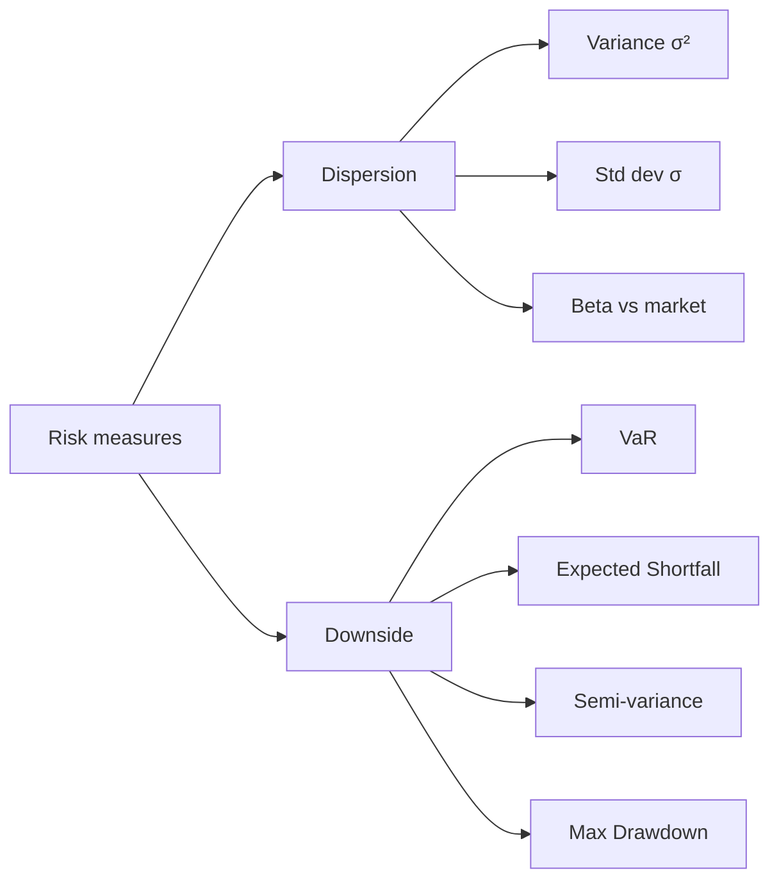
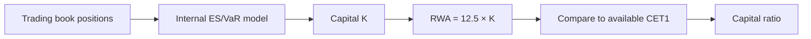

# Quantitative risk management: VaR and CVaR

Measuring risk is finance's least glamorous job and the only one that keeps you standing when things go wrong. In this section I take you from "risk = volatility" to a set of actually usable measures: Value-at-Risk, Expected Shortfall, ratios. These are the numbers banks use for Basel III and the same ones you should compute on your personal portfolio before the next crisis.

## What is "risk" in finance

Two big definitions, and they differ.

**Risk as dispersion.** How much returns move around the mean, in both directions. Measured by variance $\sigma^2$ and standard deviation $\sigma$. Markowitz (1952) uses it: minimize variance for a given return. Problem: a heavily skewed distribution with rare big gains and many small losses can show high variance but "good" risk.

**Risk as downside.** How much you can lose and with what probability. Measured by VaR, ES, semi-variance, max drawdown. It's what your brain feels when the account is down 30%.



In practice you use both families. The first for well-diversified portfolios with "well-behaved" distributions; the second for anything with fat tails or skew (equities, hedge funds, crypto, sold options).

## Value-at-Risk (VaR)

**Definition.** The $VaR$ at confidence $1-\alpha$ is the maximum loss expected over a fixed horizon **not exceeded** with probability $1-\alpha$. Formally, if $X$ is P&L (positive = gain):

$$VaR_{\alpha}(X) = -\inf\{x \in \mathbb{R} : P(X \le x) > \alpha\}$$

In plain English: take the P&L distribution, find the $\alpha$ quantile (e.g. 1% if $\alpha=0.01$), flip the sign. The result is a positive number saying "worst loss I expect 99% of the time".

Three things to fix:

1. **Horizon** — 1 day (trading), 10 days (Basel trading book), 1 year (banking book, insurance).
2. **Confidence** — 95%, 99%, 99.5% (Solvency II), 99.9%.
3. **Distribution assumed** — parametric Gaussian, historical empirical, simulated.

### Three methods to compute VaR

#### 1. Parametric (variance-covariance)

Assume returns are normal with mean $\mu$ and stddev $\sigma$. Then:

$$VaR_{\alpha} = -(\mu + z_\alpha \cdot \sigma) \cdot V$$

where $V$ is portfolio value and $z_\alpha$ is the standard normal quantile ($z_{0.01} \approx -2.326$, $z_{0.05} \approx -1.645$).

**Worked example.** Portfolio $V = 100{,}000$ €, $\sigma_{daily} = 1.5\%$, $\mu_{daily} \approx 0$ (drift ignored over 1 day).

$$VaR_{0.01}^{1d} = 2.326 \times 0.015 \times 100{,}000 = 3{,}489 \text{ €}$$

Translation: on 99% of trading days you won't lose more than ~3,490 €. The other 1% you will.

Time scaling (iid returns):

$$VaR^{T} = VaR^{1d} \cdot \sqrt{T}$$

So 10-day $VaR \approx 3{,}489 \times \sqrt{10} \approx 11{,}030$ €.

#### 2. Historical (empirical)

No distributional assumption: take the last $N$ portfolio returns (e.g. 500 days), sort, pick the $\alpha$ quantile. With 500 obs and $VaR_{0.01}$, that's the 5th-worst loss.

Pros: captures real fat tails, skew, asymmetry.
Cons: assumes past represents future. A 500-day sample post-2009 doesn't contain 2008.

#### 3. Monte Carlo

Simulate $M$ scenarios (e.g. $M=10{,}000$) drawing returns from a chosen model (multivariate Gaussian, Student-t, GARCH, copula). Compute portfolio P&L per scenario, take the quantile.

Pros: flexible, handles non-linear derivatives (options), correlations.
Cons: heavy, quality depends on the underlying model.

### Comparison on the same example

| Method | $VaR_{0.01}^{1d}$ (€) | Notes |
|---|---:|---|
| Parametric Gauss | 3,489 | $z=2.326$, $\sigma=1.5\%$ |
| Historical (500d) | ~4,200 | depends on period |
| Monte Carlo (t, $\nu=5$) | ~4,700 | fatter tails |

The three methods can disagree a lot: Gaussian almost always **understates** real risk.

## Limits of VaR

VaR is wildly popular but has an original sin: **it is not a coherent risk measure** in the sense of Artzner, Delbaen, Eber, Heath (1999). The four properties a "good" measure $\rho$ should satisfy:

1. **Monotonicity**: if $X \le Y$ everywhere, $\rho(X) \ge \rho(Y)$.
2. **Translation invariance**: $\rho(X + c) = \rho(X) - c$.
3. **Positive homogeneity**: $\rho(\lambda X) = \lambda \rho(X)$ for $\lambda \ge 0$.
4. **Subadditivity**: $\rho(X+Y) \le \rho(X) + \rho(Y)$.

VaR violates **subadditivity**: in pathological cases, diversifying increases VaR. Classic example: two bonds defaulting independently with 4% probability and 100€ loss. Individually $VaR_{0.05} = 0$. In a portfolio, prob of at least one default $\approx 7.84\%$, and the combined portfolio $VaR_{0.05}$ is $100$. Diversification "worsens" the metric — absurd.

Other issues:

- Says nothing about **how much** you lose when VaR is exceeded. Just "it'll happen 1% of the time".
- Manipulable: positions with hidden tail risk (e.g. selling OTM puts) look safe under VaR.
- Procyclical: after periods of low vol, VaR shrinks → higher leverage → amplified crashes.

## Expected Shortfall (CVaR/ES)

**Expected Shortfall** (a.k.a. CVaR, Conditional VaR, Tail VaR) fixes VaR's problems:

$$ES_{\alpha}(X) = -E[X \mid X \le -VaR_{\alpha}(X)]$$

In words: given the worst $\alpha\%$ of cases, what is the **average** loss? Always $\ge VaR$.

**It is coherent** (satisfies all four Artzner properties). That's why Basel III (Fundamental Review of the Trading Book, 2019+) replaced VaR 99% with ES 97.5%.

### Computing ES

**Gaussian case.** If $X \sim N(\mu, \sigma^2)$:

$$ES_\alpha = -\mu + \sigma \cdot \frac{\phi(z_\alpha)}{\alpha}$$

with $\phi$ the standard normal density and $z_\alpha$ the quantile.

For $\alpha = 0.01$: $\phi(-2.326) \approx 0.0267$, so $\phi/\alpha \approx 2.67$. ES is $\sigma \times 2.67$ vs VaR's $\sigma \times 2.33$.

**Same portfolio.** $V=100{,}000$, $\sigma=1.5\%$:

$$ES_{0.01}^{1d} = 0.015 \times 2.67 \times 100{,}000 = 4{,}000 \text{ €}$$

So: on the worst 1% of days, **average** loss is 4,000 €, not 3,489. Much more honest information.

**Historical case.** Take all returns worse than the $\alpha$ quantile, average them. On 500 days, $\alpha=0.01$, that's the 5 worst → mean.

## Backtesting: does the VaR actually work?

After computing VaR you must verify quality. Two classic tests.

### Kupiec test (POF — Proportion of Failures, 1995)

Count how often realized losses exceed VaR. With $T$ observations and $N$ "exceptions":

$$LR_{POF} = -2 \ln\left[\frac{(1-\alpha)^{T-N}\alpha^N}{(1-\frac{N}{T})^{T-N}(\frac{N}{T})^N}\right] \sim \chi^2_1$$

If $LR > 3.84$ (5% threshold), reject the model.

**Example.** $T=250$, $\alpha=0.01$, you expect $2.5$ exceptions. You observe $7$: $LR_{POF} \approx 5.8 \rightarrow$ reject. Model underestimates risk.

### Christoffersen test (1998)

Extends Kupiec by also checking **independence** of exceptions: two consecutive exceptions are suspicious (uncaught volatility clustering). Joint test $\chi^2_2$.

Basel has an operational rule: "traffic light" over 250 backtest days. Green if 0–4 exceptions at 99%, yellow 5–9 (capital penalty), red ≥10 (model rejected).

## From VaR/ES to regulatory capital (Basel)

Banks compute VaR/ES on the **trading book** and use them to determine capital absorbed.

| Standard | Measure | Horizon | Confidence |
|---|---|---|---|
| Basel II (2007) | VaR | 10 days | 99% |
| Basel II.5 (2011) | VaR + Stressed VaR | 10 days | 99% |
| Basel III/FRTB (2019+) | Expected Shortfall | 10 days (with liquidity horizons 10–120) | 97.5% |

Stylized Basel II capital formula:

$$K = \max(VaR_{t-1}, k \cdot \overline{VaR}_{60d}) + \max(sVaR_{t-1}, k \cdot \overline{sVaR}_{60d})$$

where $k$ ranges from 3 (default) to 4 (poor backtest penalty). **Risk-Weighted Assets** are $RWA = 12.5 \times K$ to scale to the 8% minimum capital ratio.



## Risk-adjusted performance measures

Measuring return alone is useless: anyone can make 30% with 10x leverage. Risk-adjusted metrics tell you how much return per unit of risk. The four classics:

### Sharpe Ratio (1966)

$$SR = \frac{E[R_p] - R_f}{\sigma_p}$$

Excess return over risk-free per unit of total vol. Sharpe > 1 good, > 2 excellent, > 3 suspicious (overfitting or hidden leverage).

**Example.** Portfolio returns 8%, $R_f=3\%$, $\sigma = 12\%$ → $SR = (8-3)/12 = 0.42$. Mediocre.

### Sortino Ratio

Same as Sharpe but the denominator is only the **downside deviation** $\sigma_d$ (volatility of negative returns below a threshold, typically $R_f$):

$$Sortino = \frac{E[R_p] - R_f}{\sigma_d}$$

Rewards strategies that are volatile "to the upside". Better for positively-skewed strategies.

### Treynor Ratio

Denominator = market beta:

$$Treynor = \frac{E[R_p] - R_f}{\beta_p}$$

Used when the portfolio is already well-diversified and only systematic risk matters.

### Information Ratio

Excess over benchmark per tracking error:

$$IR = \frac{E[R_p - R_b]}{\sigma_{R_p - R_b}}$$

How "skilled" an active manager is. IR > 0.5 long-term is rare.

| Ratio | Numerator | Denominator | When to use |
|---|---|---|---|
| Sharpe | $R_p - R_f$ | total $\sigma_p$ | Generic comparison |
| Sortino | $R_p - R_f$ | $\sigma_{downside}$ | Skewed strategies |
| Treynor | $R_p - R_f$ | $\beta_p$ | Diversified portfolios |
| Information | $R_p - R_b$ | tracking error | Active managers |

## Python code: full computation

```python
import numpy as np
from scipy import stats

# simulated daily returns
np.random.seed(42)
rets = np.random.normal(0.0005, 0.015, 1000)  # 1000 days

V = 100_000  # portfolio value
alpha = 0.01  # 99% confidence

# 1) Parametric Gaussian VaR
mu, sigma = rets.mean(), rets.std()
z = stats.norm.ppf(alpha)
var_param = -(mu + z * sigma) * V

# 2) Historical VaR
var_hist = -np.quantile(rets, alpha) * V

# 3) Expected Shortfall (gauss)
es_param = (-mu + sigma * stats.norm.pdf(z) / alpha) * V

# 4) Expected Shortfall (historical)
tail = rets[rets <= np.quantile(rets, alpha)]
es_hist = -tail.mean() * V

print(f"Parametric VaR:  {var_param:8.0f} EUR")
print(f"Historical VaR:  {var_hist:8.0f} EUR")
print(f"Parametric ES:   {es_param:8.0f} EUR")
print(f"Historical ES:   {es_hist:8.0f} EUR")

# Annualized Sharpe ratio
rf_daily = 0.03 / 252
sharpe = (mu - rf_daily) / sigma * np.sqrt(252)
print(f"Annual Sharpe:    {sharpe:.2f}")
```

Typical output:

```
Parametric VaR:     3382 EUR
Historical VaR:     3514 EUR
Parametric ES:      3879 EUR
Historical ES:      4421 EUR
Annual Sharpe:       0.43
```

Note how historical ES is more conservative than parametric: the sample has somewhat fatter real tails.

## Visualizing VaR and ES

<svg viewBox="0 0 400 220" xmlns="http://www.w3.org/2000/svg" style="max-width:100%;background:#fafafa">
  <defs>
    <linearGradient id="g1en" x1="0" x2="1">
      <stop offset="0" stop-color="#cc3333" stop-opacity="0.4"/>
      <stop offset="1" stop-color="#cc3333" stop-opacity="0.05"/>
    </linearGradient>
  </defs>
  <path d="M 20 200 C 60 200, 100 195, 130 180 S 180 60, 200 50 S 280 180, 320 195 L 380 200 Z" fill="#cccccc" opacity="0.4"/>
  <path d="M 20 200 L 80 200 L 80 198 C 90 196, 105 192, 115 188 L 115 200 Z" fill="url(#g1en)"/>
  <line x1="115" y1="200" x2="115" y2="40" stroke="#cc3333" stroke-dasharray="4 3"/>
  <line x1="85" y1="200" x2="85" y2="40" stroke="#993300" stroke-dasharray="2 2"/>
  <text x="115" y="35" font-size="11" fill="#cc3333" text-anchor="middle">VaR 99%</text>
  <text x="85" y="25" font-size="11" fill="#993300" text-anchor="middle">ES 99%</text>
  <text x="200" y="215" font-size="11" text-anchor="middle">Portfolio returns</text>
  <text x="50" y="180" font-size="10" fill="#cc3333">1% tail</text>
</svg>

The VaR line cuts the 1% quantile; ES is the **average** of values to the left (more extreme).

## Practical case: apply to a personal portfolio

You have 50,000 € split 60% global equity (MSCI World ETF), 30% bonds (Euro aggregate), 10% gold. Historical data (annualized):

| Asset | Weight | Annual $\sigma$ | Correlations |
|---|---|---|---|
| Equity | 60% | 16% | 1 / -0.1 / 0.05 |
| Bond | 30% | 5% | -0.1 / 1 / 0.15 |
| Gold | 10% | 14% | 0.05 / 0.15 / 1 |

Portfolio volatility (3×3 matrix):

$$\sigma_p^2 = \mathbf{w}^T \Sigma \mathbf{w}$$

Approximate result: $\sigma_p \approx 10\%$ annual, i.e. $\sigma_p^{daily} \approx 10\%/\sqrt{252} \approx 0.63\%$.

$$VaR_{0.01}^{1d} = 2.326 \times 0.0063 \times 50{,}000 = 733 \text{ €}$$

At 10 days: ~2,318 €. At 1 year: with annual $z_{0.01}$ and $\sigma_p$: worst expected 99% loss = $2.326 \times 0.10 \times 50{,}000 \approx 11{,}630$ €. ES about 25% more.

<details>
<summary>Exercise: compute VaR and ES on Bitcoin</summary>

Download daily BTC prices for the last 3 years (e.g. Yahoo Finance, ticker BTC-USD). Compute log-returns. Your portfolio is 10,000 € in BTC.

1. Compute $VaR_{0.01}^{1d}$ parametric assuming normality.
2. Compute $VaR_{0.01}^{1d}$ historical empirical.
3. Compute $ES_{0.01}^{1d}$ both ways.
4. Compare. How much does the Gaussian model underestimate? Hint: BTC log-returns have kurtosis ~10 vs 3 for normal.
5. How many exceptions to the 99% historical VaR over the last year? Does Kupiec pass?

Reflection: if your Gauss-VaR says "worst 99% loss = 600 €" and in reality the March 2020 -30% day cost you 3,000 €, you have a model problem, not bad luck.

</details>

## Takeaways

- VaR is not the truth of risk: it's a quantile **convention**.
- **Expected Shortfall** is better (coherent, tells the tail), but noisier to estimate.
- Three methods: parametric (simple, wrong on tails), historical (honest but mute on new regimes), Monte Carlo (powerful but model risk).
- **Backtest** always (Kupiec, Christoffersen). A never-backtested VaR is a placebo.
- Ratios (Sharpe, Sortino, Treynor, Information) tell you whether the return is worth the risk.
- On your personal portfolio you can do this in 30 lines of Python. If you don't, you're telling yourself risk "isn't there".
