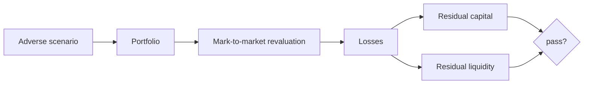
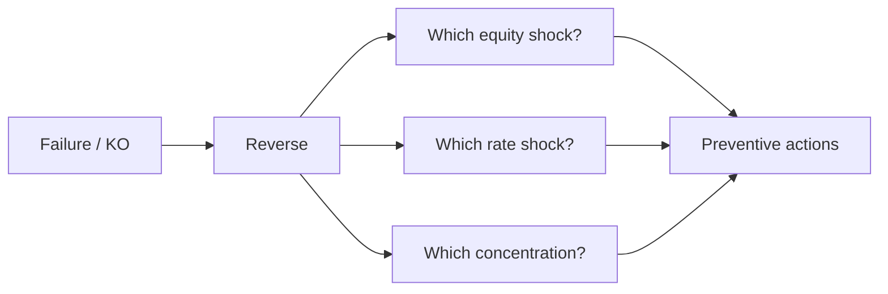

# Stress tests, extreme scenarios, tail risk

VaR and ES are useful but live inside a data sample that never saw Lehman, never saw 1929, never saw a -22 sigma. A stress test is the honest way to ask: "if tomorrow something happens that my model considers nearly impossible, where do I land?". It's what regulators, banks, and (you should) do before letting the next fad run.

## What is a stress test

A **stress test** evaluates how an institution or portfolio would react to a hypothetical adverse scenario. It differs from VaR/ES in three ways:

1. **Not probabilistic**: you don't ask "what is the 99th percentile" but "what happens if Y occurs".
2. **The scenario is extreme and plausible**: not a 3σ average move, but a 2008 replay or a scenario designed by supervisors.
3. **The output is P&L, residual capital, liquidity** — not just a risk metric.



## Major regulatory stress tests

### United States: DFAST and CCAR

After 2008, the Dodd-Frank Act introduced **DFAST** (Dodd-Frank Act Stress Test): banks with assets > $250B must simulate their balance sheet under three scenarios (baseline, adverse, severely adverse). **CCAR** (Comprehensive Capital Analysis and Review) adds qualitative review of internal capital planning. Annual frequency, run by the Fed.

Example "severely adverse" 2024 scenario:
- US real GDP: $-7.8\%$ in 4 quarters.
- Unemployment: $4\% \rightarrow 10\%$.
- Equity index: $-55\%$.
- Volatility: VIX $\rightarrow 75$.
- BBB spread: $+575$ bps.
- House Price Index: $-32\%$.

### Europe: EBA stress test

The **EBA** (European Banking Authority) coordinates biennial stress tests on the ~70 largest EU banks. Macroeconomic scenarios developed with the ESRB and ECB.

Example EBA 2023 adverse scenario (horizon 2023–2025):
- Cumulative EU GDP: $-6.0\%$ vs baseline.
- Unemployment: $+6.1$ percentage points.
- Inflation: persistently high then sharp disinflation.
- Equity: $-55\%$ EU.
- Residential real estate: $-21\%$.
- Commercial real estate: $-32\%$.
- HICP: secondary energy shock.

Output: each bank publishes its stressed CET1 ratio. Indicative threshold: $>5.5\%$ (historically), now more qualitative.

### Other frameworks

- **BoE Solvency Stress Test** (UK): annual post-Brexit.
- **CBE/PBOC** (China): less transparent.
- **Solvency II ORSA** for insurers (annual, internally produced).
- **IMF FSAP** (Financial Sector Assessment Program): systemic assessments by country.

## Three methodological approaches

### 1. Historical scenarios

Replay a past crisis applied to the current portfolio. Typical examples:

| Scenario | Period | US equity | Credit spread | US 10y |
|---|---|---:|---:|---:|
| Black Monday | Oct 1987 | $-20\%$ in 1 day | $+50$ bps | $-100$ bps |
| LTCM/Russia | Aug-Sep 1998 | $-19\%$ | $+200$ bps | $-100$ bps |
| Dotcom | 2000–02 | $-49\%$ | $+250$ bps | $-300$ bps |
| Lehman | Sep-Oct 2008 | $-30\%$ in 6 weeks | $+650$ bps | $-200$ bps |
| Eurocrisis | Jul-Aug 2011 | $-19\%$ | $+300$ bps EU | $-150$ bps |
| Taper tantrum | May-Sep 2013 | $-5\%$ | $+50$ bps | $+140$ bps |
| Covid | Feb-Mar 2020 | $-34\%$ in 5 weeks | $+400$ bps | $-100$ bps |
| Inflation+rates | 2022 | $-25\%$ | $+250$ bps | $+250$ bps |

Pros: real data, already cross-asset consistent.
Cons: the next crisis won't be identical.

### 2. Hypothetical/ad hoc scenarios

Design a new scenario. Example "Asia geopolitical shock":
- Oil $+50\%$ in 1 month.
- EUR/USD: $-15\%$.
- Tech equity: $-40\%$.
- EM spreads: $+500$ bps.
- DM rates: $+100$ bps.

Pros: captures forward-looking risks history hasn't seen.
Cons: subjective, complacency risk.

### 3. Reverse stress test

Flip the question: **what scenario would push the bank / portfolio to fail?** Start from the break point (e.g. CET1 < threshold, drawdown > 40%) and search for coherent moves that get there. Powerful — finds "unguarded teeth".



## Tail risk: why real distributions are fat-tailed

The Gaussian model says a move $> 5\sigma$ is "one every 7 million days" (1 every ~28,000 market years). Yet we see them regularly.

| Event | Move | Gaussian sigma |
|---|---:|---:|
| Black Monday 1987 (S&P) | $-20.5\%$ in 1 day | $\sim -22\sigma$ |
| Flash Crash 2010 | $-9\%$ intraday | $\sim -8\sigma$ |
| Brexit (GBP) | $-8\%$ in hours | $\sim -10\sigma$ |
| SNB unpegs CHF (2015) | EUR/CHF $-19\%$ | $\sim -50\sigma$ |
| Vix Feb 5 2018 ("Volmageddon") | $+115\%$ in 1 day | impossible gauss |

They're "impossible" only under Gaussian assumptions. Reality:

- **Skewness**: asymmetric tails. Equity has negative skew: crashes more frequent than symmetric rallies.
- **Kurtosis**: fat tails. Equity has kurtosis 5–15 vs 3 for normal.
- **Volatility clustering**: bad days come in clusters (Mandelbrot, 1963 → GARCH, Engle 1982).

## Non-Gaussian distributions

### Student-t

Generalizes the normal with a parameter $\nu$ (degrees of freedom) controlling tail heaviness:

$$f(x) = \frac{\Gamma(\frac{\nu+1}{2})}{\sqrt{\nu\pi}\Gamma(\frac{\nu}{2})}\left(1+\frac{x^2}{\nu}\right)^{-\frac{\nu+1}{2}}$$

For $\nu \to \infty$ returns to Gaussian. For $\nu=5$ it's a good approximation for daily equity returns. Tails: $P(|X| > x) \sim x^{-\nu}$.

### Pareto / Power law

"Scale-free" distribution:

$$P(X > x) = \left(\frac{x_{min}}{x}\right)^{\alpha}$$

Typical of natural catastrophes, operational loss sizes, earthquake magnitudes. For $\alpha \le 2$ variance is infinite; for $\alpha \le 1$ even the mean is infinite.

### Extreme Value Theory (EVT)

Fisher-Tippett-Gnedenko theorem: the maximum (or minimum) of many iid variables, properly normalized, converges to a **Generalized Extreme Value distribution (GEV)** with three families (Gumbel, Fréchet, Weibull, depending on shape $\xi$).

Practical **Peaks Over Threshold (POT)** approach: pick a high threshold $u$, model excesses $X - u | X > u$ with the **Generalized Pareto Distribution (GPD)**. Fit by MLE and get VaR/ES with correctly-modeled tails.

$$P(X-u > y | X>u) = \left(1+\frac{\xi y}{\beta}\right)^{-1/\xi}$$

Fat tails $\Leftrightarrow \xi > 0$. For daily S&P 500: $\xi \approx 0.2-0.3$.

## Black swan vs grey rhino

Two useful metaphors to distinguish risk types.

**Black swan** (Taleb, 2007): event that is (a) rare, (b) extreme, (c) rationalized after the fact. The point: it isn't predictable even in principle. Example: 9/11, Fukushima, Covid-19 in winter 2019.

**Grey rhino** (Wucker, 2016): high-probability, high-impact event, **visible ahead of time but ignored**. Example: 2007 housing bubble flagged by many from 2005, eurocrisis predictable to anyone watching Greek spreads 2008–2010, sovereign debt buildup post-Covid.

| Type | Probability | Visibility | Lesson |
|---|---|---|---|
| Black swan | extremely low | none | build robustness, not prediction |
| Grey rhino | medium-high | high | act on signals, avoid cynicism |

## Stress test on a personal portfolio

You have an 80,000 € portfolio:
- 40,000 € (50%) MSCI World ETF.
- 20,000 € (25%) Euro Aggregate Bond ETF.
- 10,000 € (12.5%) real estate via REIT (VNQ).
- 8,000 € (10%) physical gold (bars).
- 2,000 € (2.5%) crypto (BTC).

Apply three scenarios.

### Scenario A: "2008 reload"

| Asset | Shock | Loss € |
|---|---:|---:|
| Global equity | $-50\%$ | $-20{,}000$ |
| Bond agg EU | $-3\%$ | $-600$ |
| REIT | $-65\%$ | $-6{,}500$ |
| Gold | $+15\%$ | $+1{,}200$ |
| BTC (didn't exist, simulate) | $-80\%$ | $-1{,}600$ |
| **Total** | | **$-27{,}500$ € (-34%)** |

### Scenario B: "Inflation 2022 reload"

| Asset | Shock | Loss € |
|---|---:|---:|
| Equity | $-25\%$ | $-10{,}000$ |
| Bond | $-18\%$ | $-3{,}600$ |
| REIT | $-30\%$ | $-3{,}000$ |
| Gold | $0\%$ | $0$ |
| BTC | $-65\%$ | $-1{,}300$ |
| **Total** | | **$-17{,}900$ € (-22%)** |

Bitter lesson of 2022: the classic 60/40 doesn't protect when equity and bonds crash together.

### Scenario C: "Severe euro crisis"

| Asset | Shock | Loss € |
|---|---:|---:|
| Equity (50% EU) | $-35\%$ | $-14{,}000$ |
| Bond EU agg | $-12\%$ | $-2{,}400$ |
| REIT EU | $-30\%$ | $-3{,}000$ |
| Gold | $+25\%$ | $+2{,}000$ |
| BTC | $-30\%$ | $-600$ |
| Weak-EUR FX risk | $-5\%$ on USD assets | implicit |
| **Total** | | **$-18{,}000$ € (-22%)** |

Three ugly numbers, but useful: now you know your "worst plausible loss" is around 30–35%, not the 12% your annual 99% VaR suggests. Calibrate leverage, liquidity buffer, retirement timing **on these numbers**, not on VaR.

## Fat-tail vs Gaussian curve

<svg viewBox="0 0 400 220" xmlns="http://www.w3.org/2000/svg" style="max-width:100%;background:#fafafa">
  <path d="M 20 200 C 80 200, 120 195, 150 180 S 190 60, 200 50 S 250 180, 280 195 L 380 200 Z" fill="#3366cc" fill-opacity="0.3" stroke="#3366cc"/>
  <path d="M 20 195 C 70 192, 110 180, 140 160 S 190 60, 200 55 S 260 170, 290 188 L 380 198 Z" fill="#cc3333" fill-opacity="0.2" stroke="#cc3333" stroke-dasharray="4 2"/>
  <text x="200" y="215" font-size="11" text-anchor="middle">Return (sigma)</text>
  <text x="200" y="45" font-size="10" text-anchor="middle" fill="#3366cc">Gauss</text>
  <text x="60" y="195" font-size="10" fill="#cc3333">Fat tails</text>
  <text x="340" y="195" font-size="10" fill="#cc3333">(Student-t / EVT)</text>
</svg>

The dashed red curve has more mass in the tails: same 2σ but extreme-event probabilities 3–5× the Gaussian.

## Python practice: EVT on S&P 500

```python
import numpy as np
import pandas as pd
import yfinance as yf
from scipy.stats import genpareto

df = yf.download("^GSPC", start="2000-01-01")
rets = df["Close"].pct_change().dropna()
losses = -rets  # positive losses

# Peaks Over Threshold: 95th percentile threshold
u = losses.quantile(0.95)
excesses = losses[losses > u] - u

# Fit GPD
shape, loc, scale = genpareto.fit(excesses, floc=0)
print(f"xi (shape) = {shape:.3f}, beta (scale) = {scale:.4f}, u = {u:.4f}")

# 99.5% VaR and ES via EVT
n = len(losses)
nu = len(excesses)
p = 0.995
var_evt = u + (scale/shape) * (((n*(1-p))/nu)**(-shape) - 1)
es_evt = (var_evt + scale - shape*u) / (1 - shape)
print(f"VaR 99.5% EVT = {var_evt:.4f} ({var_evt*100:.2f}%)")
print(f"ES  99.5% EVT = {es_evt:.4f} ({es_evt*100:.2f}%)")
```

Typical post-2020 output: $\xi \approx 0.25$, confirming fat tails. EVT $VaR_{99.5\%}$ is ~30–50% higher than Gaussian.

## Lessons from the three recent big crises

### 2008 — leverage and hidden correlations

CDO mortgage-backed securities rated AAA turned out junk when US residential cross-state correlations, assumed low, spiked to 1 in stress. **Lesson**: historical correlations don't hold in crises.

### 2020 — liquidity

In weeks the US Treasury market had liquidity problems (bid-ask spread 10x normal). Money market funds in distress. **Lesson**: even "safe" assets can become illiquid under stress. You need liquidity stress tests, not just solvency.

### 2022 — positive equity-bond correlation

For 20 years "60/40" worked because stocks down = bonds up in stress. In 2022, both -15%/-20%. **Lesson**: classic diversification fails when the shock is "inflation" rather than "growth".

<details>
<summary>Exercise: design a reverse stress test on your portfolio</summary>

1. Define your breaking point: e.g. "I can't afford a drawdown > 35%, because I'd have to abandon the plan".
2. Consider three risk dimensions: equity, rates/spread, currency (if you have USD assets).
3. Find shock combinations that yield $-35\%$. Examples:
   - Equity $-50\%$, bonds $-10\%$, gold $-5\%$: simulate it.
   - Equity $-30\%$, bonds $-25\%$, EUR/USD $+15\%$ (if 30% in USD).
4. For each combo: plausible? Historical precedent? Do you have hedges?
5. Define 3 preventive actions: e.g. reduce equity to 50%, add 5% gold, build 12 months of liquidity.
6. Set a "trigger rule": if global equity drops $-25\%$, rebalance within 30 days.

Expected output: a single A4 page with scenarios and actions. Keep it. Reread every 6 months.

</details>

## Takeaways

- The **stress test** answers questions VaR/ES can't: "if X happens, where do I land?"
- Regulators use ad hoc scenarios (DFAST/CCAR, EBA, BoE) with consistent macro shocks.
- Three approaches: **historical**, **hypothetical**, **reverse**.
- Real distributions are **fat-tailed**: Student-t, Pareto, EVT model the tails better than Gauss.
- **Black swan** vs **grey rhino**: work on both, but the grey rhino is the one you can't blame on luck.
- On your portfolio: replay 2008, 2020, 2022 + reverse stress = no surprises, no panic, no forced sales.
