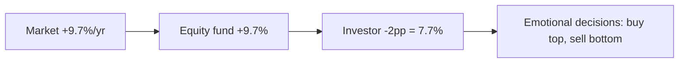

# Behavioral finance: the biases that wreck your investments

For 50 years finance built models around an abstraction: **homo œconomicus**, rational, informed, patient, immune to emotion. Then two Israeli psychologists — Daniel Kahneman and Amos Tversky — tore that character apart. Behavioral finance is the most useful field of study for the small investor: it explains why you buy at the top and sell at the bottom, and gives you tools to stop.

## From homo œconomicus to humans

Classical theory assumes three things:

1. **Consistent preferences** (Von Neumann-Morgenstern axioms).
2. **Bayesian updating** of beliefs.
3. **Expected utility maximization**.

Three things humans, experimentally, do not do. The behavioral research program starts from two foundational works:

- **Tversky & Kahneman (1974)** — *Heuristics and biases*. Humans use mental shortcuts (heuristics) that produce systematic errors (biases).
- **Kahneman & Tversky (1979)** — *Prospect Theory*. A descriptive theory of choice under risk that, unlike expected utility, actually works.

Result: Nobel to Kahneman in 2002, to Richard Thaler in 2017.

## Prospect Theory in two graphs

Prospect theory has four elements.

### 1. Value function

People evaluate outcomes as **gains** and **losses relative to a reference point**, not as absolute wealth levels.

$$v(x) = \begin{cases} x^\alpha & x \ge 0 \\ -\lambda (-x)^\beta & x < 0 \end{cases}$$

With $\alpha, \beta \approx 0.88$ and $\lambda \approx 2.25$. Three facts:

- **Concave in gains** ($\alpha < 1$): risk aversion in profits. You prefer a sure 100 € to 50-50 of 0/200.
- **Convex in losses** ($\beta < 1$): risk seeking in losses. You prefer 50-50 of 0/-200 to a sure -100 € (the gambler who doubles down).
- **Steeper in losses** ($\lambda \approx 2$): **loss aversion**. A 100 € loss hurts more than a 100 € gain pleases. About twice as much.

<svg viewBox="0 0 360 240" xmlns="http://www.w3.org/2000/svg" style="max-width:100%;background:#fafafa">
  <line x1="20" y1="120" x2="340" y2="120" stroke="#999"/>
  <line x1="180" y1="20" x2="180" y2="220" stroke="#999"/>
  <path d="M 180 120 C 220 100, 280 85, 330 80" stroke="#2a9d44" fill="none" stroke-width="2"/>
  <path d="M 180 120 C 150 145, 80 200, 25 215" stroke="#cc3333" fill="none" stroke-width="2"/>
  <text x="335" y="75" font-size="10" fill="#2a9d44">v(x) gain</text>
  <text x="20" y="220" font-size="10" fill="#cc3333">v(x) loss (steeper)</text>
  <text x="185" y="15" font-size="10">v</text>
  <text x="335" y="135" font-size="10">x</text>
</svg>

### 2. Probability weighting

Humans **overweight** small probabilities and **underweight** medium-high probabilities:

$$w(p) = \frac{p^\gamma}{(p^\gamma + (1-p)^\gamma)^{1/\gamma}}$$

with $\gamma \approx 0.61$. Consequence: you overpay for insurance and lottery tickets (overweighted rare events) and underestimate "near-certain" scenarios.

### 3. Reference point

The price you paid for Tesla is a reference for your brain. If it's now $-20\%$ you're "in loss" even if Tesla at that price, on a different account, would have been a buy. The reference point is arbitrary but dominates the decision.

### 4. Isolation (framing)

You evaluate choices separately from the rest of the portfolio (mental accounting). A position $-30\%$ hurts more on its own than when viewed as 2% of total wealth.

## Loss aversion: the base bias

Loss aversion explains most investment errors. **Asymmetry $\sim 2:1$**: the pain of losing 1,000 € equals the pleasure of gaining 2,000.

Practical consequences:

- **Sell winners, hold losers** (disposition effect — Shefrin & Statman 1985). You realize small gains to "feel smart" and keep losses open hoping they'll "come back". Statistically a loser.
- You avoid equity because a $-30\%$ weighs twice the expected $+30\%$ (even though equity premium is positive).
- You over-insure small risks (car warranty extension 20 €/month) and under-insure catastrophic risks (home liability, life insurance).

Classic experiment: I offer a coin flip — heads you win $X$, tails you lose $100$. To accept, humans want $X \approx 200$. Under expected utility with small sums relative to wealth, you should accept for $X > 100$.

## The ten biases that matter

### 1. Anchoring

You're influenced by an opening number, even if irrelevant. **Tversky experiment**: wheel of fortune lands on 10 or 65, then they ask the % of African countries in the UN. Mean estimates: 25% (anchor 10), 45% (anchor 65). In investing: broker target price = anchor that conditions every future revision.

### 2. Confirmation bias

You actively seek information **confirming** your thesis and ignore contradicting evidence. Bought Tesla? You read only pro-Tesla articles, follow only pro-Tesla investors, ignore the 2018 EBITDA losses. Antidote: actively seek the best thesis **against** your position (steel man).

### 3. Hindsight bias

"I knew it would happen." After the 2008 crash, everyone said they predicted it. In pre-2007 surveys, < 5% did. The brain rewrites memory to make you smarter. Antidote: keep an **investment journal** with theses written **before** the decision, reread later.

### 4. Recency bias

You overweight recent events. If S&P rose 3 years in a row, you expect more. If it fell 6 months, you expect more falling. Statistically: annual returns are nearly independent; momentum exists only over specific horizons (3–12 months).

### 5. Overconfidence

You overestimate your forecasting abilities. **Experiment**: estimate a 90% confidence interval for N quantities. People are wrong 30–50% of the time (should be 10%). In investing: retail traders who over-trade and lose to commissions. Barber & Odean (2000) studied 66,000 US accounts 1991–1996: the most active traders returned $11.4\%$ vs $17.9\%$ for the market, due to commissions and bad timing.

### 6. Disposition effect

Sell winners, hold losers. Already discussed under loss aversion. Average cost in the US sample: $-3.4\%$/year (Odean 1998).

### 7. Herd behavior / FOMO

Buy when everyone buys, sell when everyone sells. Bubble dynamics: bitcoin at $65,000 in November 2021 because "everyone" was buying; bitcoin at $16,000 in November 2022 because "everyone" was selling. Social media amplifies.

### 8. Mental accounting

You treat money differently depending on its "mental box". 1,000 € tax refund spent on travel; 1,000 € saved with effort invested. Same money, opposite behavior. Thaler (1985, 1999).

### 9. House money effect

After a gain, you take more risk because you're "playing with the house's money". Typical of crypto entrants in 2020 who saw 10x: take profit and bet it on riskier altcoins. Asymmetry with regret: losing "your" original money hurts more than losing the gain.

### 10. Status quo bias

Keep the current situation even when suboptimal. Money in 0% checking instead of moving to 3.5% T-bills. You hold a 2% TER fund inherited from the bank and don't switch to "save time". Costs thousands in the long run.

## Summary table

| Bias | Symptom | Typical cost | Antidote |
|---|---|---|---|
| Anchoring | "I bought at 10, I wait for 10" | hold losers | reflect without entry price |
| Confirmation | only read friends | wrong theses | seek counter-theses |
| Hindsight | "I knew it" | future overconfidence | investment journal |
| Recency | "still going up" | buy at the top | historical means, not last 12m |
| Overconfidence | over-trading | $-3\%$ to $-7\%$/yr | passive rule |
| Disposition | sell winners | $-3\%$/yr (Odean) | stop loss & take profit rule |
| Herd / FOMO | buy because everyone | bubbles | automatic DCA |
| Mental accounting | "different" money | sub-optimal | unified budget |
| House money | post-gain risk | give it all back | rebalance, take profit |
| Status quo | don't move | lost years of interest | semi-annual review |

## Retail investor systematic errors

The **Dalbar QAIB** (Quantitative Analysis of Investor Behavior) has studied for 30 years the gap between fund returns and investor returns (due to timing). 2024 results over 30 years:

| Category | Fund return | Investor return | Gap |
|---|---:|---:|---:|
| Equity funds | $9.7\%$ | $7.7\%$ | $-2.0$ pp |
| Bond funds | $4.5\%$ | $0.5\%$ | $-4.0$ pp |
| Asset allocation | $7.0\%$ | $5.7\%$ | $-1.3$ pp |

The gap (~2 pp on equity) is money left on the ground just from emotional timing. On 100,000 € over 30 years: $1,620,000 vs $930,000. Almost 700,000 € of difference, **for no technical reason**.

## Choice architecture and nudge

Richard Thaler and Cass Sunstein popularized the idea: instead of "educating" the rational human, **design the environment** so default choices are good. Examples:

- **Auto-enrollment in pension plans** (opt-out instead of opt-in). In the US participation rose from $40\%$ to $90\%$.
- **Save More Tomorrow** (Thaler & Benartzi 2004): automatic contribution increases tied to raises. Savings rate in 4 years: $3.5\% \rightarrow 13.6\%$.
- **Automatic DCA plans** (DCA on ETFs): eliminates timing. Studies show DCA investors close 90% of the Dalbar gap.

The general idea: make the virtuous action easy and the destructive action hard.

## Robo-advisors as anti-bias

Robo-advisors (Moneyfarm, Betterment, Vanguard Digital Advisor) are useful more as **behavioral shield** than as return engines. Three mechanisms:

1. **Pre-determined asset allocation** based on a risk questionnaire: forces reflection before investing.
2. **Automatic rebalancing**: sells winners and buys losers without asking (anti disposition effect).
3. **Friction for intervention**: to change allocation you go through steps, giving time to reflect.

Costs: $0.5\%$ - $1\%$/yr. If the "Dalbar gap" is $-2\%$ and the robo-advisor closes it, it pays for itself.

## Ten personal rules to reduce bias

1. **Investment Policy Statement**: one page describing what you do, in what %, why. Read before every decision.
2. **Automatic DCA** monthly or quarterly. No timing.
3. **Mechanical rebalancing**: once a year or when an asset exits the +/-5% band.
4. **Investment journal**: date, decision, thesis, price. Reread after 12 months.
5. **Pre-commit not to sell during crashes** > 20% in the first month.
6. **Monthly, not daily, portfolio review**. Daily watching is the surest way to sell.
7. **Actively seek the counter-thesis** before any > 5% portfolio buy.
8. **Separate "core" and "satellite"**: 90% passive core, 10% for ideas. The "core" is untouchable.
9. **No leverage**: leverage amplifies gains and biases (forced panic selling on margin calls).
10. **Explain the investment to a non-financial friend**: if you can't, you don't understand, you don't do it.

## Example: bias impact on your wallet

Scenario: retail investor with 50,000 € in S&P 500. Between 2007 and 2024 the market does $+220\%$ total (including 2008 crash). Three profiles:

| Behavior | Final value | Annualized return |
|---|---:|---:|
| Total buy & hold | 160,000 € | $7.1\%$ |
| Sells March 2009, returns late 2010 | 95,000 € | $3.9\%$ |
| Sells March 2009, never returns | 56,000 € | $0.7\%$ |
| Average active trader | 110,000 € | $4.8\%$ |

Three emotional decisions separate 65,000 € over 17 years from the "do nothing" strategy.

## Profile-specific traps

- **Student / under 30**: crypto FOMO, recency on tech. Antidote: DCA on MSCI World ETF, 10–15% max in "bets".
- **Parent / 30–45**: status quo (pays 2% TER), confirmation (follows only bank advisor). Antidote: passive portfolio, annual cost check.
- **Pre-retirement / 50–60**: extreme loss aversion (shifts all to bonds), recency (buys gold at peaks). Antidote: programmed, non-emotional glidepath.
- **Retired / 60+**: status quo, herd from family advice. Antidote: annual review with fee-only advisor.

Exercise: find biases in your last 3 investment decisions

Take a sheet of paper. Write down your last 3 investment decisions (buy or sell) over the past 12 months. For each:

1. **Entry price vs current price**: were you selling to "break even"? That's disposition.
2. **Source of the idea**: friend, news, social? That's herd/FOMO.
3. **Did you seek counterarguments**? If not, confirmation.
4. **How long did the decision take**? Less than an hour suggests overconfidence.
5. **Did you write the thesis beforehand**? If not, you'll fall to hindsight on review.
6. **Were you "playing" with a recent gain**? That's house money.

Count the biases. More than 2 = the decision was likely suboptimal.

Then set ONE rule for next time (e.g. "1-paragraph investment journal before any buy > 2,000 €"). Try it for 3 months.

## Takeaways

- The rational investor doesn't exist: you're human, even when investing.
- **Loss aversion** ($\sim 2:1$) is at the root of half your errors.
- Ten recurring biases, each with measurable cost in lost return.
- The **Dalbar gap** says average investors leave $1.5–2$ percentage points on the table every year purely from behavior.
- Solutions: **written rules**, **automatic DCA**, **mechanical rebalancing**, **investment journal**, **robo-advisor** or **fee-only advisor**.
- The goal isn't to be smart. It's to be **consistent**.
