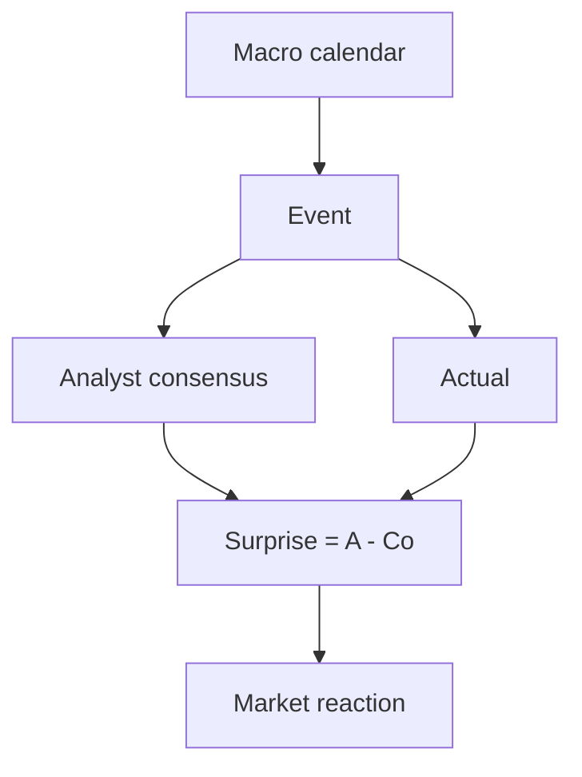

# Essential macroeconomics for investors

Investors who say "I don't follow macro" still hold portfolios that react to every Fed decision, every inflation print, every quarterly GDP. Understanding macro doesn't mean forecasting — it means **reading the context** your assets live in. In this section we build the essential vocabulary and learn to read a weekly macro calendar.

## The five indicators you can't miss

If you must pick five, these:

1. **GDP** quarterly.
2. **Inflation** monthly (HICP for Europe, CPI/PCE for US).
3. **Employment / unemployment** monthly.
4. **Manufacturing and services PMI** monthly.
5. **Policy rates** (scheduled central bank meetings).

Above these five there's a world of other useful statistics (deficit, debt, leading indicators). But miss these, and you're blind.

## GDP — production, income, expenditure

**Gross Domestic Product** is the broadest measure of economic activity. Three equivalent ways to compute:

### Expenditure approach

$$GDP = C + I + G + (X - M)$$

where:
- $C$ = household consumption (~$60\%$ in Italy, $68\%$ in US).
- $I$ = private investment (~$18\%$).
- $G$ = government spending (~$18-20\%$).
- $X-M$ = net exports (~$3\%$ surplus in Italy, $-3\%$ deficit US).

### Production approach

Sum of value added across sectors (agriculture, industry, services). Italy 2024: agriculture $\sim 2\%$, industry $\sim 23\%$, services $\sim 75\%$.

### Income approach

Sum of wages, profits, rents, indirect taxes. Fundamental accounting identity.

### Nominal vs real GDP

$$GDP_{real,t} = \frac{GDP_{nominal,t}}{Deflator_t} \cdot 100$$

The **GDP deflator** measures inflation of **all goods produced** (broader than CPI, which is consumer basket only). For investors, real **quarterly** GDP matters.

### How it's published

Three successive estimates:
- **Flash** (~30 days post quarter, big revisions possible).
- **Second estimate** (~60 days).
- **Final estimate** (~90 days).

Revisions can change the sign: a flash $+0.1\%$ can become a final $-0.2\%$. Markets react to the unexpected (surprise vs analyst consensus), not the number itself.

## Inflation

### Main measures

| Index | Area | Frequency | Notes |
|---|---|---|---|
| HICP / IPCA | Eurozone / Italy | monthly | harmonized EU |
| CPI | US | monthly | consumer basket |
| PCE (Personal Consumption Expenditures) | US | monthly | Fed's favorite |
| Core CPI / Core PCE | US | monthly | excludes food & energy |
| RPI | UK | monthly | includes housing costs |
| WPI / PPI | world | monthly | producer prices (leading) |

**Core** = excluding volatile items (food, energy). Slower but more "trend".

### Why it matters for investing

- **Bonds**: inflation $\uparrow$ $\Rightarrow$ rates $\uparrow$ $\Rightarrow$ bond prices $\downarrow$. Brutal for long duration.
- **Equity**: nonlinear. Moderate inflation ($2-3\%$) is neutral/positive (companies can pass through). High inflation ($>5\%$) erodes multiples and margins.
- **Cash**: destroyed in real terms.
- **Real assets** (real estate, gold, commodities): tend to protect, with exceptions.

Example 2022: EU inflation $10.6\%$ (October), US CPI $9.1\%$ (June). Market response: S&P $-25\%$, Bund 10y $-18\%$, gold $-1\%$, gold USD-hedged $+8\%$.

## Labor

### Unemployment rate

$$u = \frac{Unemployed}{Labor\ force} = \frac{U}{U+E}$$

Where $E$ = employed. Excludes those not actively searching (inactives).

Complementary indicators:
- **Participation rate**: $(U+E)/Pop_{15-64}$. Measures how many "want to" work.
- **Employment rate**: $E/Pop_{15-64}$. More direct, less mood-dependent.
- **Labor underutilization** (U-6 US): includes discouraged and involuntary part-time. Almost always $\sim 2x$ U-3.

### Current rates (~2024–2025)

| Country | Unemployment | Participation | Employment |
|---|---:|---:|---:|
| Italy | $\sim 6\%$ | $\sim 67\%$ | $\sim 62\%$ |
| Germany | $\sim 3.5\%$ | $\sim 78\%$ | $\sim 76\%$ |
| Spain | $\sim 11\%$ | $\sim 75\%$ | $\sim 66\%$ |
| US | $\sim 4\%$ | $\sim 63\%$ | $\sim 60\%$ |
| Japan | $\sim 2.5\%$ | $\sim 78\%$ | $\sim 76\%$ |

### US indicators that move markets

- **Non-farm payrolls** (NFP): first Friday of the month. Change in non-farm employment. $\pm 100$k surprises move markets.
- **Unemployment claims** (weekly): new benefit requests. Leads cyclical turns.
- **JOLTS** (monthly): job openings, voluntary quits. The Fed watches it for labor "tightness".
- **Wage growth**: average hourly earnings. Structural inflation component.

## PMI — Purchasing Managers' Index

PMIs are monthly surveys of purchasing managers. Questions like "production vs last month", "new orders", "employment".

Result: index $0-100$. Critical threshold = **50** (expansion vs contraction).

- $> 55$: robust expansion.
- $50-55$: moderate expansion.
- $45-50$: mild contraction.
- $< 45$: recession.

Three main PMIs:
- **S&P Global / Markit PMI manufacturing**.
- **S&P Global PMI services**.
- **Composite** = weighted average.

**Example.** Eurozone manufacturing PMI Jan 2025: 46.6 (contraction). Services: 51.3 (expansion). Composite: 50.2 (barely). Markets read it as "soft landing", not recession.

PMIs are **leading indicators**: tend to lead GDP by 1–2 quarters.

## Economic cycle

### Phases and asset classes

| Phase | Features | Best assets |
|---|---|---|
| Early recovery | GDP accelerating, low inflation, low rates | small caps, cyclicals, high yield |
| Mid-cycle | stable GDP, moderate inflation | global equity, real estate |
| Late-cycle | inflation $\uparrow$, rates $\uparrow$, margins squeezed | commodities, energy, value |
| Recession | GDP $\downarrow$, unemployment $\uparrow$ | govt bonds, gold, defensives (utilities, consumer staples) |

This is the "BlackRock scheme" or "investment clock" — useful as a general map, NOT as a timing tool.

### Recession: technical vs official definition

- **Technical**: two consecutive quarters of negative real GDP.
- **US (NBER)**: significant, broad, prolonged decline in GDP, employment, income, industrial production. Decided with delay (sometimes $6-12$ months later) by the NBER Business Cycle Dating Committee.

US recessions since 1990 (NBER): Jul 1990–Mar 1991, Mar 2001–Nov 2001, Dec 2007–Jun 2009, Feb 2020–Apr 2020.

## Phillips curve

Historical relation between **unemployment** and **wage inflation** (Phillips, 1958). Idea: fewer unemployed = higher wages = higher inflation.

$$\pi_t = \pi^e_t - \beta(u_t - u^*) + \epsilon_t$$

where $u^*$ is the "natural" rate (NAIRU). Today it's controversial:
- Worked post-WWII until the '70s.
- Stagflation 1973–75: high unemployment $+$ high inflation. Curve "dead".
- 2010–2019: low unemployment $+$ low inflation. Curve "dead" again.
- 2021–2023: briefly returns.

Conclusion: Phillips is a fragile empirical observation, not a law.

## Fiscal vs monetary policy

| Aspect | Fiscal policy | Monetary policy |
|---|---|---|
| Who decides | Government + parliament | Central bank (independent) |
| Tools | Public spending $G$, taxes $T$ | Rates $i$, monetary base $M$, QE |
| Speed | Slow (months-years for laws) | Fast (monthly-quarterly meetings) |
| Constraints | Public debt, EU rules | Mandate (ECB: price stability; Fed: dual) |

### Debt-to-GDP

$$D/Y = \frac{Debt}{GDP}$$

2024 numbers:
- Japan: $\sim 250\%$.
- US: $\sim 122\%$.
- Italy: $\sim 137\%$.
- Germany: $\sim 64\%$.
- Eurozone average: $\sim 88\%$.

Ratio dynamics:

$$\Delta(D/Y) \approx (r - g)\cdot(D/Y) + \frac{deficit}{Y}$$

Where $r$ = average debt rate, $g$ = nominal GDP growth. If $r > g$ (as it is today in many advanced economies), the ratio tends to rise even without new deficit.

## Leading, coincident, lagging indicators

### Leading (anticipate)

- PMI new orders.
- Yield curve (see below).
- Building permits.
- S&P 500 equity index.
- ZEW sentiment (Germany).
- Conference Board Leading Economic Index (US).

### Coincident

- GDP.
- Non-farm payrolls.
- Retail sales.
- Industrial production.

### Lagging

- Unemployment (yes, it's lagging, remember it).
- Core inflation.
- Services CPI.

## Yield curve as recession predictor

Curve inversion ($10y - 2y < 0$): historically, since 1955 it preceded **every** US recession, with $6-18$ month lead.

| Inversion | Recession | Lead time |
|---|---|---:|
| Jan 1969 | Dec 1969 | 11 months |
| Aug 1978 | Jan 1980 | 17 months |
| Sep 1980 | Jul 1981 | 10 months |
| Dec 1988 | Jul 1990 | 19 months |
| Jul 2000 | Mar 2001 | 8 months |
| Dec 2005 | Dec 2007 | 24 months |
| Aug 2019 | Feb 2020 | 6 months |
| Jul 2022 | ? | expected 2024-26 |

False positives: few. Open question: ~2024–2025 still uncertain as of writing.

## Long cycles

- **Kitchin** (3-5 years): inventory cycles.
- **Juglar** (7-11 years): fixed investment cycles.
- **Kuznets** (15-25 years): infrastructure / demographic cycles.
- **Kondratieff** (40-60 years): long-period technological waves. Four so far: steam (1780-1840), railways + steel (1840-1890), electricity + auto (1890-1940), petrochemicals + ICT (1940-2000). Fifth wave ongoing (digital + AI + renewable energy?).

Useful as a **conceptual map**, not as timing tools.

## What a macro calendar looks like

Typical week example (February 2025):

| Day | Time | Country | Event | Consensus | Prev. | Impact |
|---|---|---|---|---|---|---|
| Mon | 10:00 | EU | Sentix Investor Confidence | -16.5 | -17.7 | $\star$ |
| Tue | 11:00 | DE | ZEW Sentiment | 20.0 | 16.8 | $\star\star$ |
| Wed | 14:30 | US | CPI yoy | 2.9% | 2.9% | $\star\star\star$ |
| Wed | 20:00 | US | FOMC Minutes | - | - | $\star\star$ |
| Thu | 14:30 | US | Initial Jobless Claims | 215k | 218k | $\star$ |
| Fri | 11:00 | EU | GDP QoQ flash | 0.0% | 0.4% | $\star\star\star$ |
| Fri | 15:30 | US | NFP | +175k | +256k | $\star\star\star$ |

Three stars = "moves markets". Key phenomenon: **surprise** = (actual - consensus). Markets react proportionally to surprise, not the absolute number.

## Numerical example: NFP shock

Consensus: $+175k$ jobs. Released: $+312k$. Surprise: $+137k$. Typical reaction (2022-23 era when the Fed was watching labor):
- 10y yield $+10$ bps in 5 minutes.
- USD $+0.5\%$ vs EUR.
- Equity futures $-0.8\%$ (because "strong labor $\Rightarrow$ hawkish Fed").
- Gold $-0.7\%$.

Three months later: fully digested. But if you're near a major bond purchase, knowing "NFP Friday" is prudence.

## Stagflation

"Anomalous" combination: **high inflation + low growth + high unemployment**. Classic Phillips doesn't predict it, but it has existed:
- 1973–1975 (oil shock, Arab embargo).
- 1979–1982 (second oil shock, Volcker).
- 2022 (feared scenario, scaled back thanks to 2023 disinflation).

For investors: worst-case scenario. Bonds lose (inflation), equity loses (margins), cash loses (real). Partial defenses: commodities, real estate with inflation-linked income, inflation-linked bonds (BTP Italia, TIPS).

## Three practical steps for investors

### 1. Identify the macro regime

Four basic quadrants (simplified):

|  | Growth $\uparrow$ | Growth $\downarrow$ |
|---|---|---|
| **Inflation $\uparrow$** | overheating | stagflation |
| **Inflation $\downarrow$** | goldilocks | deflationary recession |

Typical allocation:
- Overheating $\rightarrow$ commodities, energy, value.
- Stagflation $\rightarrow$ cash, gold, real assets.
- Goldilocks $\rightarrow$ growth equity, EM, real estate.
- Defl. recession $\rightarrow$ long-duration govt bonds, gold, defensives.

### 2. Follow 3 data points monthly

US CPI + Eurozone CPI + one of US NFP / quarterly GDP. No more. Spending hours daily on macro is useless: you just need a compass.

### 3. Don't time on a single print

A PMI $< 50$ doesn't mean "exit equity". A six-month run of PMI $< 50$ + falling NFP + inverted curve starts being a signal. Macro is noise, not oracle.

Exercise: read and annotate a macro calendar

1. Go to Investing.com macro calendar or ForexFactory.
2. Filter "high impact" (three stars).
3. For the upcoming week, list the $5$ most relevant events for eurozone / US.
4. For each annotate:
   - Expected consensus.
   - Previous.
   - What's expected to move: equity? bonds? FX?
5. After publication, write:
   - Actual.
   - Surprise.
   - Actual market reaction (S&P, Bund, EUR/USD over the next 30 min).
6. Continue for 4 weeks. You'll be surprised how often the reaction "differs" from what you expected (because another concurrent data release canceled it).

Result: in 1 month you'll have an intuitive feel for how consensus + surprise drive short-term prices.

## Takeaways

- Five indicators not to miss: **GDP, inflation, labor, PMI, rates**.
- Markets react to **surprise** vs consensus, not the absolute number.
- **Leading** indicators (PMI, curve, building permits) anticipate the cycle.
- The **economic cycle** suggests different allocations per phase, but timing is hard.
- **10y-2y curve inversion** is the most reliable recession signal ($6-18$ month lead).
- Distinguish **fiscal** and **monetary** policy: different timings, tools, constraints.
- The **growth × inflation** regime is a simple, powerful compass.
- Macro is not an oracle: it's the map to read the context.
