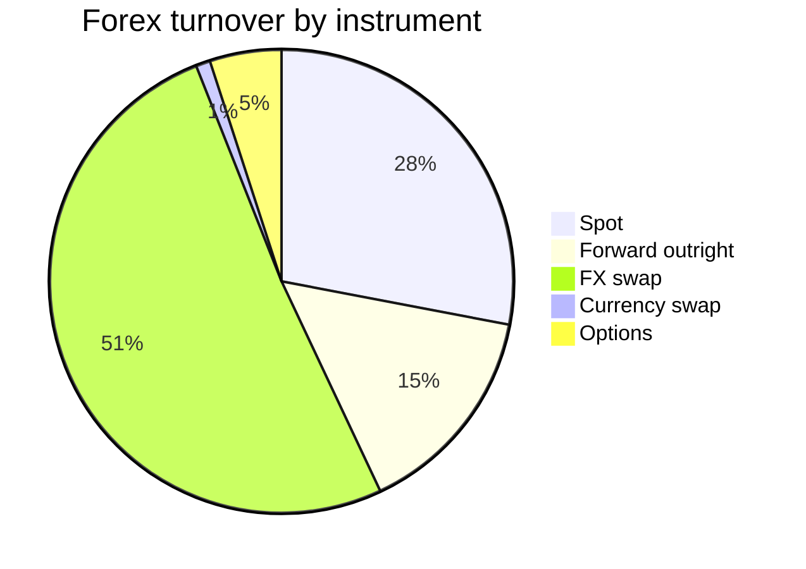
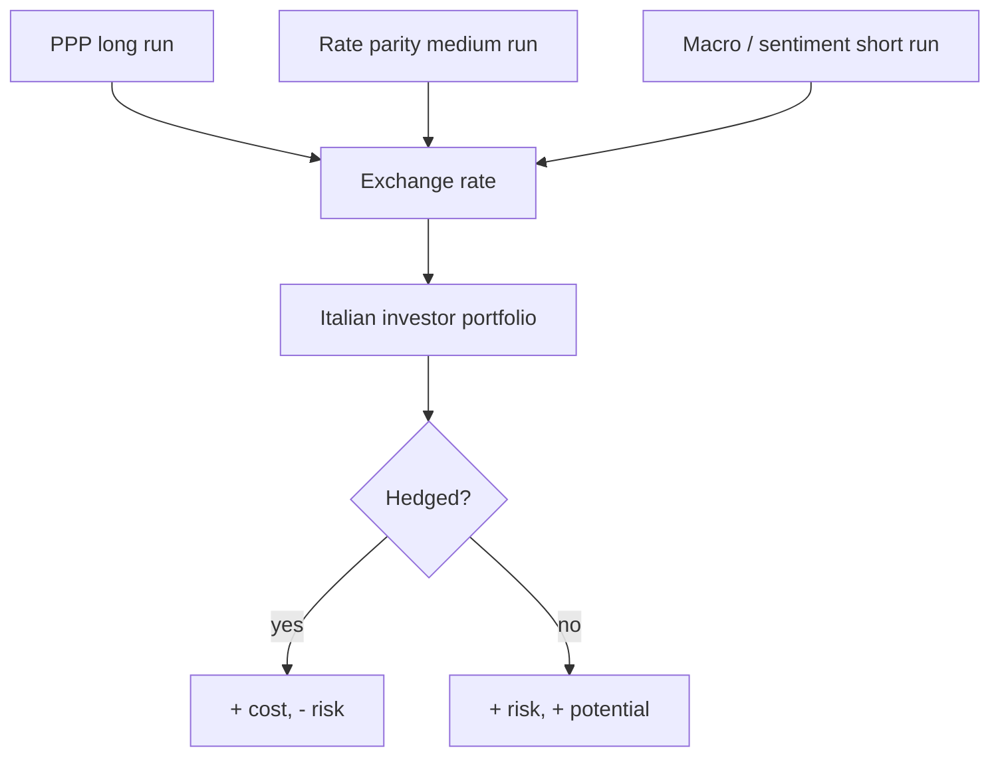

# Exchange rates and Forex

Even if you've never set foot on a Forex platform, every euro you invest abroad goes through an exchange rate. An S&P 500 ETF bought in euros is a **double** bet: US equity and EUR/USD. Understanding FX is not optional if you have international exposure, and it's practically mandatory given Italy's small domestic equity market.

## What is an exchange rate

The **exchange rate** $S$ is the price of one currency in terms of another. For EUR/USD:

$$S_{EUR/USD} = 1.0850$$

means: 1 € = 1.0850 $. FX convention: the **base currency** is first (EUR), the **quote currency** second (USD).

When $S$ rises, EUR **appreciates** vs USD. When $S$ falls, EUR **depreciates**.

### Direct and indirect quotes

- **Direct** (domestic view): units of local currency per foreign unit. In Italy "1 USD = 0.92 €" is direct.
- **Indirect**: foreign units per local. EUR/USD = 1.0850 in Italy is indirect.

Conventions vary by country. EUR/USD is always quoted with EUR base because the euro ranks "higher" in the hierarchy (after USD). For JPY: USD/JPY (base USD).

## Currency regimes through history

### Gold standard (1870–1914, briefly 1925–1931)

Each currency convertible to gold at a fixed rate. UK: 1 £ = 7.32238g gold. US: 1 $ = 1.5046g gold. EUR/$ rate derived arithmetically. Stable but rigid: no autonomous monetary policy, structural deflation possible (one cause of the 1929-33 Great Depression).

### Bretton Woods (1944–1971)

Hybrid system. The **dollar** anchored to gold ($35/oz). Other currencies pegged to dollar with $\pm 1\%$ band. IMF as arbiter. Backed by US gold reserves (80% of world supply in 1944).

Crisis: US prints dollars for Vietnam + Great Society. France demands gold. **August 15, 1971**: Nixon suspends convertibility ("Nixon shock"). Bretton Woods is dead.

### Floating rates (1973–today)

Major currencies free to fluctuate. The modern Forex market is born. Three big blocs: USD, EUR, JPY (+ GBP, CHF, AUD, CAD, NZD = "majors").

### Hybrid systems

- **Currency board**: local currency "pegged 1:1" to a foreign one (e.g. Hong Kong dollar to USD 7.80). The central bank gives up monetary policy.
- **Flexible peg**: oscillation band. Example: **CHF/EUR pegged at 1.20** by the Swiss SNB (2011–January 2015). On January 15, 2015 the SNB drops the peg: in minutes EUR/CHF crashes from 1.20 to 0.85 (over $-30\%$).
- **Crawling peg**: scheduled revaluations.
- **Dollarization**: the country directly adopts USD as local currency. Examples: Ecuador (2000), El Salvador (2001), Zimbabwe (2009 after 230% hyperinflation).

### Eurozone

Special case: 20 countries give up their currency and adopt EUR. Centralized monetary policy (ECB). Pros: no intra-area FX risk. Cons: no devaluation available for asymmetric shocks (see Greece 2010–12).

## The Forex market

### Size

From the **BIS Triennial Survey 2022**: average daily turnover $\$7.5$ trillion. It's the **largest market in the world**:

- Global equities: $\sim 600$bn/day.
- US Treasuries: $\sim 700$bn/day.
- Forex: $7500$bn/day. **10x global equities**.

$51\%$ is swaps (very short-term operations), not pure spot. It's a liquidity/hedging market more than speculative.

### Major pairs

| Pair | Turnover (% of total) | Notes |
|---|---:|---|
| EUR/USD | $\sim 23\%$ | most traded |
| USD/JPY | $\sim 14\%$ | |
| GBP/USD | $\sim 9\%$ | "cable" |
| USD/CNY | $\sim 7\%$ | growing |
| AUD/USD | $\sim 6\%$ | |
| USD/CAD | $\sim 5\%$ | "loonie" |
| USD/CHF | $\sim 4\%$ | "swissy" |

**88%** of FX transactions have USD on one side. Dollar supremacy is the market's dominant reality.

### Bid-ask spread and pips

**Bid-ask spread** = difference between sell and buy price. EUR/USD on retail platforms: $0.8 - 1.5$ pips. Institutional prime brokers: $0.2$ pip.

**Pip** = price interest point = last moving decimal. EUR/USD at 5 decimals: 1 pip = $0.0001$. USD/JPY at 3 decimals (because JPY has low absolute value): 1 pip = $0.01$.

**Standard lot**: 100,000 units. On 1 EUR/USD lot, 1 pip = $10.

**Example**. You buy 1 lot EUR/USD at 1.0850, sell at 1.0900. Pips: 50. P&L: $50 \times 10 = $500$.

### Sessions

24h market, 5 days/week. Main sessions:

| Session | Open UTC | Close UTC | Liquidity |
|---|---|---|---|
| Sydney | 22 | 06 | low |
| Tokyo | 00 | 09 | medium |
| London | 08 | 16 | maximum (38%) |
| New York | 13 | 21 | high (19%) |

London–NY overlap (13–16 UTC) = the deepest liquidity window.

## Exchange rate determinants

### Long run: PPP (Purchasing Power Parity)

**Purchasing power parity** (Cassel, 1918) says that in the long run the exchange rate should equalize international prices:

$$S = \frac{P_{domestic}}{P_{foreign}}$$

Absolute (levels) or relative (changes) version:

$$\Delta S = \pi_{domestic} - \pi_{foreign}$$

If EU inflation is $2\%$ and US $5\%$, EUR/USD should appreciate $3\%$ a year (euro gains relative purchasing power).

### Big Mac Index

The Economist publishes since 1986 the Big Mac Index: compares Big Mac prices across countries. If in the US it costs $5.69 and in Switzerland 7.50 CHF, the "implied PPP" is $7.50/5.69 = 1.32$. If USD/CHF is 0.88, CHF is **overvalued** by $50\%$. Playful but surprisingly predictive long-run.

Sample table (January 2025):

| Country | Local Big Mac | Implied PPP USD | Actual USD | Currency vs USD |
|---|---:|---:|---:|---|
| US | $5.69 | - | - | base |
| Switzerland | 7.50 CHF | 1.32 | 0.88 | CHF +50% |
| Eurozone | 5.65 € | 0.99 | 0.92 | EUR +8% |
| China | 25 ¥ | 4.39 | 7.20 | CNY -39% |
| Japan | 480 ¥ | 84.3 | 155 | JPY -46% |
| UK | £4.49 | 0.79 | 0.79 | GBP fair |

### Medium run: interest rate parity (IRP)

#### Covered Interest Rate Parity (CIP)

In the absence of arbitrage:

$$\frac{F}{S} = \frac{1 + i_{domestic}}{1 + i_{foreign}}$$

where $F$ is the forward rate and $S$ spot. It's an identity that holds (nearly) exactly in the market: if US rates are 5% and EU 3%, the 1-year USD/EUR forward has a $\sim 2\%$ premium vs spot.

#### Uncovered Interest Rate Parity (UIP)

$$E[\Delta S] = i_{domestic} - i_{foreign}$$

Predicts that the high-rate currency should **depreciate** to offset the differential. **Empirically violated** systematically (Forward Premium Puzzle, Fama 1984): over the last 40 years, high-yield currencies tend to **appreciate**, giving birth to the carry trade.

### Short run: news flow, sentiment, positioning

Short-term, FX follows: macro surprises, central bank decisions, geopolitics, speculative flows.

## Carry trade

Strategy: borrow in low-rate currency (e.g. JPY at $0.5\%$), invest in high-rate (e.g. AUD at $4\%$). Earn the $3.5\%$ spread per year, **if the FX rate doesn't move**.

History: classic JPY $\rightarrow$ AUD/NZD carry of the 2000s. Crashed in September 2008 (massive unwind, JPY appreciated $30\%$ in 4 months). Returned 2021–2024 (USD $\rightarrow$ JPY yen carry, yen at 1986 lows).

Asymmetric risk-reward: small steady gains, occasional huge losses. "Picking up nickels in front of a steamroller".

## Historical currency crises

### 1992 — sterling and Soros

UK in the European **Exchange Rate Mechanism (ERM)**, GBP pegged to the Mark at $2.95 \pm 6\%$. The market considers it unsustainable (high UK inflation + post-reunification Germany hiking rates). George Soros bets $10$bn $ short GBP. Bank of England spends $\sim$ £27bn in reserves defending it, raises rates from 10% to 15% in a day. **September 16, 1992, Black Wednesday**: UK exits ERM, GBP $-15\%$ in weeks. Soros makes $\sim$ $1$bn. UK actually benefits economically from the exit.

### 1997 — Asian crisis

Thailand, Indonesia, South Korea had informally pegged to USD with high rates to attract capital. When USD appreciated (1995–97), they became overvalued. Speculators short:
- THB $-50\%$.
- IDR $-83\%$.
- KRW $-50\%$.

Contagion: catastrophic even for healthy economies (Hong Kong, Singapore).

### 2001 — Argentina

$1:1$ peso/USD currency board since 1991. Unsustainable fiscal policy, external debt. December 2001: corralito (withdrawal limits), 5 presidents in 12 days, sovereign default. Peso $-75\%$ in months.

### 2018 — Turkey

Erdogan forces rate cuts while inflation rises. Turkish lira: $-25\%$ in August 2018. From 2018 to 2024: $-90\%$ vs USD. Hyperinflation (over 80% in 2022).

### 2015 — the Swiss franc

January 15, 2015, SNB drops the EUR/CHF $\ge 1.20$ peg without warning. EUR/CHF crashes from 1.20 to 0.85 in minutes. Several FX brokers go bust. Lesson: pegs **end**, always, and end badly.

## FX risk in a personal portfolio

Example: Italian investor with 30,000 € in **unhedged S&P 500 ETF** (iShares CSPX in EUR but USD exposure). S&P return in $:

Year X: S&P 500 $+10\%$ in USD. EUR/USD goes from 1.05 to 1.15 ($\Rightarrow$ EUR appreciates). In EUR:

$$R_{EUR} = (1 + R_{USD}) \cdot \frac{S_0}{S_1} - 1 = 1.10 \cdot \frac{1.05}{1.15} - 1 = +0.4\%$$

Almost all the equity gain destroyed by FX. Same year with flat FX would have given $+10\%$ in EUR.

Year Y: S&P $-5\%$, EUR/USD from 1.15 to 1.05. In EUR:

$$R_{EUR} = 0.95 \cdot \frac{1.15}{1.05} - 1 = +4.0\%$$

The stock loses but FX saves.

### Hedged vs unhedged

**Unhedged ETF**: you bear FX risk. **Hedged ETF** (e.g. CSPX Hedged, Vanguard VHVE): a forward overlay eliminates FX risk, at a cost of $\sim 0.1-0.5\%$/yr (plus costs when rate spreads are high, because you pay the forward cost).

Which to pick?
- Long-term + diversification: unhedged is fine (FX is zero-sum long-run).
- Short-term + fixed EUR target: hedged.
- For bonds: HEDGED almost mandatory (low yield, FX dominates).

## Numerical example: 10 years S&P 500 in $ vs €

Period 2014–2024:
- S&P 500 total return in $: $+243\%$.
- EUR/USD: $1.38 \rightarrow 1.05$ ($\rightarrow$ USD appreciated $\sim 24\%$).
- S&P 500 in €: $+243\% + 24\%$ (approx compounded) $\approx +325\%$.

Italian unhedged investor gained more than the American, purely from FX. It works as long as USD keeps appreciating. Tomorrow? Unknown.

## Practice: should you hedge FX?

Pragmatic rule for an Italian retail investor:

| Asset type | % | FX | Hedge? |
|---|---|---|---|
| MSCI World ETF | 50% | mix | unhedged (FX is "diversified") |
| S&P 500 ETF | 20% | USD | unhedged if long-term, hedged if < 5 years |
| EU govt bonds | 20% | EUR | n/a |
| US / EM bonds | 5% | USD / EM | HEDGED |
| Physical gold | 5% | USD priced | n/a (gold is "anti-USD") |

A commonly-ignored recommendation: **for bonds, hedging is almost always right**. 4% yield in USD, but if EUR/USD appreciates 5% a year, you've destroyed the return.

## Currency intervention

Central banks intervene to influence the rate. Three tools:

1. **Verbal intervention**: speeches ("watch JPY", "comfortable level"). Zero cost, limited effect.
2. **Spot intervention**: directly buying/selling currency. Classic: BOJ sells USD/JPY to strengthen yen. 2022: $\sim$ $60$bn $ spent, JPY briefly rebounds.
3. **International cooperation**: Plaza Accord 1985 (5 countries weaken USD). Louvre Accord 1987 (stabilization).

Effectiveness is **low**: against a $7.5$ trillion/day market, even $50$bn is a drop. FX moves on fundamentals.

## Retail Forex: should you trade?

Statistically, no. Studies on retail brokers show **70–85%** of retail accounts lose money (ESMA-mandated disclosure in Europe). Causes:

- Excessive leverage (up to 30:1 in EU, 500:1 outside). A 2% move wipes the account.
- High retail bid-ask spread.
- Overconfidence: most overestimate their skill.
- Slippage and hidden fees.

If you want to learn: **demo** account first, then real account with max 1,000 € and leverage $\le 5x$. Not investing, just a gym.

## Summary diagram

Exercise: compute € vs $ return on your S&P 500 ETF

If you hold an unhedged S&P 500 ETF bought a year ago (or use 2024 data):

1. Find S&P 500 price in $ 1 year ago and today (Yahoo Finance, ^GSPC).
2. Find EUR/USD 1 year ago and today.
3. Compute:
   - $ return: $R_\$ = (P_1 / P_0) - 1$.
   - FX return: $R_{FX} = (S_0 / S_1) - 1$ (because you care **how many** € per $).
   - € return: $R_€ = (1+R_\$)(1+R_{FX}) - 1$.
4. Compare to your ETF's actual return (justETF or broker).
5. How much is "stock" and how much is "FX"?
6. With the hedged version, you'd have paid $\sim 0.2\%$ and lost/saved $R_{FX}$. Would it have been better?

Bonus: redo over a 10-year horizon. You'll see $R_{FX}$ is small in absolute value vs $R_\$$ long-term, which is why many pick unhedged.

## Takeaways

- Exchange rate = relative price between currencies. Convention: base / quote.
- History: gold standard $\rightarrow$ Bretton Woods $\rightarrow$ floating (1971+).
- Forex market: **$7.5$ trillion $/day**, USD on $88\%$ of transactions.
- Long run: **PPP** (Big Mac index handy).
- Medium run: **rate parity** (covered holds, uncovered doesn't $\rightarrow$ carry trade).
- Short run: news, sentiment, positioning.
- Currency crises are brutal and recurring: pegs fail.
- For retail investors: **whether to hedge is strategic**. For bonds almost always yes, long-term equity often no.
- Retail FX trading: $>70\%$ of accounts lose. Don't confuse investing with speculating.
