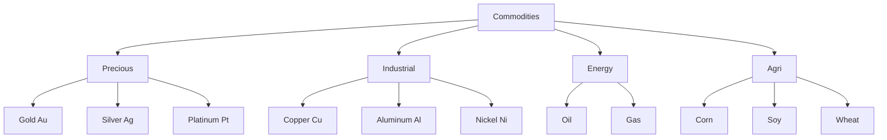
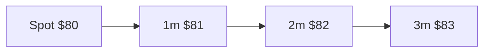
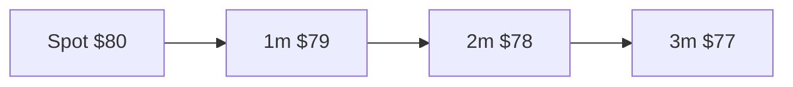

# Commodities: gold, oil, metals, agri

Commodities are the most tangible part of the financial world — they are things. Barrels of oil, gold bars, tons of copper, containers of soy. Yet the way you trade them in financial markets is anything but tangible: 95% are **futures contracts**, and understanding the difference between spot and futures is the key not to be surprised when you buy your first gold ETC or hear about "oil at $-37$".

## What commodities are

A **commodity** is a fungible raw material (one WTI barrel equals another) traded in standardized markets. Four big families:

1. **Precious metals**: gold, silver, platinum, palladium.
2. **Industrial metals**: copper, aluminum, zinc, nickel, tin, lead.
3. **Energy**: oil (WTI, Brent), natural gas, coal, electricity.
4. **Agri**: corn, wheat, soy, rice, cocoa, coffee, sugar, cotton, cattle, hogs.

## Spot vs futures

### Spot

Price for **immediate** delivery (2-3 business days). An OTC market exists for those who want the physical metal (e.g. London gold spot = LBMA fix). For most financial investors, spot is inconvenient: you'd have to store the good.

### Futures

Standardized contract for **future** delivery at a fixed price. It's how financial markets trade commodities. Features:

- Monthly or quarterly expiries.
- Standardized contract unit (e.g. 1,000 oil barrels, 100 ounces gold).
- Exchange-listed (CME, ICE, LME, SHFE).
- **Daily mark-to-market** (margins vary daily).
- Physical delivery possible but **rare** ($<2\%$ of contracts).

Famous tickers:
- **CL** = WTI Crude Light Sweet, CME, NYMEX.
- **BZ** = Brent Crude, ICE London.
- **GC** = Gold, COMEX.
- **HG** = Copper, COMEX.
- **NG** = Natural Gas, NYMEX.
- **ZC** = Corn, CBOT.

## Forward curve: contango vs backwardation

Futures prices for different expiries form a **curve**. Two main shapes:

### Contango

Futures prices **higher** than spot. Upward-sloping curve.

Reasons: storage cost (carrying cost), capital interest, low convenience yield. Normal for gold, gas, some agri.

### Backwardation

Futures prices **lower** than spot. Downward-sloping curve.

Reasons: high immediate demand, scarcity, high convenience yield. Often oil in stress, agri in famine.

### Roll yield

When you invest in commodities via futures, you must **roll** the contract (sell the expiring one, buy the next). The difference is the **roll yield**:

$$RY = \frac{F_{near} - F_{next}}{F_{near}}$$

- **Contango** $\Rightarrow$ **negative** roll yield (sell low, buy high).
- **Backwardation** $\Rightarrow$ **positive** roll yield.

For an ETC tracking oil in contango, roll yield erodes return by $5-30\%$ per year. That's why **oil ETCs return much less than spot in normal periods**.

Example: WTI spot goes from 60 to 80 in 2 years ($+33\%$). USO ETC in same period: $-10\%$ (cumulative $\sim 25\%$ roll cost).

## Gold

The oldest asset in finance. Three main functions:

1. **Store of value** in high-inflation or crisis times.
2. **Safe haven** in geopolitical shocks.
3. **Decorrelation** from equity and bonds.

### Central bank reserves

Central banks hold about **36,000 tons** of gold (~$\$2.3$ trillion). Top holders:
- US: 8,133 t.
- Germany: 3,353 t.
- Italy: 2,452 t.
- France: 2,437 t.
- Russia: 2,336 t.
- China: 2,262 t (official; unofficial estimates higher).

Italy is the **3rd holder worldwide**. Mostly stored at Banca d'Italia (Palazzo Koch) and partly at the NY Fed.

### Ways to invest in gold

| Vehicle | Pros | Cons | Cost |
|---|---|---|---|
| Physical ETC (e.g. SGLD, GLD) | liquidity, low cost | no physical ownership | $0.12 - 0.40\%$/yr |
| Bars | physical ownership | storage, security, spread | $1-3\%$ bid-ask spread |
| Coins (Sovereign, Krugerrand, Maple Leaf) | iconic, favorable UK Sovereign tax | high spreads | $3-5\%$ premium |
| Mining stocks (GDX, GDXJ) | gold leverage | company risk | not pure gold |
| Futures (GC) | leverage | margins, roll | for sophisticated investors |

For small Italian investors: physical ETC (SGLD iShares or WisdomTree Physical Gold) is most efficient. Bars if you want sleep-easy money.

### Historical gold performance

| Period | Gold return | Equity (S&P) | US inflation |
|---|---:|---:|---:|
| 1970–1979 | $+1300\%$ | $+78\%$ | $103\%$ cumulative |
| 1980–1999 | $-23\%$ | $+1900\%$ | $111\%$ |
| 2000–2010 | $+340\%$ | $+0\%$ | $28\%$ |
| 2010–2020 | $+34\%$ | $+250\%$ | $19\%$ |
| 2020–2024 | $+50\%$ | $+90\%$ | $22\%$ |

Gold is NOT a pure inflation hedge: it shone in the '70s (stagflation) and 2000-2010 (crisis), but in the '80s lost real value. The "gold = inflation" narrative is simplified.

## Silver, platinum, palladium

- **Silver (Ag)**: dual nature (precious + industrial). More volatile than gold (annual $\sigma \sim 30\%$ vs $15\%$). Used in electronics, solar panels.
- **Platinum (Pt)**: mainly industrial (auto catalysts, luxury jewelry). Small market ($\sim 200$ tons/year).
- **Palladium (Pd)**: auto catalysts (gasoline engines). Market dominated by Russia + South Africa. Extreme volatility ($\sigma \sim 40\%$).

## Oil

The most traded commodity in the world. Two global benchmarks:

### WTI vs Brent

| Feature | WTI | Brent |
|---|---|---|
| Origin | US (Texas, Oklahoma) | North Sea, Norway/UK |
| Type | Light sweet | Light sweet (slightly heavier) |
| Exchange | NYMEX (CME) | ICE London |
| Delivery | Cushing, Oklahoma | Sullom Voe, Shetland |
| Used as | US benchmark | global benchmark (~2/3 of crude) |
| Spread | normally Brent + $1$-$5$ vs WTI | |

Historically, **WTI** was slightly more expensive until 2010, then $-$ due to the shale boom. Brent commands the global benchmark.

### OPEC+ and production

**OPEC** (1960): cartel of 13 producing countries (Saudi Arabia, Iraq, Iran, UAE, Kuwait, Venezuela, etc.). **OPEC+** (2016) includes Russia, Mexico, Kazakhstan. Coordinated production quotas to influence prices.

Famous episodes:
- 1973 Arab embargo: $3 \rightarrow 12$ in months.
- 1979 Iranian revolution: $14 \rightarrow 39$.
- 1986 counter-shock: $30 \rightarrow 10$.
- 2008 peak $147$ then crash to $33$ in 6 months.
- 2014–2016 US shale boom + OPEC doesn't cut: $100 \rightarrow 30$.
- 2020 Covid + Russia-Saudi price war.

### Negative oil: April 2020

April 20, 2020: WTI May 2020 future closed at **$-37.63$ $/barrel**. First negative price in history.

**Why?** Lockdowns destroyed demand. Cushing storage was full. Long holders at expiry would have to **physically take delivery** but had nowhere to put it. To get rid of the contract, they **paid** the counterparty. Technical forced, but real.

Implication: ETC USO holders without smart rollover lost $90\%$ in days. Lesson: commodity ETCs are not "safe".

### Natural gas

Two main hubs:
- **Henry Hub** (US): NG contract on NYMEX.
- **TTF** (Title Transfer Facility, Netherlands): European benchmark.

Gas is notoriously more volatile than oil: storage hard (needs liquefaction → LNG), strong seasonal demand, regional market.

**European crisis 2022**: TTF goes from $20 €/MWh to $345 €/MWh (August 2022) due to Russian invasion of Ukraine and collapsing Russian supply. Peak $+1{,}500\%$ in 6 months. Then disinflated to $35 €/MWh by 2024.

## Industrial metals

Market dominated by the **London Metal Exchange (LME)**, with contracts on copper, aluminum, zinc, nickel, tin, lead.

### Copper ("Dr. Copper")

Nicknamed because its price "has an economics PhD": good indicator of global industrial demand (construction, electronics, EVs). Structural rise expected for green transition (1 EV uses $3-4$x the copper of a gasoline car).

Price history:
- 2008: $\$8,500/t before, crash to $2,800/t.
- 2011: $10,000/t high.
- 2020 Covid: $4,700 $\rightarrow$ $10,700/t (EV boom).
- 2024: $9,000-10,000/t.

### Nickel: short squeeze March 8, 2022

**Nickel** is critical for EV batteries. On March 8, 2022, following the Russian invasion (Russia = 20% of world nickel), the LME price went from $30,000/t to **$100,000/t** in 24 hours.

What happened: Chinese group **Tsingshan** had a huge short position. With the rally, margin calls would have been catastrophic ($\sim$ $15$bn). LME **canceled** that day's trades, halted the market. Huge controversy: longs lost a legitimate gain. LME reputation damaged, some brokers left. Lesson: exchanges can change the rules under stress.

## Agri commodities

Chicago Board of Trade (CBOT, now CME) is the world center. Main contracts:

| Commodity | Ticker | Unit | Notes |
|---|---|---|---|
| Corn | ZC | bushel | feed + biofuels |
| Soy | ZS | bushel | feed + oil |
| Wheat | ZW | bushel | Chicago soft red winter |
| Rice | ZR | cwt | smaller |
| Sugar | SB | pound | NY |
| Coffee | KC | pound | arabica |
| Cocoa | CC | tonne | NY |
| Cotton | CT | pound | NY |
| Live cattle | LC | pound | CME |
| Hogs | HE | pound | CME |

High volatility, heavily influenced by weather (El Niño, La Niña), wars (Ukraine = 12% world wheat), trade policy (US-China tariffs).

**Example 2024**: cocoa $+150\%$ in 6 months on bad Ghana/Côte d'Ivoire harvests. Final consumer cost: Lindt chocolate $+8\%$ in European supermarkets.

## Ways to invest in commodities

### Via ETC/ETF

| Vehicle | Replication | Example | TER |
|---|---|---|---|
| Physical gold ETC | physical | iShares Physical Gold (SGLN) | 0.12% |
| Synthetic gold ETC | swap | Invesco Physical Gold (SGLD) | 0.12% |
| Oil futures ETF | auto-rolling | WisdomTree WTI Crude Oil (CRUD) | 0.49% |
| Broad commodity ETF | indices | iShares Diversified Commodity (COMM) | 0.19% |
| Agri ETF | agri basket | WisdomTree Agriculture (AIGA) | 0.49% |

**Roll warning**: for energy and agri, roll yield can destroy returns in persistent contango. Look for ETCs with "optimised rolling" (Bloomberg Commodity ex-Roll Index, S&P GSCI Dynamic Roll).

### Via futures

For sophisticated investors. Pros: no immediate roll cost (pay when rolling). Low initial margins ($\sim 5-10\%$ of notional) = high leverage.

### Via sector equities

- Gold miners: Newmont, Barrick, Franco-Nevada. ETFs GDX (large) and GDXJ (junior).
- Energy: ExxonMobil, Chevron, Shell, ENI. ETF XLE.
- Agribusiness: ADM, Bunge, Cargill (private), Nutrien.

Pros: dividends, operating leverage, "indirect" exposure.
Cons: idiosyncratic company risk, high equity beta.

## Commodities as inflation hedge?

Evidence is **mixed**.

| Period | Inflation | Bloomberg Commodity Index |
|---|---:|---:|
| 1970–1980 | $+103\%$ | $+450\%$ |
| 2000–2008 | $+27\%$ | $+170\%$ |
| 2020–2022 | $+15\%$ | $+90\%$ |
| 1980–1999 | $+111\%$ | $-50\%$ |
| 2008–2020 | $+19\%$ | $-40\%$ |

When inflation is **shock-driven** (oil, war), commodities beat everything. When it's **gradual demand-driven**, commodities underperform. For portfolios, ~5-10% in commodities (half gold, half broad) is reasonable.

## Example: 5% of portfolio in physical gold vs ETF

You have 50,000 €. You want $5\% = 2{,}500$ € in gold.

| Option | Acquisition cost | Storage/year | Liquidity |
|---|---:|---:|---|
| Sovereign coins | $3\%$ spread + VAT exempt | 0 € (home) or 50–100 €/year (safe box) | medium (resell to 1-2 dealers) |
| 50g bar | $1.5\%$ spread | same | same |
| SGLN ETC | $0.5\%$ + broker fee | $0.12\%$/yr | high (sell in 30 seconds) |

10-year calc with gold $+50\%$ (total):
- Sovereign: $+45\%$ net (spread + storage) $\rightarrow$ 3,625 €.
- ETC: $+48\%$ net $\rightarrow$ 3,700 €.

Difference: small. Physical advantage: psychological security in case of bank collapse. ETC advantage: instant liquidity.

## Spot vs futures curve: SVG

<svg viewBox="0 0 400 220" xmlns="http://www.w3.org/2000/svg" style="max-width:100%;background:#fafafa">
  <line x1="40" y1="180" x2="380" y2="180" stroke="#999"/>
  <line x1="40" y1="20" x2="40" y2="180" stroke="#999"/>
  <text x="380" y="200" font-size="10">Expiry</text>
  <text x="20" y="20" font-size="10">Price</text>
  <polyline points="60,130 130,115 200,100 270,85 340,72" stroke="#cc3333" fill="none" stroke-width="2"/>
  <text x="350" y="65" font-size="10" fill="#cc3333">Contango</text>
  <polyline points="60,80 130,95 200,110 270,128 340,148" stroke="#2a9d44" fill="none" stroke-width="2"/>
  <text x="350" y="155" font-size="10" fill="#2a9d44">Backwardation</text>
  <line x1="60" y1="180" x2="60" y2="20" stroke="#999" stroke-dasharray="2 2"/>
  <text x="40" y="195" font-size="10">spot</text>
</svg>

Exercise: pick and simulate 5% in commodities

Build a commodity strategy for a 60,000 € portfolio (5% = 3,000 €).

1. **Decide diversification**:
   - 50% gold (1,500 €).
   - 25% broad commodity (750 €) — Bloomberg Commodity Index ETF.
   - 25% energy (750 €) — optional.
2. **For each**:
   - Look on justETF.com for an ETC listed on Borsa Italiana (or local).
   - Check TER, replication (physical vs synthetic), domicile (Ireland preferred for Italian investors).
   - Check roll method (for energy/agri, avoid generic first-month roll).
3. **Compute total annual cost**:
   - TER $\times$ amount invested.
   - Bid-ask spread on buy and sell.
   - Broker commission.
4. **Simulate 3 scenarios over 3 years**:
   - Bull commodity (inflation $+5\%$ sustained): +30%, +50%, +20%.
   - Bear (deflation/recession): -20%, -30%, -10%.
   - Sideways: 0%, ±5%, 0%.
5. **Set rebalancing threshold**: if commodity share exits the 4-6% range of total, rebalance.

Bonus: write a one-page "thesis" on why you want commodities (inflation? geopolitics? diversification?). Reread in 2 years.

## Takeaways

- Commodities = fungible raw materials, traded mainly via **futures**.
- **Contango** = upward curve (negative for longs); **Backwardation** = downward curve (positive for longs). **Roll yield** can make/break returns.
- **Gold**: safe haven, partial inflation hedge, central bank reserve. Italy is #3 in the world.
- **Oil**: two benchmarks (WTI US, Brent global). OPEC+ coordinates. "Negative price" episode April 2020.
- **Natural gas**: European crisis 2022 = TTF $+1{,}500\%$. Regional market, extreme volatility.
- **Industrial metals**: copper as "Dr. Copper", nickel short squeeze March 2022.
- **Agri**: weather, geopolitics, tariffs. High volatility.
- For retail: **physical gold ETC**, broad commodity ETF for diversification. Avoid energy/agri ETCs with first-month roll.
- Inflation hedge: partial, depends on inflation type.
- Reasonable portfolio share: **5–10%**.
