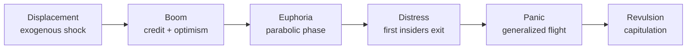
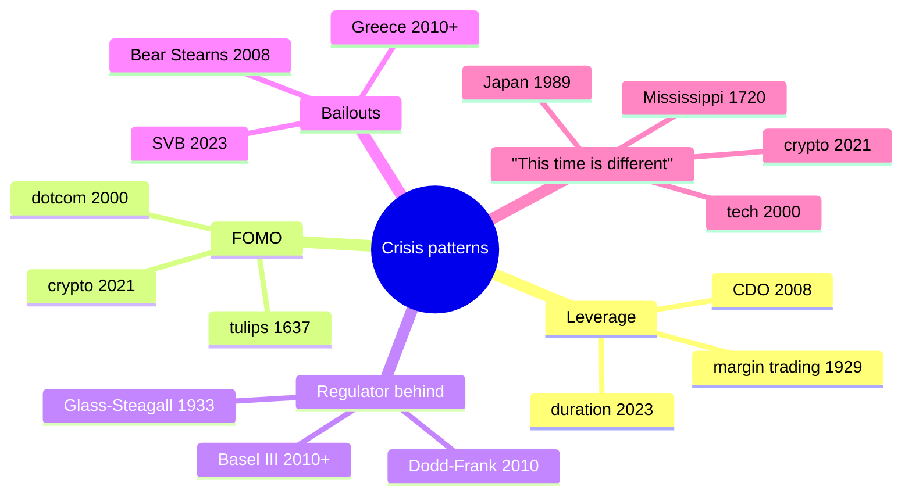

# Financial crises in history: what keeps repeating

"History doesn't repeat itself, but it rhymes," Mark Twain (allegedly) said. Financial crises have a recurring grammar: excessive leverage, collective FOMO, regulators lagging behind, controversial bailouts. Knowing the crises of the past won't make you a prophet, but it will make you harder to fool when the next one comes — and it will come. This is a tour of the 15 crises every investor should keep in mind.

## The Kindleberger model

Charles Kindleberger, in *Manias, Panics, and Crashes* (1978), proposed a **5-phase** model for every financial crisis. Inspired by Hyman Minsky.

**1. Displacement**: an external change that opens up new profit opportunities (new technology, deregulation, geographic discovery, rate cuts). 1990s → Internet. 2000s → structured finance. 2020 → zero rates.

**2. Boom**: credit expands to finance the new sector. Prices rise. Rational operators enter.

**3. Euphoria**: the "this time is different" phase. Valuations decouple from fundamentals. The general public piles in. Family conversations about how "the neighbor made $50{,}000$ on [tulips / dotcom / bitcoin]".

**4. Distress**: insiders begin to exit. Volume drops, insiders sell on filings, bankers downplay ("market in moderate correction").

**5. Panic and Revulsion**: cascading sell-offs, margin calls, bankruptcies. The bubble ends with prices often below pre-bubble values.

## A table of the crises we'll cover

| Year | Crisis | Bubble asset | Drawdown | Trigger |
|---|---|---|---:|---|
| 1637 | Tulipmania | tulip bulbs | $-95\%$ | failed auction |
| 1720 | Mississippi/South Sea | colonial shares | $-90\%$ | no earnings |
| 1873 | Long Depression | railways | $-30\%$ | Jay Cooke collapse |
| 1907 | Banker's Panic | trusts | $-50\%$ | Knickerbocker Trust |
| 1929 | Great Depression | stocks | $-89\%$ | margin leverage |
| 1973–74 | Stagflation | stocks | $-48\%$ | oil shock |
| 1987 | Black Monday | stocks | $-23\%$ in 1 day | program trading |
| 1990 | Japan | stocks + real estate | $-80\%$ over 19 years | BoJ tightening |
| 1997 | Asia | FX + equity | $-50/80\%$ | capital flight |
| 2000 | Dotcom | tech | $-78\%$ Nasdaq | earnings never came |
| 2008 | Subprime | mortgages + credit | $-57\%$ S&P | Lehman |
| 2010–12 | Eurozone | peripheral bonds | Greece spread $+3000$ bps | sovereign debt |
| 2020 | Covid | everything | $-34\%$ S&P in 5 weeks | lockdowns |
| 2022 | Inflation | bonds + tech | $-25\%$ S&P, $-30\%$ Nasdaq | inflation + rates |
| 2023 | Regional banks | US banks + Credit Suisse | $-50\%$ SIVB | duration mismatch |

Fifteen crises in 400 years. One every 25–30 years in the early centuries, one every 5–10 years from 1980 onwards.

## Tulipmania (Netherlands 1634–1637)

The first documented speculative bubble. Tulips arrived from the Ottoman Empire in the 1500s. The "Semper Augustus" variety with red/white striping became a status symbol among the Dutch elite.

**1634–1636**: a market in **forward contracts** on tulip bulbs developed. Traders exchanged "tulip for next spring" based on weight estimates.

**Peak February 1637**: one Semper Augustus bulb = 12 acres of land, 1 carriage, an Amsterdam house. Modern equivalent: roughly $50{,}000–100{,}000$ €.

**3 February 1637**: an auction in Haarlem found no buyers. The news spread. Total collapse in weeks. $-95\%$ in months.

**Consequences**: Dutch banks refused to honor the forward contracts. Courts were weak. Many speculators ruined, but the Dutch banking system survived. Lesson: a bubble **insulated** from the banking system does less damage.

## Mississippi and South Sea Bubbles (1719–1720)

Two "twin" bubbles in France and the UK based on colonial monopolies.

### Mississippi (France)

John Law, a Scotsman, convinced the French regent that monarchical finances could be rescued through paper money + a commercial monopoly on Louisiana. **Compagnie du Mississippi**: shares issued in 1717.

1719: shares went from 500 livres to 10,000 livres in 18 months. Wealthy Parisians, peasants, even King Victor Amadeus invested. The word "millionaire" was coined here (for the newly wealthy).

May 1720: Law tried to stabilize by lowering the value. Confidence crisis. Collapse. Law fled to Belgium.

### South Sea (UK)

Same dynamic. South Sea Company, a South American colonial monopoly. Shares from £100 to £1,000 in 1720. Even Isaac Newton lost £20,000 (famous quote: "*I can calculate the motion of heavenly bodies, but not the madness of people*").

September 1720: collapse. Penalties for directors, some never enforced. The British Bubble Act of 1720 banned unauthorized joint-stock companies (it lasted 100 years, hindering UK financial development).

## The Panic of 1873 and 1907

### 1873 — the "Long Depression"

USA after the Civil War: a railway boom with high leverage. Bank **Jay Cooke & Co.**, the main backer of Northern Pacific Railway, failed on 18 September 1873. The NY Stock Exchange closed for 10 days. A 65-month recession (the longest in US history). It coincided with the global "long deflation" of 1873–1896.

### 1907 — the trust companies' panic

The USA had a banking system without a central bank. **Trust companies** (the shadow banks of the era) ran copper speculation. The **Knickerbocker Trust** failed on 22 October 1907. Bank runs in NY. Private banker **J.P. Morgan** (yes, that one), 70 years old, gathered Wall Street bankers in his library and imposed a coordinated bailout.

**Political consequence**: in 1913, the **Federal Reserve** was created. America realized it couldn't depend on J.P. Morgan personally.

## 1929 — the Great Depression

The model for every modern crisis.

### The Roaring Twenties boom

USA: productivity $+30\%$, wages $+20\%$, new consumer credit. Stock market: Dow from 100 in 1924 to 381 in September 1929 ($+280\%$ in 5 years). Leveraged broker trading: only 10% margin, 90% loan.

### The October 1929 crash

**24 October (Black Thursday)**: $-11\%$.
**28 October (Black Monday)**: $-13\%$.
**29 October (Black Tuesday)**: $-12\%$.

The market lost $-89\%$ from peak to trough (July 1932 = 41). Recovery to 381 only in 1954, 25 years later.

### The Great Depression 1929–1933

Fed errors: restrictive monetary policy post-crash (fear of "moral hazard"). Bank runs without deposit insurance. **Smoot-Hawley** tariffs (1930) collapsed world trade ($-66\%$).

Effects:
- US GDP $-30\%$.
- Unemployment $25\%$.
- Cumulative deflation $-25\%$.
- $9{,}000$ banks failed (a third of the total).

### Lessons and reforms

- **Glass-Steagall Act (1933)**: separation of commercial / investment banks (repealed in 1999).
- **FDIC**: deposit insurance.
- **SEC**: securities markets regulation.
- **Securities Act 1933/1934**: issuance transparency.

## 1973–1974 — stagflation

Double shock:
1. **October 1973**: Arab oil embargo following the Yom Kippur war. Price $3 \rightarrow 12$ $/barrel.
2. **1971 (precursor)**: Nixon ends the dollar's gold convertibility.

Result: US inflation $11.0\%$ (1974), unemployment $9\%$, GDP $-3\%$. S&P $-48\%$ between Jan 1973 and Oct 1974.

Lesson: inflation + recession (stagflation) is the worst possible scenario. Bonds lose, equity loses, cash loses.

## 1987 — Black Monday

**19 October 1987**: Dow Jones $-22.6\%$ in **one single day**. The largest daily drop in history (in %).

Main cause: **program trading** and **portfolio insurance** (a strategy that auto-sold futures whenever the market fell, creating a sell-loop). Rising rates, weak dollar, geopolitical tensions.

**Fed response**: Greenspan injected immediate liquidity, cut rates, guaranteed bank credit. Fast recovery: the market returned to pre-crash levels in 2 years.

Lesson: crashes can be **technical** (not fundamental) and recover fast if the central bank acts.

## Japan 1990 — the lost decade

The 1980s: gigantic real estate + equity bubble. Peak December 1989:
- Nikkei $38{,}957$.
- Tokyo real estate value > value of all California real estate.
- Average Nikkei P/E: $60$.

1990: BoJ raised rates to stop the bubble. Coordinated collapse.

| Year | Nikkei | Drawdown from peak |
|---|---:|---:|
| 1989 Dec | 38,957 | 0% |
| 1992 | 16,925 | -57% |
| 2003 | 7,607 | -80% |
| 2009 | 7,054 | -82% |
| 2024 | 38,000 | back to peak after 35 years |

**Crucial lesson**: the Japanese market took $35$ years to recover nominally, and real-return investors (with reinvested dividends) only broke even around 2017. There is no such thing as "the market always goes up".

## 1997 — Asian crisis

Thailand, Indonesia, Korea had FX semi-pegs to USD + high rates + capital inflows. External liabilities in $.

When the USD strengthened (1995–97), these economies became uncompetitive. Hedge funds (Soros & co.) shorted their currencies.

July 1997 Thailand abandoned its peg: THB $-50\%$. Domino effect: IDR $-83\%$, KRW $-50\%$, MYR $-40\%$, PHP $-30\%$.

Russia 1998 contagion: sovereign debt default, RUB collapsed. Hedge fund **Long-Term Capital Management** (with two Nobel laureates) blew up. The Fed organized a coordinated rescue.

## 2000 — dotcom

Tech bubble 1995–2000. Companies with the ".com" suffix were worth billions without earnings. Pets.com, Webvan, eToys, Boo.com. Nasdaq peaked March 2000 at 5,048.

Crash 2000–2002: Nasdaq $-78\%$ to 1,140. Cisco $-89\%$. Yahoo $-95\%$. Many companies vanished.

**Survivors**: Amazon (from $113 to $5.51), Microsoft, Apple, Google (IPO 2004), eBay. Those that "won" produced enormous returns in the following years.

Lesson: a real sector bubble but with impossible timing. Investing "in the concept" without earnings is always risky.

## 2007–2008 — subprime and Lehman

### Boom 2002–2006

US rates at $1\%$ post-dotcom. Real estate bubble: US house prices $+85\%$ in 5 years. Investment banks created CDOs (Collateralized Debt Obligations) packaging subprime mortgages, obtaining AAA ratings from S&P/Moody's. Selling them to German banks, pension funds, Italian municipalities.

### 2007

March 2007: New Century Financial (subprime lender) failed. June: a Bear Stearns hedge fund on CDOs shut down. August: BNP Paribas froze redemptions on 3 funds $\rightarrow$ start of the money-market freeze.

### 2008 — the disaster

- **17 March**: Bear Stearns bailed out by JPMorgan at $2/share (later raised to $10).
- **7 September**: US government nationalized Fannie Mae and Freddie Mac.
- **15 September, Lehman**: Lehman Brothers failed. 158 years of history, 158 years wiped out in a weekend. $613 bn of debt, never paid.
- **16 September**: AIG bailed out with $182 bn.
- **29 September**: US House rejected TARP (Troubled Asset Relief Program). Dow $-7\%$ in one day.
- **3 October**: TARP approved, $700 bn to bail out banks.

### Effects

- S&P 500 $-57\%$ peak to trough (March 2009 at 666).
- US unemployment $10\%$.
- Eurozone GDP $-4.5\%$.
- 25 million additional global unemployed.

### Policy response

- **Fed**: rates to $0\%$, QE1 (2008), QE2 (2010), QE3 (2012). Fed balance sheet from $900$ bn to $4.5$ trillion.
- **Dodd-Frank Act (2010)**: stress tests, Volcker Rule, CFPB.
- **Basel III**: capital, leverage, liquidity.

## 2010–2012 — Eurozone crisis

May 2010: Greece revealed its real deficit was 13% (not the 4% declared). Italian BTP-Bund spreads rose. Summer 2011: Italy entered the crosshairs, spread climbed to 575 bps.

**26 July 2012**: Mario Draghi in London, conference, two sentences: *"Within our mandate, the ECB is ready to do whatever it takes to preserve the euro. And believe me, it will be enough."*

Italian spreads collapsed from 575 to 250 bps in 2 months without the ECB buying a single bond. Just words, but backed by OMT (Outright Monetary Transactions) and later QE in 2015.

Bailouts: Greece (2010, 2012, 2015), Ireland (2010), Portugal (2011), Spain (banks, 2012), Cyprus (2013). Troika programs (IMF + EU + ECB) with austerity.

## 2020 — Covid

February–March 2020: global lockdowns. S&P 500 $-34\%$ in **5 weeks** (the fastest crash in history, excluding 1929).

Response:
- Fed: rates to $0\%$ in 12 days. Unlimited QE. Bought corporate bonds for the first time.
- US government: $2.2$ trillion CARES Act (12% of GDP).
- ECB: PEPP from $750$ bn $\rightarrow 1.85$ trillion.

Result: V-shaped bounce. S&P returned to highs by September 2020. The giant stimulus set the stage for the 2022 inflation.

## 2022 — inflation and crypto winter

2021: Covid stimulus + disrupted supply chains + Ukraine war (Feb 2022) $\rightarrow$ US inflation $9.1\%$ in June 2022. Eurozone $10.6\%$ in October.

**Fed response**: rates $0\% \rightarrow 5.25\%$ in 16 months. The fastest hiking cycle since 1981.

Markets:
- S&P $-25\%$.
- Nasdaq $-33\%$.
- US 10y Treasury $-18\%$ (worst bond year in 250 years).
- Bitcoin $69k \rightarrow 16k$ ($-77\%$).
- Crypto collapse: Terra Luna (May), Celsius (July), FTX (November).

## 2023 — regional banks and Credit Suisse

March 2023:
- **10 March**: Silicon Valley Bank (SIVB) failed. Cause: $128$ bn in Treasuries bought at $0.5\%$ rates, now showing $17$ bn of unrealized losses. Volatile tech deposits. Bank run: $42$ bn in one day.
- **12 March**: Signature Bank failed. FDIC rescues.
- **19 March**: Credit Suisse, the Swiss bank founded in 1856 (167 years old), bailed out by UBS for $3$ bn CHF. Shareholders wiped out, AT1 bonds ($16$ bn) wiped out.
- **1 May**: First Republic Bank failed, bought by JPM.

Lesson: even big banks can blow up in days due to duration mismatch (short deposits, long assets). The 2023 crises are "old-school" — no complex derivatives, but classic asset/liability management done badly.

## Reinhart-Rogoff: "This Time Is Different"

Carmen Reinhart and Kenneth Rogoff, 2009 book: 800 years of financial crises across 66 countries. Main conclusions:

1. **Sovereign defaults recur**: Spain defaulted 13 times since 1500, Argentina 9 times since 1816, Greece in default 50% of the time since its independence in 1830.
2. **Real estate bubbles are worse than equity bubbles**: average drawdown $-35\%$ vs $-55\%$, but duration $6$ years vs $2.5$.
3. **Banking crises cost on average 86% of GDP** in additional public debt over the following 3 years.
4. **The "tranquil era" 1945–1970** was the exception, not the rule. The norm is periodic crisis.

## What keeps repeating: patterns

## Practical lessons for retail investors

### 1. The crisis always comes

Expect one every 7–10 investing years. Plan a 30-year horizon: you'll go through 3–5.

### 2. Don't sell during the crash

S&P 500 history: anyone who stayed invested between 2007 and 2024 earned $+220\%$. Anyone who exited in March 2009 and never returned: $+0\%$ to $20\%$. Most of a decade's return concentrates in a few "miracle" days post-crash.

### 3. Don't overweight the current moment

In 1989 the Nikkei was the future. In 2000 dot-com. In 2007 real estate. In 2021 crypto. Every "this time is different" ends in tears.

### 4. Build a liquidity reserve

12 months of essential expenses in a deposit account / short-term Treasuries. Not for yield — to avoid selling risky assets in panic during a crisis.

### 5. Recognize early signals

- Loan growth $> 2x$ nominal GDP growth.
- Inverted yield curve.
- Credit spreads compressed to historical lows.
- Family conversations about "miracle investment".
- "This time is different" in the media.

These are signals, not oracles. But if you see 3–4 together, reduce leverage.

### 6. Truly diversify

Not just "10 stocks instead of 1". Diversify across asset classes (equity, bonds, real assets, cash, gold), geographies, currencies. In 2022, 60/40 portfolios discovered that classic diversification fails under an inflation shock.

### 7. Remember history is written by the survivors

Maximum survivor bias. You only see Amazon (survived) and forget Pets.com (dead). You see Apple and forget Nokia. You see Tesla and forget all the failed automakers. In your "historical return" calculations, include extinction rates.

Exercise: study one crisis in depth

Pick a crisis from the table (suggested: 1929, 2008, or 2022) and do this work:

1. **Pre-crisis**: find 3 articles/books written **before** the peak. What did they say? Bullish or cautious?
2. **Trigger event**: the single event that started the panic. Was it predictable? What signals were there?
3. **Kindleberger pattern**: identify the 5 phases (displacement, boom, euphoria, distress, panic) with dates.
4. **Drawdown and recovery time**: maximum drawdown? How many years to break even (nominal + real)?
5. **Policy response**: what fiscal/monetary policies? Were they effective? Side effects?
6. **Winning and losing sectors**: who grew after the crisis? Who died?
7. **Regulatory reforms**: what changed? Does it work?
8. **Your takeaway**: a concrete lesson you apply to your portfolio.

Hints:
- For 1929: read Galbraith's *The Great Crash*.
- For 2008: Michael Lewis *The Big Short*, Sorkin *Too Big to Fail*.
- For 2022: Tooze *The Polycrisis Series*.

Output: a 1–2 page A4 synthesis you can re-read when you spot early signals of a new crisis.

## Takeaways

- Financial crises share a **constant grammar** (Kindleberger: 5 phases).
- They recur every 5–30 years following similar patterns: leverage + FOMO + slow regulator + controversial bailouts.
- The **15 crises** in the table are "historical literacy" for anyone who invests.
- Reinhart-Rogoff: "this time is never different" — sovereign defaults, real estate bubbles, banking crises all repeat.
- Practical lessons: **don't sell in panic**, build a liquidity reserve, truly diversify, recognize signals, remember survivor bias.
- The next bubble is somewhere already. Probably not where you think. You'll never know exactly which or when, but you can now recognize its structure.
