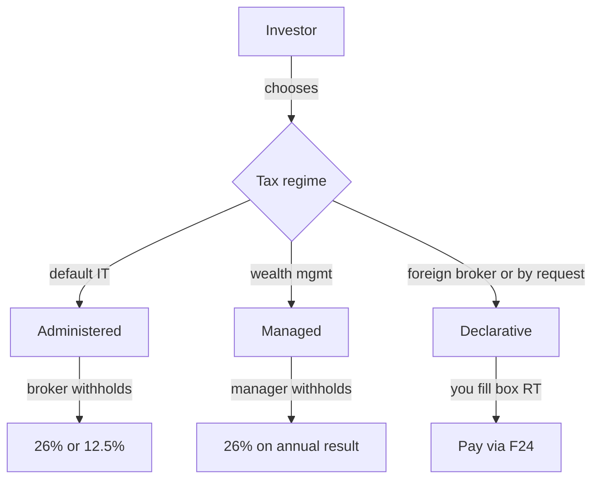
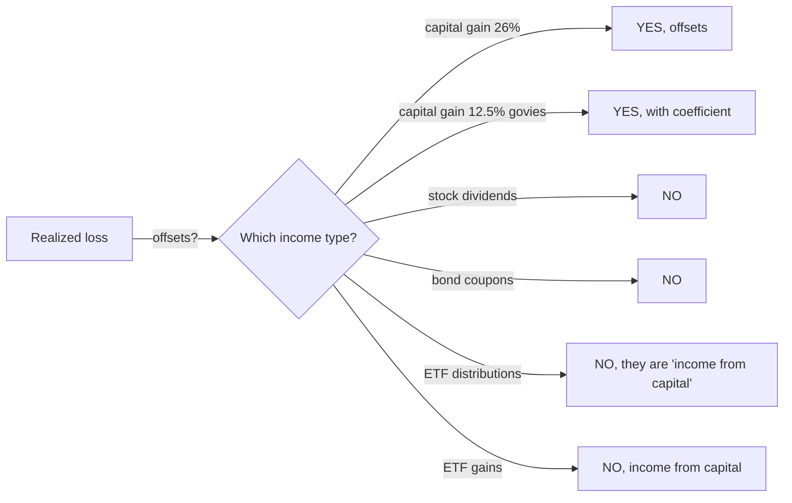

# Investment taxation in Italy (and elsewhere)

Your net return is not what you see on your broker's app. It is what is left **after taxes**. Italian investment taxation is a mosaic of rates, regimes and asymmetries that, if ignored, costs you thousands of euros. This is the most "technical" section of the course: treat it as a map of a minefield you cannot avoid crossing.

## 1. The three tax regimes

Italy offers three ways to handle the taxation of your investments, and the choice is not trivial.

| regime | who calculates | who pays | when paid | loss/gain offset |
|---|---|---|---|---|
| **Administered (Amministrato)** | the intermediary (bank/broker) | the intermediary as withholding agent | per closed trade | automatic within same account |
| **Managed (Gestito)** | the manager (e.g. discretionary portfolio) | the manager | on **yearly net result** of the account | automatic within the account |
| **Declarative (Dichiarativo)** | you, in your tax return | you, via F24 form | June/November next year | manual, in box RT |

**Multiple brokers?** Each administered broker computes taxes **only on its own account**: losses on Directa do NOT offset gains on Fineco. To offset across brokers you must switch to declarative regime, or transfer the securities (and pending losses) from one account to another — possible but bureaucratic.

### Which one fits?

- **Administered**: convenient, zero hassle, but no cross-broker offset. Default for 95% of small Italian investors.
- **Managed**: only used in pricey bank wealth-management accounts. The cross-instrument offset is nice, but 1–2% annual fees easily wipe out the benefit.
- **Declarative**: mandatory for foreign brokers (historically DEGIRO, IBKR, etc.), or for complex offset planning. Requires attention but is the choice of "savvy" retail investors.

## 2. The rates: 26% and 12.5%

Italy basically has **two rates** on financial income, the legacy of stratified political choices.

| rate | instruments covered |
|---|---|
| **26%** | stocks, equity/corporate-bond ETFs, corporate bonds, derivatives, crypto, dividends, corporate coupons, gains on currencies |
| **12.5%** | Italian government bonds (BOT, BTP, CCT, CTZ), postal savings, government bonds of white-list countries, supranational issuers (EIB, World Bank), Italian local authorities |

The 12.5% rate is an **implicit subsidy** to the State financing itself (and its peers). For bond ETFs it lands in a hybrid territory: many "mono-government" ETFs apply a mixed rate, but in practice the broker applies 26% with an **exemption coefficient** on the share of govies (~50% abatement) which makes the effective rate roughly 12.5% on the govies portion.

**Concrete example.** iShares Euro Govt Bond 7-10Y (IBGM):
- Distributed coupons: 12.5% (composition: ~100% eurozone govies, white-list countries).
- Realized gain on sale: same regime, with coefficient.

While iShares Core S&P 500 (CSPX):
- Realized gain: **full 26%** on sale price − cost basis.
- Dividends (none here since it is accumulating): would be taxed 26% at receipt.

## 3. Stamp duty and IVAFE

Even when you make nothing, you pay.

| tax | applies to | rate | min/max |
|---|---|---|---|
| **Italian securities stamp duty (bollo)** | end-of-period market value, Italian accounts | 0.20%/year | no cap for individuals |
| **IVAFE** | financial instruments held **abroad** | 0.20%/year (stocks, ETFs) | €34.20 flat only for foreign current accounts |
| **Bank account stamp duty** | average balance >€5,000 | €34.20/year | — |

**Example.** You hold €50,000 of ETFs at an Italian broker:
$$\text{Stamp duty} = 50{,}000 \times 0.002 = 100\text{ €/year}$$

On a foreign broker (IBKR Ireland) with the same portfolio you pay **IVAFE** at the same rate: €100. **No tax saving abroad** on this front.

**Trap.** Stamp duty is due **even if you have an unrealized loss**. You bought at 100k, now it is worth 60k: you still pay €120. The State does not share your losses.

## 4. Loss/gain offset (and why it is asymmetric)

This is the Italian investor's **trap #1**. Losses (minusvalenze) can offset gains (plusvalenze), but only in a very restricted way.

Italian tax law splits everything into two boxes:

- **Other income (redditi diversi, art. 67 TUIR):** gains/losses from selling stocks, bonds, derivatives, currencies. These offset within themselves.
- **Income from capital (redditi di capitale, art. 44 TUIR):** dividends, coupons, interest, ETF and mutual fund gains. These do NOT offset within themselves and do NOT offset other income.

**Paradox.** You sell an ENI stock at a loss (−€2,000 → loss in "other income") and sell an S&P 500 ETF at a gain (+€5,000 → income from capital). **You cannot offset.** You pay 26% on the ETF gain (€1,300) and keep an unused €2,000 loss that will expire in 4 years.

Losses last **4 years** (the year they arise plus 4). After that, lost.

### The ETF trap

ETFs in Italy are tax-**inefficient** vs direct stocks for those carrying losses, because:

1. Gains on ETF = income from capital → does NOT offset losses.
2. Losses on ETF = other income → offsets only stock/bond/derivative gains (not other ETFs in gain!).

So an ETF in loss generates usable losses, but an ETF in gain cannot be offset. **Perfect asymmetry in favor of the State.**

**What to do:**
- If you have many accumulated losses, consider certificates with conditional/protected capital (gains qualify as "other income" and do offset).
- Consider direct stocks instead of ETFs to burn losses.
- Don't sell ETFs in gain unless the gain is meaningful, since you pay 26% and can't offset.

## 5. Dividends and foreign withholding

When you receive a US dividend on a USD-bought stock, this happens:

1. The US IRS applies **withholding tax**: 30% without W-8BEN, 15% with W-8BEN (a form certifying you are Italian tax resident).
2. In Italy, a further **26%** is applied on the **net frontier amount** (dividend after US withholding).

**Example.** Apple pays $100 dividend:
- IRS withholds 15% (with W-8BEN): $85 remain.
- Italian withholding agent applies 26% on $85 → $22.10 of Italian tax.
- You actually receive $62.90 = **effective tax burden of 37.1%**.

Without W-8BEN: $100 → −30% → $70 → −26% → **$51.80 net = 48.2% tax**.

| source country | default withholding | with Italy treaty | where to claim |
|---|---|---|---|
| USA | 30% | 15% with W-8BEN | broker |
| UK | 0% | 0% | automatic |
| Germany | 26.375% | 15% | refund from Bundeszentralamt |
| France | 25% | 12.8% (EU residents) | refund from DGFiP |
| Switzerland | 35% | 15% | refund from AFC (slow) |
| Netherlands | 15% | 15% | automatic |

For ETFs this is less painful when the fund is **domiciled in Ireland**: the ETF itself pays 15% on US dividends (thanks to the US-Ireland treaty) and you pay only 26% on fund returns. This is one reason almost all UCITS ETFs are Irish.

## 6. Box RW and tax monitoring

If you hold **financial assets abroad** (foreign broker, crypto account, foreign bank account, foreign real estate) above certain thresholds, you must fill in **box RW** of your tax return.

| obligation | threshold | penalty for omission |
|---|---|---|
| RW (monitoring) | no threshold for financial assets (even €1 must be declared) | 3%-15% of value (doubled if non-cooperative country) |
| IVAFE (tax) | applies to all | as above + interest |

**Key points:**
- IBKR (Interactive Brokers): account in your name in Dublin → mandatory RW.
- Trade Republic: has Italian branch, but assets effectively abroad → mandatory RW (historically debated, now confirmed).
- Foreign crypto exchanges (Binance, Kraken): mandatory RW.
- Italian exchanges (Young Platform, Conio): usually act as withholding agent, RW not due.

**Drastic penalty.** €10,000 undeclared = €300–€1,500 minimum penalty. On €100k = €3,000–€15,000. Not worth hiding.

## 7. Real estate capital gains

Real estate has a mini-capital-gain tax too.

| case | gain taxation |
|---|---|
| property sold within **5 years** of purchase, NOT used as primary home | **26% or IRPEF** (your choice) |
| property sold within 5 years, used as primary home for most of the period | exempt |
| property sold after 5 years | exempt |
| inherited property | always exempt |

**Example.** You bought for €200k in 2022 and sell for €280k in 2026 (4 years later), not your primary home → you tax €80k of gain:
- Substitutive 26%: €20,800.
- IRPEF option: depends on your bracket (could reach 43% on the €80k...).

The 26% substitutive option is usually better. See **Section 34 — Real Estate**.

## 8. Quick international comparison

| country | capital gain | dividends | exempt threshold | notes |
|---|---|---|---|---|
| **Italy** | 26% (12.5% govies) | 26% | none | 0.2% stamp + RW |
| **Germany** | 25% + 5.5% Soli = 26.375% | same | €1,000/year (Sparer-Pauschbetrag) | simple |
| **France** | 30% PFU (12.8% tax + 17.2% social) | 30% PFU | optional progressive IRPEF | PEA tax-favored account |
| **UK** | 10% basic / 20% higher | 8.75% / 33.75% / 39.35% | £3k CGT + £500 dividend (24/25) | ISA fully exempt up to £20k/year |
| **USA** | 0/15/20% LT (>1 year), short-term = ordinary | 0/15/20% qualified | $0 generally | 401k/IRA tax-deferred |
| **Spain** | 19% to €6k, 21% to €50k, 23% to €200k, 27% above | same | none | progressive |
| **Netherlands** | "Box 3" on imputed wealth (~1.3-2%) | as box 3 | ~€57k exemption | unique system |
| **Switzerland** | **0%** on private capital gain | progressive cantonal | — | legitimate tax haven for buy-and-hold |

Italy is not particularly worse than EU average, but it is **not simple** (multiple regimes, loss/gain asymmetry, aggressive monitoring).

## 9. Full example: mixed portfolio in one year

Marco holds:
- €30,000 in MSCI World ETF (CSPX-like), +€1,500 gain on a partial sale.
- €10,000 in BTP government bonds, €350 coupon received.
- €5,000 in ENI stocks sold at a €400 loss.
- €2,000 in Apple stock, gross dividend $50 (≈ €46).

| item | income type | rate | tax |
|---|---|---|---|
| ETF gain +€1,500 | income from capital 26% | 26% | €390 |
| BTP coupon €350 | income from capital 12.5% | 12.5% | €43.75 |
| ENI loss −€400 | other income | — | accrued for 4 years |
| Apple dividend €46 frontier net | income from capital 26% | 26% | €11.96 |
| stamp duty €47k account | 0.2% stamp | 0.2% | €94 |
| **total** | | | **€539.71** |

The €400 ENI loss **offsets nothing** (no other "other income" gains that year). It sits in the tax drawer for 4 years. If Marco never again sells direct stocks at a gain, it's lost.

Lesson: had Marco bought an equivalent certificate instead of the ETF, the €1,500 gain would have been other income → would have offset the €400 → tax on €1,100 = €286. Saving: €104 per year. Not huge, but over 30 years it compounds.

## 10. Common mistakes and best practice

| mistake | consequence | how to avoid |
|---|---|---|
| Ignoring W-8BEN | 30% US withholding instead of 15% | submit form to broker |
| Multiple administered brokers = separate losses | losses expire unused | switch to declarative or consolidate brokers |
| Thinking ETFs offset losses | trap: 26% paid and losses unused | use certificates or direct stocks |
| Not declaring RW for IBKR/crypto | 3-15% wealth penalty | always RW for foreign assets |
| Selling ETFs in gain without reason | pay 26% now instead of deferring | use accumulating ETFs (compound) |
| Confusing gross vs net in advertised returns | overestimate returns | always compute net |
| Forgetting 0.2% stamp duty in cost calc | underestimated effective TER | add 0.2% to TER in comparisons |

Exercise: compute the taxation of your hypothetical portfolio

Assume at year-end you hold:
- €25,000 in global equity ETF (CSPX), bought at €22,000, NEVER sold.
- €5,000 in BTP 2034, coupons received €110.
- €3,000 in Enel stocks sold at a gain of €600.
- €4,000 in Tesla stocks sold at a loss of −€800.

Questions:
1. What is the **stamp duty** at year-end?
2. How much do you pay on accrued/realized income for the year?
3. What is the remaining loss and for how long usable?
4. If next year you sell the ETF realizing +€2,000 gain, do you pay on €2,000 or on €1,800? (Hint: think income category)

**Solution:**

1. Stamp: $(25{,}000 + 5{,}000 + 0 + 0) \times 0.002 = \text{€60}$. (Sold stocks no longer in account at year-end.)
2. Taxes realized:
   - BTP coupons: $110 \times 0.125 = \text{€13.75}$.
   - Enel gain €600 vs Tesla loss €800 → both "other income" → offset. Net: −€200. Nothing to pay, €200 loss carried forward.
   - Year total: €13.75 + €60 stamp = **€73.75**.
3. Carried loss: **€200**, usable for 4 years (matures 2026, usable through 2030).
4. Next year ETF +€2,000: gain is **income from capital**, does NOT offset the €200 loss (other income). You pay $2{,}000 \times 0.26 = \text{€520}$ in full. The €200 loss still waits for a stock/bond/derivative gain.

## 11. Crypto taxation

Since 2023, crypto-assets have their own tax regime in Italy.

| item | regime from 2023 |
|---|---|
| Realized gain | 26% (above €2,000/year franchise) |
| Loss offset | yes, as "other income" (4 years) |
| Holding on foreign exchange | mandatory box RW |
| Stamp duty | 0.2%/year |
| Crypto-crypto conversion | taxable (no longer exempt "swap") |
| Staking, lending, airdrop | other income → 26% |

**Example.** Bought 0.5 BTC at €15,000 and sold at €35,000:
- Gain: €20,000.
- €2,000 franchise: taxable €18,000.
- Tax: 18,000 × 26% = €4,680.

If using a foreign exchange (Binance, Kraken), fill in box RW. **Minimum penalty 3% of value**, doubled in non-cooperative countries.

## 12. Taxation of mutual funds and managed accounts

Often confused with ETFs but taxed differently.

| instrument | income type | rate | offset |
|---|---|---|---|
| Mutual fund (Luxembourg, Ireland UCITS) | income from capital | 26% | like ETF: NO offset of losses |
| Italian harmonized mutual fund | income from capital | 26% | as above |
| Managed account (GPM/GPF) | annual result | 26% (12.5% pro-rata govies) | offsets everything inside |
| Foreign SICAVs | income from capital | 26% | NO offset |
| Italian hedge funds | income from capital | 26% (with specific levies) | NO offset |

**Managed accounts** have the unique benefit of internal offset: within the account, gains and losses cancel out, even mixing ETFs/stocks/bonds. A small advantage usually swallowed by 1-2% annual management fees.

## 13. Investor's tax calendar

When you pay what:

| month | deadline |
|---|---|
| March | Broker tax statement ready for declaration |
| April-May | CU 2024 provided by broker (withholding agent) |
| June (30/6) | Balance + 1st advance IRPEF (including RT, RW) |
| July (31/7) | Possible payment installment |
| November (30/11) | 2nd advance IRPEF |
| December (31/12) | Stamp duty 0.2% calculated on end-of-period value |
| Year-round | Withholdings per operation (administered regime) |

In **declarative regime** you must collect ALL broker statements, manually compute offsets and pay via F24. Useful tools: 730 + Modello Redditi PF "DIY mode" or accountant (€200-600 per return).

## 14. Inheritance and gift tax

Often ignored, but important for wealth accumulators.

| relationship | exempt threshold per beneficiary | rate above threshold |
|---|---|---|
| Spouse, children | **€1,000,000** | 4% |
| Siblings | €100,000 | 6% |
| Other relatives (uncles, cousins) | none | 6% |
| Unrelated | none | 8% |
| Disabled persons | €1,500,000 | as above |

**Example.** Parent leaves €1.5M to a child:
- Exempt: €1M.
- Taxable: €500,000.
- Tax: 500,000 × 4% = **€20,000**.

For lifetime gifts (succession planning): essentially same rates. Useful tools:
- **Life insurance policies** with designated beneficiaries: capital exempt from inheritance tax (within limits).
- **Family pacts** (art. 768-bis c.c.): transfer of business/shares to descendants tax-free.
- **Italian trusts**: tax treatment recently clarified.

Italy has high thresholds and low rates compared to France (60% for unrelated) or USA (40% federal above ~$13M). It's relatively generous, **if** you plan.

## 15. Operational summary

- Two rates: **26%** general, **12.5%** Italian/supranational govies.
- **0.2% stamp duty** even when you have losses.
- **0.2% IVAFE** + **box RW** if you hold abroad or crypto.
- **W-8BEN** to reduce US withholding to 15%.
- **Loss/gain asymmetry**: ETFs in gain do NOT offset losses. Only certificates, stocks, bonds, derivatives can.
- Losses last **4 years**: use them or lose them.
- Real estate gains: exempt after 5 years or if primary home.
- Crypto: 26% above €2,000/year franchise, RW mandatory for foreign exchanges.
- International comparison: Italy is not the worst, but it is the most **complex**.

## 16. Mini tax glossary

| term | meaning |
|---|---|
| Capital gain | realized gain on sale of an asset |
| Coupon (cedola) | periodic bond interest |
| Dividend | distribution of profits to shareholders |
| Accumulating ETF | reinvests dividends/coupons automatically |
| Distributing ETF | pays out dividends/coupons to investors |
| F24 | unified form to pay taxes in Italy |
| IRPEF | Italian personal income tax, progressive 23-43% |
| IVAFE | Tax on Foreign Financial Assets Value (0.2%) |
| Minus / minusvalenza | realized loss, "other income" |
| Plus / plusvalenza | realized gain |
| Box RT | declaration of gains/losses |
| Box RW | monitoring of foreign assets |
| Withholding agent | who deducts tax on behalf of the State |
| TUIR | Italian Income Tax Code (master law) |
| White-list | non-favored-tax countries cooperating with Italy |
| Withholding tax | tax withheld at source by issuing country |

Knowing taxation is not "aggressive tax optimization": it is the prerequisite for not having your return stolen by red tape you didn't understand.
