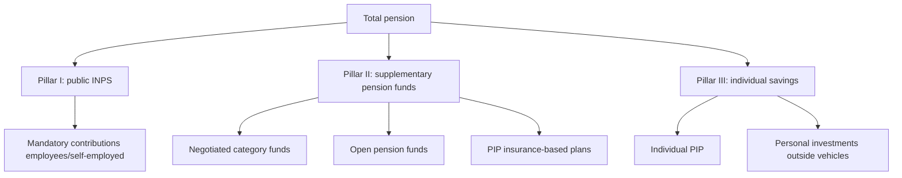
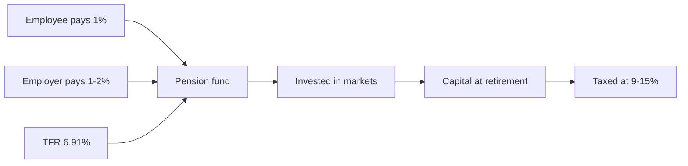

# Pension system: state pension, supplementary funds, TFR

If you're under 40 and assume the INPS state pension will "be enough", you have a problem. The numbers say Italians born after 1980 will collect, on average, **50-60% of their last salary** as public pension. The rest is something you must build yourself, today, exploiting the mechanisms the State — paradoxically — offers generously (tax deduction, employer match, favored tax regime). This is the "long but most important" section for anyone with time on their side.

## 1. The three-pillar system

Italy, like most of Europe, has a **three-pillar** pension system stacked together.

| pillar | nature | contribution | payout |
|---|---|---|---|
| **I — INPS** | mandatory, public, pay-as-you-go | 33% (employees, ~23% employer + ~10% employee) | lifetime annuity |
| **II — Pension funds** | voluntary, private, funded | flexible + TFR + employer | annuity or capital (max 50%) |
| **III — Individual** | voluntary, free | any | any form |

**Key point.** Pillar I is **pay-as-you-go**: your contributions today pay current pensioners. There is no "treasury" with your name on it. It's a generational pact. Pillar II is **funded**: your money is invested in financial markets, then paid back to you (or heirs).

Big difference: in pillar I, if demographics worsen (fewer youngsters per pensioner), you lose. In pillar II, if markets perform, you win. That is why building pillar II + III today is not optional.

## 2. History of Italian pension reforms

Without some history you don't know where you stand.

| year | reform | what changed |
|---|---|---|
| 1969 | Brodolini | introduces final-salary system (% of last salaries × seniority) |
| **1995** | **Dini** | switch to contributive for new hires; pro-rata for mixed careers |
| 1997 | Prodi | harmonizations |
| 2004 | Maroni | raises retirement age |
| 2007 | Damiano | "scalone" |
| **2011** | **Fornero** | retirement age = life expectancy ISTAT; contributive for all pro-rata from 2012; ends easy early retirement |
| 2017 | APE / Opzione donna | conditional early exits |
| 2019 | Quota 100 | experiment 38 years contributions + 62 years age |
| 2022-2024 | Quota 102, 103, restricted Opzione donna | progressive cuts |

Bottom line: **anyone born after 1980 gets pure contributive pension** (working career started after 1996). No saving "final-salary" formula.

## 3. Contributive pension formula

This is the formula to understand once in your life. The monthly contributive pension is:

$$\text{Annual pension} = \text{Notional capital} \times c(\text{age})$$

Where:
- **Notional capital** = sum of all contributions paid (33% of salary), revalued each year with the **5-year moving average of nominal GDP**.
- **$c$(age)** = transformation coefficient, depending on retirement age.

Coefficients are updated every two years based on ISTAT life expectancy. Schedule in force 2023-2024:

| retirement age | coefficient $c$ |
|---|---|
| 57 | 4.270% |
| 60 | 4.602% |
| 62 | 4.860% |
| 65 | 5.275% |
| 67 | 5.723% |
| 70 | 6.377% |
| 71 | 6.541% |

**What does it mean?** If you retire at 67 with €400,000 notional capital:
$$P = 400{,}000 \times 0.05723 = \text{€22,892/year} \approx \text{€1,760/month (13 monthlies)}$$

Retiring 4 years later (71 vs 67) raises the coefficient from 5.723% to 6.541%: +14% monthly annuity. It's a trade-off: work longer but get more per month, as long as you live.

### Estimating notional capital

If you earn on average $R$ per year for $n$ years, with revaluation $g$ (nominal GDP, historically 2-3%):

$$M \approx 0.33 \times R \times \frac{(1+g)^n - 1}{g}$$

**Example.** €30,000 average gross salary for 40 years of career, 2.5% revaluation:
$$M \approx 0.33 \times 30{,}000 \times \frac{1.025^{40} - 1}{0.025} = 9{,}900 \times 67.40 \approx \text{€667,260}$$

Pension at 67: $667{,}260 \times 0.05723 = \text{€38,187/year} \approx \text{€2,938/month}$.

Sounds like a lot, BUT: at 67 in 2065 that income will buy much less than €2,938 today (inflation). And your last salary will likely be €60-80k nominal. **Replacement rate** ~ 50%.

## 4. Replacement rate: the harsh diagnosis

The **replacement rate** is the ratio of first pension to last salary. For a 30-year-old today, projections from Ragioneria di Stato and Covip show:

| worker profile | expected gross replacement rate |
|---|---|
| Private employee man, 40 years of contributions | **~62-68%** |
| Private employee woman, 35 years (maternity gap) | ~52-58% |
| Self-employed gestione separata 24%, 40 years | **~45-55%** |
| Self-employed traders/artisans 24%, 40 years | ~55-60% |

If today you earn €50k net and tomorrow pension is 50-60% of **gross**, your pension net crashes 40-50%. **This is the gap** that pillar II and III must fill.

## 5. TFR: the "forgotten 13th salary"

The **TFR — Trattamento di Fine Rapporto** is severance pay that your employer accrues annually for you.

$$\text{Annual TFR} = \frac{\text{Eligible salary}}{13.5} \approx 7.41\% \text{ of salary}$$

In practice about **6.91% net** after the 0.50% INPS Guarantee Fund levy.

**Legal revaluation:**
$$\text{Reval.} = 1.5\% + 75\% \times \text{ISTAT inflation}$$

With zero inflation: 1.5%. With 6% inflation (2022): 1.5% + 4.5% = 6%.

When your employment ends (resignation, dismissal, retirement), you receive TFR in one shot, taxed via **separate taxation** (average IRPEF rate of past 5 years, typically 23-27%).

### TFR in employer vs TFR in pension fund

This is **the** key tax-financial decision for any Italian employee. You have 6 months from hiring to decide; otherwise, "silent assent" sends it to the negotiated fund.

| dimension | TFR with employer | TFR in pension fund |
|---|---|---|
| typical annual return | 1.5-3% (law) | 2.5-5% (depends on profile) |
| accessibility before retirement | yes, for advances (first home, medical) | yes, partial (more restrictive) |
| market risk | zero (employer's debt) | yes (equities may fall) |
| taxation on exit | 23-43% (separate) | **9-15%** (favored!) |
| protection if employer fails | INPS Guarantee Fund | total (third-party manager) |
| additional employer match | NO | YES (if negotiated fund) |

**The employer "match"** is key: if your company has a negotiated category fund (e.g. Cometa for metalworkers, Fonchim for chemists, Cooperlavoro, Espero for school), by paying a small share (e.g. 1% of salary) **the employer is obliged by collective contract to match** (often 1-2%). It's **free money**.

Not joining the negotiated fund means **leaving on the table a 1-2% raise**.

## 6. Pension fund types

| type | promoted by | typical costs | employer match |
|---|---|---|---|
| **Negotiated** | unions + employers | 0.1-0.3% TER (Cometa: 0.12%) | YES |
| **Open** | banks, asset managers (e.g. Allianz, Amundi) | 0.5-1.5% TER | only if agreed |
| **PIP** | insurance companies | 1-2.5% TER + 2-5% entry fees | rarely |
| **Pre-existing funds** | banks (e.g. Intesa, UniCredit) | varies | often yes for employees |

**Verdict.** For 90% of Italian employees: **negotiated category fund** is clearly the best, combining very low costs and employer match. PIPs are almost always **to avoid**: high entry fees, opaque management, sad net returns. See section 33 (Insurance) for why.

## 7. Pension fund tax advantages

This is why the State wants you to join:

1. **Tax deduction up to €5,164.57/year** on voluntary contributions (excluding TFR).
   - If you earn €40k and pay €5,000: immediate tax saving = $5{,}000 \times 0.38 = \text{€1,900}$ (marginal rate 38%).
2. **Favored taxation on returns: 20%** (vs 26% on standard savings; 12.5% on the govies portion inside the fund).
3. **Exit taxation 15%**, decreasing 0.3% per year of membership beyond 15 → **down to 9%** after 35 years.
4. **Tax-free or 23% advances**:
   - First home for you/children (after 8 years of membership): up to 75% of capital.
   - Medical expenses: up to 75% at any time.
5. **Full redemption** in cases of unemployment >12 months, invalidity, death.

**Tax comparison example.** You pay €5,000/year for 30 years, net return 3.5%:

Case A (pension fund, deduction + 11% exit tax after 30 years):
- Annual tax saving: 5,000 × 38% = €1,900/year (effectively you pay €3,100 "net out of pocket").
- Gross capital after 30 years: $5{,}000 \times \frac{1.035^{30}-1}{0.035} \approx \text{€258,207}$.
- Exit tax 11% on contributions (returns already taxed): net ~ **€245,000**.

Case B (global ETF, 0.2% TER, no tax shelter):
- You pay €3,100/year for 30 years (same "net pocket" as case A).
- Estimated net return 5% (gross 7% − 26% on realized → ~5%).
- Capital: $3{,}100 \times \frac{1.05^{30}-1}{0.05} \approx \text{€205,911}$.

The pension fund **wins by ~€40k** thanks to upfront deduction + favored taxation. For anyone in IRPEF bracket 38-43%, the pension fund is almost always mathematically superior.

## 8. Full simulation: 30-year-old, €30k salary

Assumptions:
- 30 today, gross salary €30,000.
- Real salary growth 2%/year.
- Joins Cometa (metalworkers negotiated fund) paying 1.2% (to get 2% employer match).
- TFR 6.91% to the fund.
- Balanced profile, net return 3.5%/year.
- Retires at 67 → 37 years of contributions.

Average annual fund contributions:
- Employee: 1.2% × 30k = €360
- Employer: 2% × 30k = €600
- TFR: 6.91% × 30k = €2,073
- **Total starting annual: €3,033** (net of salary growth)

Estimated capital at 67 (simplified, constant real salary):
$$M = 3{,}033 \times \frac{1.035^{37} - 1}{0.035} \approx 3{,}033 \times 75.42 \approx \text{€228,700}$$

Converted to annuity using pension-fund coefficients (more favorable than INPS, ~5-5.5%):
$$\text{Annuity} \approx 228{,}700 \times 0.05 \approx \text{€11,435 net/year} = \text{€950/month net}$$

Added to estimated INPS public pension ~€1,700/month → **~€2,650/month total net**. Without the fund, it would have been €1,700. **+55% effective pension**.

"Real" cost to the employee: only €360/year net (the TFR would have gone to the employer anyway; 2% match is gift). 360 × 37 years = €13,320 total → translated to +€950/month for life. **Phenomenal lifetime ROI.**

## 9. Pillar III: beyond pension fund

Once you saturate the pension fund (max €5,164.57 deductible), the rest of your individual saving is:

- **Accumulating global ETF** at your broker (no tax shelter, but full liquidity).
- **PIR** (Individual Saving Plans): capital gain exemption after 5 years holding, but requires ≥70% Italian/EU securities and ≥30% SMEs. Costs often high, good tax window.
- **Emergency fund liquidity** (6 months, see budgeting section).

Pillar III ≠ Pillar II: in III you have no tax deduction but full withdrawal freedom. You need both.

## 10. Common pension mistakes

| mistake | consequence | fix |
|---|---|---|
| Leaving TFR with employer without checking | lose employer match + favored taxation | join negotiated, at least for match |
| Joining PIP from bank/insurer | TER 1.5-2.5%, fees 3-5% | replace with open/negotiated fund |
| Paying only the minimum for match | waste of €5,164 deduction headroom | go to limit if marginal rate ≥35% |
| Guaranteed profile at 30 | ~1% return, below inflation | switch to equity profile until age ~50 |
| Lump sum redemption at 67 | big capital taxed together | consider annuity or split |
| Believing INPS will be enough | 50-60% replacement rate | build pillar II + III |
| Not checking INPS ECO statement | gaps discovered after 30 years | review yearly on INPS website |

## 11. Operational checklist

1. Go to **INPS → Contribution Statement**: verify all years are recorded.
2. Use the **"La mia pensione futura"** simulator on inps.it.
3. Check if your collective contract (CCNL) provides a **negotiated fund**: if yes, join at least to grab the match.
4. If you contribute to the fund, choose **equity profile** while >15 years to retirement, **balanced** between 15 and 5 years, **guaranteed/bond** in the final 5.
5. Max out the deduction (€5,164.57) **if your marginal rate is ≥ 35%**.
6. Keep CUD/770 forms to certify deductible voluntary contributions.
7. Above the pension fund cap: use accumulating global ETFs.

Exercise: compare TFR with employer vs in pension fund

You are an employee, gross salary €35,000, marginal IRPEF 38%. You have 35 years to retirement. Three scenarios:

**Scenario A:** TFR with employer. Revaluation 1.5% real.
**Scenario B:** TFR in balanced pension fund, net return 3.5% real, no voluntary contribution.
**Scenario C:** Like B + voluntary €1,500/year (for 2% match).

Annual TFR: 35,000 × 6.91% = €2,418.5.

**Questions:**
1. Gross final capital in each scenario.
2. Exit taxation: 25% for A, 9% for B and C.
3. Net final capital + in case C the annual tax saving of €1,500 × 38%.

**Solutions:**

Scenario A:
$$\text{Cap. A} = 2{,}418.5 \times \frac{1.015^{35}-1}{0.015} \approx 2{,}418.5 \times 45.59 \approx \text{€110,250}$$
Net: $110{,}250 \times 0.75 = \text{€82,687}$.

Scenario B:
$$\text{Cap. B} = 2{,}418.5 \times \frac{1.035^{35}-1}{0.035} \approx 2{,}418.5 \times 66.67 \approx \text{€161,241}$$
Net: $161{,}241 \times 0.91 = \text{€146,729}$.

Scenario C:
Total annual contribution: 2,418.5 + 1,500 + 700 (2% match) = €4,618.5.
$$\text{Cap. C} \approx 4{,}618.5 \times 66.67 \approx \text{€307,875}$$
Net: $307{,}875 \times 0.91 \approx \text{€280,166}$.
Annual tax saving from €1,500 deduction: €570 × 35 years = ~€20,000 more (unpaid IRPEF).

**A → C difference: ~+€197,500 + €20k tax saving = ~+€217,500** in a 35-year career. By paying €1,500/year (~€125/month) extra. Think about it.

## 12. Pension for self-employed and VAT holders

If you're self-employed, the system is different and (unfortunately) less generous.

### INPS Gestione Separata

For freelancers without a private pension fund (consultants, programmers, etc.):
- Contribution rate: **26.07% on net income** (2024, of which 0.72% maternity + 0.5% sickness + 0.35% DIS-COLL for para-subordinate).
- For self-employed with other coverage: **24%**.
- 2024 ceiling: €119,650 taxable income.

**Expected replacement rate for Gestione Separata self-employed:** ~40-50%. Dramatic.

### Private pension funds (Casse)

Professional categories (lawyers, doctors, engineers, accountants, architects) have their own **autonomous funds**:
- Inarcassa (free-lance architects/engineers)
- Cassa Forense (lawyers)
- ENPAM (doctors)
- ENPACL (labor consultants)

Different rates (10-20%), independent management, own rules. Often better than Gestione Separata in replacement-rate terms, but with legacy constraints.

### Traders and artisans

INPS Commercianti/Artigiani: rate 24.48% (2024), contribution floor ~€4,000/year.

| category | 2024 rate | expected replacement rate |
|---|---|---|
| Private employee | 33% (total firm+worker) | 60-68% |
| Gestione Separata (no other coverage) | 26.07% | 40-50% |
| Gestione Separata (with other coverage) | 24% | 35-45% |
| Traders/artisans | 24.48% | 55-60% |
| Private Casse (varies) | 10-20% | 50-65% |

### What to do if self-employed

1. **Max out pension fund deduction** (€5,164): marginal rate often 38-43% → huge tax saving.
2. **Join an open fund** (e.g. Amundi, Anima): usually no category negotiated fund available.
3. **Build a broad pillar III**: accumulating ETFs and PIRs.
4. **Don't skip contributions**: every "hole" year is 1-2% of future pension lost.

## 13. RITA and other early exits

In recent years, mechanisms have appeared to anticipate withdrawals from the pension fund.

### RITA (Anticipated Temporary Supplementary Annuity)

Allows you to start drawing the pension fund **up to 5 (or 10) years** before retirement age, if:
- Work activity ceased.
- At least 20 years INPS contributions.
- 5 (or 10) years to old-age pension maturity.
- At least 5 years of pension fund membership.

RITA taxation: 15% decreasing to 9%, like a standard supplementary pension. **Important**: the RITA portion paid out is IRPEF-exempt.

### Advances

Without needing RITA:
- **75% for medical expenses** (at any time, 15% tax).
- **75% for first home for self/children** (after 8 years, 23% tax).
- **30% for any reason** (after 8 years, 23% tax).

### Total redemption

In cases of:
- Unemployment > 12 months.
- Permanent disability.
- Death (heirs redemption).

Favored taxation in these cases (9-15% for unemployment/disability redemption).

## 14. Summary

- 3 pillars: reduced INPS, crucial pension fund, flexible individual.
- Contributive pension = notional capital × transformation coefficient (~5.7% at 67).
- TFR 6.91% gross annual, revaluation 1.5% + 75% inflation.
- **Negotiated > open > PIP pension fund** for cost and match.
- Tax advantages: €5,164 deduction, 20% taxation on returns, **9-15% on exit**.
- For someone with 30 years ahead: equity profile, max deduction, TFR to fund.
- Never skip the **employer match**: it's hidden salary.
- **Self-employed**: pillars II and III even more crucial (40-50% replacement rate).
- **RITA**: anticipate up to 5-10 years before retirement.

The Italian system is generous **for those who know the rules**. Everyone else gets the default — and the default today is the pension gap.
