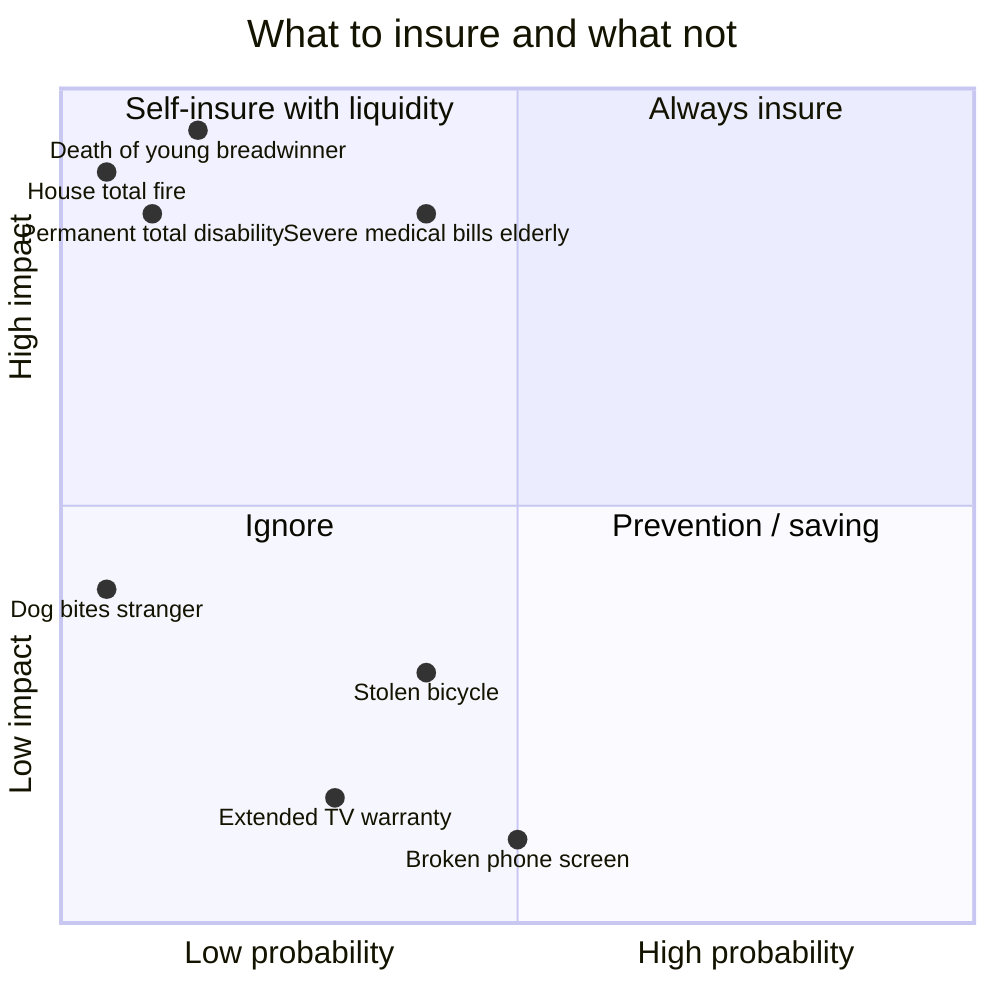
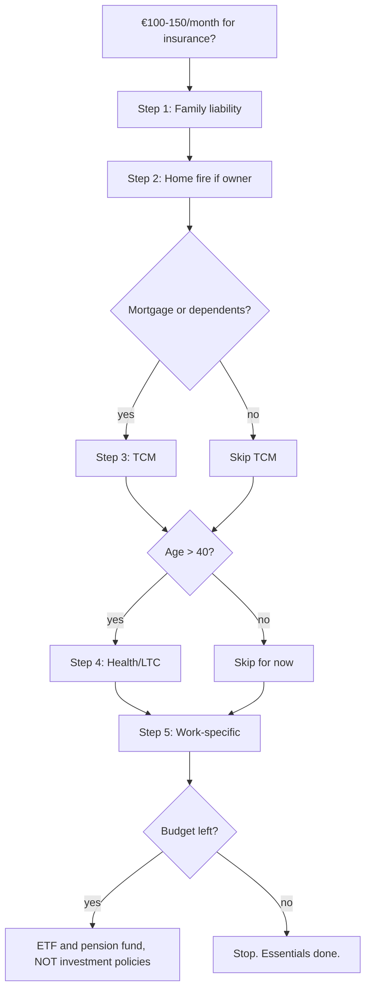

# Insurance: what you actually need vs what is just fees

Insurance is a fundamental financial tool **and** one of the most predatory industries in Italian retail finance. The golden rule is simple and harsh: **insure against catastrophic unrecoverable events, not against annoyances**. Nine out of ten policies pushed by banks, advisors and sub-agents do not respect this principle. In this section we separate what makes sense from what is mere commission fuel.

## 1. The insurance principle

Insurance makes sense when an event has **low probability but high impact**, where "high impact" means you couldn't cover it with your savings.

In other words: if the event ruins your life, **insure**. If it ruins just your month, **self-insure** with 6 months of emergency fund.

| principle | example in practice |
|---|---|
| Insure the catastrophic | death, disability, house destruction |
| Don't insure the small | phone, extended warranty, lost luggage |
| Insurance ≠ investment | mixing protection and capitalization = high costs |
| Lower premium vs cover ratio, better | "leverage ratio" is the real signal |
| Beware of seller earning commission | their incentive isn't yours |

## 2. Truly essential policies

The "minimum kit" for a normal Italian adult.

### Car insurance (RCA, mandatory)

Covers third-party damages caused by your vehicle. **Mandatory by law.**

| cover | mandatory? | typical annual cost |
|---|---|---|
| Third-party liability | YES | €300-1,500 |
| Fire/theft | NO | +€100-300 |
| Kasko (own vehicle damage) | NO | +€400-1,500 |
| Vandalism, atmospheric events | NO | +€50-150 |

**Tips:**
- Always compare 3 quotes (e.g. Segugio, Facile, ConTe).
- Bonus/malus: one class better = -10-15% premium.
- Black box: -20-30% premium for tracking.
- Kasko only worth it on new cars >€25k.

### Family liability (RC capofamiglia)

Costs very little (€40-100/year) and covers damages by you, family, pets, kids to third parties. **Cap €1-2 million**.

**Real example.** Your kid breaks a shop window (€3,000). Your dog bites a passerby (€8,000 medical). Without it you pay out of pocket. With it: €50/year.

This is **the best risk/premium ratio** policy out there. Almost no Italian has it.

### Home insurance (fire + atmospheric events)

If you are an owner, **fire insurance is mandatory** if you have a mortgage. Keep it even after paying it off.

| cover | typical annual cost (€250k home) |
|---|---|
| Fire + explosion + lightning | €80-150 |
| Atmospheric events (hail, storm) | +€20-40 |
| Theft/robbery in home | +€60-150 |
| Water pipe damage | +€30-60 |
| Vandalism, electrical phenomena | +€20-50 |
| Building third-party liability | +€30-50 |
| **"All risk" complete package** | **€250-450** |

Covers the **rebuild value** of the building (not market value). €250k Milan center = ~€180k rebuild (land doesn't burn).

### Term life insurance (TCM)

**The queen of policies.** Crucial if you have a mortgage, young children, or a financially dependent partner.

**How it works.** You pay annual premium X for a period (e.g. 20 years). If you die during the period, beneficiaries receive a sum (e.g. €300,000). If you don't, you've paid for nothing — **no refund**. Just like car insurance.

**Cost.** Healthy non-smoker, 35yo, €300,000 cover, 20-year term: **€15-30/month**. Ridiculously low for the value.

**Common traps:**
- Bundled with mortgage: the bank sells you theirs at 4x market. **Illegal to force you since 2017**. Get 3 independent quotes (e.g. via Facile.it).
- "Decreasing" TCM: cover decreases with mortgage debt. Cheaper but only OK if it's just to cover the mortgage, not to protect family on other fronts.
- Exclusions: suicide in first 2 years, extreme sports, undisclosed pre-existing conditions.

### Disability and critical illness (LTC, Dread Disease)

Non-negligible probability (3-5% during working life) and devastating impact: if you can't work, the family loses income **and** faces care costs.

- **Permanent total disability**: lump sum €100-200k.
- **Dread disease**: annuity or capital if diagnosed with severe disease (cancer, heart attack, stroke).
- **LTC (Long Term Care)**: monthly annuity if you lose self-sufficiency (Activities of Daily Living).

These are **expensive policies** (€200-800/year depending on age/cover), but consider that INPS recognizes only very severe disabilities with paltry benefits.

## 3. "Life-investment" policies: the Ramo trap

This is where the Italian insurance **wild west** begins. When you're offered a non-TCM "life policy", know there are essentially 5 "ramos" (plus some hybrids).

| ramo | nature | investment risk | typical historical return | typical costs |
|---|---|---|---|---|
| **Ramo I — Separate Management** | capital managed by insurer, guaranteed minimum return | low (insurer) | 1-3% net | 1-2% TER + 1-5% entry fees |
| **Ramo III — Unit Linked** | underlying = funds/profiles | you (markets) | −10% to +10% | 1.5-3% TER + entry fees |
| **Ramo III — Index Linked** | underlying = indexes/structures | you (also issuer!) | varies | opaque costs |
| **Ramo V — Capitalization** | like ramo I but for legal entities | low | 1-2% | less retail |
| **Multi-ramo** | mix I+III | partly you, partly insurer | varies | worst of both |
| **PIP** (any ramo) | individual pension plan | varies | varies | often 2-2.5% TER |

### Ramo I (separate management)

Sounds ideal: guaranteed minimum return, never zero, "safe". Reality:
- 1-2% annual costs eat most of the return.
- Entry fees (1-5%) not recouped for years.
- Surrender penalties in the first 4-5 years.
- Composition of separate management: 80-90% government bonds (largely Italian BTPs) → in high-rate scenarios, accounting valuation can diverge from market value.

**Practical effect.** Put €10,000 in a ramo I with 3% entry fee, you start with **€9,700 invested**. To recover the fee takes a full year of returns. Over 30 years, the 1.5% TER eats ~36% of final capital vs an equivalent alternative.

### Ramo III (unit-linked)

A kind of "mutual fund wrapped in insurance wrapper". Compared to ETF/mutual fund direct, you pay:
- Underlying fund TER: 1-2%.
- Policy TER ("management mandate"): 0.5-1.5%.
- Entry fees.
- Surrender penalties.

You pay **double commissions**. The theoretical benefit (un-seizability, beneficiary outside estate, no probate wait) rarely compensates.

### Index-linked: watch the issuer

History. Lehman Brothers 2008: many "index-linked" policies sold as "safe" in Italy had Lehman as **issuer**. When Lehman failed, policyholders lost capital: the insurer wasn't the guarantor, the issuer was. Fundamental insight: **issuer risk** doesn't disappear behind the "insurance" label.

### PIP (Individual Pension Plans)

PIPs are pension funds **in insurance form**. They have the same tax benefits (€5,164 deduction, favored 9-15% exit) but with insurance costs.

Covip 2023 comparison (averages):

| type | avg TER | net 10y return |
|---|---|---|
| Negotiated pension funds | 0.2% | +3.5% |
| Open pension funds | 1.3% | +2.5% |
| **New PIPs** | **2.2%** | **+1.2%** |

Over 30 years, 0.2% vs 2.2% TER (= 2% annually) means **~45% less capital** at retirement. For PIPs it's the TER eating the return, not markets.

## 4. Math comparison: PIP vs ETF over 30 years

Scenario:
- You pay €200/month (= €2,400/year) for 30 years.
- Market gross return (global equity): 7%/year.
- PIP: TER 1.8% + 3% entry fee + 11% exit tax.
- Accumulating global ETF (e.g. SWDA, VWCE): TER 0.2% + 26% capital gain on exit.

**PIP:**
- Net annual contribution after fee: 2,400 × 0.97 = €2,328.
- Annual net return: 7% − 1.8% = 5.2%.
- Gross capital after 30 years: $2{,}328 \times \frac{1.052^{30}-1}{0.052} \approx \text{€171,108}$.
- Simplified 11% exit tax on contributions → **net ~€158,000**.

Accounting also for **annual tax saving** from deduction (2,400 × 38% = €912/year), over 30 years reinvested at 5% real ≈ **€60,000** additional.

PIP total: ~€218,000.

**ETF:**
- Net contribution: €2,400 (no entry fee).
- Net return: 7% − 0.2% = 6.8%.
- Stamp duty (0.2%/year) → effective net ~6.6%.
- Gross capital after 30 years: $2{,}400 \times \frac{1.066^{30}-1}{0.066} \approx \text{€215,760}$.
- Contributions: €72,000. Gain: ~€143,760. Tax 26%: ~€37,378.
- Net: **~€178,382**.

| item | PIP | global ETF |
|---|---|---|
| net final capital | ~€158,000 | ~€178,382 |
| annual tax saving (reinvested) | ~+€60,000 | 0 |
| **net total** | **~€218,000** | **~€178,382** |

**Surprise.** At these numbers the PIP "wins" thanks to the tax deduction. **BUT** if you compare PIP with a **negotiated pension fund** (TER 0.2% vs 1.8%), the negotiated wins both: ~€295,000 net.

**Operational conclusion:**
1. Max out the **negotiated pension fund** (deduction + low TER + employer match): always wins.
2. Beyond the €5,164 cap: **accumulating global ETF** on your broker.
3. **PIP** only makes sense if you have no access to a negotiated fund and you need the deduction. Always compare TER, fees, penalties.

## 5. Professional liability and other "work" policies

If you are self-employed/freelance:

- **Professional liability**: mandatory for many categories (lawyers, doctors, engineers, accountants). Premiums €300-3,000/year. **Essential**.
- **Legal expenses**: covers legal costs in disputes. €100-300/year.
- **Cyber risk**: for those handling sensitive data, systems. €500-2,000/year.
- **Key Man**: for small businesses, covers loss of owner/key partner.

## 6. Common traps and red flags

| trap | how to spot | defense |
|---|---|---|
| Mortgage-bundled policy | bank says "mandatory with us", prices 3-5x market | since 2017 NOT mandatory with your bank; independent quotes |
| 3-5% upfront entry fee | not visible in advertised returns | read KID/IBIP — costs section |
| 4-7 year surrender penalty | hidden in policy notes | run if penalties extend beyond 12 months |
| "Safe" index-linked | uses poor-quality issuer | check issuer rating |
| "Guaranteed minimum return" | often 0.5% or ZERO | not a benefit: it's the worst case |
| PIP sold in bank | TER 2-2.5%, vs 0.2% negotiated | prefer negotiated or open |
| Home + mortgage bundles | bundled with mortgage cost | separate, compare |
| Extended electronic warranty | costs 10-20% of price, legal warranty already 2 years | don't buy |

## 7. Insurance priorities hierarchy

If you have limited budget (€100-150/month total for non-car insurance):

1. **Family liability** (€40-80/year) — always.
2. **Home fire** (€80-300/year) — if owner.
3. **TCM** (€200-500/year) — if mortgage or dependents.
4. **Health/LTC** (€300-800/year) — especially over 40.
5. **Legal, professional** — if work requires.

Only **after** these, consider investment policies (and you likely won't need them: use ETFs and pension funds).

## 8. How to read an insurance KID/IBIP

Since 2018 every investment-based policy must provide a standard KID/DIP. Items to check:

| KID section | what to look for |
|---|---|
| "Costs over time" | RIY (Reduction in Yield): if >0.8%, expensive |
| "Cost composition" | one-off costs (fees), running costs, performance fees |
| "Performance scenarios" | "unfavorable" and "stress" scenario (the real risk) |
| "Recommended period" | if >5 years, understand it's illiquid |
| "Type of guarantee" | "none" is a warning, not a detail |

If a policy is offered without KID/IBIP, **run**. It's legally required.

## 9. Common mistakes

| mistake | consequence | fix |
|---|---|---|
| Buying policy before emergency fund | no liquidity for deductibles and delays | build 3-6 months cash, then policies |
| TCM cap too low | family discovers only €100k covered after death | calculate 5-10x annual income |
| Buying out of bank "loyalty" | TER 2x market | always 3 independent quotes |
| Investment policy before pension fund | wasted deduction | saturate negotiated fund first |
| Underinsuring home | proportional reduced payout | declare correct floor area |
| Confusing "guaranteed" ramo I with safe | high costs, negative real returns | read KID + compare TER |
| Paying annual policy in installments | implicit financing cost 10-15% | pay lump sum if you can |

Exercise: dissect a life-investment policy

A bank pitches you a multi-ramo III policy:
- 3.5% entry fee.
- 1.9% annual TER.
- 0% guaranteed minimum (nominal capital at 20-year maturity).
- Surrender penalties: year 1 = 5%, year 2 = 4%, year 3 = 3%, year 4 = 2%, year 5 = 1%, from year 6 onward zero.
- Planned contribution: €5,000/year for 20 years, expected market 5% gross.

**Questions:**
1. How much of year 1 €5,000 is actually invested?
2. What is the expected net annual return?
3. Final net capital after 20 years vs global ETF (0.2% TER, 5% gross, 26% exit tax)?
4. If you surrender after 4 years, what do you receive?

**Solutions:**

1. Invested year 1: 5,000 × (1 − 0.035) = **€4,825**. €175 gone immediately.
2. Net policy return: 5% − 1.9% = **3.1% annual**.
3. Final policy capital:
$$4{,}825 \times \frac{1.031^{20}-1}{0.031} \approx 4{,}825 \times 27.07 \approx \text{€130,612}$$
(actually should be computed contribution-by-contribution; simplified).

ETF final capital:
$$5{,}000 \times \frac{1.048^{20}-1}{0.048} \approx 5{,}000 \times 32.25 \approx \text{€161,250}$$
Contributions: €100,000. Gain: €61,250. Tax: €15,925. **Net: €145,325**.

**Difference: ETF +€14,700 over the policy.** Without even factoring surrender penalties.

4. Redemption after 4 years:
- Gross accumulated (4 contributions of €4,825 at 3.1%): $\approx 4{,}825 \times \frac{1.031^4-1}{0.031} \approx \text{€20,218}$.
- 2% penalty: −€404.36.
- Net: **~€19,814**, vs 4 × €5,000 = €20,000 paid in. You've **lost ~€186**, after 4 years of "investment".

Lesson: the policy is structured to favor the insurer, not you. Aside from rare cases (succession needs, un-seizability), ETF + pension fund always beat it.

## 10. Summary

- **Insure the catastrophic, not the annoying.**
- Essential kit: RCA, family liability, home fire, TCM, eventually LTC/health.
- **Never mix protection and investment**: Ramos I/III/V are often expensive vs ETF + pension fund.
- **PIPs** are insurance-wrapped pension funds, costly: prefer negotiated/open.
- Always read **KID/IBIP**: look at costs, RIY, unfavorable scenarios.
- Mortgage-bundled sale: **illegal since 2017**. Always 3 independent quotes.
- Over 30 years, an extra 2% TER costs **40-50% of final capital**.

The insurance product is a useful tool **when you choose it**. When someone earning commission on the contribution sells it to you, the incentive is not yours.
