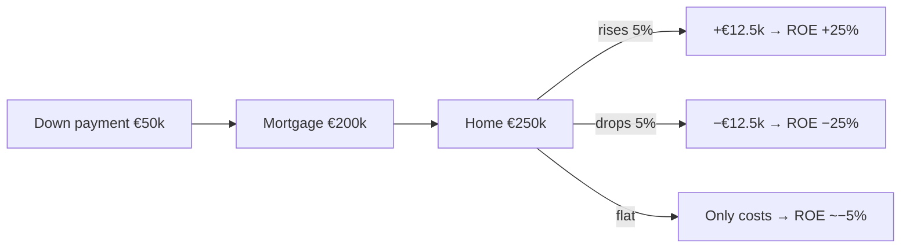
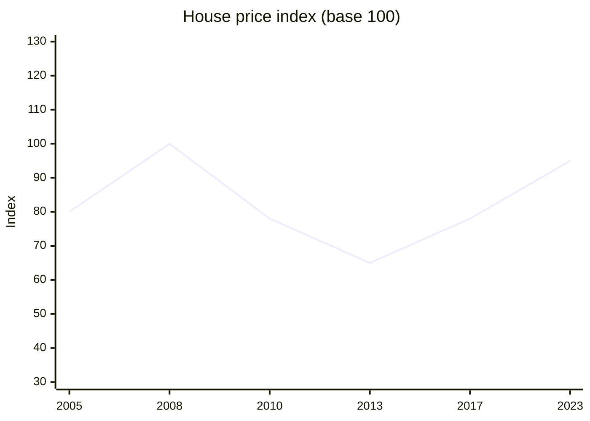
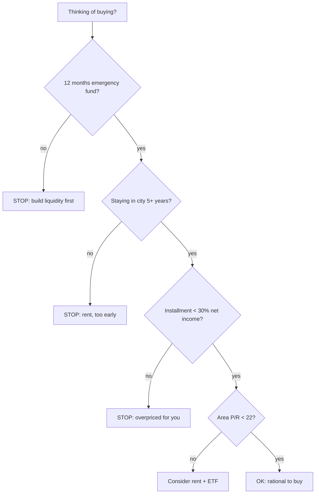

# Real estate: buying, renting, REITs, fractional investing

"Bricks never betray you." This Italian saying has cost generations of savers hundreds of billions in foregone returns, because it ignores mathematical facts. Real estate is an asset class like any other — with specific advantages (leverage, tangibility, utility value) and huge costs often hidden in the purchase price. In this section we run the real numbers, ideology-free, for both primary residence and investment, in Italy and abroad.

## 1. Buy vs rent: the real math

"Buy or rent?" looks emotional but is mostly math. The principle: the **total annual cost of ownership** should be compared to **annual rent + opportunity cost of the down payment capital**.

### Hidden costs of buying

| item | % of price | example on €250,000 |
|---|---|---|
| Notary (primary home) | 1-2% | €2,500-5,000 |
| Purchase tax (primary home) | 2% (private seller) or 4% VAT (builder) | €5,000-10,000 |
| Purchase tax (second home) | 9% (private) or 10% VAT (builder) | €22,500-25,000 |
| Real estate agent | 3% + VAT = ~3.66% | €9,150 |
| Mortgage appraisal | one-off | €250-500 |
| Mortgage substitutive tax | 0.25% (primary) or 2% (second) | €625-5,000 |
| Mortgage origination fees | varies | €0-1,000 |
| **Total purchase costs** | **6-15%** | **€15,000-50,000** |

Add **annual ownership costs**:

| item | typical annual (€250k home) |
|---|---|
| IMU (only second home, primary exempt) | €800-1,500 |
| TARI waste tax | €200-400 |
| Maintenance (1-2% value) | €2,500-5,000 |
| Condo fees | €600-2,500 |
| Home insurance | €200-400 |
| Down payment opportunity cost (see below) | big |
| **Annual total (excluding mortgage)** | **~€4,300-9,800** (second home) |
|  | **~€3,500-8,000** (primary home) |

### Example: €250k purchase vs €800/month rent

Base scenario:
- Home price: €250,000.
- Equivalent rent: €800/month = €9,600/year.
- 80% mortgage: €200,000 at 25 years, 3.5% rate → installment ~€1,001/month, total interest paid ~€100,000.
- Down payment €50k + purchase costs €15k = €65,000 **out of financial markets**.
- Down payment opportunity cost: if €65,000 in ETF at 5% real → +€3,250/year of missed return.

| year | scenario "buy" (cash out) | scenario "rent + invest" |
|---|---|---|
| 0 | −€65,000 (down + costs) | 0 (but invest €65k in ETF) |
| 1-25 | installment €12,012/year + €4,000 ownership | rent €9,600/year + ETF grows at 5% |
| 25 (mortgage paid off) | owner of home with market value X | 65,000 × 1.05^25 ≈ €220,000 ETF + you've been renting |
| 26+ | ownership cost €4,000/year | rent + ETF continues |

**When does buying win?** When after 25 years the home's market value exceeds the accumulated ETF + risk premium. In Milan over the last 20 years, the average apartment grew **+1.5-2.5% real**, while a global ETF grew **+5-6% real**. The financial investment almost always wins **if** you don't account for emotional/utility value.

### Quick indicator: price-to-rent ratio

$$P/R = \frac{\text{property price}}{\text{equivalent annual rent}}$$

| P/R | interpretation |
|---|---|
| < 15 | buying favored |
| 15-20 | gray zone, depends on market |
| 20-25 | renting statistically better |
| > 25 | buying almost always disadvantaged |

Example: Milan central apartment €700k, equivalent rent €2,000/month (€24k/year) → P/R = 29. **Renting clearly better.**

Rome suburb €180k, rent €700/month (€8.4k/year) → P/R = 21.4. Gray zone.

Catania peripheral district, €90k, rent €450/month (€5.4k/year) → P/R = 16.6. Buying reasonable.

## 2. Mortgage as leverage: pros and cons

Already covered in mortgage section. Real-estate summary:

**Leverage pro.** If you buy €250k with €50k down and the home rises 5%, gain is €12,500 on €50k capital = **+25% ROE**. Multiplicative effect.

**Leverage con.** If the home drops 5%, you lose €12,500 on €50k = **−25% ROE**. Symmetric. And if value falls below remaining debt you're in **negative equity**, the USA 2008 scenario.

Leveraged real estate is **amplified risk**. It is not "safe": it is "tangible". Different thing.

## 3. Buy-to-let investment

If you buy **to rent out** (not to live), you enter the rental yield world.

### Yield: gross vs net

**Gross yield:**
$$\text{Gross yield} = \frac{\text{Annual rent}}{\text{Purchase price}}$$

**Net yield — the number that matters:**
$$\text{Net yield} = \frac{\text{Annual rent} - \text{expenses} - \text{tax}}{\text{Total purchase cost}}$$

Example. €150,000 apartment in Bologna rented €700/month (€8,400/year).
- Gross yield = 8,400 / 150,000 = **5.6%**.
- Annual costs: condo €600, IMU €700, maintenance €1,500, insurance €200, 5% vacancy = €420. Total €3,420.
- Income after costs: €4,980.
- Cedolare secca 21%: 8,400 × 21% = €1,764 (cedolare on gross, not net).
- Net income: 4,980 − 1,764 = €3,216.
- **Net yield = 3,216 / 165,000 (incl. purchase costs) = 1.95%**.

**Surprise.** An apartment "yielding 5.6%" actually returns **<2% real net**. Often worse than a BTP.

### Rental taxation in Italy

Two options:

| regime | rate | when it wins |
|---|---|---|
| **Cedolare secca standard** | **21%** | almost always |
| **Cedolare secca agreed rent** | **10%** | in high-housing-demand cities with 3+2 contract |
| **IRPEF + surtaxes on revalued cadastral income + surcharges** | 23-43% + ~3% | almost never |

Cedolare is **owner's option**, chosen at filing/contract registration. Usually best.

### Vacancies, deadbeats and litigation

In Italy (more than elsewhere):
- Typical vacancy between tenants: 1-3 months.
- Eviction times: 12-24 months in Italian courts. Meanwhile you don't collect and pay expenses.
- Legal eviction cost: €2,000-5,000.
- Property damage: avg 5-10% of value over 10 years.

All risks reducing "theoretical" yield. To budget realistically subtract **5-10% of gross** as risk buffer.

### Italy vs abroad for buy-to-let

| country | typical city-center gross yield | rental taxation | eviction ease |
|---|---|---|---|
| Italy (Milan) | 3-4% | 21% cedolare | 12-24 months |
| Italy (province) | 5-7% | 21% cedolare | 12-24 months |
| Germany (Berlin) | 3-4% | progressive | heavily regulated, rent freeze |
| UK (London) | 3-4% | 20-45% income tax | 2 months |
| USA (Texas, Florida) | 6-8% | 0-37% federal + state | 1-3 months |
| Spain (Madrid) | 4-5% | 19-26% | 6-12 months |
| Netherlands | 3-5% | box 3 (~1.5%) | medium |

Italy has **average yields** but **slow courts** on disputes. Account for it.

## 4. Historical real estate bubbles

The mantra "bricks never betray" is belied by a series of historical disasters:

| event | price crash | recovery |
|---|---|---|
| **Japan 1990-2000** | −60% nominal (homes), −80% commercial | never recovered (30+ years) |
| **USA 2006-2012** | −33% national, −60% Phoenix/Vegas | full recovery only in 2017 |
| **Spain 2008-2013** | −40% national | partial recovery 2019+ |
| **Ireland 2007-2013** | −50% | partial recovery |
| **Italy 2008-2017** | −15% national, −30% south | partial, uneven |

(stylized line of bubble-and-crash market).

**Lesson.** Real estate can drop 50% and take 15-20 years to recover. Like equities. The difference: with real estate you have **leverage** (mortgage) → equity volatility is amplified, not reduced.

## 5. REIT, SIIQ and real estate ETFs

If you want real estate exposure without the hassle (notary, vacancies, maintenance), you can buy **shares of companies owning and managing properties**.

### REIT (Real Estate Investment Trust)

Vehicles created in 1960 in the USA. Features:

- Required by law to **distribute ≥90%** of net income as dividends.
- Exempt from corporate income tax (to avoid double taxation).
- Quoted like stocks (liquid, buyable in clicks).
- Sub-categories: residential, retail, office, healthcare, data center, industrial, hotel.

| sample US REIT | sector | dividend yield | market cap |
|---|---|---|---|
| Realty Income (O) | retail | ~5.5% | $50B |
| Prologis (PLD) | logistics | ~3% | $100B |
| Equinix (EQIX) | data center | ~2% | $80B |
| American Tower (AMT) | telecom towers | ~3% | $90B |
| Public Storage (PSA) | self-storage | ~4.5% | $50B |

### SIIQ (Italian listed real-estate investment companies)

The Italian equivalent of REITs, introduced in 2007 with a dedicated tax regime.

| SIIQ | sector | notes |
|---|---|---|
| IGD (Immobiliare Grande Distribuzione) | shopping centers | Milan-listed |
| Aedes SIIQ | mixed | small cap |
| COIMA RES | premium Milan offices | **delisted 2022** (Qatar takeover) |

The SIIQ market is **tiny** (total cap <€2bn). Very limited diversification. Italian investors wanting REIT exposure mostly buy global **REIT ETFs**.

### REIT ETFs

| ETF | UCITS ticker | TER | composition |
|---|---|---|---|
| iShares Developed Markets Property Yield UCITS | IWDP / IDWP | 0.59% | global ex-EM, ~350 REITs |
| iShares European Property UCITS | IPRP | 0.40% | developed Europe |
| Amundi FTSE EPRA NAREIT Global Real Estate UCITS | AMUN | 0.24% | global incl. USA |
| HSBC FTSE EPRA NAREIT Developed | HPRO | 0.40% | global developed |
| SPDR Dow Jones Global Real Estate UCITS | SPYJ | 0.40% | global |

Historically global REITs returned **6-8% nominal/year** long-term, with 3-5% dividends. Volatility similar or slightly above equities (≈18-22%).

**REIT/REIT ETF vs direct property advantages:**
- Liquidity (sell in 1 second).
- Sector and geography diversification.
- Minimal management costs (TER 0.2-0.6%).
- No vacancies, evictions, appraisals.
- 26% taxation on capital gain and dividends.

**Drawbacks:**
- No "tangibility", no personal use.
- Correlation with equities in crises (2008, 2020).
- Rate-sensitive: rates up → REITs down (refinancing).
- No personal leverage (leverage is inside the company).

## 6. Real estate crowdfunding

A middle ground: invest small amounts (€100-500 minimum) in individual projects.

| platform | minimum | target yield | risk |
|---|---|---|---|
| Walliance | €500 | 7-10% | medium-high, 12-36 months lock-in |
| Concrete Investing | €5,000 | 6-9% | medium, 24-48 months lock-in |
| Re-Lender | €100 | 6-10% | high, development |
| Recrowd | €250 | 8-12% | high, short |

**Pros:**
- Access to institutional deals (residential developments, refurbishments).
- Diversification across multiple projects.
- Higher yield than listed REITs.

**Cons:**
- **Total illiquidity**: locked until project completes (1-4 years).
- Developer risk (bankruptcy, delay). Default ~5-15% historical on Italian platforms.
- No long track record (sector <10 years).
- Taxation: 26% on "withholdings" (treated as bonds).

**Verdict.** Use a small share (max 5% of wealth) and diversify across 10+ projects. It is not a "deposit": it is real-estate venture capital.

## 7. Tokenization and digital bricks (NFTs)

In the last 5 years, platforms have started "tokenizing" properties: each token represents 1/1000 of an apartment, exchangeable like crypto.

Examples: **RealT** (USA), **BlockSquare** (Slovenia), **Brickken** (Spain).

**Promises:**
- Extreme fractionability (€50 minimum).
- Improved liquidity (crypto secondary markets).
- Dividends paid in stablecoin/crypto.

**Reality:**
- Liquidity still very low in secondary markets.
- EU/Italy regulatory uncertainty.
- Infrastructure costs (Ethereum gas fees, etc.).
- Platform risk (startup failure).
- Platforms have historically failed (e.g. Brickblock 2018).

**Verdict.** Interesting tech, premature sector. Experiment with small amounts, don't allocate significant wealth.

## 8. 10-year comparison: direct vs REIT ETF

You have €250,000 available today. Two scenarios:

**Scenario A: direct apartment in Bologna**
- Purchase: €250,000 + €25,000 costs = €275,000 cash out.
- No mortgage (cash). Rented €750/month cedolare secca.
- Annual expenses (IMU, condo, maintenance, vacancies): ~€4,500.
- Net annual income: 9,000 − 4,500 − 1,890 (cedolare) = €2,610/year.
- Expected value after 10 years (1.5% real appreciation): 250,000 × 1.015^10 ≈ €290,000.
- Final capital: €290,000 + €26,100 cumulative cash flows = **€316,100** (slight underestimate, reinvested flows would compound somewhat).
- Total return: (316,100 / 275,000) − 1 = **+15%** in 10 years = ~1.4% annual compound.

**Scenario B: global REIT ETF**
- Invest €275,000 in REIT ETF (e.g. IWDP, TER 0.59%).
- Expected gross return: 6%/year (historical, with dividends).
- Effective TER: 0.59% + 0.2% stamp = ~0.79% → net return ~5.2%.
- Gross capital after 10 years: 275,000 × 1.052^10 ≈ **€456,500**.
- Gain: €181,500. Tax 26%: €47,190.
- Net capital: **~€409,310**.
- Total return: +49%.

**Difference: REIT ETF +€93,000 in 10 years.**

Disclaimer: direct property has non-monetary benefits (utility, tangibility) and downsides (management, stress). The ETF is pure financial investment. Not perfectly comparable. But if your goal is purely financial, REIT/ETF often beat direct property **without leverage**.

## 9. When direct real estate is rational

- **Primary home**: huge utility value, hedge against future rents, exempt capital gains after 5 years or if primary home. Usually rational, but run the numbers.
- **High-yield markets with strong tenant protection**: P/R <15 with fast courts.
- **Local market you know well**: small towns, off-market opportunities.
- **Significant wealth (>€1M) seeking diversification**: adding real estate reduces correlation.
- **Rent as "salary" in retirement**: predictable cash flow.

## 10. When NOT to buy real estate

- You don't have 12 months emergency fund liquid.
- Down + costs = >50% of your liquid wealth.
- You're about to change city/job in the next 5 years.
- Mortgage installment > 30% of net income.
- You're buying in a demographically/economically declining area.
- You're buying "because everyone says it's a safe investment".

## 11. Common mistakes

| mistake | consequence | fix |
|---|---|---|
| Confusing gross vs all-in price | underestimate purchase costs 6-15% | compute everything inclusive |
| Thinking "home = investment" | forget utility and opportunity costs | distinguish primary home from investment |
| Buying in a city you don't live in | disastrous distant management | pick local market or REITs |
| Underestimating ownership costs | optimistic net yield | always subtract 30-40% from gross |
| Ignoring major maintenance | sudden €10-30k hit | accrue 1-2% value/year |
| Local bubble: buying at peak | crash 20-40% in 3-5 years | watch P/R and 10-year average |
| Confusing REITs with bonds | high volatility, not guaranteed income | max 10% portfolio in REITs |
| Crowdfunding as "deposit" | illiquidity + developer defaults | small share, diversified |

Exercise: buy vs rent with real numbers

You're evaluating a 3-room apartment in Turin, asking price €220,000. Equivalent rent in the area is €750/month.

You have €50,000 liquid for down payment. Mortgage €170,000 at 25 years, 3.2% APR.

**Data:**
- Total estimated purchase costs: €14,000.
- Mortgage installment: ~€826/month (total interest over 25 years: ~€78,000).
- Annual ownership costs (no IMU on primary, but TARI/condo/maintenance/insurance): ~€2,800.
- Expected appreciation 1.5%/year nominal.
- Expected inflation 2%/year.
- Expected global ETF 6% gross, 5% net (post 26%).
- Expected rent growth: 2%/year (inflation).

**Questions:**
1. Day-1 cash out?
2. Total over 25 years in mortgage + expenses vs 25 years of rent?
3. ETF final capital if you invest €50k + monthly diff installment−rent?
4. Expected home value after 25 years?

**Solutions:**

1. Day 1 cash out: €50,000 down + €14,000 costs = **€64,000**.

2. **Mortgage + ownership 25 years:**
   - Installment: 826 × 12 × 25 = €247,800.
   - Ownership costs (2% growth): 2,800 × $\frac{1.02^{25}-1}{0.02}$ ≈ 2,800 × 32.03 = €89,684.
   - **Total cash out 25 years: 247,800 + 89,684 + 64,000 = €401,484.**

   **Rent 25 years:** 750 × 12 × $\frac{1.02^{25}-1}{0.02}$ × initial correction ≈ 9,000 × 32.03 ≈ €288,270.

3. **ETF "rent + invest" scenario:**
   - Invest €64,000 in ETF + monthly diff installment−rent (826−750 = €76/month initially, but decreasing as rent grows).
   - For simplicity ignore the monthly diff.
   - 64,000 × 1.05^25 = 64,000 × 3.386 = **€216,704**.

4. **Estimated home value:** 220,000 × 1.015^25 = 220,000 × 1.4509 = **€319,198**.

**Wealth comparison at 25 years:**

| | scenario "buy" | scenario "rent + invest" |
|---|---|---|
| Cumulative cash out | €401,484 | €288,270 + €14,000 savings → ~comparable with small diff |
| Final wealth | home €319,198 | ETF €216,704 |
| Net diff | home owner 319k, cost 401k | ETF owner 217k, cost ~288k |

**Result.** In "wealth − cash out": +319k − 401k = **−82k** for buy. +217k − 288k = **−71k** for rent.

Rent + invest is slightly better in pure math. But it's close, and:
- The home offers utility value and emotional security.
- Rent inflation may accelerate (asymmetric risk).
- The mortgage is a "short inflation" position protecting you.

So in this case: **buying is reasonable, but not the "no-brainer" Italian culture suggests**. The difference is 5-10%, decided by personal factors.

## 12. Summary

- **Buy vs rent**: math + P/R + utility. P/R >22 = renting almost always wins.
- Purchase costs **6-15%** of price. Underestimated 90% of the time.
- Rentals: net yield ~ gross × 0.5–0.7 after taxes and expenses.
- **Cedolare secca 21%** (10% agreed rent) beats IRPEF almost always.
- Historical bubbles: Japan, USA, Spain, Ireland. Bricks **do betray**.
- **REIT/SIIQ/REIT ETF**: liquid real-estate exposure without management hassles.
- **Crowdfunding**: max 5% portfolio, diversify across 10+ deals.
- **Tokenization**: premature sector, experiment only.
- **Primary home**: often rational, but run the numbers.

Real estate isn't "safe by definition". It is an asset with specific features, advantages, and often-ignored downsides. Treat it as you would a stock: with analysis.
