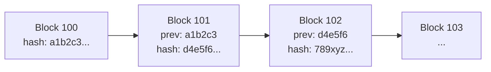
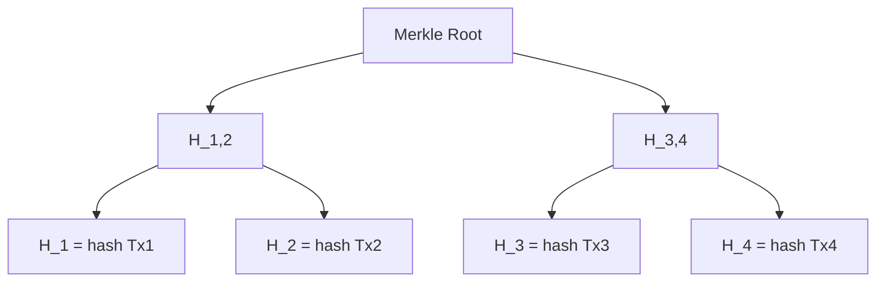
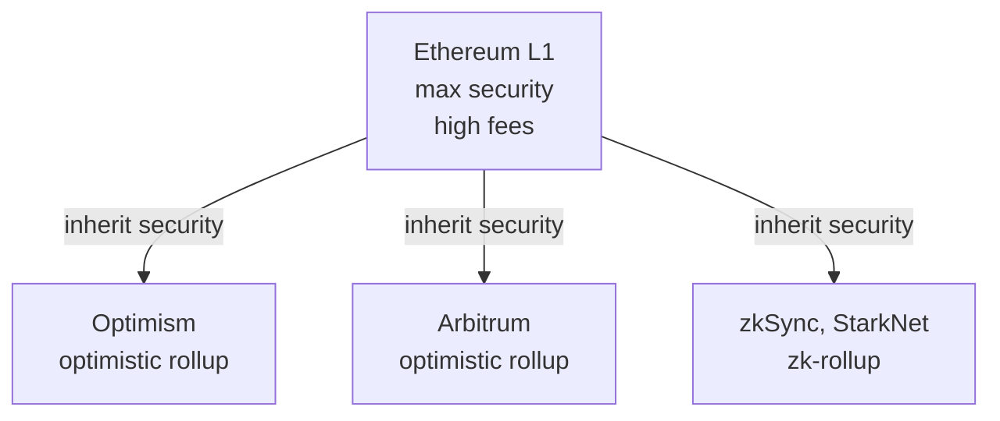

# Crypto, Bitcoin, Ethereum, stablecoins, DeFi

Crypto is the corner of finance with the worst ratio between **hype** and **average understanding**. 90% of people who talk about it don't know what a hash is, and 90% of people who do know what a hash is have still lost money. This chapter gives you the minimum technical explanation to recognize what you are looking at, separate signal from noise and — if you decide to step in — not get rugged by custody, exchange failures, forks, or regulators.

No salesman enthusiasm, no boomer disdain. Just how it works.

## 1. What a blockchain actually is (in three minutes)

A **blockchain** is a distributed, append-only, cryptographically signed ledger. Take it apart:

- **Ledger** = list of transactions (who pays whom, how much).
- **Distributed** = every node has the same copy.
- **Append-only** = you can only add rows at the end, never modify or delete old ones.
- **Cryptographically signed** = every transaction is signed with a private key; each block is linked to the previous one via a **hash**.

A **hash** is a math function that takes any input (e.g. a block of transactions) and returns a fixed-length string, deterministic, with avalanche effect: flip one bit of the input and the output is completely different.

$$H(\text{"hi"}) = \texttt{1e3...a2f} \neq H(\text{"hI"}) = \texttt{9b4...c11}$$

Bitcoin uses **SHA-256**. Finding an input that yields a specific hash is computationally impossible (more years than the age of the universe). That's what keeps the chain safe.

If someone tampers with a transaction in block 100, the hash of block 100 changes, the "prev" pointer of block 101 no longer matches, and the whole chain past that point has to be rewritten. To pull that off you'd need to redo the **proof-of-work** of all subsequent blocks faster than the honest network produces them. For Bitcoin today this requires >51% of global hashrate, costing billions of USD a year.

## 2. Merkle tree: packing transactions

Each block doesn't store every transaction hash separately. It builds a **Merkle tree**:

Advantages:

1. The **Merkle root** is a single hash certifying all the block's transactions.
2. You can prove a transaction is in a block without downloading the whole thing (Simplified Payment Verification, SPV): you only need log₂(N) hashes.

For a block with 4,096 transactions, you need just 12 hashes to prove inclusion of one Tx. That's how "light" wallets on phones work.

## 3. Consensus: Proof-of-Work vs Proof-of-Stake

The blockchain problem: who decides the next block? If anyone can propose it, someone cheats. You need **consensus** rules.

### 3.1 Proof-of-Work (PoW) — Bitcoin

Miners compete to find a **nonce** (arbitrary number) such that:

$$H(\text{block header} \mid\mid \text{nonce}) < \text{target}$$

The *target* is a very small number. You iterate by trial and error: trillions per second. The first to find a valid nonce publishes the block and takes the **block reward** (today 3.125 BTC, post-2024 halving) plus fees.

The **difficulty adjustment** every 2,016 blocks (~2 weeks) retargets so blocks come out roughly every 10 minutes regardless of how many miners participate.

Energy: Bitcoin consumes ~150 TWh/year, similar to Argentina. For ESG folks it's a problem; for those who only want security, it's the feature.

### 3.2 Proof-of-Stake (PoS) — Ethereum since Sep 15, 2022 (*The Merge*)

**Validators** stake 32 ETH. The protocol randomly picks one (weighted by stake) to propose the next block. Others vote. If a validator cheats, they lose stake (*slashing*).

| Property | PoW (BTC) | PoS (ETH) |
|---|---|---|
| Scarce resource | hashpower (electricity) | capital (ETH staked) |
| Energy | very high | ~99.95% lower |
| Block time | ~10 min | ~12 sec (slot) |
| Finality | probabilistic (6 conf ≈ 1h) | deterministic (~12 min) |
| 51% attack cost | hardware + electricity | buy 51% of staked ETH |
| Criticism | costs the planet | "rich get richer" |

## 4. Bitcoin: programmable scarce money

Bitcoin was born from the **Satoshi Nakamoto whitepaper** (Oct 31, 2008, 9 pages) and the genesis block (Jan 3, 2009). Satoshi's identity: unknown.

Hard properties:

- **Max supply: 21,000,000 BTC**. Period. Cannot be changed without majority node agreement, which politically nobody wants.
- **Halving**: every 210,000 blocks (~4 years) the block reward halves. Scheduled for years: 2009 (50 BTC), 2012 (25), 2016 (12.5), 2020 (6.25), 2024 (3.125). Next: 2028 (1.5625). Last BTC mined: roughly year 2140.
- **Block time**: 10 minutes.
- **Block size**: ~1–4 MB (with SegWit).
- **Scripting language**: Bitcoin Script, deliberately restricted (not Turing-complete) for safety.

Bitcoin is engineered to be **digital gold**: scarce, neutral, censorship-resistant. It is not engineered to buy coffee (too slow, too expensive during congestion). Layer-2 solutions like **Lightning Network** handle instant micropayments.

### 4.1 Example: how a Bitcoin transaction gets mined

1. Alice signs with her private key: "transfer 0.1 BTC from `bc1q...alice` to `bc1q...bob`, fee 0.00002 BTC".
2. The Tx lands in every node's **mempool**.
3. A miner includes it in a candidate block (preferring higher fee-per-byte Txs).
4. The miner searches for a valid nonce. Finds SHA-256 < target.
5. Publishes the block. Other nodes validate: hash valid, signatures valid, no double-spend.
6. Bob sees 1 confirmation. After 6 confirmations (~1 hour) the Tx is considered "final" for medium amounts.

The cost to attack (a company wanting to reverse the payment) grows exponentially with the number of confirmations.

## 5. Ethereum: the programmable blockchain

Bitcoin is a balance database. Ethereum is a **world computer**. Released 2014 by Vitalik Buterin et al.

Key concepts:

- **EVM (Ethereum Virtual Machine)**: Turing-complete VM executing bytecode.
- **Smart contract**: deterministic immutable program published on-chain. Languages: Solidity (most common), Vyper, Yul.
- **Gas**: every opcode costs gas. You pay `gas_used × gas_price`. Gas price is measured in **gwei** (1 gwei = 10⁻⁹ ETH).
- **ERC-20**: standard for fungible tokens (USDC, LINK, UNI).
- **ERC-721 / ERC-1155**: standards for NFTs.

Cost example: a simple transfer uses 21,000 gas. If gas_price = 30 gwei and ETH = 3,000 USD:

$$\text{cost} = 21{,}000 \times 30 \times 10^{-9} \times 3{,}000\,\text{USD} = 1.89\,\text{USD}$$

A Uniswap swap uses ~150,000 gas → ~13.5 USD. During congestion (e.g. NFT mint hype) gas spikes to 500 gwei → swap costs 220 USD. Hence **layer-2s**.

Rollups batch thousands of Txs off-chain and post a compressed proof to L1. Per-Tx cost is 10-100x lower.

## 6. Types: L1, L2, stablecoins, app tokens

| Category | What it is | Examples |
|---|---|---|
| General-purpose L1 | base chain with its own security | Bitcoin, Ethereum, Solana, Avalanche, BNB Chain |
| Ethereum L2 | scale L1 | Optimism, Arbitrum, Base, zkSync |
| Stablecoins (fiat-collateralized) | 1 token = 1 USD in bank account | USDT (Tether), USDC (Circle) |
| Stablecoins (crypto-collateralized) | 1 token ≈ 1 USD with crypto overcollateral | DAI (MakerDAO) |
| Algorithmic stablecoins | 1 token ≈ 1 USD via arbitrage | UST/LUNA (dead), FRAX |
| DeFi utility tokens | app governance/utility | UNI, AAVE, COMP |
| Memecoins | no utility, pure narrative | DOGE, SHIB, PEPE |

### 6.1 The Terra/Luna collapse (May 2022)

Mandatory case study.

UST was an algorithmic stablecoin: 1 UST could always be burned for 1 USD of LUNA, and vice versa. Works as long as LUNA has value. Anchor Protocol paid 20% APY on UST deposits → 18 bn USD parked there.

May 9, 2022: large UST withdrawals from Anchor → UST drops to 0.98 USD. Arbitrageurs should buy UST at 0.98 and burn it for 1 USD of LUNA. But if everyone sells LUNA, its price collapses → you burn UST and get more and more LUNA worth less and less → **death spiral**.

Result in 7 days:

| Asset | May 8 price | May 15 price | Change |
|---|---|---|---|
| LUNA | 64 USD | 0.0001 USD | -99.9999% |
| UST | 1.00 USD | 0.10 USD | -90% |
| Total cap lost | | | ~40 bn USD |

Lesson: a stablecoin without real collateral is a bomb.

## 7. DeFi: scripted finance

**DeFi** (Decentralized Finance) = rebuild financial primitives (exchange, lending, derivatives) as public, composable smart contracts (*Money Legos*).

| Primitive | What it is | Examples |
|---|---|---|
| DEX | decentralized exchange with AMM | Uniswap, Curve, Balancer |
| Lending | collateralized deposits/loans | Aave, Compound, MakerDAO |
| Perpetual | derivatives without expiry | dYdX, GMX, Hyperliquid |
| Yield farming | accumulate reward tokens | Convex, Yearn |
| Liquid staking | stake ETH receiving a liquid token | Lido (stETH), Rocket Pool (rETH) |
| Bridge | move assets across chains | Wormhole, Across |
| Oracle | bring off-chain data on-chain | Chainlink |

### 7.1 Uniswap and the AMM

No order book. There's a **pool** with two assets (e.g. ETH and USDC). The pool maintains the invariant:

$$x \cdot y = k$$

where `x` = ETH amount, `y` = USDC amount, `k` = constant. When you buy ETH from the pool, `x` decreases and `y` must increase to keep `k` constant → you pay more USDC per each successive ETH (**slippage**).

**Numerical example.** Pool with 100 ETH and 300,000 USDC. `k = 30,000,000`. Initial price: 3,000 USDC/ETH. You buy 10 ETH:

- New `x = 90`.
- New `y = 30,000,000 / 90 = 333,333.33 USDC`.
- You gave: `333,333.33 − 300,000 = 33,333.33 USDC`.
- Average price paid: `33,333.33 / 10 = 3,333.33 USDC/ETH` → +11.1% over mid.

On small trades slippage is negligible. On large trades it's prohibitive. Liquidity providers earn the fee (e.g. 0.3%) but face **impermanent loss**: if ETH appreciates outside the pool, they end up with less ETH and more USDC, missing upside.

### 7.2 Aave and lending

You deposit ETH as collateral. The protocol lets you borrow USDC up to a certain **LTV** (e.g. 75%). Dynamic interest rate based on pool utilization.

If the collateral value drops below the liquidation threshold, the protocol sells your collateral at a discount (5-10%) to a liquidator.

Real utility: leveraged long on ETH without KYC, access to stablecoins without selling ETH (and triggering taxable events, where the law allows).

## 8. NFTs: justified skepticism

NFT = non-fungible token, each one unique. ERC-721 standard. Possible real uses: digital titles, tickets, on-chain identity.

2021 uses: monkey JPEGs trading at six figures. **Bored Ape Yacht Club** average price Apr 2022: 130 ETH (~430k USD). Same BAYC Mar 2024: 13 ETH (~45k USD). -90%.

OpenSea volume Jan 2022: 5 bn USD. Same metric early 2024: <100M USD. -98%.

Technically: the NFT points to a URL (often IPFS or, worse, a centralized AWS server). If the server dies, you have a token pointing to nothing. It's worth only as long as the community recognizes it.

Verdict: as a speculative asset it was a casino. As a tech it has interesting applications (ticketing, certifications) but marginal.

## 9. History of crypto bubbles

| Year | BTC top (USD) | Subsequent bottom | Drawdown | Bull trigger | Bust trigger |
|---|---|---|---|---|---|
| 2013 (Apr) | ~260 | ~50 | -80% | early adopters | Mt. Gox hack |
| 2013 (Dec) | ~1,150 | ~150 | -87% | China retail | Mt. Gox + PBoC ban |
| 2017 (Dec) | ~19,700 | ~3,200 | -84% | ICO mania | SEC regulation |
| 2021 (Nov) | ~69,000 | ~15,500 | -77% | post-COVID retail, Tesla | Fed hike, Luna, FTX |
| 2024 (Mar) | ~73,000 | ~ — | — | spot BTC ETF SEC approved | — |

Pattern: bull lasts 12-18 months, bear 18-24 months, cycle (historically) ~4 years tied to halving. No guarantee it continues.

### 9.1 The FTX crash (November 2022)

FTX was the #2 global exchange, valued at 32 bn USD. CEO Sam Bankman-Fried (SBF), darling of VCs and US politics.

On Nov 2, 2022 a CoinDesk article reveals Alameda Research's balance sheet (SBF's hedge fund) has 14.6 bn USD in assets of which 5.8 bn are **FTT**, the token issued by FTX. Meaning: the hedge fund used as collateral a token printed by the exchange owned by the same person. Ponzi-ish.

Nov 6: Binance announces it's selling its FTT position → bank run on FTX → Nov 8: FTX halts withdrawals → Nov 11: Chapter 11. 8 bn USD of customer funds gone, used by Alameda. SBF arrested Dec 2022, sentenced to 25 years in 2024.

Lesson: **not your keys, not your coins**. Leaving BTC on an exchange is lending it to the exchange.

## 10. Custody: the real risk

Three ways to hold crypto:

| Mode | Who controls the private key | Main risk | Convenience |
|---|---|---|---|
| Custodial exchange (Binance, Coinbase) | exchange | bankruptcy, hack, account freeze | max |
| Hot wallet (MetaMask, Phantom) | you (seed phrase on PC/phone) | malware, phishing | high |
| Hardware cold wallet (Ledger, Trezor) | you (offline seed phrase) | seed loss, physical theft | low |
| Multisig / SSS | n of m keys | complexity | low |

Rule of thumb: under €100 → exchange, fine. Under a few thousand → hot wallet. Above that → cold wallet or multisig.

The **seed phrase** (12 or 24 words) is your bank. Lose it, you lose everything. Anyone who finds it gets everything. Write it on paper or metal, never on a digital file, never ever photograph it.

## 11. Regulation

### 11.1 MiCA — Markets in Crypto-Assets (EU)

Approved in 2023, full application June 2024 (stablecoins) and December 2024 (rest). What it does:

- Defines categories: ART (asset-referenced token), EMT (e-money token), CASP (Crypto-Asset Service Provider).
- Forces stablecoin issuers to hold 1:1 reserves in liquid assets, audits, authorization.
- Forces exchanges (CASPs) to get MiFID-like authorization.
- Doesn't cover pure DeFi and NFTs (yet).

Practical effect: Tether (USDT) struggles to operate in EU because it doesn't meet reserve requirements; USDC is more aligned.

### 11.2 Taxation in Italy

**2023 Budget Law** (law 197/2022, in force from January 1, 2023):

- Capital gains on crypto-assets are **miscellaneous income** taxed at **26%**.
- Exemption: the first **€2,000** of annual gains are tax-free.
- Gains and losses offset. Losses carry forward for the next 4 years.
- Mandatory **RW form** in tax return if you hold crypto above ~€15,000 average annual (foreign asset monitoring).
- **IVAFE** replaced by **stamp duty** of 0.2% on Dec 31 value for assets held via resident intermediaries (Italian exchanges or with local establishment).
- Optional revaluation regime: pay 14% on the Jan 1 value to "reset" your cost basis.
- **Crypto/crypto swap** is generally a taxable event (doctrine is still debated in edge cases).

Track **every transaction** from day one: date, amount, EUR value, fees. Tools: Koinly, CoinTracker, CoinTracking.

## 12. Practical traps

1. **Offshore exchanges** with no KYC: opaque governance, no guarantees, no RW form = potential criminal penalties.
2. **Brand-new tokens** with 10,000% APY: rug pull (devs disappear with the pool).
3. **DMs on Telegram/Discord** contacting you: 100% scam.
4. **Phishing wallets**: sites impersonating MetaMask. Always verify URL.
5. **Infinite approvals**: when you connect a wallet to a dApp, read *what you're approving*. Approving "all tokens forever" on a malicious contract drains the wallet.
6. **Cross-chain bridges**: 2.5 bn USD stolen in 2022 (Ronin, Wormhole, Nomad). Use sparingly.
7. **"Investment managers" on LinkedIn** promising 5% monthly: pig butchering. Scam.

## 13. Example: reading a block explorer

Go to **etherscan.io** and search any address. You see:

- **Balance**: ETH held.
- **Tokens**: ERC-20 list in the wallet (beware **airdrop scams**: spam tokens with names like "Visit usdc.com" — never interact).
- **Transactions**: every Tx with timestamp, gas used, contract called.
- **Internal txs**: internal calls between smart contracts.

For Bitcoin: **mempool.space**. Live mempool, suggested fees, next block.

Mental exercise: pick a public crypto company (e.g. MicroStrategy, BTC treasuries). Its BTC address is publicly known. You can see how much BTC it holds *in real time* on a block explorer. Try.

## 14. When it makes sense (for retail) — the frank take

- **If you already have emergency fund, debts paid, diversified ETF in place** → you can allocate 1-5% of total portfolio to BTC and/or ETH as asymmetric hedge. More only if you truly understand the risk.
- **If you don't yet have the basics** → stop. Sections 5–14 first.
- **If someone told you "double in 6 months"** → run.
- **DeFi without reading Solidity contracts** → high risk.
- **High-yield stablecoins** → above the risk-free rate there's always a risk. Always.

The long-term expected return of BTC depends on assumptions (adoption rate, global M1). Serious estimates range from "revolutionary" to "thermodynamic Ponzi". You don't know who's right. Nobody does. Position accordingly.

Exercise: compute the cost of an Ethereum activity

You have 1 ETH and want to:

1. Swap 0.5 ETH → USDC on Uniswap. Estimated gas: 150,000.
2. Deposit 0.5 ETH on Aave as collateral. Gas: 250,000.
3. Borrow 500 USDC. Gas: 200,000.

Current gas price: 25 gwei. ETH price: 3,200 USD.

Compute total cost in USD and what % of moved capital (0.5 ETH = 1,600 USD) you paid in gas.

**Solution.**

- Total gas: 150,000 + 250,000 + 200,000 = 600,000.
- Cost in ETH: 600,000 × 25 × 10⁻⁹ = 0.015 ETH.
- Cost in USD: 0.015 × 3,200 = **48 USD**.
- On 1,600 USD moved → **3.0%**.

If ETH goes to 5,000 USD and gas to 100 gwei (bull market), same bundle costs: 0.06 ETH × 5,000 = **300 USD**. On 2,500 USD moved → **12%**. Hence L2s.

## 15. Things to remember

- Blockchain = append-only ledger + hashes + distributed consensus.
- Bitcoin = digital gold, programmed scarcity (21M, halving).
- Ethereum = world computer, smart contracts, gas.
- Stablecoins: collateralized fine, algorithmic historically exploded.
- DeFi is composable and brilliant, but also strips regulation.
- NFTs as speculative asset: bubble popped.
- FTX and Luna are lessons, not exceptions.
- Custody: not your keys, not your coins.
- MiCA + 26% tax above €2k/year in Italy from 2023.
- Treat it as a max-risk asset, never more than a small % of net worth.
