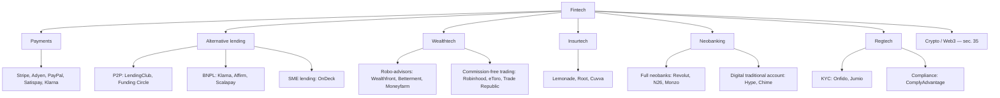
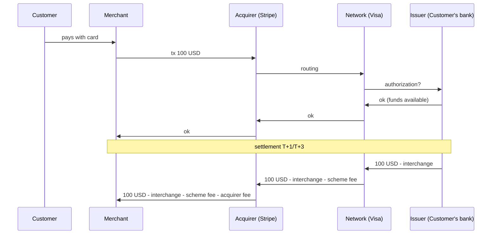
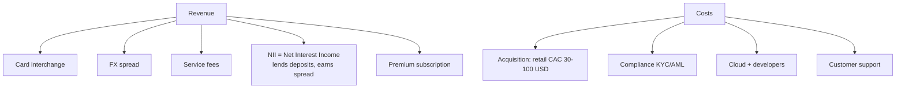

# Fintech: robo-advisors, neobanking, BNPL, embedded finance

"Fintech" is a suitcase word. Inside you find everything: the bill-splitting app, the algorithm that grants a mortgage in 30 seconds, the SPAC that burned 5 bn in 2022. This chapter maps the sector into orderly categories, looks at the real business models, separates true innovation from marketing wrapped around a plain-vanilla banking product, and — most importantly — figures out which fintechs survive in a high-rate world.

## 1. Definition and scope

**Fintech** = companies using technology (mobile-first, API-first, cloud-native, ML) to deliver financial services historically dominated by banks, brokers, and insurers.

It is not a monolithic revolution: it is pressure on dozens of micro-markets. Most fintechs compete on one or two of the following advantages:

1. **UX**: onboarding < 5 minutes, clean app, no branch queue.
2. **Price**: fees 5-10x lower than the traditional bank.
3. **Distribution**: reach customers the bank can't see (immigrants without credit history, gig workers, micro-businesses).
4. **Specialization**: instead of universal-bank Swiss Army knife, do one thing extremely well (FX, merchant payments, factoring).

"Losers" tend to compete only on #1 (UX). They win temporarily, then a traditional bank copies the app and keeps the advantage of license, cheap deposit base, and trust.

## 2. The sector map

Let's look at the categories in detail.

## 3. Payments

The most mature fintech segment, because payments are a huge market with thin margins and many players. Key distinction:

| Model | Function | Examples | Typical margin |
|---|---|---|---|
| **Acquirer / PSP** | accepts payments for merchants | Stripe, Adyen, Nexi | 1.5-3% on volume |
| **Alternative issuer** | issues digital cards | Curve, Revolut Card | FX spread + interchange |
| **P2P wallet** | person-to-person transfers | PayPal, Satispay, Wise | fixed fees or FX |
| **Cross-border remittance** | low-cost international transfers | Wise, Remitly | 0.3-1% FX spread |

**Stripe** (USA, 2010) won a huge share by offering dead-simple APIs to developers. A few lines of code, transparent pricing (2.9% + $0.30), no contracts. 2023 valuation: ~50 bn USD (was 95 bn in 2021).

**Adyen** (NL, 2006) has the same proposition aimed at enterprise. Public. 50%+ EBITDA margin.

**Wise** (UK, 2011) broke banks' FX fees: instead of 3-5% on volume, Wise spreads are 0.3-0.7%. Architecture: multi-currency accounts, local liquidity pockets in each country bypassing SWIFT.

**Satispay** (Italy, 2013) bypassed Visa/Mastercard using SEPA Credit Transfer. Merchant cost: fixed €0.20 above €10, free below. Advantage: no % fee, micropayments OK. Drawback: Italy/EU only, no true cross-border online.

### 3.1 Anatomy of a card transaction

On 100 USD card payment:

- Interchange (to issuer): 0.3% in EU (regulated), 1.5-2% in USA.
- Scheme fee (Visa/MC): 0.1-0.2%.
- Acquirer markup (Stripe): 1-1.5%.

Total to merchant: ~1.9-2.5% in EU, 2.5-3.5% in USA. Hence Stripe's "all-in" 2.9% + $0.30.

## 4. Alternative lending

Peer-to-peer (P2P) model: a platform connects savers willing to lend with SMEs/individuals seeking loans, skipping the bank.

Historical examples:

- **Lending Club** (USA): founded 2007. IPO 2014 at 8 bn. Strong erosion, today a traditional bank.
- **October** (FR/IT, ex Lendix): P2P for European SMEs.
- **Funding Circle** (UK): P2P SME, LSE-listed.

Structural problem: without depositor guarantee (FDIC, FITD), in case of default the saver's expected return must be high to compensate risk. Historically, default rates have been underestimated. Many retail lenders lost 5-15% of capital in 2018-2022.

Verdict: from the retail lender perspective, it's an *equity-like* investment dressed up as *credit-like*. Approach with awareness.

### 4.1 BNPL — Buy Now Pay Later

Model: customer buys now, pays in 3-4 installments with no interest (apparently). The merchant pays BNPL a 3-6% commission, well above the 2% of a classic card. BNPL also earns from:

- Late fees if customer doesn't pay on time.
- 6-12 month extensions with interest.
- Data / cross-selling.

Main players: **Klarna** (SE), **Afterpay** (AU, acquired by Block), **Affirm** (US), **Scalapay** (IT).

Explosive growth 2018-2021. Klarna 2021 valuation: 46 bn USD. Klarna 2022 valuation: 6.7 bn USD. -85% in one year.

What went wrong:

1. **Rate hikes**: BNPL funding became expensive (they lend their money, must source it on the market).
2. **Bad debt**: rising default rates (average BNPL customer has low credit score).
3. **Regulation**: CFPB in USA, FCA in UK, Bank of Italy on transparency.

For consumers: documented over-indebtedness risk, especially among under-25s. See [Credit and debt](12-payment-instruments.html) for numbers.

## 5. Wealthtech: robo-advisors

A **robo-advisor** is an automated wealth management service. You answer a questionnaire (horizon, goals, risk tolerance); the system assigns a profile (e.g. 1-5 risk); management is in ETFs, auto-rebalanced. Fees: 0.3-0.9% annually, vs 1-2% for a private banker or 0.4-1.2% for an active fund.

Players:

| Name | Country | Min entry | Avg TER |
|---|---|---|---|
| Wealthfront | USA | 500 USD | 0.25% + ETF |
| Betterment | USA | 0 USD | 0.25% + ETF |
| Moneyfarm | IT/UK | 5,000 EUR | 0.4-0.7% + ETF |
| Tinaba | IT | 2,000 EUR | 0.5-1.0% + ETF |
| Euclidea | IT | 25,000 EUR | 0.6-1.1% (higher, HNW segment) |

### 5.1 How it actually works (under the hood)

1. **Profiling**: 8-15 questions, output a risk score.
2. **Asset allocation**: each profile is associated with a target portfolio (e.g. 80% bonds / 20% equity for "conservative", 20/80 for "aggressive"). Usually 5-7 profiles.
3. **Instrument selection**: low-cost ETFs, generally EU UCITS harmonized. Possible sub-asset classes: DM equity, EM, IG corporate, HY, govies, real estate, gold.
4. **Rebalancing**: when an asset class drifts by more than X% from target (e.g. ±5%), the system sells and rebuys to restore. Frequency: quarterly or threshold-based.
5. **Tax loss harvesting** (USA only due to tax law): the system sells losing positions to generate tax-deductible losses and rebuys an equivalent ETF (to avoid *wash sale*).
6. **Reporting**: dashboard with net return, costs, scenarios.

### 5.2 What a robo-advisor does NOT do

- Doesn't give you deep personalized advice (estate, complex tax optimization, real estate).
- Doesn't pick stocks.
- Doesn't guarantee returns.
- Doesn't replace a human CFP for non-standard situations (self-employed with corporate structures, inheritance, dual citizenship).

For average retail, it's *competitive* against:

- A bank fund with 2% TER (clearly robo wins).
- A DIY "lazy portfolio" of ETFs on a low-cost broker (here robo loses, because you pay 0.4-0.7% extra for auto-rebalancing you could do manually 1-2x per year).

## 6. Insurtech

Less mature than most other segments. Players:

- **Lemonade** (US): home/rent/pet via app. AI pricing. IPO 2020 at $30/share, today below $20. Growing, but combined ratio (losses + costs / premiums) over 100% for years.
- **Root** (US): auto via app, pricing on telematics. Stock disaster (-95% from peak).
- **Cuvva** (UK): hourly/temporary auto insurance.
- **Coverwallet** (US): commercial insurance for SMEs.

Structural difficulty: accurate underwriting needs long historical data. "AI-pricing" insurtechs often underpriced risk in early years, accumulating losses. Local regulation (supervisors, Solvency II capital requirements in EU) slows cross-border scaling.

## 7. Neobanks

A **neobank** is a fully digital, branchless bank or near-bank.

Technical distinction:

- **Full neobank with own banking license**: N26 (DE, BaFin license), Bunq (NL), Monzo (UK). Can take deposits, lend, covered by FITD/FSCS/FDIC.
- **"Sponsored" neobank**: uses a partner bank's license. E.g. Revolut in Italy historically rode on Lithuania Bank. Chime (US) on Bancorp. Hype/illimity/Banca Sella for others.
- **E-money license apps**: can offer payment accounts but **NOT** protect deposits via FDIC/FITD; funds are *segregated* at a custodian bank.

Telling these apart is critical for customer risk:

| Form | Deposit insurance | Limits |
|---|---|---|
| Licensed bank | Yes, up to 100k€ (250k USD US) | none |
| Sponsored neobank | depends on partner | varies |
| E-money license | No (segregation) | cannot lend |

### 7.1 Revolut (UK, 2015) — paradigmatic case

Start: FX-at-interbank app, no hidden fees. Viral growth.

Expansion: multicurrency cards, multi-currency accounts, stock trading, crypto, robo-advisor.

Status: obtained **EU banking license** via Bank of Lithuania (2018), and in 2024 obtained UK banking license (PRA authorized). Massive cross-border operation.

2021 valuation: 33 bn USD. Discussed by analysts as likely optimistic.

Revenue model: FX spread (travel, freelancers paid in USD), card interchange, trading fees, premium subscription (Standard / Plus / Premium / Metal / Ultra at 0/3.99/7.99/13.99/45 EUR/month).

### 7.2 What actually makes a neobank profitable

The turn to profitability comes when:

1. **CAC < LTV** (acquisition cost less than lifetime value): usually needs 2-3 customer years to amortize.
2. **NII** (Net Interest Income) grows: with high rates, neobanks holding deposits can earn 2-4% spread on demand deposits, *doing nothing*.

Irony: the **2022-2024 rate hike** saved neobanks with a banking license (Revolut, N26 profitable 2023+) and destroyed those without (commission-only focus, burned cash).

## 8. Open Banking, PSD2 and PSD3

**PSD2** (Payment Services Directive 2) is an EU directive in force since **January 13, 2018**. Three key points:

1. **Mandatory APIs**: every bank must expose standard APIs (account info, payment initiation) letting third-party apps access customer data, **with consent**.
2. **Strong Customer Authentication (SCA)**: every payment requires two factors (possession + knowledge/biometrics).
3. **Market opening**: the TPP (Third Party Provider) is born, either AISP (account info) or PISP (payment initiation).

Consequence: banks lose data monopoly. Apps like **Plaid** (US), **Tink** (EU, acquired by Visa), **TrueLayer** (UK) aggregate a customer's accounts from multiple banks into a single view. They are "the OS" beneath robo-advisors, BNPL fintechs, PFM (Personal Finance Management) apps.

### 8.1 PSD3 incoming

Proposal June 2023, expected force 2026. What it improves:

- Stronger API standardization (today each bank does it slightly differently).
- Strengthened fraud protection (stricter liability on banks and PSPs for scams).
- New PSR (Payment Services Regulation) for uniformly applied parts.
- Opening to "open finance" (investments, mortgages, insurance, not just current accounts).

## 9. Embedded finance

Model where a **non-financial** company integrates financial services into its product, using a B2B provider's infrastructure.

Examples:

- **Tesla sells auto insurance** with the car (in some US states). Pricing based on driving data.
- **Shopify Capital** lends money to Shopify merchants based on sales. Decision in minutes.
- **Amazon Lending** same for Amazon sellers.
- **Uber Money** cards and account for drivers, with instant payouts after each ride.
- **Apple Pay Later** (announced 2022, withdrawn 2024) — BNPL embedded into the OS.

B2B providers enabling embedded:

| Provider | Service |
|---|---|
| Stripe Treasury | embedded bank account |
| Marqeta | card issuing API |
| Treezor (FR) | banking-as-a-service |
| Solaris (DE) | banking-as-a-service |
| Railsr (UK) | banking-as-a-service |

For consumers there's rarely any awareness the service is "embedded". UX belongs to the main app (Uber, Tesla, Shopify). Regulation belongs to the underlying banking entity.

## 10. Regtech and KYC/AML

A less glamorous but critical category: **regtech** = compliance technology.

Examples:

- **KYC** (Know Your Customer): verify customer identity. **Onfido**, **Jumio**, **Veriff**, **Idemia** offer onboarding with ID photo + selfie + liveness check, done in <2 minutes.
- **AML** (Anti-Money Laundering): transaction monitoring to spot suspicious patterns. **ComplyAdvantage**, **Chainalysis** (crypto), **Quantexa**.
- **Sanctions screening**: counterparty matching against OFAC, UN, EU lists.
- **Transaction monitoring**: rules + ML on patterns (e.g. "smurfing", "structuring").

Without regtech, launching a fintech costs 3x in manual compliance.

## 11. Critique: who survives

2021 was the peak of fintech valuations: zero rates, free capital, insane revenue multiples (50-100x for top names). Klarna 46 bn, Stripe 95 bn, Revolut 33 bn.

Since 2022, **Fed and ECB rate hikes** → end of free money. What happened:

| Fintech | Peak | 2023-2024 | Change |
|---|---|---|---|
| Klarna | 46 bn | 6.7 bn → 14 bn (2024) | -85% then recovery |
| Stripe | 95 bn | 50 bn | -47% |
| Affirm (public) | 47 USD/share | 8 USD (2023) → 60 USD (2024) | brutal swing |
| Robinhood | 70 USD (IPO 2021) | 7 USD (2023) → 30 USD (2024) | -90% then rebound |
| Pagaya, SoFi, LendingClub, Upstart | all -70/90% from peaks | | |

Lesson: profitable models survive (Adyen, Wise, Visa, Mastercard, Stripe). "Growth at all costs" models without clear unit economics are dead or restructuring (many BNPLs, unlicensed neobanks, P2P lending).

Long-term winners tend to be:

1. **Infrastructure** (Stripe, Adyen): high margins, tech moat, network.
2. **Licensed neobanks generating NII**: Revolut, N26, Monzo (profitable 2023+).
3. **High-margin niche specialists**: Wise in FX, Klarna recovery with traditional BNPL.

Losers:

1. **"Freemium" apps without clear monetization**.
2. **P2P lending without funding cost advantage**.
3. **Insurtechs that underpriced risk.**

## 12. Practical: using fintechs with your head on

| Use case | Useful fintech | Caveat |
|---|---|---|
| Hold salary + expenses | Licensed bank, including licensed neobank | Avoid e-money license for sums > 1-2k EUR |
| International travel | Revolut, Wise (multicurrency card) | FX spread above X EUR/month |
| Passive retail investing | ETFs on low-cost broker (Degiro, Trade Republic, Scalable) | Robo-advisor only if you want auto-pilot at 0.4-0.7% extra |
| Trading | Interactive Brokers, Saxo for serious; eToro/Robinhood for fun with max 5% of net worth | Avoid impulsive micro-trading |
| P2P payments | Venmo, Zelle (US); Satispay, Bizum (EU); Wise | Above 1k USD use bank wire |
| Mortgage / loan | Always compare with traditional bank | Fintechs don't always offer the best rate |
| BNPL | Almost always avoid | Use it only if installment < opportunity cost of selling your ETF |

## 13. Example: the real TER of a robo-advisor

You invest 50,000 EUR for 10 years in a robo balanced profile (60% bond, 40% equity).

- Robo TER: 0.7% per year.
- Average underlying ETF TER: 0.15% per year.
- Total annual cost: ~0.85%.
- Estimated gross portfolio return: 5% per year.
- Net return: 5% − 0.85% = **4.15%** per year.

Value after 10 years:

$$V_{10} = 50{,}000 \times (1+0.0415)^{10} = 75{,}030\,\text{EUR}$$

Compare: same allocation built yourself with 3 ETFs on a low-cost broker (TER 0.15%, broker fee negligible):

$$V_{10}^{DIY} = 50{,}000 \times (1+0.0485)^{10} = 80{,}356\,\text{EUR}$$

Difference: **5,300 EUR** in 10 years, or 10.6% of initial capital. Not nothing.

The robo only makes sense if:

- You wouldn't rebalance without it.
- You want to pay for time saved.
- You need the discipline of monthly auto-deposit.

Exercise: pick the right fintechs for an Erasmus student

Maria, 22, goes on Erasmus to Berlin for 6 months. Grant: 750 EUR/month transferred from her Italian bank. She'll spend in EUR (Berlin) and occasionally PLN (Krakow weekend).

Needs:

1. Card accepted everywhere in EU.
2. Low FX cost.
3. Safe account for 4-5k EUR cash.
4. App to split expenses with flatmates.

**Proposed solution.**

- **Italian bank** kept for salary inflow (Erasmus wire lands here).
- **Revolut Standard (free)** for daily use and EUR withdrawals (free limit 200 EUR/month), PLN spend at interbank rate.
- **Wise** if she expects PLN exchanges > 1,000 EUR total (Revolut weekend adds +0.5-1% spread).
- **Satispay / Bizum** to split with Italian/Spanish flatmates.
- **Cash above 1,000 EUR** kept on Italian bank account (FITD-protected), not on Revolut (in case of technical issues, recovery is slower).

Estimated monthly cost: 0 EUR. Saving vs using only the Italian bank card (with 2-3% FX spread outside EUR): ~30-50 EUR/year.

## 14. Things to remember

- Fintech is a collection of niches, not a single block.
- Payments and infrastructure (Stripe, Adyen, Wise) are the most profitable segment.
- Neobanks: always tell apart **licensed bank** from **e-money license** for deposit safety.
- Robo-advisors: useful if you can't/won't rebalance; costs 0.4-0.7% extra vs DIY.
- BNPL: nice for merchants, risky for consumers (over-indebtedness) and for investors (models under pressure).
- PSD2 opened banking data; PSD3 + PSR (2026+) will standardize them.
- Embedded finance is the future: financial product "disappears" into non-banking apps.
- The 2022-2024 rate hike pruned the sector: positive NII or high margin survives.
- Before signing with a fintech: check license, deposit guarantee, real price sheet.
