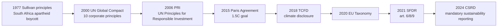
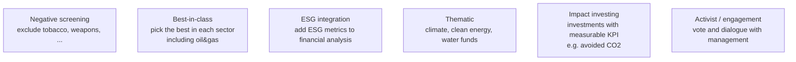
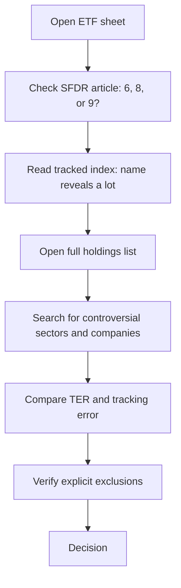

# ESG and sustainable finance

ESG is one of those acronyms that has crossed two decades of financial marketing from *novelty* through *banality* to *scandal*. Today most European mutual funds are "ESG" in some form. The problem is figuring out whether it's actual substance or a label that justifies higher TER. This chapter gives you the tools to:

1. Understand what "ESG" means technically (not just rhetoric).
2. Tell apart SFDR art. 6 / 8 / 9 and the EU Taxonomy.
3. Read an ESG rating with healthy skepticism.
4. Spot greenwashing.
5. Pick a "strict ESG" ETF if you decide you care.
6. Understand the empirical evidence: do ESG funds outperform, underperform, or match?

## 1. What ESG is (and isn't)

ESG stands for:

- **E — Environmental**: CO₂ emissions, water use, waste management, biodiversity, climate impact, scope 1/2/3.
- **S — Social**: worker rights, supply chain (no child/forced labor), gender pay gap, human rights, local communities, product safety.
- **G — Governance**: board composition, member independence, anti-corruption, transparent taxation, executive pay, audit, whistleblower protection.

ESG **is not**:

- Universal ethics (a weapons company can have an excellent ESG rating if the board is well composed and the factory has solar panels).
- Positive impact (an ESG fund can buy a "best in class" oil company without the world emitting less CO₂).
- A return guarantee.

ESG is a framework to **identify extra-financial risks** that can materialize in the long term. It is risk analysis before it is ethics.

## 2. History: from Sullivan principles to 2024

Key milestones:

- **1977**: Leon Sullivan, African-American pastor, drafts the *Sullivan principles*: guidelines for US companies operating in apartheid South Africa. Ethical divestment.
- **2006**: birth of the **Principles for Responsible Investment (PRI)** under UN auspices. Today >5,000 signatories, ~120,000 bn USD total AUM.
- **2015**: **Paris Agreement**, COP21. Binding for states (with limits). Catalyzes corporate transition plans.
- **2018**: **TCFD** (Task Force on Climate-related Financial Disclosures), Mark Carney-led framework for climate risk disclosure.
- **2020**: the **EU Taxonomy** defines what is "green" legally.
- **2021**: **SFDR** (Sustainable Finance Disclosure Regulation) classifies funds in articles 6, 8, 9.
- **2024**: **CSRD** (Corporate Sustainability Reporting Directive) forces ~50,000 EU companies to publish detailed ESG reports.

## 3. SFDR: art. 6, art. 8, art. 9

SFDR went into force on **March 10, 2021**. Classifies every financial product distributed in the EU into three articles:

| Article | What it is | Obligations |
|---|---|---|
| **Art. 6** | "Any" fund, doesn't promote ESG characteristics | Must only state how it integrates (or doesn't) sustainability risks |
| **Art. 8** ("light green") | Promotes environmental and/or social characteristics | Must describe which characteristics and how |
| **Art. 9** ("dark green") | Has a specific **objective** of sustainable investment | Must demonstrate positive contribution + do no significant harm (DNSH) |

**EU fund count per article (end 2023, Morningstar):**

| Article | % EU AUM | Number of funds |
|---|---|---|
| Art. 6 | ~46% | ~12,000 |
| Art. 8 | ~50% | ~10,000 |
| Art. 9 | ~3-4% | ~1,000 |

**2022-2023 reclassification**: after regulator criticism, many art. 9 funds were downgraded to art. 8 (they couldn't demonstrate the sustainable objective). Between November 2022 and March 2023, ~340 bn USD of assets were downgraded from art. 9 to art. 8. Sign of "art. 9-washing".

Important: art. 8 is a low bar. An art. 8 fund can still hold oil companies if it merely "considers" ESG criteria. **Don't confuse art. 8 with "actually sustainable".**

## 4. EU Taxonomy

The **Taxonomy** (EU Regulation 2020/852) is a technical dictionary that defines, activity by activity, which are "environmentally sustainable".

Six environmental objectives:

1. Climate change mitigation.
2. Climate change adaptation.
3. Sustainable use of water.
4. Transition to circular economy.
5. Pollution prevention.
6. Biodiversity protection.

To be "taxonomy aligned", an activity must:

a) Contribute substantially to **at least one** of the six objectives (with technical thresholds, e.g. < 100 gCO₂/kWh for electricity generation).
b) Do No Significant Harm to any of the other five (DNSH).
c) Comply with minimum social safeguards (OECD guidelines, ILO conventions).

Applied example: a wind farm → contributes to #1 (mitigation), no harm to #2-6, ILO compliant → aligned. A coal plant → no.

For funds and companies, disclosure of **% of taxonomy-aligned revenue/capex/opex** is mandatory from 2022.

### 4.1 The gas and nuclear controversy

In February 2022, the EU Commission included gas and nuclear in the taxonomy, with conditions (e.g. new nuclear plants with waste management plan, gas plants replacing coal and converting to hydrogen by 2035).

Reactions:

- Austria and Luxembourg filed appeals at the EU Court.
- Greenpeace and other NGOs: "institutional greenwashing".
- France: in favor (large nuclear fleet).
- Germany: against nuclear, in favor of gas.

The controversy shows that even "regulated green" is politics.

## 5. ESG ratings: useful, but with caution

Main ESG rating providers:

| Provider | Scale | Notes |
|---|---|---|
| **MSCI ESG** | AAA → CCC | most used by passive managers |
| **Sustainalytics** (Morningstar) | 0-100 (low = better, "Risk Rating") | historical leader |
| **ISS ESG** | A+ → D− | used by proxy advisors |
| **S&P Global ESG Scores** | 0-100 | used for Dow Jones Sustainability |
| **Refinitiv** | 0-100 | academic, used in studies |

### 5.1 The disagreement problem

Berg, Kölbel, Rigobon (MIT Sloan, 2022) study: average correlation between ESG ratings from different providers: **0.54**. For comparison, correlation between credit ratings (Moody's vs S&P): **0.99**.

Tesla example:

| Provider | Tesla rating (~2022) |
|---|---|
| MSCI ESG | A (mid-high) |
| Sustainalytics | High Risk (low) |
| FTSE Russell | very low |
| Refinitiv | medium |

Why the divergence? Providers weight differently:

- **What they measure**: some look at avoided emissions, some at scope 3 supply chain emissions.
- **What weighs more**: some give 60% to E, some 40-30-30 across pillars.
- **Raw data**: estimates vs disclosure vs proxy.

Practical consequence: two "ESG" funds can have completely different portfolios. Tesla is in some ESG ETFs and excluded from others. Same for JPMorgan, Saudi Aramco, etc.

### 5.2 What to do

1. Read the **methodology** of the ETF / fund, not the rating.
2. Check which companies are **explicitly excluded** (coal, tobacco, weapons, fossil fuels).
3. Inspect the **top-10 holdings**: it will surprise you.
4. Compare with a non-ESG benchmark (e.g. iShares Core MSCI World vs iShares MSCI World ESG Screened).

## 6. Greenwashing: known cases

**Greenwashing** = presenting a company or product as more sustainable than it is.

### DWS case (June 2022)

DWS is the asset manager controlled by Deutsche Bank (~900 bn EUR AUM). Former head of sustainability Desiree Fixler accuses the firm of overstating in reporting the percentage of ESG-integrated assets. German police raids the Frankfurt offices (May 31, 2022). CEO Asoka Wöhrmann resigns. In September 2023 DWS pays **19 mn USD** to the SEC for greenwashing misrepresentation.

### Goldman Sachs case (November 2022)

GS Asset Management pays **4 mn USD** to the SEC for failing to actually apply promised ESG criteria on some "Clean Energy" and "ESG Emerging Markets" funds.

### BNY Mellon case (May 2022)

First SEC penalty for ESG misrepresentation: **1.5 mn USD**.

### Vanguard ESG U.S. Stock ETF (ESGV) case

In 2022 it emerges that ESGV holds Lockheed Martin and Raytheon (weapons). Vanguard explanation: the index provider (FTSE) doesn't classify them as "controversial weapons" because they also make non-armed tech. The average customer doesn't know.

### Regulatory trend

The SEC, Singapore's SFC, UK FCA, and EU ESMA all strengthened anti-greenwashing rules in 2023-2024. ESMA issued in March 2024 fund-naming guidelines: to be called "ESG" or "sustainable", at least 80% of the portfolio must be aligned. To be called "transition" or "impact", even stricter criteria.

## 7. Cost: do ESG funds really cost more?

Average TER comparison (Morningstar 2023):

| Category | Average TER |
|---|---|
| "Traditional" world index ETF | 0.15-0.25% |
| Light ESG world ETF | 0.20-0.35% |
| SRI / strict ETF | 0.30-0.45% |
| Active ESG funds | 1.0-1.8% |

ESG vs non-ESG ETF differential is **0.05-0.20%** per year. Over 30 years of accumulation, ~0.15% extra annual on a 100k portfolio means ~5-7k EUR lost on a ~500k final. Not huge, not negligible.

## 8. Performance: ESG funds vs benchmarks

The billion-dollar question: does ESG investing cost me return, add return, or change nothing?

### Friede, Busch, Bassen meta-study (2015)

Examines **2,200 academic studies** (1970-2014) on the ESG–performance link. Result:

- ~63% of studies: **positive** ESG → performance relationship.
- ~28% of studies: **neutral**.
- ~8% of studies: **negative**.

Conclusion: ESG does NOT worsen performance on average, and tends to slightly improve it. Influential result, cited everywhere.

### More recent studies (2020-2024)

Evidence becomes more ambiguous. Some reasons:

- ESG got a **flow boost** in 2020-2021 → outperformed. When flows slow (2022), the "premium" erodes.
- Excludes sectors (fossil energy) that did extremely well in 2022-2023. Result: ESG funds underperformed by 2-5% in those years.
- High "tech exposure" in many ESG funds → 2023-2024 rally favored them again.

In sum: **no free lunch**. Performance depends on sector cycles. ESG as a factor is *not* yet clearly stably rewarded by the market.

### Quantitative: equity premium regression on Sustainalytics score (2000-2020)

Pedersen, Fitzgibbons, Pomorski (Journal of Financial Economics, 2021): ESG can raise or lower the efficient frontier depending on:

- If "ESG-aware" investors are many → negative alpha for ESG (overpriced).
- If few → positive alpha (price doesn't yet discount ESG risk).

In dynamic equilibrium: the average evidence is "slightly positive or null", consistent with Friede.

## 9. Sustainable investment strategies

| Strategy | ESG intensity | Example |
|---|---|---|
| Negative screening | low | "no tobacco, no controversial weapons" |
| Best-in-class | medium-low | hold Shell if better than Exxon |
| ESG integration | medium | fundamental analysis + ESG score |
| Thematic | medium-high | iShares Global Clean Energy ETF |
| Impact | high | Calvert Impact Capital, micro-finance funds |
| Engagement | medium | BlackRock votes against CEOs with weak transition |

**Impact investing** is the strictest form: capital must produce **measurable social/environmental outcomes** alongside financial return. Examples: micro-business loans in EM, clean water projects in Africa, social housing.

## 10. Green bond, social bond, sustainability-linked bond

Sustainable bond categories:

| Type | What it funds | Feature |
|---|---|---|
| **Green bond** | specific environmental projects (renewables, efficiency) | use-of-proceeds tracked |
| **Social bond** | social projects (housing access, schools, healthcare) | use-of-proceeds tracked |
| **Sustainability bond** | green + social mix | use-of-proceeds tracked |
| **Sustainability-linked bond (SLB)** | any use, but **coupon steps up** if issuer misses ESG KPI | step-up mechanism |

2023 market: green+social+sustainability+SLB issuance ~ 870 bn USD/year globally. Italy issued its first BTP Green in 2021 (8.5 bn EUR).

**EU Green Bond Standard** (regulation EU 2023/2631, applicable December 2024): voluntary label with strict rules. At least 85% of proceeds must be EU Taxonomy aligned. Stricter than ICMA Green Bond Principles.

Critique: the "greenium" (yield discount of a green bond vs non-green from the same issuer) is only 1-5 basis points. Meaning the market distinguishes, but little.

## 11. Portfolio carbon footprint

A concrete metric: greenhouse gas emissions associated with your investments.

Computed for each portfolio company:

$$\text{Attributed emissions}_i = \text{Total emissions}_i \times \frac{\text{your share count}_i}{\text{total shares outstanding}_i}$$

Then aggregated. Normalized by:

- **Carbon footprint** = tCO₂ / mn USD invested.
- **Carbon intensity** = tCO₂ / mn USD revenue (weighted-average WACI, used for SFDR disclosure).

Reference: an MSCI World portfolio has WACI ~110 tCO₂e / mn USD revenue. A Paris-aligned benchmark ~50. A fund that excludes fossils can drop to 20-30.

## 12. How to pick a truly "strict ESG" ETF

Practical steps, from least to most rigorous:

### 12.1 Comparison example

| ETF | Index | SFDR Art. | TER | Top 10 holdings include |
|---|---|---|---|---|
| iShares Core MSCI World (IWDA) | MSCI World | 6 | 0.20% | Apple, MSFT, oil&gas, banks |
| iShares MSCI World ESG Enhanced (EEDM) | MSCI World ESG Enhanced Focus | 8 | 0.18% | like IWDA, slight redistribution |
| iShares MSCI World ESG Screened (SAWD) | MSCI World ESG Screened | 8 | 0.20% | excludes tobacco, controversial weapons, thermal coal > threshold |
| iShares MSCI World SRI (SUSW) | MSCI World SRI Select Reduced Fossil Fuels | 8 | 0.20% | excludes oil&gas, tobacco, alcohol, weapons, global controversies, ~25% of universe |
| iShares Global Clean Energy (INRG) | S&P Global Clean Energy | 9 | 0.65% | only renewable energy, concentrated 100 names |

**SUSW** is "best-effort" sustainable mainstream: the tightest filter while staying globally diversified. **INRG** is pure thematic, high volatility (-40% in 2022-2023, +200% in 2020).

If you genuinely want rigor: SRI ETFs with "Reduced Fossil Fuels" exclusions, not generic "ESG Enhanced".

## 13. Typical ESG investor traps

1. **Buying a fund with "ESG" in the name without reading methodology**. Almost all are art. 8 light: minimal exclusions, portfolio similar to benchmark.
2. **Thinking ESG = guaranteed performance**. False. Depends on cycles.
3. **Paying 1.5% TER for an active ESG fund that does what an SRI ETF does at 0.30%**.
4. **Confusing ESG funds with impact investing**. ESG = reduce risk. Impact = produce impact. Different things.
5. **Ignoring that ESG rating depends on the provider**.
6. **Not reading the SFDR / DNSH report** for art. 9 funds.
7. **Thinking "selling oil&gas from my ETF" changes the world**. If there's no new buyer, yes. But normally the company keeps operating; your screening is "portfolio ethics", not real impact. For real impact you need **active ownership** (engagement) or primary investments.

## 14. Practical: building a "sustainable-but-realistic" portfolio

Example for a young investor (20+ year horizon, aggressive, wants "real but diversified" sustainability):

| Asset | ETF | Weight |
|---|---|---|
| Developed market equity SRI | iShares MSCI World SRI (SUSW) | 50% |
| Emerging market equity SRI | iShares MSCI EM SRI (EMSF) | 15% |
| Global aggregate ESG bonds | iShares Global Aggregate Bond ESG (AGGE) | 20% |
| Green bond aggregate | Lyxor Green Bond (CBSE) | 10% |
| Climate theme | iShares MSCI Climate Action (CLMA) or INRG | 5% (thematic satellite) |

Weighted TER: ~0.22%. Allocation: 65% equity / 30% bond / 5% thematic.

Compared to "non-ESG" equivalent (IWDA + EMIM + AGGH):

- Expected annual tracking error: 1-2%.
- Long-run expected return difference: uncertain, ~0% neutral expectation, possibly +0.3% if ESG yields sustained alpha, -0.3% if it underweights energy sectors.

## 15. Numerical example: SRI filter impact on sector composition

iShares MSCI World vs iShares MSCI World SRI, sector weights (~2023):

| Sector | IWDA | SUSW | Δ |
|---|---|---|---|
| Tech | 23% | 28% | +5% |
| Financials | 14% | 15% | +1% |
| Healthcare | 13% | 14% | +1% |
| Consumer Discretionary | 11% | 9% | -2% |
| Industrials | 11% | 11% | 0 |
| Communication Services | 8% | 8% | 0 |
| Consumer Staples | 7% | 7% | 0 |
| Energy | 5% | 0% | **-5%** |
| Utilities | 3% | 3% | 0 |
| Materials | 4% | 3% | -1% |
| Real Estate | 2% | 2% | 0 |

The SRI filter moves weight from Energy (zeroed) and Consumer Discretionary (Big Tobacco, Alcohol) toward Tech, Financials, Healthcare. Net effect: more tech concentration → more Nasdaq volatility, less WTI sensitivity.

Exercise: read and compare two "ESG" ETFs

Look up on Justetf.com or the iShares site:

1. iShares MSCI World ESG Enhanced (EEDM)
2. iShares MSCI World SRI (SUSW)

Compare:

a) TER.
b) Number of holdings.
c) Top 10 holdings: what differs?
d) Energy sector exposure.
e) SFDR article.

**Expected answers (~2024):**

a) TER: EEDM 0.20% vs SUSW 0.20% (equal).
b) Holdings: EEDM ~700 names, SUSW ~370. SUSW more concentrated.
c) Top 10: in EEDM you find Apple, Microsoft, NVIDIA. In SUSW also Microsoft, NVIDIA, Apple (different weights) — but EEDM includes large banks and some oil&gas, SUSW doesn't.
d) Energy: EEDM ~3-5%, SUSW ~0%.
e) Both art. 8 SFDR. But SUSW has explicit exclusions (fossils, tobacco, alcohol, weapons, gambling, UN controversies); EEDM only "tilts" toward better-rated firms.

Conclusion: for genuinely strict filter, SUSW. For "ESG light with low tracking error vs MSCI World", EEDM.

## 16. Things to remember

- ESG = Environmental + Social + Governance. Extra-financial risk analysis, not universal ethics.
- SFDR: art. 6 (no claim), art. 8 (light green), art. 9 (dark green). Art. 8 is a low bar.
- EU Taxonomy: technical dictionary of "green". Includes gas and nuclear (controversial).
- ESG ratings disagree across providers: average correlation ~0.54 vs 0.99 for credit ratings.
- Greenwashing: DWS, Goldman Sachs, BNY Mellon all penalized in 2022.
- ESG vs non-ESG performance: slightly positive long-term (Friede 2015), depends on cycles.
- ESG funds cost 5-20 bp more than traditional equivalents.
- For real impact: impact investing or active engagement, not just passive screening.
- Practical: SUSW and similar "MSCI World SRI" are the realistic-sustainable for EU retail.
- Always read methodology, explicit exclusions, and top-10 holdings. Don't trust the name.
