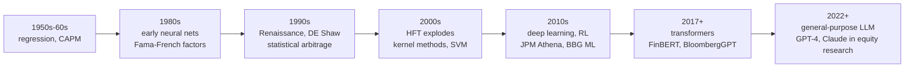
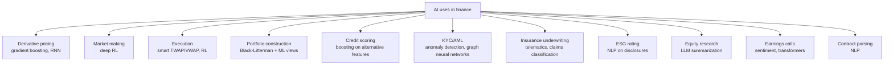
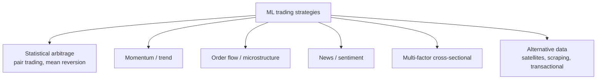
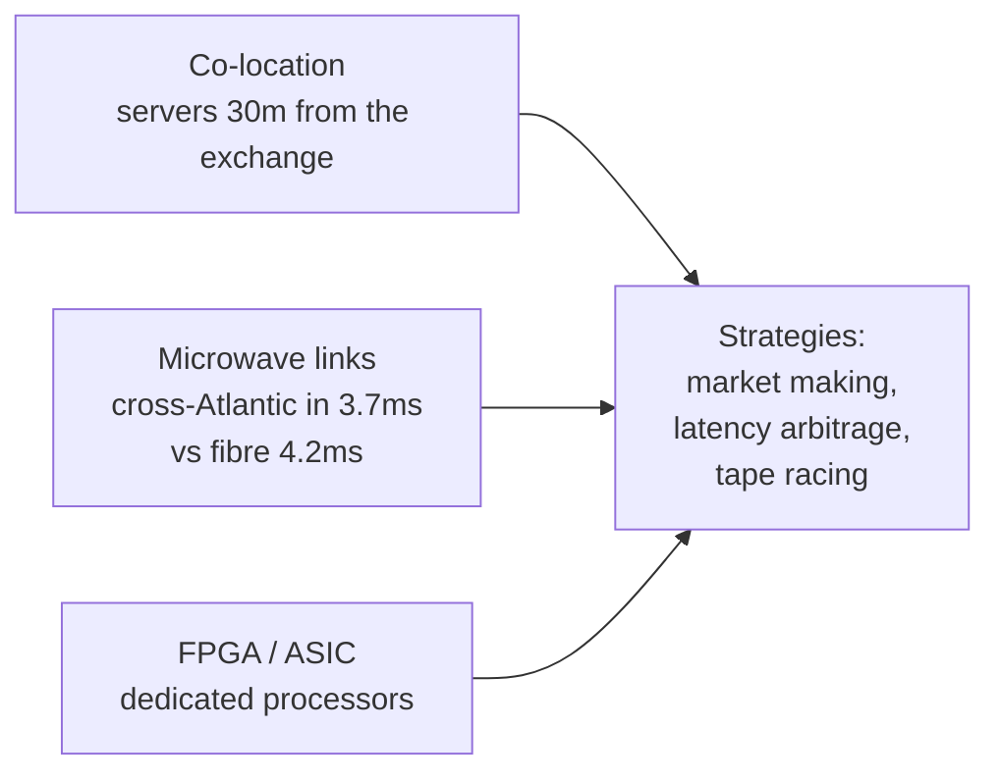
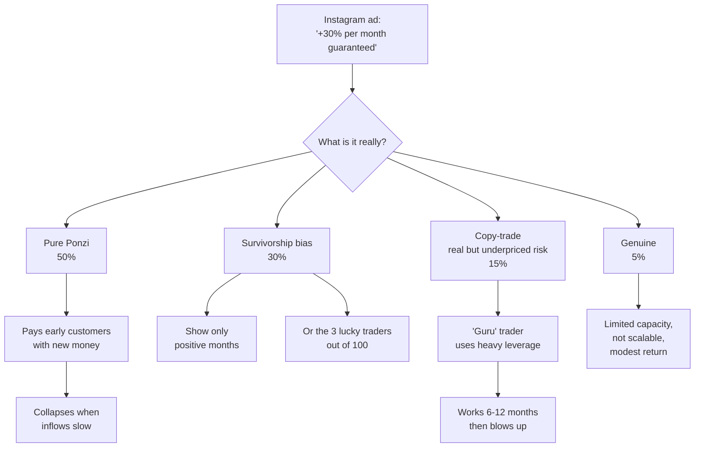

# AI in finance: ML for trading, robo-advisors, credit scoring, LLM

AI in finance is one of the domains where the gap between **who actually uses it** (quant hedge funds, investment banks, exchanges) and **who sells it to the public** (Instagram, YouTube, "bot trading" apps) is the widest in the entire industry. The first crowd makes billions. The second is almost always fluff or fraud.

This chapter aims to:

1. Map the real uses of AI in finance, from 1970s regression to 2024 LLMs.
2. Show where AI really works (derivative pricing, market making, anomaly detection, sentiment).
3. Show where it doesn't (retail directional market prediction).
4. Highlight the traps: overfitting, data leakage, look-ahead bias, survivorship bias.
5. Give a realistic look at HFT.
6. Show a small Python script doing stock momentum, with caveats.

## 1. History: from the linear model to the transformer



- **1950s-60s**: Markowitz, Sharpe, Lintner. Regression and mean-variance. *Linear AI* before the word "AI".
- **1970s**: Fama-French, risk factors. Black-Scholes.
- **1980s-90s**: birth of **quant trading**. Jim Simons founds **Renaissance Technologies** in 1982. The **Medallion Fund** (internal, employees only) produces from 1988 to 2018 an average annual return of **66% gross** (~39% net of fees, which are sky-high). The secret: extreme data mining on non-linear, short-horizon patterns with fast rebalancing.
- **1990s**: David Shaw founds **DE Shaw** in 1988. Same playbook: statistical arbitrage on massive datasets. DE Shaw alumni include Jeff Bezos (later Amazon) and Cliff Asness (later AQR).
- **2000s**: **HFT** becomes 50%+ of US volume. Goldman, Citadel, Virtu, Jane Street.
- **2010s**: **deep learning** in pricing, RL in market making (DeepMind studied zero-sum games applicable to market making).
- **2018-2020**: **FinBERT** (transformer for financial sentiment). Sentiment from Twitter, news, earnings calls.
- **2022**: **ChatGPT**. From late 2022 onward, general-purpose LLMs enter the workflows of analysts, risk officers, compliance teams.
- **2023**: Bloomberg releases **BloombergGPT** (50B parameters, trained on a finance corpus). JP Morgan announces "IndexGPT". The EU AI Act is approved and classifies credit scoring as "high-risk".

## 2. Where AI is actually used



Detail:

### 2.1 Derivative pricing

Analytical models (Black-Scholes, Heston) have limits on exotic derivatives (path-dependent, multi-asset). Solutions: slow but general Monte Carlo. Modern shortcut: **gradient boosting (XGBoost, LightGBM)** or **neural nets** trained on Monte Carlo pricing tables, delivering a price in microseconds instead of seconds.

JP Morgan published (2018) a paper showing a fully-connected neural net can approximate basket option pricing 100x faster than Monte Carlo, with error <0.1%.

### 2.2 Market making

A **market maker** quotes bid and ask on an instrument, earning the spread. The problem: how to quote to maximize profit and minimize **adverse selection** risk (an informed trader sells to you knowing the price will fall).

**Deep reinforcement learning (DRL)** models the problem: agent quotes, receives reward (P&L), updates the policy. Citadel, Jane Street, Optiver likely use RL variants in their infrastructure.

### 2.3 Execution algorithms

When an asset manager has to execute a big order (e.g. sell 1M Apple shares), they don't dump it all at once — it would move the price. They split it into small chunks executed over hours. Classic strategies: **TWAP** (time-weighted average price), **VWAP** (volume-weighted).

**ML execution** predicts future volume and dynamically adjusts the schedule. RL can optimize the impact-vs-timing-risk trade-off.

### 2.4 Portfolio construction

Black-Litterman is a framework combining Bayesian priors on expected returns with manager views. The modern ML twist replaces "human" views with views derived from ML models on factors (momentum, value, quality, etc.).

AQR, BlackRock, Two Sigma have entire teams doing this.

### 2.5 Credit scoring

The most established ML use in retail finance. Models:

- Logistic regression (historic).
- **Gradient boosting (XGBoost, LightGBM)**: state-of-the-art today for tabular data.
- Deep learning: used by fintechs like Upstart, Klarna.

**Alternative features** (beyond salary, debt, history): phone usage patterns, aggregated bank transactions, social graph. Ethical and regulatory pressures make them controversial — the **EU AI Act** (2024) classifies consumer credit scoring as **high-risk**: transparency, monitoring, human review, ban on some features (e.g. sexual orientation, religion).

Source of return for fintechs: spot customers the traditional FICO model misclassifies, lend to those who'll actually pay. Upstart claims approval rates +27% at equal risk vs classic FICO.

### 2.6 KYC / AML

Anomaly detection on millions of transactions: graph neural networks identify "money mule networks", chains of accounts exchanging funds to launder money. **Chainalysis** does it for crypto; **ComplyAdvantage**, **Quantexa** for traditional banks.

### 2.7 LLM in equity research

Real 2024 workflow:

1. Company X publishes its 10-K (annual report, 200 pages, legalese).
2. The analyst loads the PDF into an LLM + RAG (Retrieval-Augmented Generation) system.
3. Asks: "Extract Cloud segment risks", "Compare FY23 vs FY22 margins", "Find guidance mentions".
4. LLM returns text-localized answers with citations.
5. Analyst verifies, summarizes, writes the research note in 1/3 of the time.

**Bloomberg Terminal** integrates LLMs since 2023 for news and earnings call summarization. Goldman Sachs and Morgan Stanley have internal chatbots.

Important: LLMs **hallucinate** (invent plausible facts). In finance, where a wrong number in a research note can trigger lawsuits, the LLM is always a **human-supervised assistant**, not a replacement.

## 3. ML for trading: what's realistic and what isn't



Realistically:

- **Stat arb and microstructure**: domain of top hedge funds. Edge in micro-to-seconds, limited capacity (more capital → less alpha), teams of hundreds of PhDs.
- **Cross-sectional momentum**: well documented, replicable as a risk premium via ETFs (e.g. iShares Momentum). Eroded edge in recent years.
- **Sentiment trading**: works for certain events (earnings calls), but low capacity.
- **Alternative data**: supermarket parking lots seen from satellites → sales estimates → trading. Expensive (datasets $500k-$2M/year), limited capacity.
- **Daily directional S&P prediction for retail with LSTM**: noise. Splendid backtests, disastrous out-of-sample.

### 3.1 The six backtest traps

| Trap | What it is | Example |
|---|---|---|
| **Overfitting** | model memorizes training set, doesn't generalize | net with 1M parameters on 5 years of daily data |
| **Look-ahead bias** | you use data in the backtest you wouldn't have had in real time | using split-adjusted prices for splits that hadn't happened yet |
| **Survivorship bias** | universe includes only surviving firms | backtest on today's S&P 500 without Enron, Lehman, pre-decline GE |
| **Data snooping** | you try 1,000 strategies, publish the 1 that works | "tilted" paper not corrected for multiple comparisons |
| **Ignored transaction costs** | backtest doesn't subtract fees, slippage, market impact | HF mean-reversion strategy doing 10,000 trades/day |
| **Regime change** | model trained on one regime dies in another | strategy trained pre-COVID that blows up March 2020 |

### 3.2 Historical case: Long-Term Capital Management (1998)

LTCM was a hedge fund founded by John Meriwether with two Nobel laureates (Merton, Scholes). Strategy: bond arbitrage, high leverage (30:1). Sophisticated statistical models for return distribution.

Problem: the model assumed normal distribution and stable correlations. In August 1998, Russian default → flight-to-quality → all LTCM positions moved together, against the model. In 4 months LTCM loses 4.6 bn USD. The Fed coordinates a bailout to avoid systemic contagion.

Lesson: historical models fail in regime changes. Fat tails are everywhere.

### 3.3 Recent case: quant funds in March 2020

Quant funds with systematic vol-target strategies had a bad March 2020. When vol exploded, forced deleveraging; momentum positions were wrong; the regime change blew up models that had worked for 5+ years.

AQR (Cliff Asness) had a horrible 2020 (-15-20% on some value funds).

Since then: more focus on **regime detection** and **hybrid models**.

## 4. HFT: High-Frequency Trading

HFT is the extreme version of speed: microsecond latency, hyper-specialized infrastructure.



Players: **Citadel Securities**, **Virtu**, **Jane Street**, **Jump Trading**, **DRW**, **IMC**. Together they make ~50% of US equity volume.

### 4.1 Flash crash of May 6, 2010

At 14:32 EST the Dow Jones drops **1,000 points in 5 minutes**, recovers in another 20. Procter & Gamble flies from $60 to $39 in seconds, Accenture to 1 cent — temporarily.

Causes (SEC-CFTC September 2010 report):

1. A Waddell & Reed fund places a sell order of 75,000 E-mini S&P contracts ($4.1 bn) with a poorly calibrated execution algorithm (% of volume with no price limit).
2. HFT market makers initially absorb, then pull out (volatility kills) → liquidity evaporates.
3. Stop-loss orders cascade, the order book empties → grotesque prices.
4. "Hot potato" algorithms pass contracts among each other at insane speed.

Regulatory consequences: more aggressive **circuit breakers**, **Reg SCI**, **MiFID II** in Europe (2018) with strict algo trading rules (testing, mandatory kill switch, order tagging).

### 4.2 Spoofing

Illegal technique: place large fake orders on one side of the book, let others move the price in the direction you want, cancel the fakes, execute on the opposite side.

Famous case: **Navinder Sarao**, London-based retail trader, charged by the SEC in 2015 with contributing to the 2010 flash crash through massive spoofing from his home laptop. Extradited to the US, 2020 sentenced to 1 year house arrest + cooperation with authorities.

Italian case: Consob/Bank of Italy investigations into BTP futures spoofing led to multi-million sanctions on some international banks.

Spoofing is **illegal** in the US (Dodd-Frank 2010) and EU (MAR — Market Abuse Regulation).

## 5. Generative AI (LLM) in finance: status 2024

Concrete production workflows:

| Workflow | Benefit | Limit |
|---|---|---|
| Summarization 10-K, 10-Q, prospectus | analyst saves 60-80% time | hallucination risk on numbers |
| Earnings call summary with sentiment | additional quant signal | compute cost, real-time challenge |
| Compliance: trader chat review for market abuse | scalability vs human auditors | false positives |
| Drafting research notes / pitchbooks | reduced drafting time | requires review |
| Contract parsing (loan agreements, ISDA) | clause classification | legal edge cases |
| Q&A on internal database (RAG) | onboarding new analysts | retrieval quality |
| Code generation for data pipelines | developers 2-5x more productive | code review mandatory |

Public examples:

- **JPMorgan COiN** (Contract Intelligence): reviews commercial loan contracts. 360,000 work hours/year saved.
- **Morgan Stanley AI @ Morgan Stanley Assistant** (with OpenAI): copilot for the ~16,000 financial advisors on queries over 100k+ internal research docs.
- **Bloomberg GPT** (50B parameters, training corpus 363B tokens mixing Bloomberg + web).
- **Goldman Sachs** publicly stated it uses Devin (Cognition AI) and other LLMs for code generation.

### 5.1 What LLMs DON'T do

- They don't make reliable market predictions (trained on text, not numerical time series; and real market patterns aren't in the news).
- They don't replace judgment in risk management.
- They are not allowed (in EU under the AI Act) as autonomous decision-makers on consumer credit scoring, employment, social benefits. They must stay advisory + human-in-the-loop.

## 6. EU AI Act (2024)

Approved March 2024, phased entry into force 2025-2027.

Classifies AI systems into 4 levels:

| Level | Examples | Obligations |
|---|---|---|
| **Prohibited** | Chinese-style social scoring, subliminal manipulation | banned |
| **High risk** | consumer credit scoring, biometrics, hiring processes, critical infrastructure | conformity assessment, EU registry, human oversight, transparency |
| **Limited** | chatbots, deepfakes | disclosure obligation ("you're talking to an AI") |
| **Minimal** | spam filters, video game AI | no obligations |

For EU retail finance: consumer credit scoring is high-risk. Banks and fintechs must:

- Document the model.
- Test for bias.
- Ensure explainability (user has the right to know why they were rejected).
- Allow human review.
- Register in EU database by 2026-2027.

## 7. Example: small Python momentum script on S&P 500

A pedagogical example. **NOT a real-money strategy** — only shows what a simple backtest is and where the traps are.

```python
import yfinance as yf
import pandas as pd
import numpy as np

# 1. download daily data for top 10 S&P 500 names (SPY-like proxy)
tickers = ["AAPL", "MSFT", "GOOGL", "AMZN", "NVDA",
           "META", "TSLA", "BRK-B", "JPM", "JNJ"]
data = yf.download(tickers, start="2018-01-01", end="2024-01-01",
                   auto_adjust=True)["Close"]

# 2. compute 12-month momentum (252 trading days)
mom = data.pct_change(252)

# 3. each month, pick the 3 names with highest momentum
monthly = mom.resample("M").last()
top3 = monthly.apply(lambda r: r.nlargest(3).index, axis=1)

# 4. backtest: each month invest 1/3 in each of the top 3
returns = data.pct_change()
monthly_ret = returns.resample("M").apply(lambda x: (1+x).prod() - 1)

portfolio_ret = []
for date, picks in top3.items():
    if date in monthly_ret.index:
        picks_valid = [p for p in picks if p in monthly_ret.columns]
        if len(picks_valid) >= 3:
            r = monthly_ret.loc[date, picks_valid[:3]].mean()
            portfolio_ret.append((date, r))

df = pd.DataFrame(portfolio_ret, columns=["date","ret"]).set_index("date")
df["cum"] = (1 + df["ret"]).cumprod()

# 5. compare with equally weighted buy-and-hold
bh = monthly_ret.mean(axis=1)
bh_cum = (1 + bh).cumprod()

print("Momentum strategy CAGR:",
      df["cum"].iloc[-1] ** (12 / len(df)) - 1)
print("Buy-and-hold CAGR:",
      bh_cum.iloc[-1] ** (12 / len(bh_cum)) - 1)
```

### 7.1 Caveats on the script

1. **Survivorship bias**: the list is "today's S&P top 10". Tesla wasn't there in 2018. Apple was.
2. **No transaction cost**: rebalancing each month = 6 trades. For a retail 10k EUR portfolio, 6 × 0.15% = 0.9% costs per year. Erodes the margin.
3. **Look-ahead bias**: if you use `pct_change(252)` computed on the full dataset, you include future info in the ranking. You should use strict walk-forward.
4. **Sample size**: 6 years, 72 months → ~24 independent observations (because 12-month momentum overlaps). Low statistical significance.
5. **In-sample backtest**: the "12-month momentum" choice is made after seeing data. Change it to 6 or 18 months, get different results. That's data snooping.

Realistic result: cross-sectional momentum is documented in the literature (Jegadeesh-Titman 1993), averages 3-5% gross annual alpha in developed markets, **but**:

- Alpha has shrunk since 2000.
- Drawdowns are brutal (2009 momentum crash -50% in weeks).
- After TER and execution costs, residual alpha for retail is uncertain.

## 8. Instagram bot trading: why 9 of 10 are scams



Mandatory red flags:

- "Guaranteed X% per month" → no investment is guaranteed.
- "Proprietary bot" without documentation → black box.
- Track record only via Instagram screenshots → forgeable in 30 seconds.
- "Pay upfront for the bot" → wrong business model (whoever has a real bot doesn't sell it, uses it).
- Promise of "passive income" → active trading is never passive income.
- "Work with my advisor team" → never exposed to regulators, never with SEC/CONSOB license.

**Pig butchering** (romance + crypto scam): the most lucrative today. Victim is courted on WhatsApp/dating app, steered to a "crypto investment" showing fake returns on a fake platform, "fattened" by depositing more, then "slaughtered" when trying to withdraw (they ask for ever-higher "fees"). FBI estimates: 4 bn USD in 2023 USA alone.

## 9. AI for retail: what's reasonable

If you have 1-100k EUR to invest, here's the **reasonable use** of AI in your financial life:

| Use | Yes/No |
|---|---|
| Robo-advisor (auto asset allocation + rebalancing) | Yes, see sec. 36 |
| LLM (ChatGPT/Claude) to clarify financial concepts | Yes, with source check |
| LLM to read and summarize an ETF prospectus | Yes |
| LLM telling you "what to invest in" or predicting a stock | NO |
| Proprietary trading bot for sale | NO |
| Copy-trading "successful" eToro/Robinhood traders | High caution, see survivorship |
| Automatic tax-loss harvesting tool | Yes in USA (legal), little use in IT |
| Portfolio aggregators (Plaid-like) | Yes |

## 10. Ironic case: does GPT-4 beat analysts?

In May 2023 a paper by Lopez-Lira & Tang (Univ. Florida) shows that ChatGPT, reading news headlines, predicts stock directionality better than several benchmarks and human analysts over 2-3 days, on a 2021-2022 sample.

Caveats (very important):

1. Very peculiar period (post-COVID, high vol, extreme retail flow).
2. Out-of-sample after publication: the edge is likely already arbitraged away.
3. Predictability is statistical, not guaranteed on a single name.
4. Doesn't incorporate realistic transaction costs.

It's not "ChatGPT beats Wall Street". It's "on a given dataset, in a given period, discriminatively more informed than baseline models". From that to "buy stocks with ChatGPT" is a huge logical leap.

## 11. Summary: defensible positions on AI in finance

1. AI is ubiquitous in finance's back end: pricing, KYC, market making, credit scoring, summarization. You see nothing because it's invisible to the customer.
2. AI to predict markets is the domain of top hedge funds with capacity retail will never have. Limited capacity = not scalable = not sellable.
3. LLMs today (2024-2026) are assistants, not decision-makers. In credit scoring and "high-risk" areas, the EU AI Act requires human oversight.
4. Retail trading bots: 90% are scams or survivorship bias. The remaining 10% have such low capacity that those who own it don't sell it.
5. For you, retail: use AI as *extra brain* (summarization, queries, prep), never as *financial decision-maker*. ETFs + disciplined asset allocation + no shortcuts.

## 12. Numerical example: portfolio optimizer with ML views

You have 100k EUR in 3 asset classes (equity, bond, commodity). Starting point: MSCI-world-like weights 60/30/10.

An ML model tells you that, given current macro factors (real rates, momentum, sentiment), commodities have **expected excess return** +2% over the next 6 months above baseline.

Black-Litterman approach:

1. Prior (equilibrium): r̂_eq derived from market weights.
2. View: +2% for commodities with confidence σ_view = 1.5%.
3. Posterior: weighted average of prior and view by variance.

Posterior suggests moving commodities from 10% to 13%. Modest, but measured.

Compare with "typical retail" who, after hearing a guru on YouTube, shifts from 10% to 40% commodities. Result: if commodities drop, disastrous loss; if they rise, huge gain — but risk uncommensurate with position size.

Well-done AI is **informed moderation**, not concentrated bets.

<details>
<summary>Exercise: extend the momentum script with walk-forward</summary>

Modify the script in section 7 to:

a) Use S&P 500 constituents historically correct for each date (use an annual snapshot instead of "today's top 10").
b) Implement walk-forward: for each month t, compute 12m momentum **using only data up to t-1**.
c) Add a 0.1% transaction cost per trade (open + close = 0.2% notional).
d) Compare CAGR and max drawdown vs equally weighted buy-and-hold.

Reflection questions:

1. After removing survivorship + look-ahead + costs, does momentum's alpha survive?
2. Which drawdown periods do you see? Consistent with known "momentum crashes" (2009)?
3. If you change lookback from 12m to 6m or 18m, how much does the outcome change? Consistent with literature pattern, or are you data snooping?

**Hint**: expect CAGR to drop significantly after corrections. If it doesn't drop, you have a bug.

</details>

## 13. Things to remember

- AI in finance dates back to the 1950s (regression, CAPM). What changes is compute and data.
- Renaissance Medallion: 66% gross annual for 30 years. Real, but inaccessible (closed, employees only).
- Real uses today: pricing, market making, execution, credit scoring, KYC/AML, sentiment, LLM for research/compliance.
- Six backtest traps: overfitting, look-ahead, survivorship, data snooping, transaction costs, regime change.
- HFT: limited capacity, dominated by 6-10 players, regulated by MiFID II and Reg SCI.
- 2024 EU AI Act: consumer credit scoring is high-risk, needs human oversight.
- LLMs in finance: assistants for summarization, research, compliance. Not autonomous decision-makers.
- Instagram trading bots: 90% scam or survivorship trap.
- For retail: use AI to *understand*, not to *predict*. ETF + asset allocation + discipline.
- Real AI edge in finance is in the hands of a few players with capital, data, and PhDs. The rest is marketing.
