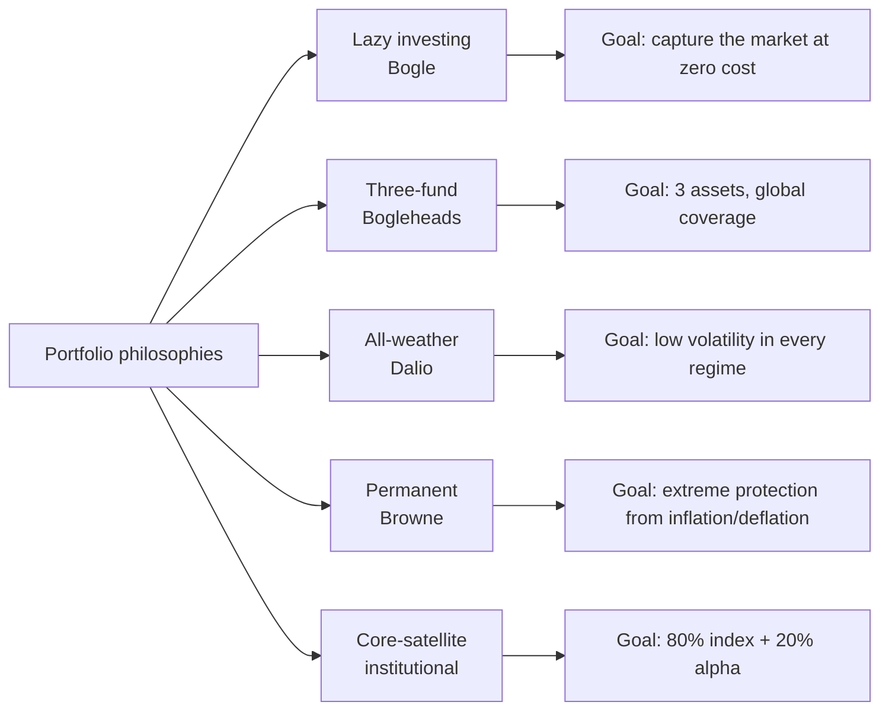
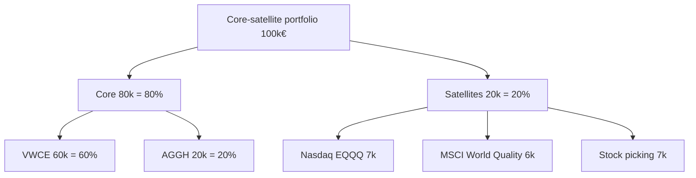
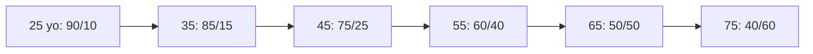
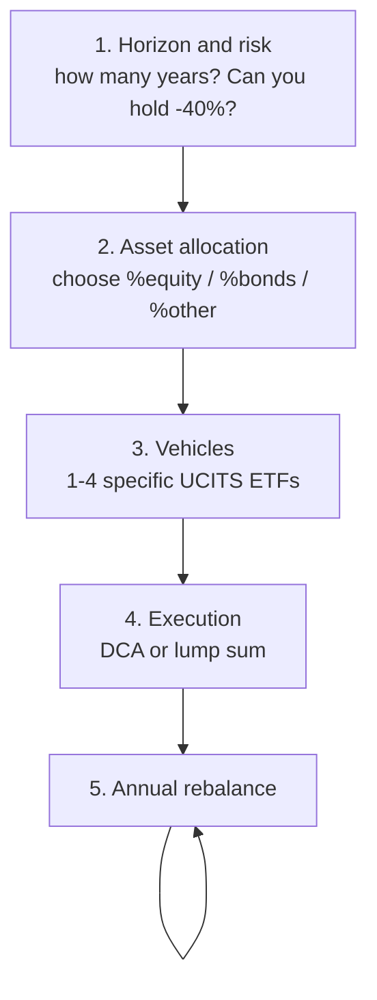

# Building a portfolio: lazy, three-fund, all-weather, core-satellite

The "right" portfolio doesn't exist in the abstract. Only the portfolio that is right **for you** exists, given your horizon, your risk profile and how much stomach you have to watch the account go red 40% in a bad year. In this section I take you from "ok I got the theory" to "here are four ETFs, how much I invest in each, and in 30 years net I have €480,000". We'll only use UCITS ETFs really purchasable by an Italian retail investor, with real ISINs. No theory orphaned from ticker codes.

## 1. Four construction philosophies

Before the numbers, take the four big families and understand where they come from.

### 1.1 Lazy investing — John C. Bogle (Vanguard, 1975)

The founder of Vanguard has one idea worth 100 books: **you can't beat the market systematically, so buy all of it at very low cost and leave it there for 30 years**. The lazy portfolio in its extreme version is a single global equity ETF ($\text{ACWI}$ or $\text{MSCI World}$) for the young, or a 60/40 stocks/bonds mix for the more conservative.

Key lazy point: **time in the market** beats **timing the market**. The average retail investor's performance is 4% a year against 9% of the $S\&P 500$, and the 5 missing points are money left on the table by wrong market timing (Dalbar QAIB study).

### 1.2 Three-fund portfolio — Bogleheads

The Bogleheads (community forum based on Bogle) standardized the "three-fund portfolio": three ETFs cover the world.

Original US version:

| Asset | Typical US ETF | Aggressive weight | Moderate weight | Conservative weight |
|---|---|---:|---:|---:|
| US total market | VTI | 60% | 40% | 20% |
| International ex-US | VXUS | 30% | 20% | 10% |
| US total bond | BND | 10% | 40% | 70% |

European version (€-investor, UCITS):

| Asset | UCITS ETF | ISIN | TER | Notes |
|---|---|---|---:|---|
| Developed world | iShares Core MSCI World | IE00B4L5Y983 (SWDA) | 0.20% | ~1500 large+mid cap, no USD/EUR hedge |
| All-world all-cap | Vanguard FTSE All-World | IE00BK5BQT80 (VWCE) | 0.22% | includes emerging markets, ~3700 names |
| Emerging markets | iShares Core MSCI EM IMI | IE00BKM4GZ66 (EIMI) | 0.18% | if you use SWDA you need a separate EM |
| Bond global € hedged | iShares Core Global Aggregate Bond € H | IE00BDBRDM35 (AGGH) | 0.10% | global bonds hedged in EUR |
| Bond € govts | iShares Core € Govt Bond | IE00B4WXJJ64 (IEGA) | 0.07% | more conservative alternative |

Simplified version for young €-investor: **VWCE + AGGH**. Two ETFs, global equity + global bonds EUR-hedged. For 90% of people it's already done here.

### 1.3 All-weather — Ray Dalio (Bridgewater, 1990s)

Dalio wanted a portfolio that would hold up in **any macro regime**: high growth, low growth, high inflation, low inflation. Four quadrants, four assets balanced for **risk** (not for capital).

Classic all-weather allocation:

| Asset | Weight |
|---|---:|
| Global equity | 30% |
| Long bonds (15-30y) | 40% |
| Medium bonds (5-10y) | 15% |
| Gold | 7.5% |
| Commodities | 7.5% |

UCITS implementation:

| Component | ETF | ISIN | TER |
|---|---|---|---:|
| Equity | VWCE | IE00BK5BQT80 | 0.22% |
| Long € bonds | iShares € Govt 15-30y | IE00B1FZS913 | 0.15% |
| Medium € bonds | iShares € Govt 7-10y | IE00B1FZS681 | 0.15% |
| Gold | iShares Physical Gold | IE00B4ND3602 | 0.12% |
| Commodities | Invesco Bloomberg Commodity | IE00BD6FTQ80 | 0.34% |

Characteristic: historical annual volatility $\sim 7\%$ (against 15% of a 100% equity), historical max drawdown $\sim -12\%$ against -55% of 2008. **Cost**: lower expected return (~5-6% real long-term against 7-8% of 100% equity).

### 1.4 Permanent Portfolio — Harry Browne (1981)

Four clean quadrants, 25% each, designed to be "permanent" (never changed).

| Asset | Weight | Scenario where it wins |
|---|---:|---|
| Equity | 25% | Prosperity |
| Long bonds | 25% | Deflation |
| Cash / T-bill | 25% | Recession |
| Gold | 25% | Inflation |

For €-investor: VWCE 25% + iShares € Govt 15-30y 25% + deposit account/MMF 25% (e.g. XEON IE00B3VTML14, EUR overnight) + iShares Physical Gold 25%. Real historical return ~4%, very contained drawdown. Philosophically more extreme than all-weather: explicitly gives up "beating" the market, only wants to protect purchasing power in every regime.

### 1.5 Core-satellite

The "professional" approach of wealth management. A passive **core** (70-90% of the portfolio) captures the market at low cost. Some **satellites** (10-30%) express tactical views: sectors (e.g. tech, healthcare), factors (value, quality, momentum), specific geographies, themes (clean energy, AI).

The point: **if you mess up the satellites, you lose at most 20%**. The core, the big part, is invariant.

## 2. Asset allocation by profile

Asset allocation is the one decision that explains 80-90% of the variance of a portfolio's returns (Brinson-Hood-Beebower 1986, replicated dozens of times). Everything else — stock picking, market timing, picking the "best" ETF — is noise in comparison.

Three sample profiles:

| Profile | Indicative age | Equity | Bonds | Gold | Commodities | Real exp. return | Expected drawdown |
|---|---|---:|---:|---:|---:|---:|---:|
| Aggressive | 25-40 | 90% | 10% | 0% | 0% | 6-7% | -45% |
| Moderate | 40-55 | 60% | 35% | 5% | 0% | 4-5% | -25% |
| Conservative | 55+ | 30% | 60% | 10% | 0% | 2-3% | -12% |

The classic "$110 - \text{age} = \%\text{equity}$" rule is a decent but coarse shortcut. Better ask yourself:

1. **Horizon**: in how many years will I need this money? <5 years → no equity. 5-10 → max 50%. >15 → you can push to 80-100%.
2. **Emotional tolerance**: if you see -40% in 2008, do you sell or hold? If you sell, you're not aggressive, even if you're 25.
3. **Risk capacity**: stable salary (civil service, healthcare) → higher risk capacity. Self-employed + 1 child → lower.

## 3. Glide path: changing allocation with age

"Target date" funds (e.g. Vanguard 2055, BlackRock LifePath) implement a **glide path**: they automatically reduce equity exposure as retirement approaches.

Translated to an approximate formula:

$$\%\text{equity}(age) = 110 - age \quad \text{(moderate version)}$$

$$\%\text{equity}(age) = 125 - age \quad \text{(aggressive, long-life)}$$

Personally I prefer Pfau-Kitces's "rising equity glide path": go down to 40-50% equity around 60, then **rise back** to 70% after 75. Defends against the *sequence of returns risk* early in retirement.

## 4. How many ETFs do you really need

Spoiler: few. The proliferation of ETFs (today ~3000 UCITS in Europe) tricks you into thinking complicated portfolios are needed. They're not.

| Setup | # ETFs | Example | Good for |
|---|---:|---|---|
| Minimal | 1 | VWCE | young 100% equity, no bonds |
| Two-fund | 2 | VWCE + AGGH | the majority |
| Three-fund classic | 3 | SWDA + EIMI + AGGH | separate EM control |
| All-weather | 5 | VWCE + long bonds + med bonds + gold + commodities | Dalio enthusiast |
| Core-satellite | 5-8 | base + satellites | who wants tactical tilts |

Beyond 8-10 ETFs you're in **diworsification** (Lynch): performance doesn't improve, complexity does, and you probably overlap too.

## 5. Total costs for an €-investor

How much does it really cost to own a portfolio in Italy? Three items.

$$C_{total} = TER + \text{stamp duty} + \text{capital gain tax} + \text{broker fees}$$

| Item | How much |
|---|---|
| Average TER, global equity UCITS ETF | 0.10–0.25% / year |
| Average TER, € bond UCITS ETF | 0.05–0.15% / year |
| Stamp duty (securities tax) | 0.20% / year on AUM |
| Capital gain tax | 26% on gains at sale (not on dividends reinvested if accumulating ETF) |
| Broker fees | from 0 (Trade Republic, Directa Maxi PAC) to 0.19% (Fineco) |

Example: €100,000 portfolio on Fineco, VWCE 100%.

- TER: $100{,}000 \times 0.22\% = 220$ € / year
- Stamp duty: $100{,}000 \times 0.20\% = 200$ € / year
- Total recurring: **€420 / year = 0.42%**

Over 30 years the differential between 0.4% and 1.5% cost (= an average active fund) on 100k growing at 6% is enormous:

$$\text{ETF 0.4\%}: 100{,}000 \times 1.056^{30} \approx 521{,}000 \, \text{€}$$
$$\text{Active fund 1.5\%}: 100{,}000 \times 1.045^{30} \approx 374{,}000 \, \text{€}$$

**Difference: €147,000.** Just for costs. That's why Bogle says "in investing, you get what you don't pay for".

## 6. Implementation on Italian brokers

Practical comparison for Italian retail investor:

| Broker | Type | ETF fee | Auto DCA | Custody | Notable |
|---|---|---|---|---|---|
| Fineco | IT bank | €19 flat (or 0.19% max €19) | yes, free on ~80 ETFs | account + custody included | automatic tax filing |
| Directa | IT bank | €5 flat or €9 | yes, free on Maxi PAC | free | tax-friendly Italian |
| Trade Republic | DE neo-broker | €1 flat | yes, free | free | self-declaration (you must file RW form) |
| Degiro | NL neo-broker | €2 flat or 0 on "core" ETF list | no | free | self-declaration |
| Interactive Brokers | US-style | ~€1.25 Euronext | no | free >100k | the most complete, complex for RW |

Rule of thumb: if you put in **<€300/month**, go to Fineco (free DCA) or Directa. If you put in >€500/month in lump sum, Trade Republic is also fine. Self-declaration (IB, TR, Degiro) costs 1-2h of work at year end + accountant.

## 7. Step-by-step construction

Operational recipe, 4 steps:

### Operational example: 35 yo, €40,000 cash + €800/month to invest

- **Step 1**. Horizon 25-30 years (retirement at 65). Medium tolerance (I've already seen 2020). Aggressive-moderate profile.
- **Step 2**. 80% equity / 20% bonds.
- **Step 3**. Two ETFs: VWCE (80%) + AGGH (20%).
- **Step 4**. Lump sum €40,000 split in 4 monthly tranches of €10,000 (to reduce regret in case of crash right after). Then DCA €800/month: €640 in VWCE + €160 in AGGH.
- **Step 5**. Rebalance every January.

Over 30 years, 6% average gross, $\approx €1{,}060{,}000$ gross final. We'll see the net numbers below.

## 8. Full numerical example: €100k at 70/30 over 30 years

Setup: initial capital €100,000, asset allocation 70% VWCE / 30% AGGH, broker Fineco, 30-year holding, no further DCA.

Expected real returns (after inflation):
- VWCE: 5.5%
- AGGH: 1.5%

Portfolio expected return:

$$r_p = 0.7 \times 5.5\% + 0.3 \times 1.5\% = 4.3\% \text{ real}$$

In nominal terms, assuming 2% inflation: $r_p^{nom} \approx 6.3\%$. For simplicity we work in nominal at 6%.

Gross final value:

$$V_{30}^{gross} = 100{,}000 \times (1+0.06)^{30} \approx 574{,}349 \, \text{€}$$

**Theoretical capital gain**: $574{,}349 - 100{,}000 = 474{,}349$ €.

Tax at exit (simplification: all sold at end of year 30):

| Item | Amount |
|---|---:|
| Gross capital gain | €474,349 |
| 26% tax on gain | -€123,331 |
| Stamp duty 0.20% × 30 years (avg on ~337k) | ~€20,200 |
| Cumulative TER (0.22%×70 + 0.10%×30 = 0.176%/year on avg balance) | ~€17,700 |

Estimated net value:

$$V_{30}^{net} \approx 574{,}349 - 123{,}331 - 20{,}200 - 17{,}700 \approx 413{,}118 \, \text{€}$$

In real terms (dividing by $(1.02)^{30} \approx 1.811$):

$$V_{30}^{real} \approx 228{,}000 \, \text{€}$$

You more than doubled purchasing power, **net of everything**. A 30-year BTP at 4% nominal net would have made $100k \times 1.04^{30} = €324{,}340$ gross / net 26% on gain $\approx €266k$ → in real $\approx €147k$. The 70/30 portfolio wins by 55%.

## 9. Classic construction mistakes

1. **Too much home bias** — 60% Italy/Eurozone because "you know them". The Italian market is 0.8% of the global. Really diversify.
2. **Chasing the trendy sector ETF** — clean energy in 2021 (+150%), -55% in 2023. Thematics = small satellites, not core.
3. **Confusing accumulating and distributing** — accumulating reinvest dividends without intermediate withholding (more tax-efficient in Italy). Distributing pay 26% immediately on dividends.
4. **Changing strategy every 6 months** — asset allocation works if you keep it. You rebalance but don't redesign.
5. **Overlapping ETFs** — VWCE + SWDA adds nothing, indeed if you have VWCE + SWDA + EIMI developed world is double-weighted.

## 10. Three sample portfolios by profile (full implementation)

Three complete portfolios ready to copy, with real ETFs and net weights.

### 10.1 "Junior Investor" portfolio (25-35 yo, 100% equity)

| ETF | ISIN | Weight | TER |
|---|---|---:|---:|
| Vanguard FTSE All-World | IE00BK5BQT80 (VWCE) | 100% | 0.22% |

Expected drawdown: -50% in stress scenario. Expected real return: 6-7%. Ideal DCA: 100% in VWCE every month, no rebalancing because single instrument.

### 10.2 "Mid-life Investor" portfolio (40-55 yo, 60/40)

| ETF | ISIN | Weight | TER |
|---|---|---:|---:|
| Vanguard FTSE All-World | IE00BK5BQT80 (VWCE) | 55% | 0.22% |
| iShares Core Global Aggregate Bond € H | IE00BDBRDM35 (AGGH) | 35% | 0.10% |
| iShares Physical Gold | IE00B4ND3602 (SGLN) | 10% | 0.12% |

Expected drawdown: -25%. Expected real return: 4-5%. Annual rebalance in January.

### 10.3 "Pre-Retirement" portfolio (55+ yo, 30/60/10)

| ETF | ISIN | Weight | TER |
|---|---|---:|---:|
| Vanguard FTSE All-World | IE00BK5BQT80 (VWCE) | 30% | 0.22% |
| iShares Core Global Aggregate Bond € H | IE00BDBRDM35 (AGGH) | 50% | 0.10% |
| iShares € Govt 1-3y | IE00B14X4Q57 (IBGS) | 10% | 0.20% |
| iShares Physical Gold | IE00B4ND3602 (SGLN) | 10% | 0.12% |

Expected drawdown: -12%. Expected real return: 2-3%. Bucket strategy: the 10% in short-duration bonds is the "liquid cushion" you draw from in the next 3-5 years of retirement.

## 11. Purchase frequency and DCA on Italian brokers

On the construction horizon, optimal frequency depends on the broker.

| Broker | Cost per purchase | Optimal frequency for €500/month |
|---|---|---|
| Fineco DCA (in-list ETF) | €0 | monthly |
| Fineco DCA outside list | €19 | bi-monthly (to keep fees at 1.9%) |
| Directa Maxi DCA | €0 | monthly |
| Trade Republic | €1 | monthly (fee = 0.2%) |
| Interactive Brokers Euronext | ~€1.25 | monthly |

Rule: if the fee on a single purchase exceeds 0.5% of the amount, accumulate and contribute less often.

## 12. Key takeaways

- Four philosophies, one shared idea: **low costs + diversification + time**.
- For 90% of people, **2 ETFs (global equity + global bond €-hedged)** are all you need.
- Asset allocation explains 80-90% of return variance. Choose carefully, then don't touch it.
- Total costs matter: 1% more per year = -25% on final value after 30 years.
- Specific UCITS ETFs for €-investor: VWCE (world equity), AGGH (global bonds EUR-hedged), iShares Physical Gold if you want gold.
- Implementation: Fineco/Directa for small DCA, IB/TR for large lump sums, always accumulating.

Exercise: build 3 portfolios with €100,000

You have €100,000 to invest today. Build three alternative portfolios (aggressive, moderate, conservative) using only real UCITS ETFs with ISIN.

For each one specify:

1. **Asset allocation** (% per asset class).
2. **Specific vehicles** (ticker + ISIN + TER).
3. **How much you buy of each** in €.
4. **Total cost year 1** (TER + stamp duty, ignore broker fees).
5. **Expected real return** and **expected historical maximum drawdown**.

Compare the three. Which is consistent with your personal profile? If you can't say, you skipped step 1.

Bonus: recompute net real value after 30 years assuming 2% inflation and real returns from the table in §2 (hint: $V^{real} = 100{,}000 \times (1+r_{real})^{30}$, then subtract 26% tax on nominal gain and stamp duties).

Example aggressive solution: 100% VWCE → $100{,}000 \times 1.065^{30} \approx €661{,}000$ nominal, net of tax + stamp $\approx €470{,}000$, real $\approx €260{,}000$.

One last thing: the "perfect" portfolio you'll never use is worth less than the "imperfect" one you keep for 30 years. Pick the one that lets you sleep and not sell in March 2020.
