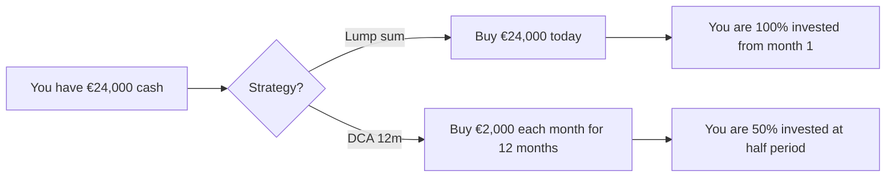
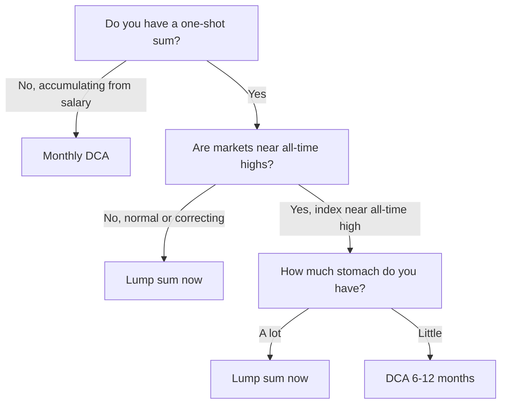
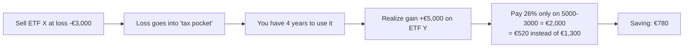

# DCA vs lump sum, rebalancing and tax loss harvesting

You have the money, you have the chosen ETFs, you have the asset allocation. Three operational decisions are missing that weigh more than you think:

1. Do I put everything in **now** (lump sum) or **in installments** (DCA)?
2. When and how do I **rebalance**?
3. Can I use **losses** to pay less tax?

Spoiler: there are evidence-based answers for all three, and they are often counterintuitive.

## 1. DCA vs lump sum: what the evidence says

**Lump sum** (PIC in Italian — *Piano in Capitale*): invest everything now.

**DCA** (Dollar Cost Averaging, PAC in Italian — *Piano di Accumulo del Capitale*): invest in installments, periodically, over a defined period (e.g. 12, 24 or 36 months).

### The Vanguard 2012 study

Vanguard compared lump sum vs DCA (12 months) on three markets (US, UK, Australia) for the period 1926-2011, on decade horizons, with 60/40 stock/bond portfolios.

**Result**: **lump sum beats DCA in ~66% of cases**. On average lump sum produces 2.3% more on the total period. Replicated by Vanguard in 2023 with updated data: 68% lump-sum wins.

Why? Markets go up in the long run. If you put everything in now you're invested for more time. DCA, on average, keeps half the capital in cash that yields little.

| Metric | Lump sum | DCA 12m |
|---|---|---|
| Expected return (historical US 60/40) | 8.2% | 7.5% |
| Volatility of final value | higher | lower |
| Worst-case (1-year max drawdown) | -38% | -22% |
| Direct win over the other | 66% | 34% |

### When DCA really makes sense

Lump sum loses in ~34% of cases. When? When you enter **right before a crash**. Historical examples: enter Feb-2000 (dot-com), Oct-2007 (subprime), Feb-2020 (Covid), Dec-2021 (rate shock).

Also DCA has three advantages that aren't purely about return:

1. **Psychological**: if you enter at 100% and it crashes, you sell at the worst. If you enter at 50% and it crashes, you **buy more** on the dip (real cost averaging).
2. **Behavioral**: forces discipline. Lump sum requires one huge decision once; DCA automates it in 12-24 small steps.
3. **Operational reality**: most people don't have a big lump sum, they have a salary. **For who accumulates from salary, DCA is the only option**, and the lump-sum-vs-DCA debate doesn't even apply.

### Practical decision rule

"Near all-time highs" is a dirty but operational judgment. Shiller CAPE (cyclically-adjusted P/E) >30 on $S\&P$ = expensive market (historical CAPE average 17). Above CAPE 30 it's reasonable to spread. Below CAPE 20, lump sum.

### Math of cost averaging

DCA buys **fewer shares when price is high and more shares when price is low**. The average price paid is therefore the **harmonic mean**, not the arithmetic, and harmonic mean is **always ≤** arithmetic mean (Jensen / AM-HM inequality).

Numerical example: invest €1,000/month for 3 months in an ETF with prices (10, 20, 10).

| Month | Price | Shares bought (€1000 / price) |
|---|---:|---:|
| 1 | 10 | 100 |
| 2 | 20 | 50 |
| 3 | 10 | 100 |
| Total | | 250 shares for €3,000 |

Average price paid = $3000 / 250 = €12$. Arithmetic mean price = $(10+20+10)/3 = €13.33$. Saving: €1.33 per share.

This is the famous "*magic of cost averaging*". It's not really magic: if prices rise monotonically, DCA always loses to lump sum.

## 2. Rebalancing: what it is and why to do it

Asset allocation **moves by itself** over time. If you start 60/40 stocks/bonds and stocks do +30% while bonds +5%, you end up at $\approx 68/32$. Portfolio risk rose without you deciding it.

**Rebalance** = bring weights back to initial target allocation.

### Why rebalance

Three reasons, in order of importance:

1. **Keep target risk.** Main reason. Without rebalance, after 20 years of bull market you might be 90/10 without knowing.
2. **Mean reversion.** Asset classes that have grown a lot tend to yield less in the future. Rebalancing sells "high" and buys "low" automatically.
3. **Rebalancing premium.** Empirical studies (Bouchey-Nemtchinov-Paulsen 2012) find a small *rebalancing bonus* of 0.2-0.5%/year for diversified portfolios with decorrelated asset classes.

### When to rebalance

Two schools:

**Calendar rebalancing**: on fixed dates (every year, every 6 months).

**Threshold rebalancing**: when an asset class exceeds a band (e.g. ±5% relative to target).

Comparison table:

| Method | Pro | Con | Typical frequency |
|---|---|---|---|
| Annual calendar | simple, predictable | sometimes you rebalance when not needed | 1× year (January) |
| Quarterly calendar | reactive | overtrading + costs/tax | 4× year |
| Threshold ±5% | tax-efficient (only when needed) | requires monitoring | varies: 0-3× year |
| Mixed | combo | a bit more complex | 1× year + ±10% threshold |

In Italy with 26% gain tax and stamp duty, **operational optimum is mixed**: annual calendar in January + ±10% threshold for big shocks (e.g. -30% in one year).

### Rebalance example

Target 60/40 on €100,000 portfolio.

| Step | Stocks | Bonds | Tot | Stocks % | Bonds % |
|---|---:|---:|---:|---:|---:|
| Start | 60,000 | 40,000 | 100,000 | 60% | 40% |
| After 1 year (+30% stocks, +2% bonds) | 78,000 | 40,800 | 118,800 | 65.7% | 34.3% |
| Rebalance | -6,720 stocks, +6,720 bonds | | | | |
| After rebalance | 71,280 | 47,520 | 118,800 | 60% | 40% |

The rebalance sold "expensive" stocks and bought "cheap" bonds — exactly what mean reversion suggests.

### Tax-aware rebalancing in Italy

In Italy, selling an ETF at a gain pays 26% on the gain (and you also lose 0.20% stamp duty that will continue to accrue next year). So selling is costly. Two tax-friendly strategies:

1. **Rebalance via new flows.** If you put in €800/month, allocate them according to the current deficit. Example: if you're at 65/35 but want 60/40, put 100% in bonds until you're back on target. Zero sales = zero taxes.
2. **Asymmetric rebalancing (toward UP only).** Sell only when an asset class exceeds **upward** in an extreme way (e.g. >+10% above target). For downward excursions, use only new flows.

### Example: DCA-driven rebalance

You are at 67/33, want 60/40, you have €1,000/month DCA.

Bond deficit: target 40% × 118,800 = €47,520 vs current €39,200 → deficit €8,320.

Pour **100% into AGGH for ~8 months** until bond weight returns to 40%. No sales, no tax, no loss harvest opportunity wasted by fungibility.

## 3. Tax loss harvesting: realizing losses to offset

In Italy the 26% capital gain tax hits **capital gains**, but realized **losses** are **offsettable** within 4 years after the year of realization.

### The 2 big Italian gotchas

**Gotcha 1: ETFs vs other instruments.** In Italy there's a horrible historic distinction between **capital income** (bond coupons, dividends, gains on funds and ETFs) and **other/diverse income** (gains on single stocks, derivatives). Losses go **only** into diverse income.

| Instrument | Gain generates | Loss generates | Offsetability |
|---|---|---|---|
| ETF | capital income | diverse income (loss) | loss offsets only future diverse income |
| Single stock | diverse income | diverse income | full offset |
| Bond | capital income (coupons + gains) | diverse income | bond loss offsets only diverse income |
| Derivative (future, option) | diverse income | diverse income | full offset |

**Practical consequence**: if you sell VWCE at a gain, your loss on another ETF sold in the past **you cannot use**. You can offset losses only with future diverse income (sale of stocks at gain, futures, options).

This is one of the reasons many Italians keep some single stocks in portfolio: to have an instrument that generates diverse income and can offset past losses.

**Gotcha 2: managed vs declarative regime.** On Italian brokers (Fineco, Directa) you're in **managed regime**: the broker calculates everything and keeps the "tax pocket". On foreign brokers (IB, TR, Degiro) you're in **declarative regime**: you must track everything yourself in tax return (RT, RW forms).

### Practical tax loss harvesting

Strategy: in December, see which ETFs are at a loss. Sell them and **buy back an equivalent but not identical one** (to avoid anti-elusion rules).

| ETF sold at loss | ETF bought (equivalent) |
|---|---|
| VWCE (Vanguard FTSE All-World) | iShares MSCI ACWI IE00B6R52259 (SSAC) |
| SWDA (iShares Core MSCI World) | Xtrackers MSCI World IE00BJ0KDQ92 (XDWD) |
| AGGH | Xtrackers Global Aggregate Bond LU0942970103 |

Watch out: it must be a **different** ETF (different ISIN) but with equivalent exposure. In Italy there's no explicit *wash sale rule* like in the US (30 days), but Cassazione jurisprudence 27063/2007 and following have applied the anti-elusion rule when the operation is "purely artificial": buying back the same ETF the same day is risky.

Good practice: wait at least 1 day and change the ISIN. Never change the economic exposure.

### Numerical TLH example

You have two ETFs:

- VWCE bought at €100, today worth €85. Shares: 100. Latent: -€1,500.
- Apple bought at €50, today worth €200. Shares: 50. Latent: +€7,500.

You want to liquidate Apple at year end (e.g. for rebalance).

| Scenario | Operations | Tax |
|---|---|---:|
| A: sell only Apple | gain 7500 | $7500 \times 26\% = €1{,}950$ |
| B: sell Apple + sell VWCE (TLH) + rebuy SSAC | gain 7500, loss 1500 → net 6000 | $6000 \times 26\% = €1{,}560$ |

**TLH saving: €390.** You paid two broker fees (VWCE sale + SSAC purchase) = ~€2 × 2 = €4. Net: €386.

Works because Apple generates diverse income and therefore the ETF loss is offsettable.

## 4. 20-year DCA simulation: €200/month in VWCE

Setup:

- Contribution: €200/month (= €2,400/year).
- ETF: VWCE.
- Expected average return: 7% / year (nominal).
- Monthly compounding rate: $0.07 / 12 \approx 0.5833\%$.
- Horizon: 20 years = 240 months.

Annuity FV formula with periodic contributions:

$$FV = R \cdot \frac{(1+i)^n - 1}{i}$$

where $R = 200$, $i = 0.005833$, $n = 240$.

$$FV = 200 \cdot \frac{(1.005833)^{240} - 1}{0.005833} \approx 200 \cdot \frac{4.039 - 1}{0.005833} \approx 200 \cdot 521 \approx 104{,}180 \, \text{€}$$

Total capital contributed: $200 \times 240 = €48{,}000$. Gross gain: $\approx €56{,}180$.

Final tax (simplified):

| Item | Amount |
|---|---:|
| Gross value | €104,180 |
| 26% tax on gain €56,180 | -€14,607 |
| Cumulative stamp duty (0.20% × ~50k average × 20 years) | -€2,000 |
| Cumulative TER (0.22% × 50k average × 20 years) | -€2,200 |
| **Net value** | **~€85,373** |

In real (deflated at 2%): $\approx €57{,}500$. You put in 48k nominal → 57.5k real. You beat inflation and took home ~20% more purchasing power. Not spectacular, but realistic for €200/month.

To see the "magic" of DCA you need larger amounts and long horizons: same simulation at €500/month for 30 years → $\approx €612{,}000$ gross, $\approx €470{,}000$ net, $\approx €260{,}000$ real.

## 5. Real PAC vs PIC drawdowns: three historical scenarios

Real case studies, computed on MSCI World total return.

| Period | Type | Lump sum 24k initial | DCA 1k/month 24 months | Winner |
|---|---|---|---|---|
| Jan 1995 - Dec 1996 | Bull market | +52% → 36,500 | +18% avg → 28,300 | Lump sum +29% |
| Jan 2000 - Dec 2001 | Dot-com crash | -28% → 17,300 | -8% avg → 22,080 | DCA +28% |
| Jan 2008 - Dec 2009 | Financial crisis | -22% → 18,700 | -1% avg → 23,760 | DCA +27% |
| Jan 2020 - Dec 2021 | Covid + recovery | +35% → 32,400 | +20% avg → 28,800 | Lump sum +12% |

What we see:
- Clear bull market: lump sum wins comfortably.
- Crash + recovery (2000, 2008): DCA reduces pain.
- Short crash followed by V-shape recovery (2020): lump sum wins even there, because who was 100% invested recovered earlier.

Sample statistic: lump sum wins in **2/3 of historical rolling windows**, but in 1/3 of cases loses a lot. You must accept variance.

## 6. Mixed rebalancing: annual operational example

Putting together calendar + threshold + new flows on a €80,000 60/40 portfolio with €500/month DCA.

Initial state year 0: VWCE €48,000 (60%), AGGH €32,000 (40%).

**End of year 1**: VWCE +25%, AGGH -2%. Balances: VWCE €60,000, AGGH €31,360. Total €91,360. Weights: 65.7% / 34.3%. Equity overshoot: +5.7%.

Decision: overshoot >5% → rebalance. Tax-aware: use the €500/month × 12 = €6,000 contributed in year **2** to bring AGGH toward target instead of selling VWCE.

Year 2: DCA 100% in AGGH for the first 5-6 months.

| Month | Contributed | VWCE | AGGH | Equity weight |
|---|---:|---:|---:|---:|
| Start year 2 | | 60,000 | 31,360 | 65.7% |
| Month 1 (+500 AGGH) | 500 | 60,000 | 31,860 | 65.3% |
| Month 3 | 1,500 | 60,000 | 32,860 | 64.6% |
| Month 6 | 3,000 | 60,000 | 34,360 | 63.6% |
| Month 12 | 6,000 | 60,000 | 37,360 | 61.6% |

After 1 year: 61.6% / 38.4%. Almost on target without selling anything and without paying taxes. Residual delta gets closed by differential return (bonds recovering).

## 7. Common operational mistakes

1. **DCA that stops halfway.** DCA works if you don't stop it at the first -20%. Statistically, people who stop it in March 2020 underperformed those who never started.
2. **Monthly rebalancing.** Costs/tax tradeoff vs precision: 1× year is almost always better.
3. **Automatic TLH without thinking of economic wash sale.** Selling VWCE and buying VWCE the next day is tax evasion.
4. **Forgetting the tax pocket in declarative regime.** On IB you must track losses yourself, and losing them after 4 years is waste.
5. **Confusing DCA and dip-buying.** DCA = scheduled plan. Dip-buying = drop below a psychological level and buy more. The second is market timing in disguise.

## 8. Key takeaways

- **Lump sum beats DCA in ~66% of cases.** But DCA reduces regret and works psychologically.
- If you accumulate from salary, the debate doesn't exist: **do DCA**.
- Rebalance **once a year** or when you exceed ±10%, never more often.
- To minimize taxes, **rebalance via new flows** before selling.
- Tax loss harvesting in Italy is limited by the **capital income vs diverse income** distinction: ETF losses don't offset ETF gains.
- Keep 1-2 single stocks or futures to have an instrument that generates offsettable diverse income.

Exercise: simulate €300/month DCA for 25 years and compare to lump sum

Case A: DCA €300/month in VWCE for 25 years (= 300 months). 7% nominal average return.

Case B: you have €90,000 today (= equivalent to total contributed over 25 years), you put it all now in VWCE. Same expected return.

1. Compute the **gross final value** in both cases. (Hint: annuity formula for A, simple compound formula for B.)
2. Compute the **gross gain** in both cases.
3. Apply 26% tax + 0.20% annual stamp duty (simplify with average AUM).
4. Compare the two net values.
5. Discuss: which is "better"? In which macro scenario does DCA win?

Solution B sketch: $FV_B = 90{,}000 \times 1.07^{25} \approx €488{,}000$ gross. DCA: $FV_A = 300 \cdot \frac{1.00583^{300}-1}{0.00583} \approx €245{,}000$. B wins 2× because invested 100% immediately.

Caveat: B requires you to **already have** 90k today. A requires only salary. The question isn't "which makes more money" but "which is available to you".

Recapping the practical: monthly DCA on 2 ETFs, rebalance in January via new flows, TLH in December only if you have diverse income to offset. Nothing else needed for 90% of investors.
