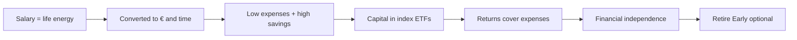
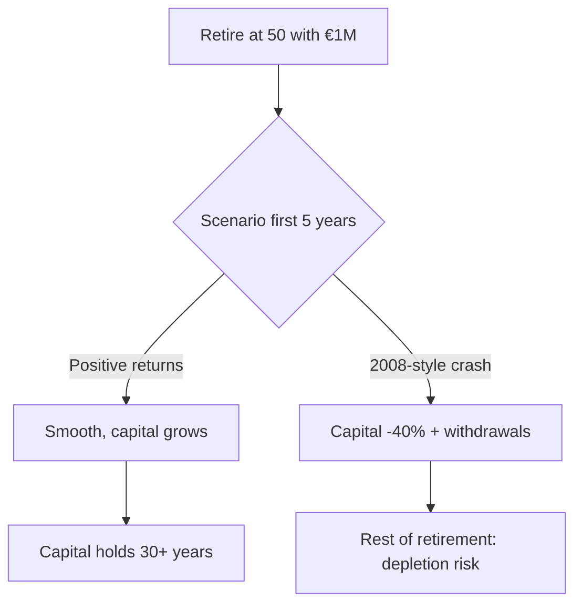
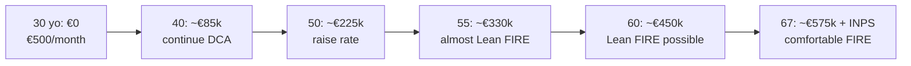

# FIRE, financial independence and longevity planning

FIRE stands for **Financial Independence, Retire Early**. It's a movement born in the US between the 90s and 2010 and today is one of very few truly widespread financial subcultures. Cutting to the bone: **if you accumulate enough capital, its returns can pay your expenses for life, and you no longer need a salary**. In this section we see the math (trivial), the modern criticisms (more important) and Italian adaptation (which changes the cards a lot).

## 1. Origins and philosophy

Three founding figures:

- **Vicki Robin & Joe Dominguez**, *Your Money or Your Life* (1992). Reframe the relationship with money: salary is "life energy" you convert into money. The question is not "how much you earn" but "how many hours of life it costs you".
- **Pete Adeney ("Mr Money Mustache")**, blog since 2011. Retired at 30 with his wife with ~$700k. Advocates aggressive frugal aesthetic: biking, repairing things, avoiding consumerism.
- **JL Collins**, *The Simple Path to Wealth* (2016). Articulates the "stock series" on how to invest in low-cost indices to reach F-You Money.

Subtle point: FIRE isn't "stop working". It's **having the freedom** to do so. Many FIRE continue to work but on chosen projects, freelance, parttime — because they can.

## 2. The math: 25× expenses and the 4% rule

The cornerstone calculation is this:

$$\text{FIRE number} = 25 \times \text{annual expenses}$$

Example: you spend €24,000/year → FIRE number = €600,000. Spend €36,000 → €900,000. Spend €60,000 → €1,500,000.

Where does 25 come from? It's the inverse of the **4% withdrawal rate** of the *Trinity Study* (Cooley, Hubbard, Walz 1998). Trinity University researchers simulated historical retirements 1926-1995, with 50/50 and 75/25 stocks/bonds portfolios, withdrawing 4% of initial capital, **inflation-adjusted** every year. Result: in **95% of cases** capital lasted 30 years or more.

$$\frac{1}{4\%} = 25$$

So 25× annual expenses is the capital that lets you withdraw 4% real for life for 30 years with 95% historical success.

### Full numerical example

Anna spends €30,000/year (rent + food + bills + holidays + everything).

| Item | Value |
|---|---:|
| Annual expenses | €30,000 |
| Classic FIRE number (25×) | €750,000 |
| Year 1 withdrawal at 4% | €30,000 |
| Year 2 withdrawal (2% inflation) | €30,600 |
| Year 10 withdrawal | $30{,}000 \times 1.02^{10} \approx €36{,}570$ |
| Year 30 withdrawal | $30{,}000 \times 1.02^{30} \approx €54{,}340$ |

If the portfolio yields **7% nominal** average and inflation is 2%, **real return** is 5%. Anna withdraws 4%, leaves 1% residual real growth. Works because there's a buffer.

## 3. FIRE variants

FIRE is not monolithic. Common taxonomy:

| Variant | Target expenses | Typical FIRE number | Approach |
|---|---:|---:|---|
| **Lean FIRE** | €18-25k/year | €450-625k | extreme frugal, low-cost life |
| **Regular FIRE** | €30-45k/year | €750k-1.1M | average life, no extras |
| **Fat FIRE** | €70-120k/year | €1.75-3M | comfortable, travel, big home |
| **Coast FIRE** | varies | partial | accumulate early, stop contributing, let compound |
| **Barista FIRE** | varies | half FIRE number | parttime work covers half expenses, capital covers other half |

### Coast FIRE: elegant math

If you have capital $C_0$ today and final FIRE number you need is $C_T$ in $T$ years, you **stop contributing** if:

$$C_0 \times (1+r)^T \geq C_T$$

Example: you're 30, want to stop contributing and reach €1M at 65 (35 years ahead), at 6% real.

$$C_0^{*} = \frac{1{,}000{,}000}{1.06^{35}} \approx €130{,}000$$

If you already have €130k invested at 30, you're in **Coast FIRE**: you can stop putting away, work only for current expenses, and at 65 you'll be at €1M.

### Barista FIRE

If you accumulated half the FIRE number and find a job covering half expenses (e.g. parttime, freelance, pleasant side gig), you're in Barista FIRE. The math: you'll need to accumulate the missing 50% of capital in 0 years because you replace it with partial work income.

Combined with Italian public healthcare and eventual INPS pension, in Italy Barista FIRE is particularly attractive.

## 4. The real lever: savings rate

The thing people don't get about FIRE is this: **what matters is not how much you earn in absolute, but what % you save**.

Let's see why. If you save $s$% of net and invest at $r$% real, years to reach FIRE depend **only** on $s$ and $r$, not on how much you earn.

Formula (Mr Money Mustache "shockingly simple math"):

$$T = \frac{\ln\left(\frac{1 - \frac{r}{4\%} \cdot s}{1 - s} \cdot \frac{4\%}{r \cdot (1-s)} + \text{stuff}\right)}{\ln(1+r)}$$

Ok, the formula is ugly. Important is the table:

| Savings rate | Years to FIRE (at 5% real) |
|---:|---:|
| 10% | ~51 |
| 20% | ~37 |
| 30% | ~28 |
| 40% | ~22 |
| 50% | ~17 |
| 60% | ~12.5 |
| 70% | ~8.5 |
| 80% | ~5.5 |
| 90% | ~3 |

**Mind blow**: saving 50% of net means being financially free in ~17 years. Saving 10% means ~51 years — effectively the traditional pension.

### Comparative example

- **Mario**: net salary €1,800/month (€21,600/year), spends €1,080 (60%), saves €720 (40%). Savings rate = 40%. Years to FIRE: **22**. FIRE number: $25 \times 12{,}960 = €324{,}000$.
- **Luca**: net salary €3,500/month (€42,000/year), spends €2,800 (66%), saves €1,200 (34%). Savings rate = 34%. Years to FIRE: **~25**. FIRE number: $25 \times 33{,}600 = €840{,}000$.

Luca earns double but reaches FIRE **after** Mario, because his lifestyle scaled with income (*lifestyle inflation*).

## 5. Trinity Study and modern criticism

The 4% rule has been heavily attacked in the last 10 years. Three fronts.

### Critique 1: Bengen 2020 — can be 4.7-5%

William Bengen, the researcher who first proposed 4% in 1994, revised upward in 2020. With more diversified portfolios (small cap, mid cap, value, beyond S&P) and backtests including post-2008, he finds **5%** is sustainable for 30 years with high probability.

### Critique 2: Pfau — today maybe 3-3.5% for higher longevity + low expected returns

Wade Pfau (Retirement Researcher) says the opposite of Bengen. His thesis:

1. **Higher life expectancy**. A healthy 60yo today has 50% probability of exceeding 90. Retirement 30+ years, not 30.
2. **Low expected returns**. Real bonds ~0%, stocks from elevated CAPE → expecting 5% real is optimistic.
3. **Sequence risk**. See below.

Pfau recommends 3-3.5% for early retirements (FIRE).

| Withdrawal rate | Trinity 1998 | Bengen 2020 | Pfau modern |
|---:|---|---|---|
| 3% | 99% success | 99% | ~95% success |
| 3.5% | 98% | 98% | ~90% |
| 4% | 95% | 97% | ~80% |
| 5% | 84% | 90% | ~60% |
| 6% | 70% | 75% | ~40% |

### Critique 3: Sequence of returns risk

The **main risk of FIRE** is not average return: it's the **sequence**.

If in the first 5 years of retirement the market crashes, you withdraw from an already small portfolio and destroy it. Even if the 30-year average is 7%, if the first 5 are -10%, -15%, +5%, -20%, +5%, you lost too much capital to recover.

Drastic example:

| Year | Return | Start balance | Withdrawal (40k) | End balance |
|---|---:|---:|---:|---:|
| Scenario A (good) | | | | |
| 1 | +20% | 1,000,000 | 40,000 | 1,152,000 |
| 2 | +15% | 1,152,000 | 41,000 | 1,275,650 |
| 3 | +10% | 1,275,650 | 42,000 | 1,357,025 |
| Scenario B (bad) | | | | |
| 1 | -20% | 1,000,000 | 40,000 | 768,000 |
| 2 | -10% | 768,000 | 41,000 | 654,300 |
| 3 | -5% | 654,300 | 42,000 | 581,485 |

Same 30-year average return, but B starts at €581k. Recovering to €1M would need a spectacular sequence.

### Sequence risk mitigations

1. **Bucket strategy**. Keep 3-5 years of expenses in cash + short bonds. In a crash, withdraw from safe bucket, don't sell stocks at loss. The bucket replenishes in good years.
2. **Rising equity glide path** (Pfau-Kitces). Start retirement with low % equity (40-50%), ride up over time (to 70% at 75). Counterintuitive but scientifically solid.
3. **Variable withdrawal**. Withdraw 3% in crash years, 5% in boom years. Dynamic module (e.g. Guyton-Klinger rules).
4. **Safety buffer**. FIRE number 30× instead of 25×. Drastically reduces sequence risk at cost of 5 extra years of accumulation.

## 6. FIRE in Italy: specifics

FIRE was designed for the US context. In Italy three things change the analysis.

### 6.1 Public healthcare (huge advantage)

In the US, private health insurance costs a family $18-24k/year and mandatory insurance above Medicare kicks in at 65. **American FIRE must cover 15-20 years of private health insurance**.

In Italy SSN covers everything (more or less). No need to overestimate FIRE number for healthcare. Typically €1,500-3,000/year for optional private supplementary suffices.

### 6.2 INPS pension as "second cushion"

At 67 (today) or 70+ (future revisions) the INPS pension kicks in. Even if you have few contributions, you have **at least the social allowance** (~€503/month in 2025). With 20-30 years of contributions you'll have €800-1500/month INPS pension.

Implication: your FIRE capital must cover **only the gap between now and 67**, not for life.

Example: you're 45 and want to stop at 50.

- Expenses €30k/year.
- From 50 to 67 = 17 years where capital must cover everything.
- From 67 onward, INPS covers €18k/year → gap of €12k/year.

Required capital:

- Phase 1 (50-67): 17 years × 30k = €510k nominal (plus inflation/return adjustment). With conservative withdrawal and 4% real portfolio, $\approx €400k$ in present value.
- Phase 2 (67+): $25 \times 12k = €300k$.

**Total: ~€700k** instead of €750k of full 25×. INPS pension cuts FIRE number by 10-20%.

### 6.3 Tax on withdrawals

Italy doesn't have a tax-deferred IRA / 401(k) like the US. Your ETFs sit in a "normal" securities account: gains are taxed 26% at sale. Good news: if you withdraw little, you pay little.

Example: you have €800k in ETFs, cost basis = €400k, latent gain = €400k. You withdraw €32k (4%): if pro-quota withdrawal, $\frac{400}{800} = 50\%$ of withdrawal is gain → $16k \times 26\% = €4{,}160$ tax. Effective rate ~13%.

In the US a traditional 401(k) taxes everything on withdrawal (even initial capital). So in some way Italy is more favorable here.

### 6.4 Pension funds and PIP

To consider: pension funds (negotiated or open) and PIP (Individual Pension Plans) are **deductible from income up to €5,164.57/year**. For an Italian FIRE, this is tax efficiency to exploit at least up to the 35% marginal rate.

Trade-off: money in the pension fund is **locked** until retirement (67 with 5 years of contributions). Max 50% withdrawable as capital at retirement; the rest is annuity.

## 7. Decumulation: the hardest phase

Accumulating is easy. Decumulating is **psychologically brutal**. You built €800k in 25 years and now you have to watch it go down every month for years. Few are ready.

Three practical points:

1. **Spend what you planned.** Many FIRE accumulate too much, then can't spend ("one more year syndrome"). Cut it: spend what you promised yourself.
2. **Diversify sources.** A mix of ETF withdrawals + BTP coupons + possible rental income + future INPS pension is psychologically more tolerable than "I withdraw 4% from a single pot".
3. **Adjust dynamically.** If year X portfolio is -20%, withdraw 3% instead of 4%. Cut holidays and restaurants, don't cut rent and food.

## 8. Integrated example: FIRE path of a 30-year-old Italian

Profile: 30 years, net salary €1,500/month (€18k/year), saves €500/month (33% rate).

Math: DCA €500/month, 6% real.

$$FV_{30 \text{ years}} = 500 \cdot 12 \cdot \frac{1.06^{30} - 1}{0.06} \approx €474{,}000 \text{ real}$$

(annuity formula with annual contributions, €6,000/year for 30 years at 6%).

At 60 Marco has €474k real. If he spends €18k/year = Lean FIRE number €450k. **Marco can stop at 60**.

If he spends €25k/year = FIRE number €625k. He should work until 64-65 or raise savings rate in coming years.

What changes if Marco gets a promotion at 35 and reaches €700/month savings?

$$FV = 700 \cdot 12 \cdot \frac{1.06^{30} - 1}{0.06} \approx €663{,}000$$

Lean FIRE at 55. 5 years earlier. Savings rate is the main multiplier.

## 9. Critiques of the FIRE movement

It's not a religion. Some legitimate critiques:

1. **Extreme frugality can ruin your 30s**. Living at €800/month at 28 to retire at 38 is a tradeoff of 10 years of "good" life. Not for everyone.
2. **Identity collapse**. Many FIRE report identity crisis after retirement. Work is also social identity, structure, relationships. Quitting is hard.
3. **Real sequence risk**. See above: who went FIRE in 1999 lived 2 crashes + 1 inflation 2022 in 25 years. Success not guaranteed.
4. **Assumes stable tax regime**. In 30 years Italian taxes will be the same? Unlikely. Possible wealth taxes, inheritance taxes, etc.
5. **"Retire to what?"** Without a post-FIRE project (passion, volunteering, intense hobby) early retirement becomes anesthesia.

## 10. Key takeaways

- **FIRE number = 25× annual expenses.** Below this you're not FIRE.
- The **4% rule** is probably too optimistic in modern regime: aim for **3.5%** or 30× buffer for early FIRE.
- The **savings rate** is the main lever. 50% saving → 17 years to FIRE.
- **Sequence risk** is the real enemy: mitigate with bucket strategy, glide path, variable withdrawals.
- In Italy: public healthcare + future INPS pension **reduce** FIRE number vs US.
- Consider **pension funds** for deductibility (max €5,164.57/year).
- Decumulation > accumulation in psychological difficulty. Plan that too.

Exercise: compute YOUR FIRE number and years remaining

Step 1. **Actual annual expenses**. Open the last 12 months of bank statements. Sum everything (rent, food, bills, subscriptions, holidays, taxes not from salary, gifts). Honest: no "actually I'd spend less".

Step 2. **Base FIRE number**:

$$F = 25 \times \text{annual expenses}$$

Step 3. **Italian adaptation** (if you have 20+ years of future INPS contributions):

$$F_{IT} = 17 \times \text{annual expenses} + 8 \times \max(0, \text{expenses} - \text{expected INPS pension})$$

Estimate INPS pension from your contribution statement (on INPS website).

Step 4. **Current savings rate**:

$$s = \frac{\text{saved/year}}{\text{net/year}}$$

Step 5. **Years to FIRE** (at 5% real): look up $s$ in the table in §4.

Step 6. **Verify**: simulate with formula

$$F = R \cdot \frac{(1+r)^T - 1}{r}$$

where $R$ is annual savings, $r = 5\%$, $T$ estimated years. If the value comes out close to your target $F$, you're on the right trajectory.

Step 7. **Stress test**: recompute with $r = 3\%$ (pessimistic scenario). How many extra years? It's a risk budget telling you how much time cushion you have.

Worked example: expenses €30k, savings rate 30%, $F = €750k$. Table → 28 years at 5%. If you're 32 now, FIRE at 60. Stress test at 3% → 34 years → FIRE at 66 (= INPS pension, effectively no more Early Retirement).

If you got this far, the most important thing you take home is: **FIRE is not a number, it's permission**. Permission to stop when you want. Even if you never stop, knowing you could changes your relationship with work forever.
