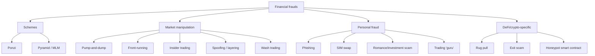
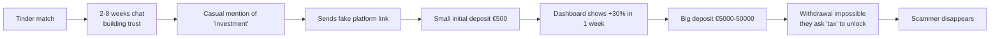
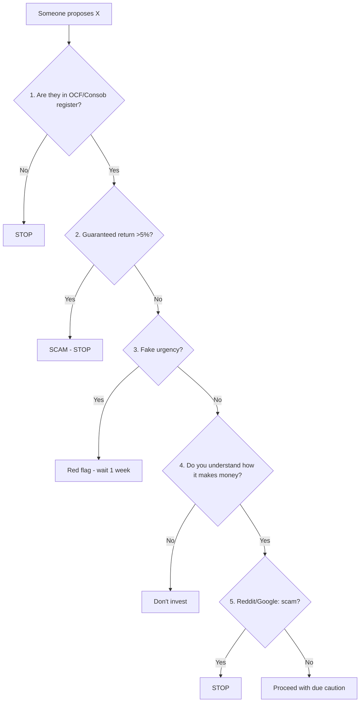

# Frauds, scams, common mistakes: how not to lose everything

This is the most important section you'll read on the entire site. All the others — diversification, asset allocation, FIRE — tell you **how to grow**. This one tells you **how not to zero yourself out**. And zeroing out is much easier than you think: an Instagram with the right photo, an urgent phone call, or even just "my cousin's advisor is amazing".

Let me tell you straight, with the bluntness you deserve: **if someone promises you guaranteed returns above 5% annual, they are scamming you**. Period. No footnotes, no exceptions, no "but this is different". Scam. Save this sentence, put it on the fridge, reread it before signing anything.

In this section: scam taxonomy (who the predators are), anti-fraud rules (how to spot them), self-inflicted mistakes (the most expensive: these aren't scams, you shoot yourself in the foot), and an operational checklist.

## 1. Scam taxonomy: the great classics

### 1.1 Ponzi (the classic of classics)

Scheme where "returns" paid to old investors come from new investors' deposits, not real investments. Works as long as new money comes in. When it slows, collapses.

| Historical case | Year | Victims | Amount |
|---|---|---|---:|
| Charles Ponzi (the eponym) | 1920 | 40,000 | $20M (= ~$280M today) |
| Bernie Madoff | exposed 2008 | 37,000 | $50-65 billion |
| Allen Stanford | exposed 2009 | 30,000 | $7 billion |
| BitConnect | 2018 | ~1.5M | $2.4 billion crypto |
| FTX (partially) | 2022 | ~millions | $8 billion missing |

**Signals**: "consistent" returns (e.g. 1% per month fixed), unexplainable or "proprietary" strategy, withdrawal difficulties, pressure to reinvest, unaudited accounting.

### 1.2 Pyramid / Multi-level marketing (MLM)

Ponzi variant: instead of promising returns, they pay you to **recruit** other participants. The real product (cosmetics, supplements, "trading courses") is a facade; the real business is recruitment.

In Italy many forex scams of the 2010s were MLM-disguised (Liberalbank, OneCoin in some national articulations).

**Key difference from a legitimate sales network**: in scam MLM, most earnings come from recruitment, not from selling the product to external end customers.

### 1.3 Pump-and-dump

A group (Telegram chat, Reddit, Discord) coordinates buying a low-liquidity stock (penny stock) or cryptocurrency. The price shoots up from artificial demand. People outside the group "see the trend" and buy (FOMO). The original group **sells to these victims** and the price collapses.

Modern crypto variant: "shitcoin season". Tokens with microscopic market cap making +1000% in 2 days and -95% in 1 week.

| Known case | Year | Instrument |
|---|---|---|
| Wolf of Wall Street (Belfort) | 90s | penny stocks pump-and-dump |
| GameStop short squeeze | 2021 | meta-pump (organic then pumped) |
| Squid Game token | 2021 | rug pull pump-and-dump style |
| Numerous Solana memecoins | 2024-25 | pump-and-dump 24h |

### 1.4 Front-running and insider trading

**Front-running**: a broker or trader knows of an incoming large order, buys first, then resells on the large order (illegal).

**Insider trading**: trading on non-public material information. Famous Italian case: Fiat-Chrysler 2014, Parmalat 2003 saw insiders selling while retail bought.

For retail: not a typical "against you" scam but a systemic injustice. Reduce exposure with ETFs (impossible to insider-trade the whole index).

### 1.5 Spoofing, layering, wash trading

Order book manipulations:

- **Spoofing**: place large orders you don't intend to execute, to fool others on sentiment, then cancel before execution.
- **Layering**: spoofing on multiple levels.
- **Wash trading**: buy and sell to yourself (or between colluding accounts) to inflate volume. Endemic in unregulated crypto markets: Bitwise in 2019 estimated 95% of BTC volume was wash trading.

### 1.6 Crypto/DeFi-specific scams

The Wild West.

- **Rug pull**: developers of a new token with liquidity provided on a DEX (e.g. Uniswap) suddenly withdraw all liquidity, leaving investors' tokens with no buyer. Typical in "altcoin season".
- **Exit scam**: the exchange or project disappears with users' funds. Known cases: QuadrigaCX 2019 (CA$190M), Mt. Gox 2014 ($450M), Cryptopia 2019 ($16M).
- **Honeypot smart contract**: contract that lets you buy but blocks selling.
- **Approve-drain**: phishing on Etherscan that gets you to sign an unlimited approve. The scammer drains your wallet.
- **Fake airdrop / fake support**: fake Twitter/Discord accounts impersonating official support.

### 1.7 Phishing and SIM swap

Classic financial phishing: email/SMS imitating your bank, asking you to confirm credentials on a fake page. Italy is particularly targeted: Intesa, Unicredit, Posteitaliane clients.

**SIM swap** (more sophisticated): the scammer convinces the phone operator to transfer your number to a new SIM (with fake documents or insider help). Receives 2FA SMS, steals account and ETFs.

Defenses:

| Threat | Defense |
|---|---|
| Phishing email | Don't click links, always access by typing the URL |
| Phishing SMS | Bank never sends links via SMS, ignore |
| SIM swap | 2FA via authenticator app (Google Authenticator, Authy) NOT via SMS |
| Identity theft | PEC + SPID + CRIF monitoring |
| Crypto wallet | Hardware wallet (Ledger, Trezor) for >€5k |

### 1.8 Romance scam → investment scam

Increasingly common. The scammer builds an online relationship (Tinder, Instagram, LinkedIn) for weeks or months. Once trust is established, proposes an "exclusive investment" (forex, crypto, gold) via platform that is actually theirs. Victims see fake "gains" on the dashboard. When trying to withdraw, find they can't.

Italian Postal Police 2023 report: in Italy €115 million stolen via romance scam, +30% vs 2022. Victim age: predominantly 50-70, but rising under 35 with "crypto romance" scams.

### 1.9 Trading "gurus" on Instagram/TikTok

Standard scam guru stack:

1. **Photos on Ferrari/yacht** (rented or not even his).
2. **"Winning" screenshots** easily faked.
3. **Account with 100k+ followers** (bought for €30).
4. **Tearjerker story** ("I was broke at 22, then I discovered this method").
5. **Promise of "financial freedom at 30"**.
6. **Sales**:
   - Online course €500-3000.
   - Trading signals via Telegram €100-300/month.
   - Copy trading via affiliated platform (referral fees).
   - 1-on-1 coaching €5000-20000.

The guru **doesn't make money trading**. He makes money selling you trading courses. The difference is huge.

**Definitive test**: ask for his audited last-5-years statements (broker statements signed and certified). If he doesn't provide them, he's a dream seller.

## 2. Anti-fraud rules: the 6 commandments

Print this list. Keep it on the desk.

### Rule 1: Verify the register

Before handing over a euro to anyone who'll "advise you on investments", verify they're registered with the competent register.

| Country | Register | URL |
|---|---|---|
| Italy | OCF Register (Authorized Financial Advisors) | albooocf.it |
| Italy | CONSOB Intermediaries Register | consob.it |
| UK | FCA Register | register.fca.org.uk |
| USA | FINRA BrokerCheck | brokercheck.finra.org |
| USA | SEC Investment Adviser Public Disclosure | adviserinfo.sec.gov |
| Germany | BaFin Unternehmensdatenbank | bafin.de |
| Global | IOSCO Investor Alerts Portal | iosco.org |

If they're in **no** register, **stop**. It's not a gray zone to understand, it's a red zone.

### Rule 2: Distrust "guaranteed returns"

There are no **guaranteed returns** above the yield of a government bond of the same maturity in that currency.

In May 2026, in Europe, Italian 10y BTPs yield ~3.5%. German Bunds 2.2%. 12-month fixed deposits 2.5-3%. Anything above 4% **has risk**, explicit or hidden.

If someone tells you "8% guaranteed", one of two:
1. Lies about guaranteed (and you'll lose the money).
2. Lies about risk (and you'll lose the money).

Either way: you lose the money.

### Rule 3: No fake urgency

"You must decide today, the offer ends tonight." "Only for the first 10 customers." "Before the rate hike announced tomorrow."

All these phrases are **red flags**. A legitimate investment doesn't expire. A legitimate advisor tells you "take a week, read the contract, talk to your wife". A scammer needs you not to think.

### Rule 4: No leverage you don't understand

Forex, CFDs, options with 30x leverage, crypto futures with 100x. If you don't know what a *margin call* and *liquidation* are, **don't touch leverage**.

ESMA official stat: **74-89% of retail CFD traders lose money**. Banks sponsor YouTube/Instagram ads because they know retail will mostly lose. It's one-way.

### Rule 5: Due diligence

For every "opportunity" (company, fund, crypto, product):

1. Google: "[product name] scam" or "[product name] truffa".
2. Reddit: "[product name] review".
3. Consob site (section "Esposti e segnalazioni").
4. Domain whois: registered 2 months ago? Red flag.
5. Company address: is there really an office? On Maps?
6. VAT/CF number: valid on VIES (vies.europa.eu)?

10 minutes of Google save thousands of euros.

### Rule 6: If you can't explain it, don't invest

Buffett rule: invest only in things you understand. If the advisor explains a product and you end up more confused than before, **don't buy it**. Confusion = vulnerability. A good product is explainable in 5 simple sentences. A bad product requires admiration + glossaries.

## 3. Self-inflicted mistakes (more expensive than scams)

Scams steal 1-2% of retail. Self-inflicted mistakes steal **15-25%** of expected return. Let's see the most expensive.

### 3.1 Home bias

You invest 60-70% of the portfolio in Italian stocks/bonds because "you know them". Italy is 0.8% of the global stock market. Investing 70% in Italy is a massive non-diversified bet.

Historical cost: ~2% annual vs an equal-weighted global portfolio. Over 30 years = -40% on final value.

### 3.2 Overtrading

Statistically, retail that does more than 10 trades per month **underperforms by 5-7% annually** vs buy-and-hold (Barber-Odean 2000 study, replicated dozens of times).

Every trade = fee + spread + 26% capital gain tax + time lost. It's a hemorrhage.

### 3.3 Market timing

Trying to sell before crashes and buy back at lows. **Doesn't work**, and there are 100 years of evidence.

J.P. Morgan study: who was invested in $S\&P 500$ from 2003 to 2022 made +9.8%/year. Whoever missed the **10 best days** made +5.6%. Missed the 20 best, +2.5%. Missed the 30, +0.2%.

The "10 best days" are often **immediately after crashes**. Sell in March 2020, miss +25% in May 2020.

### 3.4 FOMO (Fear Of Missing Out)

You buy Bitcoin at $60k in November 2021 because "it's going up". You see it crash to $16k in November 2022. You sell at the worst. You see it return to $100k in 2025.

FOMO is buying at the peak. Capitulation is selling at the bottom. Together they destroy retail return.

### 3.5 Emotional leverage

You buy leveraged ETFs (3x S&P, 3x Nasdaq) "since it's going up anyway". Volatility decay (*volatility drag*): in flat markets, the 3x ETF loses value even if the index is still. Example TQQQ: in 2022 made -79% vs -33% of underlying QQQ.

### 3.6 Mixing insurance and investment

The **unit-linked**, the "**revalued**" life policies, the **insurance separated accounts** are 95% of the time very expensive products. Typically:

| Item | Annual cost |
|---|---:|
| Management fees | 1.5-2.5% |
| Initial load | 2-5% one-off |
| Performance fees | 15-20% above benchmark |
| TER of underlying funds | 0.5-1.5% |
| **Annual total** | **3-5%** |

Over 30 years at 6% gross: $1.06^{30} = 5.74$. With 4% annual costs: $1.02^{30} = 1.81$. **Final value difference: ~3.2×.**

### 3.7 Not reading the KID/KIID

The **Key Information Document** (KID for PRIIPs, KIID for UCITS funds) is mandatory by law for any product sold in the EU. Shows:

- Product type
- Risk (scale 1-7)
- Total costs
- Expected performance in 4 scenarios (stress, unfavorable, moderate, favorable)
- Recommended holding period

Reading it takes 5 minutes. Not reading = buying blindly.

### 3.8 Active funds "because the branch manager is great"

The branch manager is a **salesperson**, not an advisor. They have sales targets for specific house products. The "flexible fund" they propose has 2.5%/year TER and in 80% of cases underperforms the benchmark net of costs (SPIVA report 2024, valid for all major markets).

Over a 20-year horizon: average Italian active fund vs ETF VWCE → **VWCE wins in 92% of cases**.

### 3.9 Leaving TFR in the company without evaluating pension fund

TFR yields **1.5% + 75% inflation** (Italian law). In low inflation it yields ~2-2.5%. A well-managed negotiated pension fund (e.g. Fondo Cometa, Fonchim) yields 4-5% net of fees. The difference over a 30-year career is huge.

Exception: if you're near retirement (<5 years) and don't want risk, leave in TFR.

### 3.10 Confusing "advice" with "sales"

In Italy two main figures exist:

| Figure | How paid | Conflict of interest |
|---|---|---|
| **Authorized financial advisor (ex promoter)** | percentages from commissions of products sold | yes, maximum |
| **Independent / fee-only advisor** | hourly/fixed fee from client | none |

The "free" advisor of your bank **is not free**. They are paid by the products they push on you. The fee-only advisor costs €1500-3000/year but is on your side.

## 4. Italian numbers on scams

Data 2023 (Postal Police + Consob report):

| Category | Cases | Stolen amount |
|---|---:|---:|
| Total financial online scams | ~70,000 | €455 million |
| Romance + investment scam | ~10,000 | €115 million |
| Scammy online trading (unauthorized brokers) | ~25,000 | €180 million |
| Banking phishing | ~30,000 | €120 million |
| Crypto scams | ~5,000 | €40 million |

The **Italian retail investor** loses, on average, €6,500 when falling for an online financial scam. The 50-70 band is the most affected by average amount; the 18-35 band by number of cases (crypto + trading bots).

Consob updates monthly a **list of unauthorized sites**: https://www.consob.it (search "operatori abusivi"). To consult before depositing any amount on an unknown broker.

## 5. Top 10 mistakes I've seen in colleagues and family

Personal list, anonymized:

1. **Uncle "I only invest in Eni stock because I worked there"**. Concentration + home + employer bias.
2. **Colleague "My brother-in-law sells great policies"**. Paid 4% load + 2% management. -50% vs an ETF over 20 years.
3. **Friend "I was called by 'Milan Stock Exchange' offering an exclusive IPO"**. Pure scam, money gone.
4. **Cousin "I do forex with copy trading, it's automatic"**. -€8,000 in 6 months.
5. **Neighbor "Bitcoin at 60k is the future"**. Bought at 60, sold at 22.
6. **Acquaintance "Crypto trading with 50x leverage on meme coins"**. Liquidated 3 times in 2024.
7. **Friend's dad "I gave 30k to the advisor, he put me in 12 different funds"**. Diworsification + fees.
8. **55yo colleague "I only invest in BTPs because they're safe"**. Safe against nominality, lost against 8% 2022 inflation.
9. **Friend couple "We buy a house with 100% mortgage as investment"**. Bad stress test, problems after a month of late rent.
10. **Family member "I gave €25k to a friend who 'knows how to invest'"**. Friendship + money gone. Never friend again.

Each of these is **self-inflicted** to some extent. There weren't sophisticated international scammers. Just decisions made without the 6-rule list.

## 6. 15-point checklist before signing anything

Print, fill in, archive. If you answer "no" or "I don't know" to more than 2 items, don't sign.

| # | Question | Answer |
|---:|---|---|
| 1 | Is the product/intermediary in an official register (OCF, Consob, FCA, FINRA)? | ☐ |
| 2 | Have I read the complete KID/KIID? | ☐ |
| 3 | Do I know the TER and all cumulative recurring costs? | ☐ |
| 4 | Do I know entry and exit fees? | ☐ |
| 5 | Do I understand the strategy in 3 sentences without glossary? | ☐ |
| 6 | Is the promised return ≤5% and marked "not guaranteed"? | ☐ |
| 7 | Does the product have 5+ years of publicly audited track record? | ☐ |
| 8 | Can I exit within 30 days without exaggerated penalties? | ☐ |
| 9 | Did the proposal come from me (searching) or was pushed to me? | ☐ |
| 10 | Have I searched "[name] scam" on Google and Reddit? | ☐ |
| 11 | Is the risk (1-7 KID) consistent with my profile? | ☐ |
| 12 | Am I investing money I do NOT need in the next 5 years? | ☐ |
| 13 | Have I waited at least 7 days from first contact? | ☐ |
| 14 | Has a trusted person (not seller) seen the documents? | ☐ |
| 15 | If I lose everything tomorrow, do I financially survive? | ☐ |

## 7. What to do if you've already been scammed

It's not always too late.

1. **Immediate report** to Postal Police: commissariatodips.it. Online or in person.
2. **Block cards/transfers**: call the bank **before** anything else. Reverse transfer within 24-48h can work.
3. **Consob report**: if the broker is unauthorized, they add it to the list.
4. **Formal warning via PEC** to the intermediary, even if you suspect scam.
5. **Lawyer specialized in banking/financial law**: for amounts >€10k.
6. **Recovery scam**: WARNING — there are fake "recoverers" who call you post-scam promising to recover your money for an upfront fee. It's a second scam. Postal Police never asks for payments.

## 8. Key takeaways

- **"Guaranteed" returns above 5% = scam**. No exceptions.
- **Always verify the register** (OCF, Consob, FCA, FINRA) before handing over a euro.
- The most profitable scams (for scammers) are **slow**: romance scam, MLM, expensive policies.
- **Self-inflicted** mistakes (overtrading, market timing, home bias, active funds) cost more than scams.
- Distinguish **fee-only advisor** from **branch salesperson**: the first is on your side, the second on the house products.
- **15-point checklist** before signing anything.
- If you've been scammed: **report immediately**, bank first, Postal Police next. No "recoverers".

Exercise: dismantle 3 scams (and 3 non-scams) using the 6 rules

For each of the 6 situations, apply the 6 anti-fraud rules (register, return, urgency, leverage, due diligence, comprehensibility) and classify as **scam**, **terrible but legal product**, or **legitimate product**. Motivate each answer.

**Case 1.** "Invest in OilTrade24, forex broker headquartered in Saint Vincent. Leverage 1:400, returns 5-15% per month guaranteed by our expert traders. Only 10 spots available this week."

**Case 2.** "Allianz Vita Multilink unit-linked policy, 20-year duration, 80% stocks / 20% bonds exposure, underlying fund TER 2.1%, initial load 3%, possibility to switch between compartments. Allianz advisor registered in OCF, KID provided."

**Case 3.** "My cousin has a proprietary crypto trading method. Made +400% in the last 2 years. He asks me €10,000 to manage as if his own, he takes only 20% of gains."

**Case 4.** "ETF VWCE on Borsa Italiana, ISIN IE00BK5BQT80, TER 0.22%, issuer Vanguard Ireland regulated by CBI. Purchase via Fineco managed regime."

**Case 5.** "BTP Italia 10-year issued today by the Treasury at 4% nominal, semi-annual coupon, maturity 2036. Subscription via home banking."

**Case 6.** "Online course 'Become a winning trader in 30 days' by a guru with 250k Instagram followers. Price €2497, 50% discount if you buy within 24 hours. 'Satisfied or refunded' guarantee."

Expected solution:

- 1: **scam** (Saint Vincent HQ = unregulated paradise, guaranteed returns impossible, fake urgency, leverage incomprehensible, certainly not OCF).
- 2: **terrible but legal product** (register ✓, but 3-4%/year total cost → -30% expected value over 20 years vs ETF).
- 3: **scam or close** (no register, no audited track record, informal structure, zero comprehensibility — even if it's truly your cousin, it's a terrible idea).
- 4: **legitimate** (register ✓, minimal costs, comprehensible, rational choice).
- 5: **legitimate** (Italian Treasury = maximum issuer, reasonable return, no urgency).
- 6: **terrible product, possible commercial fraud** (fake urgency, no register, no track record, apparent but false comprehensibility).

Bonus: for case 2, compute the 20-year expected value of €50,000 paid into the policy (6% market average return - 4% costs = 2% net) vs the same amount in VWCE (6% - 0.4% = 5.6% net). Difference: $50{,}000 \times 1.02^{20} = €74{,}300$ vs $50{,}000 \times 1.056^{20} = €148{,}700$. The policy costs you **€74,400** vs the ETF.

Recap: you don't need to be brilliant to avoid losing everything. 6 rules, 15 checklist points, and the patience to wait 7 days before signing anything. Patience is the rarest financial quality, and the most protective.

If you've read this far, you've already protected yourself from 90% of risks you'll encounter. The remaining 10% only requires the humility to **ask someone outside the sale** before signing. Your brother-in-law who sells policies doesn't count, but a fee-only advisor does.

And remember: what will really make you lose money won't be a Madoff. It'll be you yourself, in a moment of FOMO, panic, or "misdirected friendship". The 6 rules are there for those moments.
