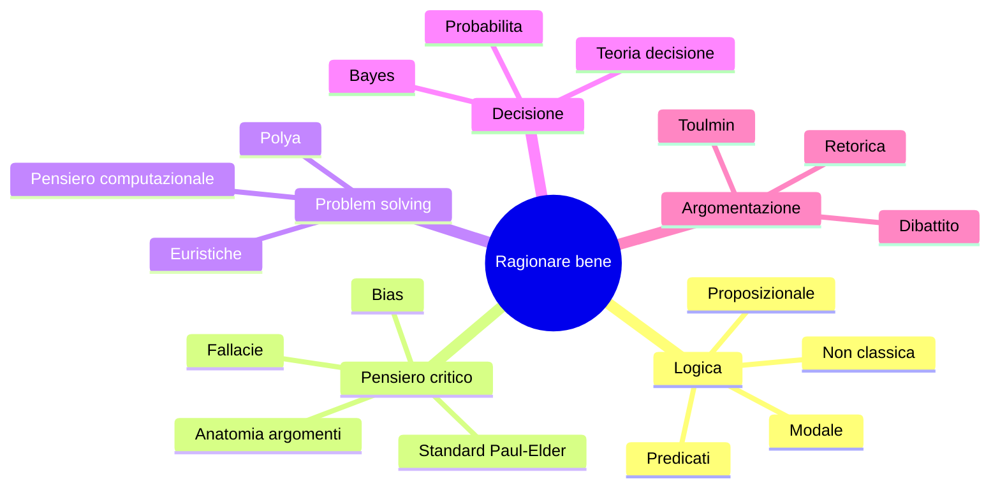

# Cos'è la logica e il pensiero critico

Hai cliccato su questo sito perché sospetti che "ragionare bene" sia una skill come scrivere codice o suonare il piano: si studia, si esercita, si misura. Sospetto giusto. Logica, pensiero critico e problem solving sono tre discipline distinte ma intrecciate, con duemilacinquecento anni di storia e una bibliografia che va da Aristotele a Daniel Kahneman. Questo corso le tratta come si tratterebbe un curriculum di matematica: definizioni, teoremi, esercizi, riferimenti accademici. Niente discorsi motivazionali, niente "pensa fuori dagli schemi". Strumenti veri.

Il punto di partenza è capire che cosa c'è effettivamente sul tavolo. Quando un giornalista dice "questo ragionamento non sta in piedi" e quando un matematico dice "questa dimostrazione è invalida" stanno usando criteri diversi, ma cugini. Mappare quei criteri è il primo lavoro.

## 1. Tre discipline, una famiglia

Dare definizioni operative — non solo evocative — è il primo gesto rigoroso.

- **Logica**: studio formale delle relazioni di conseguenza fra enunciati. Risponde alla domanda *"se assumo queste premesse, cosa segue necessariamente?"*. Non si occupa di verità empirica, ma di **forma** dell'inferenza. È la sorella matematica della famiglia: opera su simboli, regole, tabelle.
- **Pensiero critico** (*critical thinking*): pratica disciplinata di valutare informazione, argomenti e credenze. Risponde a *"questa conclusione è ben supportata? a quali condizioni dovrei cambiare idea?"*. È la sorella riflessiva: si occupa di forma **e** contenuto, contesto, fonte, bias.
- **Problem solving**: insieme di euristiche e metodi per passare da uno stato iniziale a uno stato obiettivo, soprattutto in domini mal definiti. Risponde a *"come affronto questo?"*. È la sorella ingegnera: produttiva, sporca, pragmatica.

Le tre si sovrappongono ma non coincidono. Un matematico può essere logicamente impeccabile e credere ai cerchi nel grano: gli mancherebbero le abitudini di pensiero critico. Un investigatore può avere ottime euristiche di problem solving e ignorare i quantificatori del primo ordine. Il corso tratta le tre come moduli, ma le richiama l'una nell'altra.

> **⚠ Attenzione.** "Pensare in modo critico" nel linguaggio comune significa spesso "essere scettici verso ciò che non mi piace". Il pensiero critico vero è simmetrico: scettico anche verso le tue convinzioni preferite, soprattutto verso quelle.

## 2. Cosa studia la logica (e cosa no)

La logica formale **non** è la psicologia del ragionamento. Frege, nel *Begriffsschrift* (1879), introdusse un anti-psicologismo radicale: la validità di un'inferenza è una proprietà oggettiva, indipendente dal fatto che qualche cervello sia capace di seguirla. Una macchina può eseguirla, un umano stanco no: la validità resta.

In simboli, la logica studia oggetti come

$$P_1, P_2, \dots, P_n \;\vdash\; C$$

dove $\vdash$ ("teorema di") indica che $C$ è derivabile dalle premesse $P_i$ tramite regole sintattiche, e oggetti come

$$P_1, P_2, \dots, P_n \;\models\; C$$

dove $\models$ ("conseguenza semantica") indica che in ogni modello in cui le premesse sono vere, è vera anche la conclusione. Un sistema logico è *sano* quando $\vdash$ implica $\models$, *completo* quando vale anche il viceversa.

Cosa **non** è oggetto della logica formale: la persuasione efficace, la creatività, l'intuizione, l'estetica di un argomento. Quei livelli sono trattati da retorica, psicologia cognitiva, teoria dell'argomentazione (vedi [Argomentazione di Toulmin](38-argomentazione-toulmin.html) e [Retorica](39-retorica-persuasione.html)).

## 3. Cosa studia il pensiero critico

Il pensiero critico aggiunge tre livelli che la logica formale lascia fuori.

1. **Valutazione delle premesse**. Un argomento può essere logicamente valido ma poggiare su premesse false. Distinguere validità da solidità è il primo capitolo di [Anatomia degli argomenti](04-anatomia-degli-argomenti.html).
2. **Standard intellettuali**. Chiarezza, accuratezza, precisione, rilevanza, profondità, ampiezza, logicità, significatività, equità. I nove standard di [Paul-Elder](05-standard-paul-elder.html) sono una checklist universale che si applica a qualsiasi argomento, indipendentemente dal dominio.
3. **Igiene cognitiva**. Riconoscere i bias propri e altrui — anchoring, conferma, disponibilità, sunk cost — è parte della disciplina (vedi [Bias cognitivi](23-bias-cognitivi.html)).

Il pensiero critico è quindi *logica più epistemologia più psicologia cognitiva, applicata*. È più ampio, più sporco, più necessario nel quotidiano.

## 4. Cosa studia il problem solving

Il problem solving si occupa di situazioni in cui c'è uno **stato iniziale** $S_0$, uno **stato obiettivo** $S^\ast$, e un insieme di **mosse** $M$ che trasformano stati. Risolvere significa trovare una sequenza $m_1, m_2, \dots, m_k \in M$ tale che applicandole a $S_0$ si arrivi a $S^\ast$.

$$S_0 \xrightarrow{m_1} S_1 \xrightarrow{m_2} S_2 \xrightarrow{\;\;\dots\;\;} S_k = S^\ast$$

Quando il problema è **ben definito** (scacchi, sudoku, dimostrazione di teorema con assiomi dati) gli algoritmi classici bastano. Quando è **mal definito** o **wicked** (riforma del sistema sanitario, lancio di un prodotto) servono euristiche, decomposizione, prototipazione (vedi [Polya](25-polya-problem-solving.html) e [Wicked problems](48-wicked-problems.html)).

## 5. Come stanno insieme: una mappa

Le frecce di dipendenza fra moduli sono morbide: puoi leggere problem solving senza aver finito la logica modale. Ma c'è un ordine canonico — quello dei numeri d'ordine — che minimizza i prerequisiti dimenticati.

## 6. Perché studiarli (lo so, fastidioso)

Tre ragioni non motivazionali ma misurabili.

- **Compressione delle controversie**. Quando due persone discutono e una conosce la distinzione validità/solidità, il dibattito accelera di un ordine di grandezza: si separano subito i disaccordi fattuali da quelli inferenziali.
- **Resistenza alle manipolazioni**. Conoscere i 30+ pattern di fallacia (sezioni [20](20-fallacie-formali.html)–[22](22-fallacie-informali-presunzione.html)) trasforma propaganda e marketing in oggetti con etichette. Una volta etichettati, smettono di funzionare su di te. Quasi.
- **Capacità di trasferimento**. Le strutture studiate in logica e problem solving sono *dominio-indipendenti*. Un buon argomento sulla politica monetaria, sulla riparazione di un motore e sull'etica di un trapianto condividono la stessa anatomia.

## 7. Mappa del corso: come navigare

Le 53 sezioni del corso sono raggruppate in macro-aree progressive.

| Sezioni | Macro-area | Cosa imparerai |
|---------|------------|----------------|
| 01–06 | Fondamenti, ragionamento, linguaggio | Definizioni, tipi di inferenza, argomenti, ambiguità |
| 07–14 | Logica formale classica | Proposizionale, predicati, insiemi |
| 15–19 | Logiche avanzate | Metalogica, modali, type theory |
| 20–24 | Errori del pensiero | Fallacie, bias, dual process |
| 25–28 | Problem solving | Polya, euristiche, pensiero computazionale |
| 29–31 | Creatività e mental models | Design thinking, framework di Munger |
| 32–37 | Probabilità e decisione | Bayes, decision theory, cigni neri |
| 38–41 | Argomentare e negoziare | Toulmin, retorica, teoria dei giochi |
| 42–48 | Filosofia, scienza, causalità, paradossi | Popper, Pearl, paradossi celebri |
| 49–50 | Pratica | Critical reading, propaganda |
| 51–53 | Reference | Eserciziario, glossario, formulario |

Strategia consigliata: leggi in ordine fino alla sezione 24, poi salta ai capitoli che ti servono. Il [glossario A–Z](52-glossario-az.html) e il [formulario](53-formulario.html) sono i tuoi compagni di banco.

## 8. Esempio guida: un argomento sotto i tre obiettivi

Considera l'argomento:

> Tutti i farmaci omeopatici sono diluizioni superiori a $10^{-23}$ mol/L. A diluizioni superiori a $10^{-23}$ mol/L statisticamente non resta nessuna molecola del principio attivo. Quindi nei farmaci omeopatici non c'è principio attivo.

- **Lente logica**: forma deduttiva. Sintassi: due premesse universali, una conclusione. Valida sotto la regola del [sillogismo ipotetico](09-regole-inferenza.html). Tutto bene.
- **Lente pensiero critico**: le premesse sono vere? La prima è verificabile (controlli le confezioni). La seconda è chimica nota (numero di Avogadro). L'argomento è quindi **sano**, non solo valido.
- **Lente problem solving**: se l'obiettivo era *convincere un sostenitore dell'omeopatia*, il problema è mal definito e l'argomento logico-corretto non basta — entra in gioco psicologia cognitiva, retorica, ascolto attivo.

Lo stesso enunciato, tre angolazioni, tre giudizi diversi sullo stesso oggetto. È esattamente il muscolo che il corso allena.

## 9. Esercizi

  
Esercizio 1 — distinguere logica, critical thinking, problem solving

Classifica ciascuna delle attività seguenti come prevalentemente **L** (logica), **P** (pensiero critico) o **R** (problem solving). Sono possibili categorie miste.

1. Costruire la tabella di verità di $(p \rightarrow q) \wedge (\neg q \rightarrow \neg p)$.
2. Decidere se fidarsi di un articolo su un nuovo studio clinico.
3. Risolvere un sudoku.
4. Riconoscere che il tuo amico sta usando un *ad hominem*.
5. Pianificare il trasloco di un magazzino.

Soluzioni: 1 = L; 2 = P (con dose di probabilità, sez. [32](32-probabilita-fondamenti.html)); 3 = R con L (vincoli formali); 4 = P (sez. [21](21-fallacie-informali-rilevanza.html)); 5 = R (con un po' di L per i vincoli temporali).

  
Esercizio 2 — diagnosticare un argomento quotidiano

Prendi un articolo di opinione dal sito di un quotidiano italiano. Per ogni paragrafo di tipo argomentativo, scrivi tre annotazioni: (a) la forma logica scheletrica (premesse → conclusione), (b) almeno uno degli standard di Paul-Elder che ti pare debole, (c) un possibile bias dell'autore.

Non c'è soluzione canonica: l'esercizio sviluppa l'abito mentale. Confrontati con un'altra persona e nota dove convergete e dove no.

## Sintesi

- **Logica**: forma dell'inferenza, indipendente dal contenuto.
- **Pensiero critico**: valutazione di argomenti, premesse, fonti, bias — logica più contesto.
- **Problem solving**: euristiche per passare da uno stato iniziale a uno obiettivo.
- Le tre si sovrappongono ma non coincidono; il corso le copre tutte in 53 sezioni progressive.
- L'esempio cardine: un argomento può essere logicamente valido, criticamente sano, ma comunicativamente inefficace — sono tre dimensioni indipendenti.
- Lettura raccomandata in ordine fino alla sez. 24, poi a libera scelta.

## Letture

- Aristotele, *Organon* (testo fondativo della logica).
- I. M. Copi, C. Cohen, *Introduction to Logic*, ed. moderne — manuale di riferimento per anatomia degli argomenti e fallacie.
- R. Paul, L. Elder, *Critical Thinking: Tools for Taking Charge of Your Learning and Your Life*.
- G. Polya, *How to Solve It* (1945) — manifesto del problem solving.
- D. Kahneman, *Thinking, Fast and Slow* — per il versante psicologico (anticipato qui, sviluppato in [Dual process](24-dual-process.html)).
