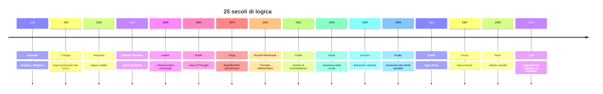

# Breve storia della logica

La logica non è nata adulta. È un organismo culturale di venticinque secoli con sussulti di crescita molto distanziati: lunghi sonni medievali, un Rinascimento che la trascura per la retorica, un Ottocento che la rifonda da capo, un Novecento che la spezza e ricompone. Conoscerne la storia non è ornamento erudito: serve a capire **perché** la logica è fatta proprio così — perché distinguiamo sintassi e semantica, perché esistono logiche modali, perché Gödel cambiò la matematica. Ogni concetto del corso ha un padre o una madre datata.

Questa è una panoramica narrativa, non un manuale di storia. Per quello c'è il classico Kneale & Kneale.

## 1. Antichità: Aristotele e gli Stoici

**Aristotele** (384–322 a.C.) scrive l'*Organon*, sei trattati che fondano la logica come disciplina autonoma. Il cuore è il **sillogismo categorico**: schemi di inferenza con due premesse e una conclusione, in cui i termini sono predicati di soggetti.

$$\frac{\text{Tutti gli uomini sono mortali.}\quad\text{Socrate è un uomo.}}{\text{Socrate è mortale.}}$$

Aristotele classifica i sillogismi validi in figure (4) e modi (256 combinazioni di cui solo 24 valide nelle ricostruzioni medievali). È una logica dei *predicati monadici* — parla di proprietà di individui — e resta dominante per duemila anni.

Pochi decenni dopo, gli **Stoici** (in particolare Crisippo di Soli, ca. 280–207 a.C.) sviluppano qualcosa che Aristotele aveva intuito ma non sistematizzato: la **logica proposizionale**. Connettivi (*kai* = e, *e* = o, *ei* = se...allora), schemi come il *modus ponens* ("primo indimostrabile" stoico), tabelle di verità di fatto. Per millenni la tradizione platonico-aristotelica li ha eclissati; sono stati riscoperti come precursori della logica moderna solo nell'Ottocento.

## 2. Medioevo: gli scolastici e la logica terminista

Nel mondo arabo, **al-Farabi** (X sec.) e **Avicenna** (XI sec.) commentano e ampliano Aristotele, anticipando temi di logica temporale e modale. In Occidente, dopo la riscoperta integrale dell'*Organon* nel XII secolo, fiorisce la **logica scolastica** (Pietro Ispano, Guglielmo di Ockham, Walter Burley, Giovanni Buridano).

I medievali sviluppano:

- la **teoria della suppositio** (riferimento dei termini),
- gli **insolubilia** (paradosso del mentitore in molte varianti),
- le **consequentiae** (teoria delle conseguenze, vicina alla logica proposizionale),
- la **logica modale** con quantificazione dei modi *de re* / *de dicto*.

Per molti aspetti — concetti come *consequentia formalis* — sono più moderni di quanto si creda. Poi il Rinascimento, ossessionato dalla retorica e ostile alla "barbarie" scolastica, li butta nel dimenticatoio. Si recupereranno nel XX secolo (Jan Łukasiewicz, Bocheński, Boehner).

## 3. Leibniz: il sogno della *characteristica universalis*

**Gottfried Wilhelm Leibniz** (1646–1716) è il primo a immaginare la logica come **calcolo**. Sogna una *characteristica universalis*, un linguaggio simbolico in cui ogni concetto sia rappresentato univocamente, e un *calculus ratiocinator*, un metodo meccanico per risolvere ogni controversia:

> Quando ci saranno dispute fra filosofi, non ci sarà più bisogno di discutere: basterà dire "calcoliamo".

Leibniz non porta il progetto a termine — i suoi quaderni di logica restano in gran parte inediti fino al XX secolo — ma definisce l'orizzonte: ridurre il ragionamento a manipolazione di simboli. Boole e Frege lavoreranno dentro quell'orizzonte.

## 4. Boole e l'algebra del pensiero (1847, 1854)

**George Boole** (1815–1864), matematico autodidatta di Cork, pubblica *The Mathematical Analysis of Logic* (1847) e *An Investigation of the Laws of Thought* (1854). L'idea: la logica delle classi (insiemi) e la logica delle proposizioni obbediscono a un'algebra. Definisce operazioni $+$, $\cdot$, complemento, con identità che diventeranno l'algebra di Boole moderna:

$$x \cdot x = x, \quad x + x = x, \quad x(y+z) = xy + xz$$

L'idempotenza ($x \cdot x = x$) è la firma di Boole: distingue la sua algebra da quella dei numeri reali. Da Boole nasce l'**hardware** dei calcolatori (Shannon 1937 mostrerà che i circuiti elettrici realizzano direttamente l'algebra di Boole).

## 5. Frege e la rivoluzione del 1879

Quando **Gottlob Frege** (1848–1925) pubblica il *Begriffsschrift* ("scrittura concettuale") nel 1879, la logica entra nell'età moderna. Frege introduce:

- la **logica dei predicati** del primo ordine con quantificatori $\forall$ ed $\exists$ (in notazione propria, bidimensionale, oggi sostituita da quella di Peano-Russell);
- la distinzione **funzione/argomento** che sostituisce soggetto/predicato grammaticali;
- un **sistema assiomatico** completo per la logica proposizionale e quasi completo per i predicati;
- un'epistemologia **anti-psicologistica**: la logica non è descrizione di come pensiamo, ma di cosa segue da cosa.

$$\forall x\, (Uomo(x) \rightarrow Mortale(x))$$

Senza Frege non esisterebbe la logica matematica come la conosciamo. Frege poi tentò di derivare l'aritmetica dalla logica (il programma *logicista*) ma nel 1902 ricevette la famosa lettera di Russell sul paradosso che porta il suo nome — sul quale torneremo.

## 6. Russell-Whitehead: i *Principia Mathematica* (1910-1913)

**Bertrand Russell** e **Alfred North Whitehead** scrivono i tre tomi dei *Principia Mathematica*, monumento del programma logicista. Tentano di derivare tutta la matematica dalla logica più la teoria dei tipi (introdotta proprio per evitare il paradosso di Russell: *l'insieme di tutti gli insiemi che non appartengono a se stessi*).

I *Principia* contengono migliaia di teoremi formalmente derivati. La dimostrazione di $1+1=2$ arriva a pagina 379 del primo volume. Il fascino è enorme, ma il progetto è destinato a una doccia fredda.

## 7. Gödel 1931: i teoremi di incompletezza

**Kurt Gödel** (1906–1978), ventiquattrenne, pubblica *Über formal unentscheidbare Sätze...* e dimostra due cose che cambiano la matematica:

1. **Primo teorema di incompletezza**: ogni sistema formale coerente e abbastanza espressivo da contenere l'aritmetica di Peano contiene enunciati veri ma non dimostrabili al suo interno.
2. **Secondo teorema**: tale sistema non può dimostrare la propria coerenza.

Il programma di Hilbert (fondare tutta la matematica su un sistema formale completo e dimostrabilmente coerente) e parte del programma logicista crollano. La logica matematica trova i propri **limiti interni**, e quei limiti sono dimostrati con strumenti rigorosamente logici. È un capolavoro. Lo affronteremo in [Metalogica e Gödel](15-metalogica-godel.html).

## 8. Tarski, Gentzen, e la maturazione del Novecento

**Alfred Tarski** (1901–1983) definisce in modo rigoroso la **verità in un modello** (1933), dando alla logica la sua semantica matematica completa: $\models$ non è più un'idea informale ma un oggetto definito. Definisce anche il concetto di **conseguenza logica** in termini di modelli.

**Gerhard Gentzen** (1909–1945), giovane allievo di Hilbert, nel 1934 inventa due sistemi di prova alternativi all'assiomatico fregeano: la **deduzione naturale** (sez. [10](10-deduzione-naturale.html)) e il **calcolo dei sequenti** (sez. [11](11-sistemi-assiomatici-sequenti.html)). Sono modelli computazionali del ragionamento umano — molto più maneggevoli — e diventano lo standard didattico.

## 9. Logiche modali, fuzzy, e oltre

**Saul Kripke**, diciannovenne, nel 1959–63 dà una semantica rigorosa alle **logiche modali** (necessità, possibilità) attraverso i *mondi possibili* (sez. [16](16-logiche-modali.html)). Le logiche modali si ramificano in temporali (Prior), deontiche (von Wright), epistemiche (Hintikka).

**Lotfi A. Zadeh**, ingegnere a Berkeley, nel 1965 introduce gli **insiemi fuzzy**: appartenenza a gradi $\mu(x) \in [0,1]$ invece che $\{0,1\}$. È una delle logiche non classiche più applicate (controllo industriale, machine learning).

Nello stesso periodo si sviluppano la **logica intuizionista** (Brouwer-Heyting-Kolmogorov, costruttivista), la **logica lineare** di Girard (1987, contabilità delle risorse), la **logica paraconsistente** (Newton da Costa).

## 10. Causalità, AI, modelli linguistici

Dal 2000, **Judea Pearl** ([Causalità](45-causalita-pearl.html)) costruisce un calcolo formale della causalità con grafi diretti aciclici e l'operatore $\text{do}(\cdot)$, distinguendo *correlazione* da *intervento*. Riceve il Turing Award nel 2011.

Negli anni 2020 i **modelli linguistici** (LLM) sollevano nuovamente la domanda: sanno ragionare? Le risposte di una rete neurale sembrano inferenze ma non sono derivazioni in un sistema formale. La frontiera della ricerca — *neurosymbolic AI*, *chain-of-thought*, prover automatici come Lean — cerca di sposare l'apprendimento statistico con la solidità della logica simbolica.

## 11. Linea del tempo

## 12. Esempi storici

  
Esercizio 1 — il paradosso di Russell, in tre minuti

Sia $R = \{x : x \notin x\}$ (l'insieme degli insiemi che non appartengono a se stessi). Domanda: $R \in R$?

- Se $R \in R$, allora per definizione $R \notin R$. Contraddizione.
- Se $R \notin R$, allora $R$ soddisfa la condizione di appartenenza a $R$, quindi $R \in R$. Contraddizione.

Russell scrisse a Frege nel 1902 mostrandogli che il suo sistema, ammettendo la formazione di insiemi per condizione arbitraria (assioma di comprensione illimitata), permetteva di derivare $R$ e quindi contraddizione. Frege riconobbe il problema in un'appendice del suo *Grundgesetze der Arithmetik* vol. II. La teoria dei tipi e l'assiomatica di Zermelo-Fraenkel (ZFC) sono le risposte standard.

  
Esercizio 2 — perché Gentzen "batte" Frege didatticamente?

Gli assiomi di Frege per la logica proposizionale (sez. [11](11-sistemi-assiomatici-sequenti.html)) sono pochi e potenti ma rendono le dimostrazioni lunghe e poco intuitive. Esempio: provare $p \rightarrow p$ in stile assiomatico richiede 3-5 passi dipendenti da assiomi non ovvi.

In deduzione naturale (sez. [10](10-deduzione-naturale.html)) la stessa prova si scrive in un passo: assumi $p$, scarica l'ipotesi, ottieni $p \rightarrow p$ per *introduzione del condizionale*. Le regole rispecchiano lo scheletro intuitivo del ragionamento umano (assumi, deduci, generalizza). Per questo deduzione naturale è lo standard didattico contemporaneo.

## Sintesi

- **Aristotele** fonda la logica come sillogistica (predicati monadici).
- Gli **Stoici** anticipano la logica proposizionale; gli **scolastici** la sviluppano e poi vengono dimenticati.
- **Leibniz** sogna il calcolo logico; **Boole** lo realizza algebricamente nel 1854.
- **Frege** (1879) inventa quantificatori e logica dei predicati moderna; **Russell-Whitehead** estendono il programma con i *Principia*.
- **Gödel** (1931) mostra i limiti formali interni della logica; **Tarski** e **Gentzen** ne maturano semantica e calcoli.
- Il Novecento esplode in logiche modali, fuzzy, intuizioniste, lineari, paraconsistenti; nel XXI secolo arrivano causalità (Pearl) e AI.

## Letture

- W. & M. Kneale, *The Development of Logic*, Oxford 1962 — il classico.
- J. van Heijenoort (ed.), *From Frege to Gödel: A Source Book in Mathematical Logic 1879–1931*.
- F. Bocheński, *Storia della logica formale*.
- D. Hofstadter, *Gödel, Escher, Bach* — divulgazione del teorema di Gödel.
- J. Pearl, D. Mackenzie, *The Book of Why* (2018) — l'ultima rivoluzione: la causalità.
