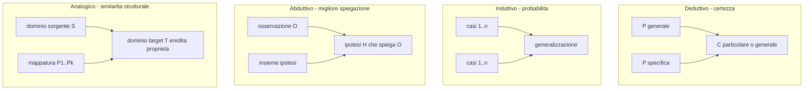

# Tipi di ragionamento: deduttivo, induttivo, abduttivo, analogico

Non ragioniamo in un solo modo. Quando un matematico dimostra un teorema, quando un medico formula una diagnosi, quando uno studente ipotizza il risultato di un esperimento di chimica e quando dici "ieri pioveva, oggi probabilmente piove ancora", stai usando *quattro* tipi di inferenza diversi. Hanno garanzie diverse, criteri di valutazione diversi e fallimenti tipici diversi. Confonderli è la prima fonte di pensiero sciatto.

Questa sezione introduce i quattro: deduttivo, induttivo, abduttivo, analogico. Lascia la formalizzazione ai capitoli sulla logica proposizionale e dei predicati (sez. [7](07-logica-proposizionale.html) e [12](12-logica-predicati-sintassi.html)) e si concentra sulle distinzioni concettuali.

## 1. Ragionamento deduttivo

**Definizione.** Un'inferenza è **deduttiva** quando la verità delle premesse garantisce la verità della conclusione. Cioè: è impossibile che le premesse siano vere e la conclusione falsa.

Più formalmente, l'argomento $P_1, \dots, P_n \therefore C$ è deduttivamente valido se e solo se

$$\nexists \text{ interpretazione: } P_1, \dots, P_n \text{ vere} \wedge C \text{ falsa}.$$

La deduzione **preserva** verità ma non la **crea**: tutto ciò che la conclusione afferma era già implicito nelle premesse.

**Esempio canonico.**

> 1. Tutti gli uomini sono mortali.
> 2. Socrate è un uomo.
> 3. ∴ Socrate è mortale.

Esempio formale:

$$\frac{p \rightarrow q \qquad p}{q} \quad (\text{modus ponens})$$

Caratteristiche.

- **Monotona**: aggiungere premesse non invalida la conclusione (in logica classica).
- **Necessaria**: la conclusione segue *con certezza*.
- **Verità preservata**: non aumenta il contenuto informativo della conclusione oltre quello delle premesse.

La logica formale (sez. 7–14) è quasi interamente sulla deduzione: studia *quali schemi inferenziali sono deduttivamente validi*.

## 2. Ragionamento induttivo

**Definizione.** Un'inferenza è **induttiva** quando le premesse forniscono un *supporto probabilistico* alla conclusione, ma non la garantiscono. La conclusione può essere falsa anche se le premesse sono tutte vere. Si va dal **particolare al generale** (o dal passato al futuro).

**Esempi.**

> Ho visto 10.000 cigni e tutti erano bianchi. ∴ Probabilmente tutti i cigni sono bianchi.

(Falso: i cigni neri esistono in Australia. È l'esempio classico di Karl Popper.)

> Il sole è sorto tutte le mattine della storia umana registrata. ∴ Domani sorgerà.

> Su 500 pazienti trattati con il farmaco X, l'87% ha avuto miglioramento. ∴ Il farmaco X è efficace.

Caratteristiche.

- **Non monotona**: nuova evidenza può ridurre il supporto. Bastano un cigno nero a indebolire la generalizzazione.
- **Probabilistica**: la conclusione è più o meno probabile in funzione della *base di evidenza*.
- **Amplificativa**: la conclusione dice qualcosa che non era contenuto nelle premesse. Per questo è informativa — e fallibile.

Misurare la forza induttiva è oggetto di *statistica* e *teoria della probabilità* (vedi [Probabilità](32-probabilita-fondamenti.html) e [Bayes](33-teorema-bayes.html)).

### 2.1 Il problema dell'induzione (Hume)

**David Hume**, nel *Treatise of Human Nature* (1739) e nell'*Enquiry concerning Human Understanding* (1748), formula il problema seguente. Ogni inferenza induttiva si basa implicitamente su un **principio di uniformità della natura**:

> Il futuro assomiglierà al passato; i casi non osservati assomiglieranno a quelli osservati.

Domanda: come giustifichiamo questo principio?

- Non per via deduttiva: non c'è contraddizione logica nel pensare che domani il sole non sorga.
- Non per via induttiva: useremmo l'induzione per giustificare l'induzione (circolarità).

Hume conclude che la nostra fiducia nell'induzione è una **abitudine psicologica**, non una giustificazione razionale. Il problema rimane aperto in filosofia. Popper proverà a aggirarlo sostenendo che la scienza non procede per induzione ma per *congettura e falsificazione* (sez. [43](43-metodo-scientifico-popper.html)).

> **⚠ Attenzione.** "Induzione" in logica/filosofia significa cosa diversa da "induzione matematica" (che è in realtà una forma deduttiva, basata sull'assioma di induzione di Peano). Sono falsi amici.

## 3. Ragionamento abduttivo

**Definizione.** L'abduzione (Charles Sanders Peirce, fine '800) è l'**inferenza alla migliore spiegazione**. Date alcune osservazioni $O$ e un insieme di possibili ipotesi $H_1, H_2, \dots, H_n$, scegli l'ipotesi $H_i$ che meglio spiega $O$.

Schema:

$$\text{Si osserva } O.\;\; H_i \text{ se vera spiegherebbe } O.\;\; \therefore H_i.$$

**Esempi.**

> La strada è bagnata. La spiegazione migliore (di solito) è che ha piovuto. ∴ Ha piovuto.

> Il paziente ha febbre alta, tosse e dolore al petto. La diagnosi più plausibile dato il quadro è la polmonite batterica. ∴ Polmonite.

> L'orbita di Urano presenta perturbazioni. L'ipotesi che meglio le spiega è l'esistenza di un altro pianeta. (Le Verrier, 1846 → scoperta di Nettuno.)

Caratteristiche.

- **Creativa**: genera nuove ipotesi (non si limita a verificare).
- **Defeasible**: la conclusione è la *migliore* spiegazione disponibile, ma non *l'unica*. Una nuova ipotesi può soppiantarla.
- **Centrale nella scienza e nella diagnosi**: la pratica scientifica e quella medica sono in larga parte abduzione, non induzione classica.

Pearl ha mostrato che molta abduzione causale può essere formalizzata con grafi e $\text{do}(\cdot)$ (sez. [45](45-causalita-pearl.html)).

## 4. Ragionamento analogico

**Definizione.** L'**analogia** trasferisce conclusioni da un dominio sorgente $S$ (noto) a un dominio target $T$ (meno noto) sulla base di similarità strutturali.

Schema:

$$S \text{ e } T \text{ condividono le proprietà } P_1, P_2, \dots, P_k.\;\; S \text{ ha la proprietà } Q.\;\; \therefore T \probabilmente \text{ ha } Q.$$

**Esempi.**

> Il sistema solare ha pianeti che orbitano attorno al sole; gli atomi hanno elettroni; per analogia (Rutherford, 1911), gli elettroni orbitano attorno al nucleo come i pianeti attorno al sole.

(L'analogia è euristica e parzialmente sbagliata: gli elettroni non hanno orbite classiche. Ma fu storicamente feconda.)

> Il cuore funziona come una pompa.

> Internet è come un'autostrada (metafora dell'*information superhighway* anni '90).

Caratteristiche.

- **Generativa**: utilissima per costruire ipotesi e modelli.
- **Fallibile**: il numero di analogie buone è enormemente più piccolo di quello delle analogie tentate. Le **analogie deboli** sono la materia prima di molte fallacie (false analogie, sez. [21](21-fallacie-informali-rilevanza.html)).
- **Quantificabile**: l'analogia è tanto più forte quanto più le proprietà condivise sono *causalmente rilevanti* per la proprietà inferita.

## 5. Confronto: quattro tipi, quattro garanzie

| Tipo | Direzione | Forza | Aumenta info? | Esempio tipico |
|------|-----------|-------|---------------|----------------|
| Deduttivo | gen → part o gen → gen | certa | no | Matematica, prove |
| Induttivo | part → gen | probabilistica | sì | Scienza empirica |
| Abduttivo | osservazione → ipotesi | "la migliore" | sì | Diagnosi, indagine |
| Analogico | dominio A → dominio B | strutturale | sì | Metafora, modello |

## 6. Quando usare quale

- **Matematica e CS teorica**: deduzione (l'unica con garanzia formale).
- **Scienze empiriche**: induzione + abduzione (con falsificazione popperiana).
- **Medicina clinica, indagini, debugging**: abduzione (e poi test).
- **Insegnamento, creatività, design**: analogia (e poi verifica).

Quasi sempre, il pensiero reale combina tutti e quattro. Sherlock Holmes "deduce" — ma usa quasi sempre abduzione travestita da deduzione: dall'orma di fango "deduce" che Watson è stato in Afghanistan, quando in realtà sceglie la spiegazione più plausibile compatibile con un certo numero di indizi.

## 7. Errori tipici per ciascun tipo

- **Deduttivo**: applicare regole inesistenti (es. *affermazione del conseguente*, vedi [Fallacie formali](20-fallacie-formali.html)).
- **Induttivo**: generalizzare da campioni troppo piccoli (sez. [21](21-fallacie-informali-rilevanza.html)) o non rappresentativi.
- **Abduttivo**: confondere "la spiegazione che mi viene in mente" con "la migliore spiegazione possibile" (bias di disponibilità, sez. [23](23-bias-cognitivi.html)).
- **Analogico**: forzare analogie su proprietà superficiali invece che causali (es. "l'economia è come una famiglia, deve risparmiare in crisi" — analogia debole, dimensioni e regole macroeconomiche sono diverse).

## 8. Esercizi

  
Esercizio 1 — classifica le seguenti inferenze

Per ciascuna scrivi **D**, **I**, **Ab** o **An**.

1. Tutti i mammiferi sono vertebrati; il delfino è un mammifero; ∴ il delfino è vertebrato.
2. Ho assaggiato cinque mele di questo albero, tutte erano dolci; ∴ probabilmente tutte le mele di quest'albero sono dolci.
3. Il computer non si accende. La spina è scollegata. ∴ è scollegata la spina.
4. Il cervello umano elabora informazioni come un computer; un computer ha una memoria a breve termine; ∴ il cervello ha una memoria a breve termine.
5. $\forall n \in \mathbb{N}\, (n + 0 = n)$; quindi $7 + 0 = 7$.

Soluzioni: 1 = D; 2 = I; 3 = Ab; 4 = An (debole ma fertile); 5 = D (è una sostituzione, deduttiva).

  
Esercizio 2 — abduzione in stile Sherlock

Tornando a casa trovi la porta socchiusa. Il cane non abbaia. Sul tavolo c'è un mazzo di chiavi nuovo. Genera almeno tre ipotesi che spiegherebbero le tre osservazioni *congiuntamente*, e ordina quale ritieni "la migliore" e perché.

Risposta-tipo: (a) tua moglie è tornata a casa e ha dimenticato di chiudere (cane non abbaia perché la conosce, chiavi nuove perché ha fatto un duplicato); (b) un ladro che conosceva il cane (poco plausibile salvo familiare); (c) sei stato tu stesso, distrattamente. La "migliore" dipende dal Bayes prior — chi ha le chiavi di casa nella tua famiglia? (sez. [33](33-teorema-bayes.html)).

## Sintesi

- **Deduzione**: garantisce la conclusione date le premesse; preserva ma non aumenta informazione.
- **Induzione**: supporto probabilistico, va dal particolare al generale; il *problema di Hume* la rende epistemicamente fragile.
- **Abduzione**: inferenza alla migliore spiegazione; centrale in scienza, diagnosi, indagine.
- **Analogia**: trasferimento basato su similarità strutturali; generativa ma facilmente fallace.
- Il pensiero reale combina tutti e quattro; saperli distinguere è precondizione del rigore.

## Letture

- C. S. Peirce, *Collected Papers*, sui concetti di abduzione/retroduzione.
- D. Hume, *An Enquiry concerning Human Understanding* (1748), sez. IV-V — il problema dell'induzione.
- K. Popper, *Logica della scoperta scientifica* (1934) — risposta non induttivista.
- D. Hofstadter, E. Sander, *Surfaces and Essences* (2013) — il ruolo cognitivo dell'analogia.
- I. M. Copi, C. Cohen, *Introduction to Logic* — capitolo sui tipi di inferenza.
