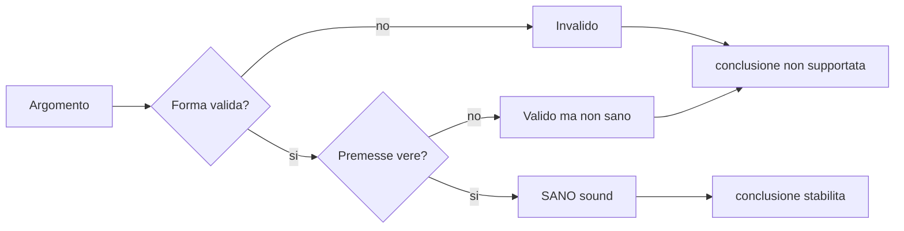
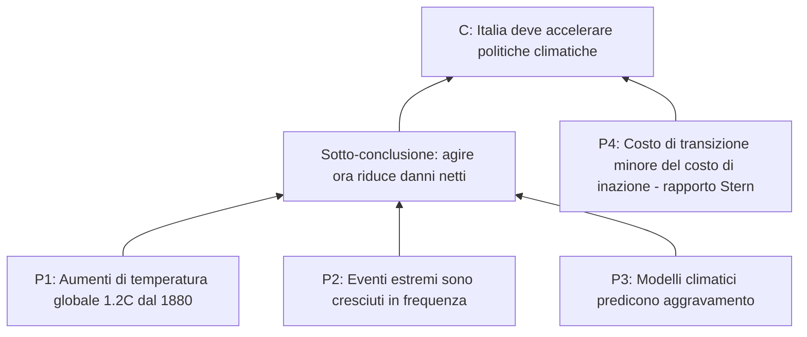

# Argomenti: premesse, conclusione, validità, solidità

Un argomento non è una lite. Nel vocabolario tecnico di logica e filosofia analitica, **argomento** è un oggetto preciso: un insieme di proposizioni di cui una (la *conclusione*) è asserita sulla base delle altre (le *premesse*). Questa sezione descrive l'anatomia dell'argomento, insegna a estrarlo da un testo che lo nasconde, e introduce le due distinzioni più importanti del corso: **validità vs solidità** e **deduttivo vs induttivo vs cogente**.

Se ti sembrano distinzioni pedanti, considera questo. Un avvocato che confonde "valido" e "sano" perde cause. Un giornalista che le confonde scrive titoli che ingannano. Un ingegnere che le confonde costruisce ponti che cadono.

## 1. Definizione di argomento

Un **argomento** è una sequenza ordinata di proposizioni

$$\langle P_1, P_2, \dots, P_n, C \rangle$$

dove $P_1, \dots, P_n$ sono le **premesse** e $C$ è la **conclusione**. La sequenza esprime che chi presenta l'argomento *asserisce* $C$ *sulla base di* $P_1, \dots, P_n$.

**Componenti essenziali.**

- **Proposizione** (statement): frase dichiarativa con valore di verità (vera o falsa). "Piove" è una proposizione; "Piove?" no; "Chiudi la porta!" no; "Forse piove" è un'asserzione con modificatore epistemico, non una proposizione semplice.
- **Premesse**: le proposizioni offerte come *ragioni* per accettare la conclusione.
- **Conclusione**: la proposizione che l'argomento intende stabilire.

> **⚠ Attenzione.** Una collezione di affermazioni *non* è automaticamente un argomento. "Il mio cane è simpatico. La torta era buona. Domani piove." sono tre asserzioni senza struttura inferenziale. Diventa argomento solo se c'è una pretesa di *supporto*.

## 2. Identificare la struttura: indicatori

In testi reali, premesse e conclusione raramente sono etichettate. Si individuano dagli **indicatori linguistici**.

| Indicatori di **conclusione** | Indicatori di **premessa** |
|------------------------------|----------------------------|
| quindi, perciò, dunque        | perché, poiché, dato che    |
| pertanto, ne consegue che     | infatti, dal momento che    |
| ne segue, di conseguenza      | siccome, visto che          |
| così, da ciò                  | a causa di, in virtù di     |

Esempio.

> *Le tasse universitarie italiane sono fra le più alte d'Europa, **e poiché** l'università pubblica dovrebbe garantire diritto allo studio, **ne consegue che** vanno ridotte.*

- Premessa 1: le tasse universitarie italiane sono fra le più alte d'Europa.
- Premessa 2 (implicita ma indicata da "poiché"): l'università pubblica dovrebbe garantire diritto allo studio.
- Premessa 3 (sotto-intesa): tasse alte sono incompatibili con il diritto allo studio.
- Conclusione: le tasse vanno ridotte.

Spesso una **premessa è sotto-intesa** (*enthimema*): chi argomenta dà per scontato che l'interlocutore la condivida. Renderla esplicita è il primo passo dell'analisi critica.

## 3. Forma standard

In analisi è utile riscrivere ogni argomento in **forma standard**:

```
P1: ...
P2: ...
[Pn: ...]
-----
C : ...
```

L'esempio di sopra:

```
P1: Le tasse universitarie italiane sono fra le piu alte d'Europa.
P2: L'universita pubblica dovrebbe garantire diritto allo studio.
P3: Tasse alte ostacolano il diritto allo studio.
-----
C : Le tasse universitarie italiane vanno ridotte.
```

## 4. Validità

**Validità** è una proprietà *formale* dell'argomento. Un argomento è **deduttivamente valido** se e solo se

$$\text{è impossibile che } P_1, \dots, P_n \text{ siano tutte vere e } C \text{ sia falsa.}$$

Cioè: l'inferenza ha la forma giusta. Le premesse, *se* fossero vere, garantirebbero la conclusione.

**Cruciale**: la validità *non dice nulla sulla verità effettiva delle premesse*. Un argomento può essere valido pur partendo da premesse palesemente false.

Esempio di argomento **valido** ma con premesse false:

```
P1: Tutti i cani hanno tre zampe.
P2: Fido e' un cane.
-----
C : Fido ha tre zampe.
```

Forma: $\forall x (Cane(x) \rightarrow Tre(x)),\; Cane(Fido) \therefore Tre(Fido)$ — perfettamente valido (è un'istanza di *Modus Ponens universale*). Eppure la conclusione è falsa, perché P1 è falsa.

**Test informale di validità** ("supposition test"): immagina un mondo in cui le premesse sono vere. La conclusione potrebbe essere falsa in quel mondo? Se sì, invalido. Se no, valido.

## 5. Solidità

Un argomento è **solido** (*sound*, in inglese) se è valido **e** tutte le sue premesse sono effettivamente vere. Solidità = forma corretta + contenuto vero.

$$\text{Solido} \iff \text{Valido} \;\wedge\; \forall i\, (P_i \text{ è vera}).$$

Solo un argomento solido stabilisce in modo conclusivo la sua conclusione.



Per criticare un argomento deduttivo hai due strade:

1. mostrare che la forma **non è valida** (controesempio: un'istanza in cui premesse vere e conclusione falsa);
2. mostrare che **almeno una premessa è falsa**.

Sono attacchi diversi. Spesso chi discute confonde "non sono d'accordo con la conclusione" con "non sono d'accordo con una premessa" — utile separare le due.

## 6. Argomenti induttivi: forza e cogenza

Per argomenti **induttivi** la coppia validità/solidità non è la giusta cornice. Si parla di **forza** (*strength*) e **cogenza** (*cogency*).

- Un argomento induttivo è **forte** se le premesse, se vere, rendono *probabile* la conclusione.
- È **cogente** se è forte **e** ha premesse vere.

Esempio di argomento induttivamente forte:

```
P1: Il 95% degli studenti che ha frequentato il corso e fatto gli esercizi
    ha superato l'esame.
P2: Anna ha frequentato il corso e fatto gli esercizi.
-----
C : Anna probabilmente superera' l'esame.
```

Non è "valido" in senso deduttivo — anche se P1 e P2 fossero vere, $C$ potrebbe essere falsa (Anna è nel 5%). Ma è **forte**: il supporto è grande.

> Un argomento induttivo che era forte ieri può smettere di esserlo oggi, se emerge nuova evidenza (vedi *non monotonia*, sez. [3](03-tipi-di-ragionamento.html)).

## 7. Argomenti deduttivi vs induttivi: come distinguerli

A volte un argomento è chiaramente deduttivo (matematico). A volte chiaramente induttivo (statistico). A volte è ambiguo. Criterio operativo:

- Se l'autore intende che la conclusione segue **necessariamente** dalle premesse → deduttivo (valuti con validità/solidità).
- Se intende che le premesse rendono la conclusione **probabile** o **plausibile** → induttivo (valuti con forza/cogenza).

Spesso l'intenzione si capisce dal linguaggio: "ne consegue che" indica deduzione; "è probabile che" indica induzione.

## 8. Diagramma strutturale di un argomento

Argomenti complessi hanno catene e supporti convergenti. Per visualizzarli si usa il **diagramma strutturale**.



Le frecce indicano relazione di *supporto*. Premesse che si rinforzano vanno in un nodo intermedio (sotto-conclusione). Premesse indipendenti convergono direttamente alla conclusione.

## 9. Esempio passo-passo: smontare un argomento

> "Tutti i grandi geni sono andati male a scuola — vedi Einstein. Mio figlio va male a scuola. Quindi è un genio."

**Step 1 — forma standard.**

```
P1: Tutti i grandi geni sono andati male a scuola.
P2: Mio figlio va male a scuola.
-----
C : Mio figlio e' un genio.
```

**Step 2 — analisi della forma.** Schema:

$$\forall x (Genio(x) \rightarrow MaleScuola(x)),\; MaleScuola(figlio) \therefore Genio(figlio).$$

Questa è la fallacia formale **affermazione del conseguente** (vedi [Fallacie formali](20-fallacie-formali.html)). $A \rightarrow B$ + $B$ non implica $A$. **Invalido**.

**Step 3 — analisi delle premesse.** P1 è palesemente falsa (la maggioranza dei geni sono andati bene a scuola; Einstein è una leggenda metropolitana — andava bene in matematica e fisica). Anche se la forma fosse valida, non sarebbe sano.

**Verdetto**: argomento doppiamente cattivo (invalido + premessa falsa).

## 10. Esercizi

<details>
  <summary>Esercizio 1 — riscrivi in forma standard</summary>

> "Dovremmo investire in trasporto pubblico perché riduce inquinamento, abbassa la congestione e migliora la qualità di vita nei centri urbani. Il fatto che i trasporti pubblici riducono inquinamento è documentato dall'ISPRA."

Soluzione possibile:

```
P1: I trasporti pubblici riducono inquinamento (ISPRA).
P2: I trasporti pubblici abbassano la congestione urbana.
P3: I trasporti pubblici migliorano la qualita' di vita nei centri urbani.
P4 (implicita): Riduzione inquinamento + congestione + migliore qualita' di vita
                sono beni che vanno perseguiti.
-----
C : Dovremmo investire in trasporto pubblico.
```

L'argomento è induttivo/pratico, non deduttivo classico. Valutare per cogenza, non per validità.
</details>

<details>
  <summary>Esercizio 2 — valido ma non sano</summary>

Costruisci un argomento **deduttivamente valido** la cui **conclusione è falsa**.

Una soluzione: 

```
P1: Tutti i numeri primi sono pari.
P2: 7 e' primo.
-----
C : 7 e' pari.
```

Forma identica a Modus Ponens universale → valida. Premessa P1 falsa → argomento non sano. Conclusione falsa.

Lezione: l'argomento è correttamente costruito ma inutile, perché parte da una premessa falsa. La validità da sola non è sufficiente per accettare la conclusione.
</details>

<details>
  <summary>Esercizio 3 — fortezza induttiva</summary>

Argomenti seguenti: stabilisci se sono forti o deboli.

a) "9 voli su 10 da Roma a Milano sono in orario. Il mio volo è da Roma a Milano. Quindi probabilmente è in orario."

b) "Ho conosciuto due milanesi e sono entrambi freddi. Quindi i milanesi sono freddi."

c) "Su un campione casuale di 5.000 italiani, il 62% si dichiara favorevole alla riforma X. Quindi la maggioranza degli italiani è favorevole alla riforma X (entro un margine d'errore)."

Soluzioni: (a) forte (base statistica adeguata); (b) debole (campione di 2, generalizzazione affrettata, sez. [21](21-fallacie-informali-rilevanza.html)); (c) forte (campione grande, casuale, con margine d'errore stimabile, sez. [32](32-probabilita-fondamenti.html)).
</details>

## Sintesi

- Un **argomento** è $\langle P_1, \dots, P_n, C \rangle$: premesse e conclusione con pretesa di supporto.
- **Validità** = forma corretta (impossibilità di premesse vere e conclusione falsa); **solidità** = validità + premesse effettivamente vere.
- **Forza induttiva** + **cogenza** sono gli analoghi per gli argomenti non deduttivi.
- Un argomento può essere **valido ma non sano** — l'errore più diffuso di chi confonde i due livelli.
- Identificare premesse e conclusione richiede attenzione agli indicatori linguistici e alla ricostruzione delle premesse implicite (*enthimemi*).
- I diagrammi strutturali aiutano a vedere catene e convergenze di supporto.

## Letture

- I. M. Copi, C. Cohen, *Introduction to Logic*, capp. 1–3 (riferimento sulla forma standard).
- W. Hughes, *Critical Thinking*, sui diagrammi argomentativi.
- A. Fisher, *The Logic of Real Arguments* (2004), Cambridge UP — splendido manuale di analisi argomentativa.
- S. Toulmin, *The Uses of Argument* (1958) — anticipato qui, sviluppato in [Toulmin](38-argomentazione-toulmin.html).
