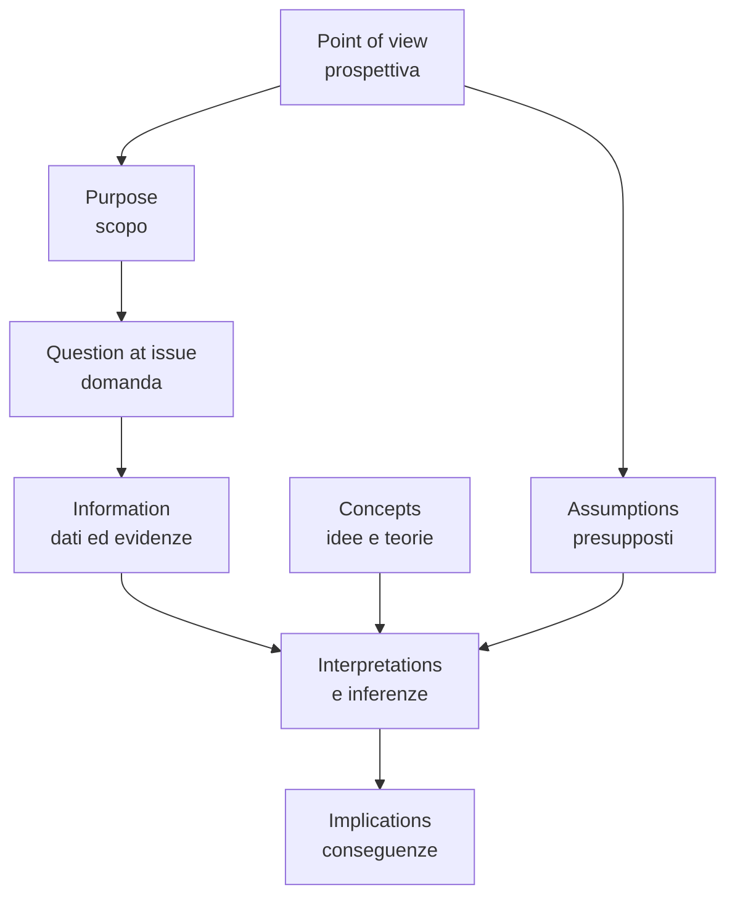

# Pensiero critico: standard di Paul-Elder

Richard Paul (1937–2015) e Linda Elder, alla *Foundation for Critical Thinking*, hanno passato decenni a sintetizzare un framework operativo per il pensiero critico. La logica formale fornisce strumenti di analisi della validità; Paul-Elder forniscono qualcosa di complementare: una **rubrica di qualità** del ragionamento applicabile in qualunque dominio (medicina, diritto, giornalismo, ingegneria, vita quotidiana).

Il framework ha tre componenti che si combinano:

1. **Nove standard intellettuali universali** — i criteri di valutazione.
2. **Otto elementi del ragionamento** — gli oggetti su cui si esercita la valutazione.
3. **Sette (otto, nove) virtù intellettuali** — le disposizioni di carattere che rendono autosostenibile il pensiero critico.

Questa sezione li espone con esempi italiani, una checklist usabile e qualche avvertimento sull'uso meccanico del modello.

## 1. I nove standard intellettuali universali

Gli standard sono **proprietà** che un ragionamento può possedere in misura più o meno alta. Si applicano a qualunque oggetto: una dichiarazione politica, un test diagnostico, una riga di codice, una decisione finanziaria.

### 1.1 Clarity (chiarezza)

Il pensiero è **chiaro** se esprime in modo distinto cosa intende. Se non capisci cosa significa un'affermazione, gli altri standard non si possono nemmeno applicare.

> Diagnostica: chiedi *"Cosa intendi esattamente con X?"*, *"Puoi fare un esempio?"*, *"Puoi riformularlo in altre parole?"*.

Esempio non-chiaro: "Bisogna fare di più per la scuola." Cosa? Aumentare gli stipendi? Riformare i curricoli? Costruire edifici?

### 1.2 Accuracy (accuratezza)

Il pensiero è **accurato** se è vero, cioè se corrisponde ai fatti. Va oltre la chiarezza: si può essere chiaramente sbagliati.

> Diagnostica: *"Come lo sai?"*, *"Come potremmo verificarlo?"*, *"Quale fonte?"*.

Esempio inaccurato: "Il 90% degli italiani parla due lingue." (Inaccurato. ISTAT 2022: bilingui ~ 60% includendo dialetto, ~ 20% per inglese.)

### 1.3 Precision (precisione)

Il pensiero è **preciso** se è specifico al grado necessario. Diverso da accuratezza: si può essere accurati ma vaghi.

> Diagnostica: *"Puoi essere più specifico?"*, *"Quanto?"*, *"Quando esattamente?"*.

Esempio impreciso: "Sono nato negli anni '90." Accurato, vago. Preciso: "Sono nato il 12 marzo 1995."

### 1.4 Relevance (rilevanza)

Il pensiero è **rilevante** se i punti che porta sono pertinenti alla questione in esame.

> Diagnostica: *"In che modo questo si collega alla domanda?"*, *"Stiamo ancora discutendo il punto X?"*.

Esempio irrilevante: in un dibattito sulla qualità della cucina di un ristorante, citare i precedenti penali del cameriere. Affermazione magari vera, ma irrilevante alla questione gastronomica.

### 1.5 Depth (profondità)

Il pensiero è **profondo** se affronta le complessità reali, non solo la superficie.

> Diagnostica: *"Quali fattori rendono il problema difficile?"*, *"Cosa stiamo lasciando fuori?"*.

Esempio superficiale: "Per ridurre la povertà basta dare soldi ai poveri." Una proposta seria deve affrontare incentivi, sostenibilità fiscale, monitoraggio, effetti di equilibrio generale.

### 1.6 Breadth (ampiezza)

Il pensiero è **ampio** se considera prospettive multiple.

> Diagnostica: *"Quale altro punto di vista bisognerebbe considerare?"*, *"C'è un'angolazione che stiamo ignorando?"*.

Esempio stretto: valutare una riforma fiscale solo dalla prospettiva delle imprese, ignorando lavoratori, consumatori, fisco, equilibri territoriali.

### 1.7 Logic (logicità)

Il pensiero è **logico** se le sue parti si tengono insieme, non si contraddicono, e la conclusione segue dalle premesse (cfr. [validità](04-anatomia-degli-argomenti.html)).

> Diagnostica: *"Questo segue dalle premesse?"*, *"È compatibile con quello che ho detto prima?"*.

### 1.8 Significance (significatività)

Il pensiero è **significativo** se affronta ciò che davvero conta nella questione, non dettagli marginali.

> Diagnostica: *"Qual è il punto più importante?"*, *"È questo il problema centrale?"*.

Esempio non significativo: in una valutazione di un'auto, ossessionarsi sul colore degli interni mentre il motore è difettoso.

### 1.9 Fairness (equità)

Il pensiero è **equo** se rappresenta correttamente le posizioni altrui, considera evidenze contrarie, e applica gli stessi standard a tutte le parti.

> Diagnostica: *"Sto rappresentando questo punto di vista nel modo migliore possibile?"*, *"Applico lo stesso metro a me e all'avversario?"*.

L'equità è la più difficile, perché va contro il bias di conferma (sez. [23](23-bias-cognitivi.html)).

## 2. Gli otto elementi del ragionamento

Ogni atto di ragionamento, secondo Paul-Elder, è descrivibile come una combinazione di otto **elementi**. Esercitarsi a riconoscerli aiuta a "sezionare" il pensiero proprio e altrui.

1. **Purpose / scopo**: perché stai ragionando su questo? Obiettivo dichiarato e obiettivo reale possono divergere.
2. **Question at issue / domanda**: qual è la domanda precisa che il ragionamento intende risolvere? Una domanda mal formulata produce risposte fuorvianti.
3. **Information / informazione**: quali dati ed evidenze stai usando? Sono accurati, rilevanti, sufficienti?
4. **Interpretations and inferences / interpretazioni e inferenze**: che conclusioni stai traendo dai dati?
5. **Concepts / concetti**: quali idee, teorie, definizioni stai usando? Sono adeguate?
6. **Assumptions / presupposti**: cosa stai dando per scontato? (Spesso il punto debole.)
7. **Implications and consequences / implicazioni**: cosa segue dalle tue conclusioni? Sei disposto ad accettarle?
8. **Point of view / punto di vista**: da quale prospettiva stai guardando? Ce ne sono altre?

L'analisi di un ragionamento si fa **applicando gli standard agli elementi**: la *clarity* del purpose, l'*accuracy* delle information, la *fairness* del point of view, ecc. Sono $9 \times 8 = 72$ punti di interrogazione potenziali — ovviamente non si usano tutti ogni volta.

## 3. Le virtù intellettuali

Gli standard non si autoapplicano. Servono **disposizioni di carattere** che li sostengano nel tempo. Paul e Elder ne elencano 7-8:

- **Integrità intellettuale**: applicare gli stessi standard a sé e agli altri.
- **Umiltà intellettuale**: consapevolezza dei limiti della propria conoscenza, disponibilità a dire "non lo so".
- **Coraggio intellettuale**: difendere idee impopolari quando sono ben supportate, e abbandonare idee popolari quando non lo sono.
- **Empatia intellettuale**: capacità di ricostruire la posizione altrui *nella sua versione migliore* (principio di carità).
- **Autonomia intellettuale**: pensare per sé senza dipendere acriticamente dall'autorità.
- **Perseveranza intellettuale**: continuare a pensare quando il problema diventa difficile.
- **Fiducia nella ragione**: assumere che il dialogo razionale sia uno strumento valido, anche quando faticoso.
- **Equità (fairmindedness)**: trattare tutti i punti di vista con gli stessi criteri.

Le virtù non sono ornamenti morali: sono *precondizioni operative*. Senza umiltà intellettuale, fairness diventa impossibile. Senza coraggio, l'analisi resta privata.

## 4. Mini-checklist usabile

Quando stai valutando un articolo, un argomento, una decisione, scorri questa lista. Non tutte sono pertinenti — è solo un menù.

> **Checklist Paul-Elder portable**
> 1. È chiaro? (Sai cosa significa?) — *Clarity*
> 2. È vero? Come lo so? — *Accuracy*
> 3. È specifico al grado giusto? — *Precision*
> 4. È pertinente alla domanda? — *Relevance*
> 5. Affronta le vere complessità? — *Depth*
> 6. Considera abbastanza prospettive? — *Breadth*
> 7. Le parti si tengono insieme? — *Logic*
> 8. Affronta ciò che conta? — *Significance*
> 9. Rappresenta correttamente le posizioni altrui? — *Fairness*

> **Domande sugli elementi**
> - Qual è lo scopo?
> - Qual è la domanda?
> - Quali dati e fonti?
> - Quali inferenze?
> - Quali concetti chiave e con che definizioni?
> - Quali presupposti taciti?
> - Quali implicazioni?
> - Da quale punto di vista?

## 5. Esempio applicato: un titolo da quotidiano

> "Il vaccino X causa effetti gravi nel 30% dei casi, secondo uno studio italiano."

Applichiamo standard ed elementi.

- **Clarity**: "effetti gravi" significa cosa? Anafilassi? Mal di testa? Disorientamento? Non chiaro.
- **Accuracy**: lo studio è peer-reviewed? Su quale rivista? Quanti partecipanti?
- **Precision**: 30% di un campione di che dimensione? Con che intervallo di confidenza?
- **Information**: il dato è confermato da altri studi (vedi *replicabilità*, sez. [43](43-metodo-scientifico-popper.html))?
- **Assumptions**: il titolo presuppone una relazione *causale*; lo studio probabilmente mostra correlazione (sez. [45](45-causalita-pearl.html)).
- **Point of view**: chi finanzia lo studio? Conflitti di interesse?
- **Fairness**: il titolo confronta col tasso base senza vaccino?

Senza queste verifiche, accettare o respingere il titolo è atto di fede, non di pensiero critico.

## 6. Limiti e abusi del framework

Paul-Elder è uno strumento, non un dogma. Tre avvertenze.

- **Non è un algoritmo**: non si applica meccanicamente. Va calibrato sul dominio. In medicina certi standard pesano di più (accuracy, fairness); in design altri (breadth, depth).
- **Non sostituisce la logica formale**: lo standard di *logicità* è puntato dalla logica formale (sez. 7–14). Paul-Elder dice "controlla la logica"; per controllarla davvero servono le tabelle di verità.
- **Rischio di check-listing**: applicarlo come questionario riduce a burocrazia ciò che è disciplina. Lo si interiorizza con la pratica, non recitando la lista.

## 7. Esercizi

  
Esercizio 1 — applica il framework a un editoriale

Prendi un editoriale di un quotidiano italiano (es. *Corriere*, *Repubblica*, *Il Foglio*) e fai una griglia 9 × 8. Per ogni cella scrivi una nota breve solo se lo standard è violato o meritevole di attenzione.

Non c'è soluzione canonica; l'esercizio sviluppa l'occhio. Confronta con un compagno: dove diverge la valutazione? Spesso il disaccordo è sul *punto di vista*, non sui *fatti*.

  
Esercizio 2 — identifica le virtù intellettuali in un personaggio

Per ciascun personaggio (storico, letterario, contemporaneo), identifica almeno una virtù intellettuale di cui è esempio e una sua antitesi.

a) Socrate.
b) Galileo Galilei.
c) Hannah Arendt.
d) Un opinionista televisivo a tua scelta.

Suggerimenti: (a) umiltà ("so di non sapere"); (b) coraggio (Inquisizione); (c) integrità (analisi spassionata del totalitarismo *anche* nelle istituzioni che la avevano salvata); (d) — esercizio per te.

  
Esercizio 3 — la propria autovalutazione

Pensa a un disaccordo che hai avuto di recente. Applica i 9 standard al tuo stesso ragionamento — non a quello dell'altra persona. Trovi qualche violazione di *fairness* (hai rappresentato la posizione avversa nella sua forma più forte)? Di *breadth* (hai considerato altre prospettive)? Di *accuracy* (hai verificato i fatti che davi per scontati)?

L'esercizio sviluppa equità intellettuale. Se non trovi nulla, applica di nuovo lo standard di *fairness*.

## Sintesi

- **9 standard universali**: chiarezza, accuratezza, precisione, rilevanza, profondità, ampiezza, logicità, significatività, equità.
- **8 elementi del ragionamento**: scopo, domanda, informazione, interpretazioni, concetti, presupposti, implicazioni, punto di vista.
- **Virtù intellettuali**: integrità, umiltà, coraggio, empatia, autonomia, perseveranza, fiducia nella ragione, equità.
- Il framework si applica come $9 \times 8$ griglia, ma in pratica si usa come *menù di domande*, non come questionario.
- Complementare alla logica formale: dà criteri di qualità anche dove la forma è informale.

## Letture

- R. Paul, L. Elder, *The Miniature Guide to Critical Thinking: Concepts and Tools* — fascicolo ufficiale.
- R. Paul, L. Elder, *Critical Thinking: Tools for Taking Charge of Your Learning and Your Life*.
- D. Willingham, *Critical Thinking: Why Is It So Hard to Teach?* — articolo che relativizza l'idea di critical thinking come skill generale.
- C. Wagner, *The Aspiring Adept: Robert Boyle and His Alchemical Quest* — esempio storico di virtù intellettuali in azione.
