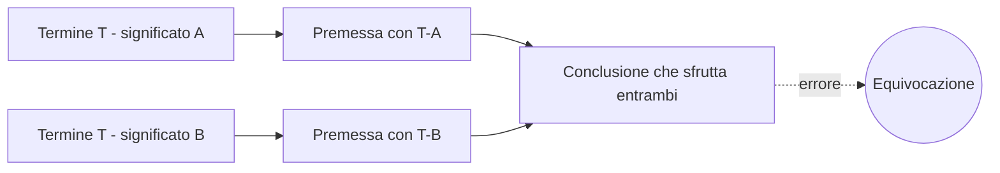
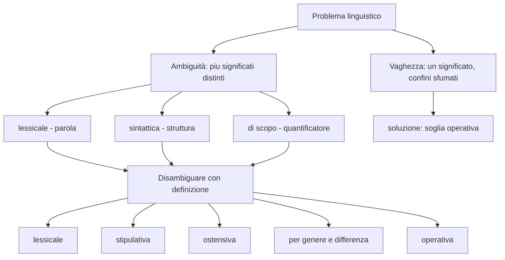

# Linguaggio, ambiguità, definizioni

La logica formale tratta enunciati con valori di verità. Ma il linguaggio reale è ambiguo: parole con più significati, frasi con strutture interpretabili in modi diversi, termini vaghi i cui confini sfumano. Prima di valutare se un argomento è valido devi sapere *cosa dice esattamente*. Questa sezione è il manuale di igiene linguistica del pensiero critico.

Le distinzioni qui sono cugine della filosofia del linguaggio analitica (Frege, Russell, Quine, Strawson), ma il taglio è operativo: imparare a smascherare un'ambiguità, scegliere il tipo giusto di definizione, riconoscere la differenza fra vaghezza e ambiguità, e collegare il tutto alla fallacia di **equivocazione**.

## 1. Significato, riferimento, uso

Punti di riferimento minimi.

- **Significato (senso)**: ciò che un'espressione significa. Frege (1892, *Über Sinn und Bedeutung*) distingue *Sinn* da *Bedeutung*: "la stella del mattino" e "la stella della sera" hanno significati diversi (sensi diversi) ma stesso riferimento (Venere).
- **Riferimento (denotazione)**: l'oggetto, individuo o classe a cui l'espressione rinvia.
- **Uso (pragmatica)**: l'effetto pragmatico di dire una certa cosa in un certo contesto. "Fa freddo qui" può significare letteralmente *fa freddo* o pragmaticamente *chiudi la finestra*.

Il pensiero critico si occupa principalmente di significato e riferimento; la pragmatica entra in retorica e dibattito (sez. [39](39-retorica-persuasione.html)).

## 2. Tipi di ambiguità

Un'espressione è **ambigua** se ammette **due o più interpretazioni distinte**. Tre tipi principali.

### 2.1 Ambiguità lessicale

Una **parola** ha più significati. È il caso più semplice.

Esempi italiani.

- **Anatra**: animale (lat. *anas*) vs verbo flesso *anatra* non esiste — riprova: **pesca** (frutto vs azione di pescare).
- **Calcio**: sport, parte del corpo, elemento chimico, parte del fucile.
- **Banca**: istituto finanziario, sedile, banco di sabbia, archivio (banca dati).

Le ambiguità lessicali sono il pane delle barzellette, ma anche di equivoci legali e diplomatici.

### 2.2 Ambiguità sintattica (di costruzione)

La **struttura della frase** ammette più analisi. Stesse parole, stessi significati lessicali, ma combinazioni diverse.

Esempi.

- "**Ho visto un uomo con un binocolo.**" — chi ha il binocolo? Io o l'uomo? Schemi:
  - $(Visto\;[Uomo]\;[con\;binocolo]_{strumento})$: l'osservatore ha il binocolo.
  - $(Visto\;[Uomo\;[con\;binocolo]_{attributo}])$: l'uomo ha il binocolo.
- "**Gli amici degli amici del nonno sono insopportabili.**" — gli amici sono del nonno o degli amici del nonno?
- "**La polizia ha sparato al rapinatore in fuga sul tetto.**" — chi è sul tetto?

I titoli di giornale sono celebri per essere sintatticamente ambigui per esigenze di brevità: "Vietato fumare nei locali pubblici dal Ministero" (chi vieta? il Ministero ha vietato, o si vieta nei locali del Ministero?).

### 2.3 Ambiguità di scopo (quantificazione)

Il **quantificatore** ha portata ambigua sui termini.

Esempio classico: "**Ogni minuto un bambino impara a leggere.**"

- $\forall \text{minuto}\, \exists \text{bambino}: \text{Impara}(\text{bambino}, \text{minuto})$ — un bambino *qualsiasi* per ogni minuto.
- $\exists \text{bambino}\, \forall \text{minuto}: \text{Impara}(\text{bambino}, \text{minuto})$ — lo *stesso* bambino, ogni minuto. (Sarebbe un genio sfortunato.)

L'ambiguità di scopo è la regione dove il linguaggio naturale collassa nella logica dei predicati (sez. [12](12-logica-predicati-sintassi.html)). Si risolve introducendo quantificatori espliciti.

## 3. Vaghezza

La **vaghezza** è diversa dall'ambiguità. Un termine vago ha **un solo significato**, ma **confini sfumati** di applicazione. Non è chiaro se applicarlo o no in casi di confine.

Esempi.

- **Calvo**: chi ha 0 capelli è calvo; chi ne ha 100.000 no; chi ne ha 1.547? (Il paradosso del *sorite*, vedi [Paradossi celebri](46-paradossi-celebri.html).)
- **Alto**: dipende dal contesto; in un giocatore NBA "alto" significa $\geq 2{,}10$ m, nella media italiana $\geq 1{,}85$ m.
- **Ricco, povero, giovane, vecchio**: tutti termini vaghi, normati da soglie convenzionali (per "povero": ISTAT ha una soglia, ma è convenzionale).

La vaghezza non è un difetto: è funzionale al linguaggio quotidiano. Ma in contesti dove serve precisione (legge, contratto, scienza) si rimpiazza con **soglie operative**.

> **⚠ Attenzione.** Ambiguità ≠ Vaghezza. *Banca* è ambigua (più significati discreti). *Alto* è vago (un significato, confine sfumato).

## 4. Le cinque forme di definizione

Disambiguare richiede definire. I tipi principali di definizione, dalla tradizione di Copi & Cohen.

### 4.1 Definizione lessicale

Riporta l'uso esistente del termine, come fa un dizionario. Vera o falsa rispetto all'uso linguistico.

> *Banca*: 1. istituto finanziario; 2. sedile lungo; 3. archivio organizzato di dati.

### 4.2 Definizione stipulativa

Introduce un significato per un termine nuovo o ne ridefinisce uno esistente per gli scopi di un discorso. Non vera né falsa: è una scelta convenzionale.

> "Per i fini di questo articolo, chiamo *zomboide* un grafo non orientato senza cicli con almeno 5 nodi."

In matematica e legge le definizioni sono quasi sempre stipulative.

### 4.3 Definizione ostensiva

Mostra esempi del termine. Si usa quando il termine è primitivo o di difficile definizione formale (es. colori).

> "Questo (mostrando il pomodoro) è *rosso*; questo (mostrando il limone) è *giallo*."

L'ostensione è il modo classico in cui i bambini imparano vocaboli concreti.

### 4.4 Definizione per genere e differenza

Aristotelica. Definisci $X$ come la sottoclasse di un *genere* $G$ che soddisfa una *differenza specifica* $D$.

$$X = \{ y \in G : D(y) \}$$

- *Uomo* (Aristotele): *animale (genere) razionale (differenza)*.
- *Triangolo*: poligono (genere) con tre lati (differenza).
- *Mutuo*: prestito (genere) garantito da ipoteca su immobile (differenza).

È il modello più usato nella scienza e in matematica.

### 4.5 Definizione operativa

Definisce un termine in base alla **procedura** per accertarne l'applicabilità.

- *Temperatura* = lettura di un termometro standard.
- *Intelligenza* (nella tradizione test-driven) = punteggio standardizzato a un test del QI.
- *Disoccupato* (ISTAT) = persona di 15+ anni senza occupazione, attivamente in cerca di lavoro nelle ultime 4 settimane, disponibile a iniziare entro 2 settimane.

Le definizioni operative sono essenziali nella scienza empirica. Sono anche pericolose: chiunque equivoci fra "intelligenza umana in senso lato" e "punteggio al test" sta commettendo un'ipostatizzazione (sez. [22](22-fallacie-informali-presunzione.html)).

## 5. Equivocazione: l'errore tipico dell'ambiguità

L'**equivocazione** è la fallacia (sez. [21](21-fallacie-informali-rilevanza.html)) che si commette quando un termine cambia significato nel corso di un argomento.

Esempio classico.

```
P1: I fini giustificano i mezzi.
P2: Tu mi fini hai dato in dote dei sodi.   [sciocco, ma rende l'idea]
```

Esempio serio.

```
P1: Le leggi della natura sono governate dalla logica.
P2: Le leggi degli uomini possono essere violate.
C : Le leggi della natura possono essere violate (perche' sono leggi).
```

Qui "legge" significa cosa diversa nelle due premesse: *regolarità necessaria* in P1, *norma giuridica* in P2. La conclusione sfrutta il doppio significato — fallacia.



Diagnosi: identifica i termini chiave dell'argomento, sostituiscili coerentemente con la loro definizione e verifica che il senso sia lo stesso in tutte le occorrenze.

## 6. Definizioni difettose

Alcuni errori comuni.

- **Circolare**: definire $X$ con $X$. *Insonnia*: "il non riuscire a dormire". *Dormire*: "essere in stato di insonnia interrotta". Inutilizzabile.
- **Troppo ampia**: include più di quanto dovrebbe. *Uomo* = *animale che ride* (anche le iene "ridono"; e ridere non è proprio solo dell'uomo).
- **Troppo stretta**: esclude cose che dovrebbe includere. *Religione* = *credenza in un dio personale* (esclude il buddhismo theravada).
- **Per negazione**: definire solo cosa non è. *Libertà* = *assenza di costrizione esterna* (è una negazione e basta, non dice cosa la libertà *è* positivamente).
- **Per metafora**: utile in poesia, problematico in argomentazione. *L'economia è un organismo* — utile come immagine, ingannevole se presa letteralmente.

## 7. Diagramma: tipi di problema linguistico



## 8. Esempi italiani notevoli

Titoli reali apparsi su quotidiani, raccolti dal *Linguista molesto* di L. Serianni e da G. Antonelli, *Il museo della lingua italiana*.

- "**Madre uccide figlio con coltello in cucina.**" — chi aveva il coltello? Sintattica.
- "**Calo dei contagi: misure più dure non escluse.**" — il calo richiede misure più dure? O le misure più dure non sono escluse nonostante il calo? Pragmatico.
- "**Polizia ferma uomo armato di tutto punto.**" — "armato di tutto punto" è idiomatico, ma l'effetto comico nasce dall'ambiguità con "armato di un tipo di arma chiamata 'di tutto punto'".

## 9. Esercizi

<details>
  <summary>Esercizio 1 — identifica il tipo di ambiguità</summary>

Per ciascuna frase indica L (lessicale), S (sintattica), Q (di scopo).

1. "L'avvocato ha parlato con l'imputato in macchina."
2. "Ho preso il treno alle otto." (a che ora? su quale treno?)
3. "Tutti i bambini amano un cartone animato."
4. "Il bar è chiuso."
5. "Lia ha incontrato il suo professore di filosofia preferito."

Soluzioni: 1=S; 2=L (otto = ora *o* numero del treno, comunque vaghezza più che ambiguità); 3=Q (un cartone qualsiasi o lo stesso?); 4=L (locale o leva?); 5=S (preferito = di Lia o un titolo del professore?).
</details>

<details>
  <summary>Esercizio 2 — scegli il tipo di definizione</summary>

Per ciascun termine, indica quale tipo di definizione (lessicale, stipulativa, ostensiva, genere/differenza, operativa) è più adatto.

1. *Calcio* (in un articolo per stranieri di lingua italiana).
2. *Sequenza convergente* in un manuale di analisi matematica.
3. *Colore giallo*, per un bambino di 3 anni.
4. *Inflazione*, in un comunicato Istat.
5. *Cliente*, in un contratto di servizio per startup.

Soluzioni: 1=lessicale; 2=genere/differenza (è una *sequenza* che ha una *certa proprietà*); 3=ostensiva; 4=operativa (indice IPC); 5=stipulativa.
</details>

<details>
  <summary>Esercizio 3 — smascherare un'equivocazione</summary>

Argomento:

```
P1: Solo l'uomo possiede la ragione.
P2: Nessuna donna e' un uomo.
C : Nessuna donna possiede la ragione.
```

Dove sta l'errore?

Soluzione: equivocazione su *uomo* — P1 usa "uomo" nel senso di *essere umano* (*homo*); P2 nel senso di *maschio adulto* (*vir*). Sostituendo coerentemente:

- Se "uomo" = *homo* in entrambe: P2 falsa (le donne *sono* esseri umani).
- Se "uomo" = *vir* in entrambe: P1 falsa.

In nessuna lettura coerente l'argomento funziona.
</details>

## Sintesi

- **Ambiguità** (più significati) ≠ **vaghezza** (confini sfumati).
- Ambiguità: lessicale (parola), sintattica (struttura), di scopo (quantificatore).
- Cinque tipi di definizione: lessicale, stipulativa, ostensiva, per genere e differenza, operativa.
- Definizioni difettose: circolari, troppo ampie/strette, per negazione, per metafora.
- **Equivocazione** è la fallacia tipica: un termine cambia significato nell'argomento.
- Prima di valutare validità o forza di un argomento, chiarisci e definisci i termini chiave.

## Letture

- G. Frege, *Über Sinn und Bedeutung* (1892) — il classico su significato e riferimento.
- W. V. O. Quine, *Word and Object* (1960) — indeterminatezza della traduzione, definizioni operative.
- I. M. Copi, C. Cohen, *Introduction to Logic*, capp. su linguaggio e definizioni.
- L. Serianni, *Italiano* (Garzanti) e G. Antonelli, *L'italiano nella società della comunicazione* — per i casi italiani.
