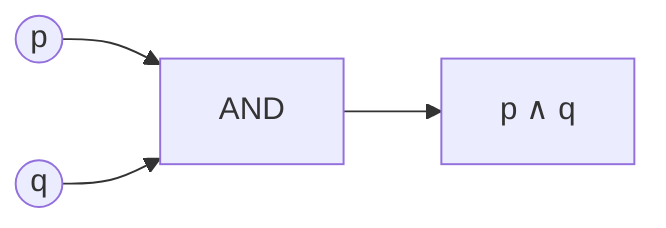

# Logica proposizionale: connettivi e tabelle di verità

La logica proposizionale (o "logica degli enunciati", *sentential logic* in inglese) è la più semplice delle logiche formali. Tratta gli enunciati come blocchi atomici che possono valere solo **vero (V)** o **falso (F)**, e li combina con cinque operatori. Aristotele non c'era ancora arrivato — gli **Stoici** sì (Crisippo, III secolo a.C.) — ed è stata rifondata in forma moderna da George Boole nel 1854 con *An Investigation of the Laws of Thought*.

L'idea è radicale: ridurre il ragionamento a calcolo meccanico. Una volta che hai la tabella di verità, decidere se un argomento proposizionale è valido diventa una procedura algoritmica, non una questione di gusto.

## 1. Enunciati atomici e composti

Un **enunciato** è una frase dichiarativa che ha un valore di verità. "Piove a Torino" è un enunciato (vero o falso, dipende dal momento). "Apri la finestra!" non lo è — è un imperativo, non è né vero né falso. Anche "che ore sono?" non è un enunciato.

In logica proposizionale gli enunciati atomici si denotano con lettere: $p, q, r, s, \ldots$. Sono atomici nel senso che non vengono analizzati internamente. "Tutti i corvi sono neri" può essere $p$ in logica proposizionale; per analizzarlo dentro servirà la [logica dei predicati](12-logica-predicati-sintassi.html).

Gli **enunciati composti** si costruiscono combinando atomici con i connettivi.

## 2. I cinque connettivi

| Connettivo | Simbolo | Lettura italiano | Operazione |
|---|---|---|---|
| Negazione | $\neg$ | "non $p$" | NOT |
| Congiunzione | $\wedge$ | "$p$ e $q$" | AND |
| Disgiunzione | $\vee$ | "$p$ o $q$" (inclusivo) | OR |
| Implicazione | $\rightarrow$ | "se $p$ allora $q$" | IF→THEN |
| Biconcizionale | $\leftrightarrow$ | "$p$ se e solo se $q$" | IFF |

Si usano anche $\overline{p}$ o $\sim p$ per la negazione, $\&$ per AND, $\supset$ per implicazione. Sintassi diverse, stessa semantica.

### 2.1 Tabelle di verità dei connettivi base

| $p$ | $q$ | $\neg p$ | $p \wedge q$ | $p \vee q$ | $p \rightarrow q$ | $p \leftrightarrow q$ |
|---|---|---|---|---|---|---|
| V | V | F | V | V | V | V |
| V | F | F | F | V | F | F |
| F | V | V | F | V | V | F |
| F | F | V | F | F | V | V |

Tre cose contro-intuitive da memorizzare:

- $p \vee q$ è **inclusivo**: vale V anche quando *entrambi* sono V. L'OR esclusivo (XOR) è un'altra operazione: $p \oplus q$.
- $p \rightarrow q$ è **falso solo quando $p$ è V e $q$ è F**. In particolare, una premessa falsa rende l'intera implicazione vera ("se la luna è di formaggio, allora $2+2=4$" è vero). Questo è il famoso *paradosso dell'implicazione materiale*: la logica formale non richiede un *legame* tra antecedente e conseguente, solo la coerenza dei valori di verità.
- $p \leftrightarrow q$ è V quando $p$ e $q$ hanno lo stesso valore di verità.

## 3. Costruire una tabella di verità complessa

Esempio: tabella di verità di $(p \rightarrow q) \wedge \neg q$.

Con due variabili abbiamo $2^2 = 4$ righe. Aggiungiamo colonne intermedie:

| $p$ | $q$ | $p \rightarrow q$ | $\neg q$ | $(p \rightarrow q) \wedge \neg q$ |
|---|---|---|---|---|
| V | V | V | F | F |
| V | F | F | V | F |
| F | V | V | F | F |
| F | F | V | V | V |

La formula è vera in una sola riga (quella in cui $p$ e $q$ sono entrambi F). Non è una tautologia. Non è una contraddizione.

Con $n$ variabili atomiche servono $2^n$ righe. Tre variabili = 8 righe, quattro = 16. Da 5–6 in su le tabelle diventano impraticabili a mano e si usano altre tecniche (vedi [equivalenze e forme normali](08-equivalenze-forme-normali.html)).

## 4. Tautologie, contraddizioni, contingenze

Una formula è:

- **Tautologia** se è V in *tutte* le righe. Esempi: $p \vee \neg p$ (principio del terzo escluso), $p \rightarrow p$, $\neg(p \wedge \neg p)$ (principio di non-contraddizione), $(p \rightarrow q) \leftrightarrow (\neg q \rightarrow \neg p)$ (contropositiva).
- **Contraddizione** se è F in tutte le righe. Esempio: $p \wedge \neg p$.
- **Contingenza** se è V in alcune righe e F in altre. La maggior parte delle formule "ordinarie" è contingente.

Una formula è **soddisfacibile** se esiste *almeno una* riga in cui è V. Il problema "esiste un assegnamento di V/F che renda vera questa formula?" è il famoso **SAT problem**, primo problema dimostrato NP-completo (Cook, 1971).

## 5. Validità di un argomento

Un argomento proposizionale $P_1, P_2, \ldots, P_n \vdash C$ è **valido** se in ogni riga della tabella di verità in cui tutte le premesse $P_i$ sono V, anche la conclusione $C$ è V. Equivalentemente: $(P_1 \wedge P_2 \wedge \cdots \wedge P_n) \rightarrow C$ è una tautologia.

Esempio. Argomento: $p \rightarrow q$, $p \vdash q$ (modus ponens — vedi [regole di inferenza](09-regole-inferenza.html)).

| $p$ | $q$ | $p \rightarrow q$ | $p$ | $q$ |
|---|---|---|---|---|
| V | V | V | **V** | **V** |
| V | F | F | V | F |
| F | V | V | F | V |
| F | F | V | F | F |

Solo nella prima riga entrambe le premesse sono V — e lì anche la conclusione è V. Argomento valido.

## 6. Visualizzazione: un AND come "porta logica"

Le porte logiche dell'hardware digitale sono letteralmente l'implementazione fisica di questi connettivi. Ogni CPU è un castello di AND, OR, NOT, XOR connesse.

## 7. Errore tipico

**"Se p allora q" non significa "p se e solo se q"**. Confondere $\rightarrow$ con $\leftrightarrow$ è la radice di molte fallacie: l'**affermazione del conseguente** (vedi [fallacie formali](20-fallacie-formali.html)) tratta $p \rightarrow q, q \vdash p$ come se fosse valido — e non lo è, perché $q$ può essere vero per altri motivi.

## Esercizi

  
Esercizio 1 — tabella di verità di $p \rightarrow (q \rightarrow p)$

| $p$ | $q$ | $q \rightarrow p$ | $p \rightarrow (q \rightarrow p)$ |
|---|---|---|---|
| V | V | V | V |
| V | F | V | V |
| F | V | F | V |
| F | F | V | V |

È una **tautologia**. Lettura intuitiva: "se $p$ è vera, allora $p$ rimane vera comunque sia $q$".

  
Esercizio 2 — è valido $(p \vee q), \neg p \vdash q$?

| $p$ | $q$ | $p \vee q$ | $\neg p$ | $q$ |
|---|---|---|---|---|
| V | V | V | F | V |
| V | F | V | F | F |
| F | V | V | V | **V** |
| F | F | F | V | F |

Solo nella terza riga entrambe le premesse sono V, e lì $q$ è V. **Valido**. Si chiama sillogismo disgiuntivo (modus tollendo ponens).

  
Esercizio 3 — è valido $p \rightarrow q, q \vdash p$?

| $p$ | $q$ | $p \rightarrow q$ | $q$ | $p$ |
|---|---|---|---|---|
| V | V | V | V | V |
| V | F | F | F | V |
| F | V | V | **V** | **F** |
| F | F | V | F | F |

Nella terza riga le premesse sono entrambe V ma la conclusione è F: controesempio. **Non valido**. Questa è la fallacia di affermazione del conseguente.

## Sintesi

- Cinque connettivi: $\neg, \wedge, \vee, \rightarrow, \leftrightarrow$.
- Tabella di verità = enumerazione esaustiva di tutti gli assegnamenti V/F alle variabili.
- Tautologia (sempre V), contraddizione (sempre F), contingenza (mista). Soddisfacibilità = problema SAT.
- Validità di un argomento: nessuna riga ha premesse V e conclusione F.
- $\rightarrow$ è l'implicazione *materiale*: falsa solo se antecedente V e conseguente F. Non è "implicazione causale".

## Letture

- George Boole, *An Investigation of the Laws of Thought* (1854) — il fondamento.
- Irving Copi & Carl Cohen, *Introduction to Logic* — manuale classico.
- Elliott Mendelson, *Introduction to Mathematical Logic*, cap. 1 — versione rigorosa.
- Wilfried Hodges, *Logic* (Penguin) — introduzione divulgativa di altissimo livello.
