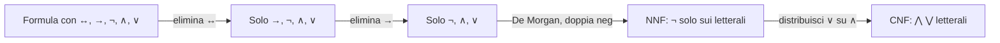

# Equivalenze logiche, De Morgan, forme normali

Due formule sono **logicamente equivalenti** (notazione $\equiv$) se hanno la stessa tabella di verità. Riconoscere e applicare equivalenze permette di semplificare, di dimostrare formule senza enumerare tutte le righe, e di riportare ogni formula in una **forma normale** che gli algoritmi (e i circuiti digitali) sanno digerire.

## 1. Equivalenze fondamentali

Le memorizzi una volta nella vita.

| Nome | Equivalenza |
|---|---|
| Doppia negazione | $\neg\neg p \equiv p$ |
| Idempotenza | $p \wedge p \equiv p$; $p \vee p \equiv p$ |
| Commutativa | $p \wedge q \equiv q \wedge p$; $p \vee q \equiv q \vee p$ |
| Associativa | $(p \wedge q) \wedge r \equiv p \wedge (q \wedge r)$; idem per $\vee$ |
| Distributiva | $p \wedge (q \vee r) \equiv (p \wedge q) \vee (p \wedge r)$ |
|  | $p \vee (q \wedge r) \equiv (p \vee q) \wedge (p \vee r)$ |
| Assorbimento | $p \wedge (p \vee q) \equiv p$; $p \vee (p \wedge q) \equiv p$ |
| De Morgan | $\neg(p \wedge q) \equiv \neg p \vee \neg q$ |
|  | $\neg(p \vee q) \equiv \neg p \wedge \neg q$ |
| Implicazione materiale | $p \rightarrow q \equiv \neg p \vee q$ |
| Contropositiva | $p \rightarrow q \equiv \neg q \rightarrow \neg p$ |
| Biconcizionale | $p \leftrightarrow q \equiv (p \rightarrow q) \wedge (q \rightarrow p)$ |
|  | $p \leftrightarrow q \equiv (p \wedge q) \vee (\neg p \wedge \neg q)$ |
| Terzo escluso | $p \vee \neg p \equiv \top$ |
| Non-contraddizione | $p \wedge \neg p \equiv \bot$ |

Verifica una qualsiasi costruendo le due tabelle di verità: vedi che coincidono.

### 1.1 De Morgan in italiano

Le leggi di De Morgan (Augustus De Morgan, 1806–1871) sono le più utili nella vita reale. Significano:

> "Non è vero che $A$ E $B$" equivale a "non $A$ OPPURE non $B$".
> "Non è vero che $A$ O $B$" equivale a "non $A$ E non $B$".

Esempio: "Non è vero che sia ricco e felice" = "O non è ricco, o non è felice (o entrambi)". È quasi sempre la trasformazione che ti permette di smontare una negazione di un'affermazione complessa.

## 2. Implicazione, contropositiva, conversa, inversa

Da $p \rightarrow q$ si possono ottenere quattro forme.

| Nome | Formula | Equivalente a $p \rightarrow q$? |
|---|---|---|
| Diretta | $p \rightarrow q$ | sì (è essa stessa) |
| Conversa | $q \rightarrow p$ | **NO** |
| Inversa | $\neg p \rightarrow \neg q$ | **NO** |
| Contropositiva | $\neg q \rightarrow \neg p$ | **sì** |

La confusione tra **diretta** e **conversa** è la base della fallacia di affermazione del conseguente. La confusione tra **diretta** e **inversa** è la fallacia di negazione dell'antecedente. (Vedi [fallacie formali](20-fallacie-formali.html).)

La contropositiva è invece equivalente: dimostrare $p \rightarrow q$ è la stessa cosa che dimostrare $\neg q \rightarrow \neg p$. Spesso è più semplice (è la dimostrazione "per contrapposizione").

## 3. Forme normali

Una **forma normale** è una sintassi canonica per le formule: due formule equivalenti hanno la stessa rappresentazione (a meno di banalità). Le due principali:

### 3.1 Forma Normale Congiuntiva (CNF)

Una formula è in CNF se è una **congiunzione di disgiunzioni di letterali** (un letterale = variabile o sua negazione). Esempio:

$$(p \vee \neg q) \wedge (\neg p \vee q \vee r) \wedge (\neg r)$$

Ogni parentesi è una **clausola**. CNF è la rappresentazione standard per i SAT solver (DPLL, CDCL) e per il calcolo di risoluzione.

### 3.2 Forma Normale Disgiuntiva (DNF)

Una formula è in DNF se è una **disgiunzione di congiunzioni di letterali**. Esempio:

$$(p \wedge q \wedge \neg r) \vee (\neg p \wedge q) \vee (r)$$

DNF rispecchia direttamente le righe V della tabella di verità.

### 3.3 Forma Normale Negativa (NNF)

Forma intermedia: tutte le negazioni sono "spinte" davanti ai letterali (mai davanti a $\wedge$, $\vee$, $\rightarrow$). Si ottiene applicando De Morgan e doppia negazione.

## 4. Algoritmo: portare una formula in CNF

Passi:

1. **Elimina $\leftrightarrow$**: $p \leftrightarrow q \equiv (p \rightarrow q) \wedge (q \rightarrow p)$.
2. **Elimina $\rightarrow$**: $p \rightarrow q \equiv \neg p \vee q$.
3. **Spingi le $\neg$ verso le foglie** usando De Morgan e doppia negazione (arrivi a NNF).
4. **Distribuisci $\vee$ su $\wedge$**: $A \vee (B \wedge C) \equiv (A \vee B) \wedge (A \vee C)$. Ripeti fino a saturazione.

### 4.1 Esempio passo-passo

Convertire $(p \rightarrow q) \wedge (\neg r \rightarrow s)$ in CNF.

**Passo 1**: niente $\leftrightarrow$.

**Passo 2**: elimina $\rightarrow$:
$$(\neg p \vee q) \wedge (\neg\neg r \vee s)$$
$$\equiv (\neg p \vee q) \wedge (r \vee s)$$

**Passo 3**: niente negazioni da spingere.

**Passo 4**: la formula è già una congiunzione di disgiunzioni di letterali. ✔ Fine.

CNF risultante: $(\neg p \vee q) \wedge (r \vee s)$. Due clausole.

### 4.2 Esempio meno banale

Convertire $\neg(p \wedge (q \vee r))$ in CNF.

**Passo 1, 2**: niente da fare.

**Passo 3**: De Morgan applicata alla negazione esterna:
$$\neg p \vee \neg(q \vee r) \equiv \neg p \vee (\neg q \wedge \neg r)$$

**Passo 4**: distribuire $\vee$ su $\wedge$:
$$(\neg p \vee \neg q) \wedge (\neg p \vee \neg r)$$

Due clausole, CNF ottenuta.

## 5. Espansione esponenziale: attenzione

La conversione in CNF può far esplodere la dimensione della formula. Esempio: $(p_1 \wedge q_1) \vee (p_2 \wedge q_2) \vee \cdots \vee (p_n \wedge q_n)$ in DNF è già lunga $n$; in CNF richiede $2^n$ clausole. Per evitare l'esplosione si usano trasformazioni che introducono variabili nuove (Tseitin transformation), che producono una formula **equisoddisfacibile** ma non *equivalente* — basta per SAT.

## 6. Funzionale completezza

Un insieme di connettivi è **funzionalmente completo** se basta a esprimere qualsiasi funzione booleana. Risultati:

- $\{\neg, \wedge, \vee\}$ è completo.
- $\{\neg, \wedge\}$ è completo (puoi sintetizzare OR via De Morgan).
- $\{\neg, \vee\}$ è completo.
- $\{\rightarrow, \neg\}$ è completo.
- **NAND** (Sheffer stroke, $p \uparrow q \equiv \neg(p \wedge q)$) da solo è completo. Idem **NOR** (Peirce, $\downarrow$). È perché certi circuiti elettronici usano solo NAND o solo NOR — riducono il costo di produzione.

## 7. Diagramma: pipeline di conversione in CNF

## Esercizi

  
Esercizio 1 — semplifica $\neg(p \rightarrow \neg q)$

Step 1: implicazione materiale: $p \rightarrow \neg q \equiv \neg p \vee \neg q$.

Step 2: $\neg(\neg p \vee \neg q)$. De Morgan: $\neg\neg p \wedge \neg\neg q$.

Step 3: doppia negazione: $p \wedge q$.

Risposta: $p \wedge q$.

  
Esercizio 2 — verifica $(p \rightarrow q) \rightarrow (\neg q \rightarrow \neg p) \equiv \top$

L'antecedente è $p \rightarrow q$. Il conseguente è la contropositiva $\neg q \rightarrow \neg p$. Ma sappiamo che $p \rightarrow q \equiv \neg q \rightarrow \neg p$, quindi l'implicazione $p \rightarrow q \rightarrow (\neg q \rightarrow \neg p)$ è del tipo $X \rightarrow X$, che è una tautologia.

Verifica tabellare:
| $p$ | $q$ | $p \rightarrow q$ | $\neg q \rightarrow \neg p$ | $\rightarrow$ |
|---|---|---|---|---|
| V | V | V | V | V |
| V | F | F | F | V |
| F | V | V | V | V |
| F | F | V | V | V |

Tautologia confermata.

  
Esercizio 3 — converti $(p \vee q) \wedge \neg(p \wedge r)$ in CNF

Applichiamo De Morgan a $\neg(p \wedge r)$: $\neg p \vee \neg r$.

Risultato: $(p \vee q) \wedge (\neg p \vee \neg r)$. Già in CNF.

## Sintesi

- Due formule equivalenti $\equiv$ se hanno stessa tabella di verità.
- Equivalenze fondamentali: commut., assoc., distrib., De Morgan, doppia neg., implicazione materiale, contropositiva.
- Diretta ed inversa NON sono equivalenti. Diretta e contropositiva sì.
- CNF = $\wedge$ di clausole ($\vee$ di letterali). DNF = $\vee$ di mintermini ($\wedge$ di letterali).
- Algoritmo CNF: elimina ↔, elimina →, NNF (De Morgan), distribuisci ∨ su ∧.
- $\{\text{NAND}\}$ è funzionalmente completo da solo.

## Letture

- Mendelson, *Introduction to Mathematical Logic*, cap. 1.
- Russell & Norvig, *AIMA*, cap. 7 — collegamento con SAT e knowledge representation.
- Marques-Silva, *Conflict-Driven Clause Learning SAT Solvers* — versione moderna degli algoritmi.
