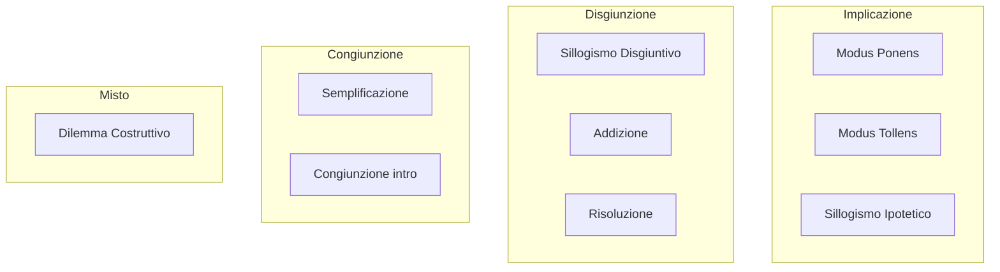

# Regole di inferenza

Una **regola di inferenza** è uno schema che ti permette di passare da premesse a conclusioni preservando la verità. Sono i "mattoni" delle dimostrazioni. Tutte sono varianti di una tautologia di base — se le metti in tabella di verità funzionano sempre.

La notazione standard è:

$$\frac{P_1 \quad P_2 \quad \ldots \quad P_n}{C}$$

Le premesse sopra, la conclusione sotto. Una regola è **valida** se non esiste un assegnamento in cui le premesse sono V e la conclusione F.

## 1. Le regole di base

### 1.1 Modus Ponens (MP)

$$\frac{p \rightarrow q \qquad p}{q}$$

"Se piove allora la strada è bagnata. Piove. Quindi la strada è bagnata." È la regola fondamentale: la trovi praticamente in ogni dimostrazione. Si chiama anche *modus ponendo ponens* ("modo che, affermando, afferma").

### 1.2 Modus Tollens (MT)

$$\frac{p \rightarrow q \qquad \neg q}{\neg p}$$

"Se piove allora la strada è bagnata. La strada non è bagnata. Quindi non piove." Negando il conseguente, neghi l'antecedente. Equivale a usare la contropositiva: $p \rightarrow q \equiv \neg q \rightarrow \neg p$, poi MP.

### 1.3 Sillogismo Ipotetico (HS)

$$\frac{p \rightarrow q \qquad q \rightarrow r}{p \rightarrow r}$$

Transitività dell'implicazione. "Se studio passo l'esame. Se passo l'esame mi laureo. Quindi se studio mi laureo."

### 1.4 Sillogismo Disgiuntivo (DS)

$$\frac{p \vee q \qquad \neg p}{q}$$

"O è in casa o è in ufficio. Non è in casa. Quindi è in ufficio." Conosciuto anche come *modus tollendo ponens*.

### 1.5 Dilemma Costruttivo (CD)

$$\frac{(p \rightarrow q) \wedge (r \rightarrow s) \qquad p \vee r}{q \vee s}$$

Variante del modus ponens applicato a una disgiunzione. Doppia possibilità, doppia conseguenza.

### 1.6 Semplificazione (Simp)

$$\frac{p \wedge q}{p} \qquad \text{(simmetrica per $q$)}$$

Da una congiunzione puoi estrarre uno dei congiunti. Banalmente vero.

### 1.7 Congiunzione (Conj)

$$\frac{p \qquad q}{p \wedge q}$$

L'opposto di Simp: se hai entrambi i pezzi, hai la coppia. Anche detta *introduzione del $\wedge$*.

### 1.8 Addizione (Add)

$$\frac{p}{p \vee q}$$

Se sai $p$, sai anche $p \vee q$ per qualsiasi $q$. Sembra banale e lo è — ma serve per costruire formule con $\vee$ nella conclusione.

### 1.9 Risoluzione

$$\frac{p \vee q \qquad \neg p \vee r}{q \vee r}$$

La regola che fa girare la maggior parte dei SAT solver moderni e il linguaggio Prolog. È un'unica regola **completa** per la dimostrazione di formule in CNF: applicandola in tutti i modi possibili scopri ogni inconsistenza (Robinson, 1965).

## 2. Tabella riassuntiva

| Sigla | Nome | Schema |
|---|---|---|
| MP | Modus Ponens | $p \rightarrow q, p \vdash q$ |
| MT | Modus Tollens | $p \rightarrow q, \neg q \vdash \neg p$ |
| HS | Sillogismo Ipotetico | $p \rightarrow q, q \rightarrow r \vdash p \rightarrow r$ |
| DS | Sillogismo Disgiuntivo | $p \vee q, \neg p \vdash q$ |
| CD | Dilemma Costruttivo | $(p \rightarrow q) \wedge (r \rightarrow s), p \vee r \vdash q \vee s$ |
| Simp | Semplificazione | $p \wedge q \vdash p$ |
| Conj | Congiunzione | $p, q \vdash p \wedge q$ |
| Add | Addizione | $p \vdash p \vee q$ |
| Res | Risoluzione | $p \vee q, \neg p \vee r \vdash q \vee r$ |

## 3. Esempio di dimostrazione strutturata

Dimostrare: da $p \rightarrow q$, $\neg q \vee r$, $\neg r$ segue $\neg p$.

| # | Formula | Giustificazione |
|---|---|---|
| 1 | $p \rightarrow q$ | premessa |
| 2 | $\neg q \vee r$ | premessa |
| 3 | $\neg r$ | premessa |
| 4 | $\neg q$ | DS su 2, 3 |
| 5 | $\neg p$ | MT su 1, 4 |

Dimostrazione completata. Ogni passo è giustificato da una regola e dai numeri delle linee precedenti su cui si applica. Questa è la struttura di una *Fitch-style proof* (che vedremo meglio in [deduzione naturale](10-deduzione-naturale.html)).

## 4. Gli errori comuni: fallacie formali "gemelle" delle regole valide

| Regola valida | Fallacia "gemella" | Schema fallace |
|---|---|---|
| Modus Ponens | **Affermazione del conseguente** | $p \rightarrow q, q \vdash p$ |
| Modus Tollens | **Negazione dell'antecedente** | $p \rightarrow q, \neg p \vdash \neg q$ |

Esempio di affermazione del conseguente: "Se piove, la strada è bagnata. La strada è bagnata. Quindi piove." Falso: la strada può essere bagnata anche perché è passato il camion delle pulizie. Vedi [fallacie formali](20-fallacie-formali.html).

## 5. Diagramma: il "pacchetto" delle regole

## 6. Validità garantita: tabelle di verità di alcune regole

Modus Tollens, verifica tabellare:

| $p$ | $q$ | $p \rightarrow q$ | $\neg q$ | $\neg p$ |
|---|---|---|---|---|
| V | V | V | F | F |
| V | F | F | V | F |
| F | V | V | F | V |
| F | F | V | V | **V** |

Solo nelle righe 3 e 4 (impossibili: riga 3 ha $\neg q$ falso, ignorala; riga 4) le premesse sono entrambe V — e lì $\neg p$ è V. ✔.

## Esercizi

  
Esercizio 1 — dimostra $\neg s$ da $p \rightarrow q$, $q \rightarrow r$, $r \rightarrow \neg s$, $p$

| 1 | $p \rightarrow q$ | premessa |
| 2 | $q \rightarrow r$ | premessa |
| 3 | $r \rightarrow \neg s$ | premessa |
| 4 | $p$ | premessa |
| 5 | $q$ | MP 1, 4 |
| 6 | $r$ | MP 2, 5 |
| 7 | $\neg s$ | MP 3, 6 |

  
Esercizio 2 — classifica come valido o fallacia: "Se piove, prendo l'ombrello. Non piove. Quindi non prendo l'ombrello."

Schema: $p \rightarrow q$, $\neg p \vdash \neg q$. **Fallacia: negazione dell'antecedente**. La conclusione non segue. Potresti prendere l'ombrello anche perché il meteo prevede pioggia più tardi.

  
Esercizio 3 — usa la risoluzione su $\{p \vee q, \neg p \vee r, \neg q\}$ per derivare $r$

| 1 | $p \vee q$ | premessa |
| 2 | $\neg p \vee r$ | premessa |
| 3 | $\neg q$ | premessa |
| 4 | $q \vee r$ | Res 1, 2 (eliminando $p$) |
| 5 | $r$ | DS su 4, 3 (eliminando $q$) — equivalente a Res 4, 3 |

## Sintesi

- Una regola è valida se non esiste assegnamento di V/F che renda V tutte le premesse e F la conclusione.
- Le nove regole standard (MP, MT, HS, DS, CD, Simp, Conj, Add, Res) coprono il grosso del ragionamento proposizionale.
- Una dimostrazione strutturata = sequenza numerata di formule, ognuna con giustificazione (premessa, o regola+linee).
- Affermazione del conseguente e negazione dell'antecedente sono le due fallacie formali più comuni — gemelle invertite di MP e MT.
- Risoluzione da sola è completa per CNF (Robinson 1965): è la base di Prolog e dei SAT solver.

## Letture

- Copi & Cohen, *Introduction to Logic*, cap. 9.
- Genesereth & Nilsson, *Logical Foundations of AI*, cap. 4 — risoluzione.
- Russell & Norvig, *AIMA*, cap. 7 — uso pratico in AI.
