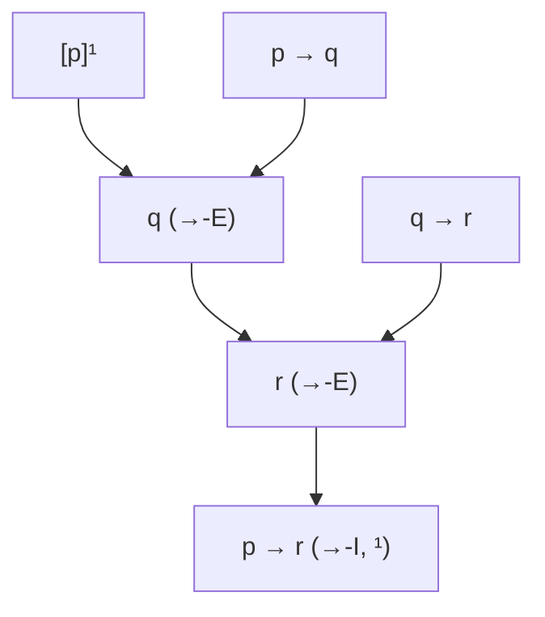

# Deduzione naturale: regole I/E e dimostrazione strutturata

La deduzione naturale nasce dal disagio di Gerhard Gentzen di fronte ai sistemi assiomatici alla Frege-Hilbert: lunghi, contro-intuitivi, popolati di assiomi che nessun matematico in carne ed ossa usa quando ragiona davvero. Nel 1934 (*Untersuchungen über das logische Schließen*) Gentzen introduce **NK** (natural deduction klassisch) e **NJ** (intuitionistisch): un sistema in cui ogni connettivo ha due regole — una di **introduzione** (I), che ne giustifica la formazione, e una di **eliminazione** (E), che ne sfrutta la presenza. Dag Prawitz nel 1965 darà al sistema la forma canonica che ancora si insegna oggi (*Natural Deduction: A Proof-Theoretical Study*).

L'idea simmetrica I/E ha un'eleganza filosofica: il significato di un connettivo è interamente catturato dalle regole che lo introducono e lo eliminano. È la celebre tesi inferenzialista (Brandom, Dummett): "il significato è uso", letteralmente. Questa sezione mostra le regole, due notazioni concorrenti (Fitch e albero), un paio di dimostrazioni e il delicato meccanismo del **discharge** delle assunzioni.

## 1. Regole I/E per i connettivi

Per ogni connettivo proposizionale forniamo coppia I/E. Useremo $\varphi, \psi, \chi$ per formule generiche e $\Gamma$ per insiemi di assunzioni attive.

### Congiunzione $\wedge$

$$\frac{\varphi \qquad \psi}{\varphi \wedge \psi}\; \wedge\text{-I} \qquad \frac{\varphi \wedge \psi}{\varphi}\; \wedge\text{-E}_1 \qquad \frac{\varphi \wedge \psi}{\psi}\; \wedge\text{-E}_2$$

### Implicazione $\rightarrow$

$$\frac{[\varphi]^n \;\vdots\; \psi}{\varphi \rightarrow \psi}\; \rightarrow\text{-I}^n \qquad \frac{\varphi \rightarrow \psi \qquad \varphi}{\psi}\; \rightarrow\text{-E (modus ponens)}$$

L'apice $n$ marca l'assunzione che viene **scaricata** (discharged) — non è più "viva" dopo la regola.

### Disgiunzione $\vee$

$$\frac{\varphi}{\varphi \vee \psi}\; \vee\text{-I}_1 \qquad \frac{\psi}{\varphi \vee \psi}\; \vee\text{-I}_2$$

$$\frac{\varphi \vee \psi \qquad [\varphi]^n \;\vdots\; \chi \qquad [\psi]^m \;\vdots\; \chi}{\chi}\; \vee\text{-E}^{n,m}$$

L'eliminazione della disgiunzione è **ragionamento per casi**: se ho $\varphi \vee \psi$ e da ciascun disgiunto deriva $\chi$, allora $\chi$.

### Negazione $\neg$ e falso $\bot$

Definizione standard: $\neg \varphi \equiv \varphi \rightarrow \bot$.

$$\frac{[\varphi]^n \;\vdots\; \bot}{\neg \varphi}\; \neg\text{-I}^n \qquad \frac{\varphi \qquad \neg \varphi}{\bot}\; \neg\text{-E}$$

$$\frac{\bot}{\varphi}\; \bot\text{-E (ex falso)} \qquad \frac{[\neg \varphi]^n \;\vdots\; \bot}{\varphi}\; \text{RAA (reductio)}^n$$

La RAA (reductio ad absurdum) è **classicamente** valida ma **non intuizionisticamente** — la grande linea di faglia che separa NK da NJ e che esploriamo in [Logiche non classiche](18-logiche-non-classiche.html).

### Bicondizionale $\leftrightarrow$

Definito come $(\varphi \rightarrow \psi) \wedge (\psi \rightarrow \varphi)$, con regole derivabili.

## 2. Due notazioni: Fitch e ad albero

### Notazione Fitch (a colonne)

Inventata da Frederic Fitch nel 1952 (*Symbolic Logic*). Le assunzioni aprono un sotto-blocco indentato; il blocco si chiude quando l'assunzione viene scaricata.

```
1 │ p → q              premessa
2 │ q → r              premessa
3 │ ┌── p              assunzione [a]
4 │ │   q              →-E (1, 3)
5 │ │   r              →-E (2, 4)
6 │ └── 
7 │   p → r            →-I [a] (3-5)
```

Leggibile come un programma: l'indentazione corrisponde all'**ambito** dell'assunzione, esattamente come uno scope in un linguaggio di programmazione (collegamento profondo: vedi [Curry-Howard](19-curry-howard-type-theory.html)).

### Notazione ad albero

Le premesse stanno in alto, le conclusioni in basso, ogni regola è una linea orizzontale. Le foglie sono assunzioni; quelle scaricate vengono parentesizzate.



Le due notazioni sono **equivalenti**: ogni dimostrazione Fitch si traduce in albero e viceversa. Fitch è più compatta per dimostrazioni lunghe; l'albero rende più visibile la struttura ricorsiva delle regole.

## 3. Esempio lavorato: $(p \rightarrow q), (q \rightarrow r) \vdash (p \rightarrow r)$

L'aviazione del modus ponens combinato a $\rightarrow$-I: la transitività dell'implicazione.

```
1 │ p → q              premessa
2 │ q → r              premessa
3 │ ┌── p              assunzione [a]
4 │ │   q              →-E (1, 3)
5 │ │   r              →-E (2, 4)
6 │ └── 
7 │   p → r            →-I [a] (3-5)
```

**Lettura discorsiva**: assumiamo $p$. Da $p \rightarrow q$ e $p$ otteniamo $q$. Da $q \rightarrow r$ e $q$ otteniamo $r$. Abbiamo dimostrato $r$ a partire dall'assunzione $p$: per $\rightarrow$-I scarichiamo $p$ e concludiamo $p \rightarrow r$. L'apice $[a]$ marca la corrispondenza: l'assunzione introdotta a riga 3 viene scaricata a riga 7.

## 4. Esempio lavorato: $\vdash p \vee \neg p$ (terzo escluso) — classico, non intuizionista

In NK la dimostrazione richiede RAA. È un classico esercizio:

```
1 │ ┌── ¬(p ∨ ¬p)       assunzione [a]
2 │ │   ┌── p           assunzione [b]
3 │ │   │   p ∨ ¬p      ∨-I₁ (2)
4 │ │   │   ⊥           ¬-E (1, 3)
5 │ │   └── 
6 │ │   ¬p              ¬-I [b] (2-5)
7 │ │   p ∨ ¬p          ∨-I₂ (6)
8 │ │   ⊥               ¬-E (1, 7)
9 │ └── 
10│  p ∨ ¬p             RAA [a] (1-8)
```

Cinque mosse, due assunzioni annidate. In **NJ** (intuizionista) la regola RAA non c'è: ci si ferma a $\neg \neg (p \vee \neg p)$, che invece **è** intuizionisticamente valido. L'intuizionista nega che ogni proposizione abbia *adesso* un valore di verità determinato — vedi [logiche non classiche](18-logiche-non-classiche.html) per la motivazione filosofica (Brouwer, Heyting).

## 5. Discharge: il meccanismo cruciale

Un'assunzione "vive" finché non viene scaricata. Le regole che scaricano sono:

- $\rightarrow$-I (scarica l'antecedente)
- $\vee$-E (scarica i disgiunti, uno per sotto-prova)
- $\neg$-I (scarica la formula negata)
- RAA (scarica la negazione)

Una dimostrazione di $\varphi$ è **chiusa** se al termine non ci sono assunzioni vive. Una dimostrazione con assunzioni $\Gamma$ vive dimostra $\Gamma \vdash \varphi$, ovvero "$\varphi$ segue da $\Gamma$".

> **⚠ Attenzione**: scaricare un'assunzione *fuori dal suo ambito* è un errore frequente per chi inizia. In notazione Fitch corrisponde a "uscire dal blocco e poi richiamare una linea interna". In notazione ad albero: una foglia parentesizzata deve essere dominata da una regola che scarica del giusto tipo.

## 6. Diagramma: l'albero di $(p \rightarrow q), (q \rightarrow r) \vdash (p \rightarrow r)$

<div class="chart">
<svg viewBox="0 0 520 280" xmlns="http://www.w3.org/2000/svg" role="img" aria-label="Albero di dimostrazione">
  <rect width="520" height="280" fill="#0f0f23"/>
  <g font-family="ui-monospace, monospace" font-size="13" fill="#ecebff">
    <rect x="40" y="20" width="100" height="28" fill="#181834" stroke="#9a8cf0"/>
    <text x="90" y="38" text-anchor="middle">p → q</text>
    <rect x="170" y="20" width="60" height="28" fill="#181834" stroke="#9a8cf0"/>
    <text x="200" y="38" text-anchor="middle">[p]¹</text>
    <line x1="40" y1="60" x2="230" y2="60" stroke="#9a8cf0" stroke-width="1.5"/>
    <text x="240" y="64" fill="#9a8cf0">→-E</text>
    <rect x="120" y="76" width="60" height="28" fill="#181834" stroke="#9a8cf0"/>
    <text x="150" y="94" text-anchor="middle">q</text>
    <rect x="240" y="76" width="100" height="28" fill="#181834" stroke="#9a8cf0"/>
    <text x="290" y="94" text-anchor="middle">q → r</text>
    <line x1="120" y1="116" x2="340" y2="116" stroke="#9a8cf0" stroke-width="1.5"/>
    <text x="350" y="120" fill="#9a8cf0">→-E</text>
    <rect x="210" y="132" width="60" height="28" fill="#181834" stroke="#9a8cf0"/>
    <text x="240" y="150" text-anchor="middle">r</text>
    <line x1="160" y1="172" x2="320" y2="172" stroke="#9a8cf0" stroke-width="1.5"/>
    <text x="330" y="176" fill="#9a8cf0">→-I, ¹</text>
    <rect x="200" y="188" width="80" height="28" fill="#181834" stroke="#9a8cf0"/>
    <text x="240" y="206" text-anchor="middle">p → r</text>
    <text x="260" y="250" text-anchor="middle" fill="#7a7aa0">L'assunzione [p]¹ viene scaricata in fondo.</text>
  </g>
</svg>
<div class="chart-caption">Albero di Gentzen-Prawitz: le foglie [p]¹ sono assunzioni scaricate, marcate dall'indice numerico ripreso dalla regola finale.</div>
</div>

## 7. Esercizi

<details>
  <summary>Esercizio 1 — dimostra $p \wedge q \vdash q \wedge p$ (commutatività della congiunzione)</summary>

```
1 │ p ∧ q              premessa
2 │ p                  ∧-E₁ (1)
3 │ q                  ∧-E₂ (1)
4 │ q ∧ p              ∧-I (3, 2)
```

Tre passi, nessuna assunzione da scaricare.
</details>

<details>
  <summary>Esercizio 2 — dimostra $\vdash p \rightarrow (q \rightarrow p)$ (assioma K)</summary>

```
1 │ ┌── p              assunzione [a]
2 │ │   ┌── q          assunzione [b]
3 │ │   │   p          riuso (1)
4 │ │   └── 
5 │ │   q → p          →-I [b] (2-3)
6 │ └── 
7 │   p → (q → p)      →-I [a] (1-5)
```

L'assunzione $p$ viene "trasportata" attraverso il blocco interno; il blocco interno scarica $q$, quello esterno scarica $p$.
</details>

<details>
  <summary>Esercizio 3 — dimostra $\neg\neg p \vdash p$ (eliminazione della doppia negazione)</summary>

```
1 │ ¬¬p                premessa
2 │ ┌── ¬p             assunzione [a]
3 │ │   ⊥              ¬-E (1, 2)
4 │ └── 
5 │   p                RAA [a] (2-3)
```

Senza RAA (cioè in NJ) **non** sarebbe dimostrabile: questa è una delle frontiere classico/intuizionista.
</details>

## Sintesi

- Ogni connettivo ha **due regole**: introduzione (I) ed eliminazione (E). Il significato è interamente determinato da queste regole (tesi inferenzialista).
- Due notazioni equivalenti: **Fitch** (a blocchi indentati) e **albero** (Gentzen-Prawitz).
- Il **discharge** delle assunzioni è il meccanismo chiave: una dimostrazione chiusa di $\varphi$ non ha assunzioni vive a fine.
- **RAA** e **doppia negazione** separano la logica classica (NK) dall'intuizionista (NJ): solo NK dimostra $p \vee \neg p$.
- La deduzione naturale è il punto di partenza per la corrispondenza [Curry-Howard](19-curry-howard-type-theory.html) e per il calcolo dei sequenti — [sez. 11](11-sistemi-assiomatici-sequenti.html).

## Letture

- Gerhard Gentzen, *Untersuchungen über das logische Schließen* (1934-35) — testo fondativo.
- Dag Prawitz, *Natural Deduction: A Proof-Theoretical Study* (1965).
- Frederic Fitch, *Symbolic Logic: An Introduction* (1952) — la notazione a blocchi.
- Jan von Plato, *Elements of Logical Reasoning* (Cambridge UP, 2013) — manuale moderno.
- Pierluigi Minari, *Logica* (Apogeo) — testo italiano con notazione Fitch dettagliata.
