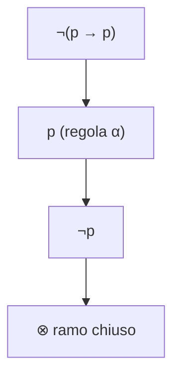
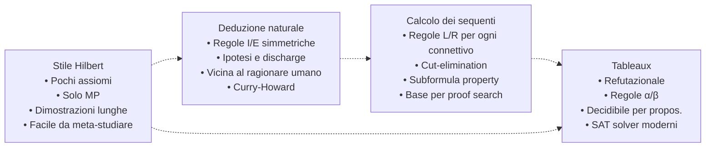

# Sistemi assiomatici e calcolo dei sequenti

Una stessa logica si può presentare in forme molto diverse. Frege nel 1879 (*Begriffsschrift*) scelse lo **stile assiomatico**: pochi schemi assiomatici, una sola regola (modus ponens). Gentzen nel 1934 propose due alternative: la **deduzione naturale** (sez. 10) e il **calcolo dei sequenti**, costruito esplicitamente per rendere dimostrabile il celebre *Hauptsatz* della cut-elimination. Smullyan e Beth, fra anni '50 e '70, codificarono i **tableaux**, un metodo refutazionale che oggi alimenta i SAT solver. Tutte e tre dimostrano gli stessi teoremi della logica classica: differiscono nella granularità, nella facilità d'uso umana e nella trattabilità meta-teorica.

Questa sezione mette le tre presentazioni una accanto all'altra, mostra come si dimostra un teorema in ciascuna, ed enuncia i risultati che le legano (deduzione, cut-elimination, completezza dei tableaux).

## 1. Lo stile Hilbert-Frege

Un **sistema assiomatico** specifica:

1. un insieme di schemi assiomatici (formule che si possono usare gratis, qualunque sostituzione delle metavariabili);
2. un insieme di regole di inferenza, di solito una sola: il **modus ponens** ($\rightarrow$-E).

Una popolare formulazione (Łukasiewicz-Mendelson) della logica proposizionale classica usa solo $\rightarrow$ e $\neg$ come primitivi e ha **tre** schemi:

$$\text{(K)} \quad \varphi \rightarrow (\psi \rightarrow \varphi)$$
$$\text{(S)} \quad (\varphi \rightarrow (\psi \rightarrow \chi)) \rightarrow ((\varphi \rightarrow \psi) \rightarrow (\varphi \rightarrow \chi))$$
$$\text{(N)} \quad (\neg \psi \rightarrow \neg \varphi) \rightarrow (\varphi \rightarrow \psi)$$

più la regola: da $\varphi$ e $\varphi \rightarrow \psi$ si deriva $\psi$.

### Esempio: dimostrazione di $\varphi \rightarrow \varphi$

Sembra banale ma in stile Hilbert costa cinque passi:

1. $\varphi \rightarrow ((\varphi \rightarrow \varphi) \rightarrow \varphi)$  — istanza di K (con $\psi := \varphi \rightarrow \varphi$)
2. $(\varphi \rightarrow ((\varphi \rightarrow \varphi) \rightarrow \varphi)) \rightarrow ((\varphi \rightarrow (\varphi \rightarrow \varphi)) \rightarrow (\varphi \rightarrow \varphi))$ — istanza di S
3. $(\varphi \rightarrow (\varphi \rightarrow \varphi)) \rightarrow (\varphi \rightarrow \varphi)$ — MP (1, 2)
4. $\varphi \rightarrow (\varphi \rightarrow \varphi)$ — istanza di K
5. $\varphi \rightarrow \varphi$ — MP (4, 3)

In deduzione naturale (sez. 10) costa **un passo**: assumi $\varphi$, scarica, ottieni $\varphi \rightarrow \varphi$ per $\rightarrow$-I. È il prezzo dello stile Hilbert: assiomi belli compatti, dimostrazioni lunghissime.

### Teorema di deduzione

Il ponte fra stile Hilbert e ragionamento ipotetico:

$$\Gamma, \varphi \vdash \psi \quad \Longleftrightarrow \quad \Gamma \vdash \varphi \rightarrow \psi$$

Dimostrato per induzione strutturale sulla derivazione. Senza questo teorema lo stile Hilbert sarebbe inutilizzabile.

## 2. Il calcolo dei sequenti di Gentzen: LK e LJ

Un **sequente** è un'espressione del tipo

$$\Gamma \vdash \Delta$$

dove $\Gamma$ (antecedente) e $\Delta$ (succedente) sono **multinsiemi** (o liste) di formule. Lettura intuitiva: la congiunzione di $\Gamma$ implica la disgiunzione di $\Delta$.

- Se $\Delta$ contiene **al più una** formula: sistema **LJ** (intuizionista).
- Se $\Delta$ può contenere qualsiasi numero di formule: sistema **LK** (classico).

La differenza fra LK e LJ è esattamente la stessa che separa NK da NJ in deduzione naturale (sez. 10), e cattura la non-validità del terzo escluso in logica intuizionista — vedi [logiche non classiche](18-logiche-non-classiche.html).

### Assioma e regole strutturali

$$\frac{}{\varphi \vdash \varphi}\; (\text{Ax}) \qquad \frac{\Gamma \vdash \Delta}{\Gamma, \varphi \vdash \Delta}\; (\text{W-L}) \qquad \frac{\Gamma \vdash \Delta}{\Gamma \vdash \varphi, \Delta}\; (\text{W-R})$$

W = weakening (indebolimento). Ci sono anche contrazione (C) e scambio (X).

### Regole logiche: ciascun connettivo ha L e R

$$\frac{\Gamma, \varphi, \psi \vdash \Delta}{\Gamma, \varphi \wedge \psi \vdash \Delta}\; (\wedge\text{-L}) \qquad \frac{\Gamma \vdash \varphi, \Delta \quad \Gamma \vdash \psi, \Delta}{\Gamma \vdash \varphi \wedge \psi, \Delta}\; (\wedge\text{-R})$$

$$\frac{\Gamma, \varphi \vdash \Delta \quad \Gamma, \psi \vdash \Delta}{\Gamma, \varphi \vee \psi \vdash \Delta}\; (\vee\text{-L}) \qquad \frac{\Gamma \vdash \varphi, \psi, \Delta}{\Gamma \vdash \varphi \vee \psi, \Delta}\; (\vee\text{-R})$$

$$\frac{\Gamma \vdash \varphi, \Delta \quad \Gamma, \psi \vdash \Delta}{\Gamma, \varphi \rightarrow \psi \vdash \Delta}\; (\rightarrow\text{-L}) \qquad \frac{\Gamma, \varphi \vdash \psi, \Delta}{\Gamma \vdash \varphi \rightarrow \psi, \Delta}\; (\rightarrow\text{-R})$$

$$\frac{\Gamma \vdash \varphi, \Delta}{\Gamma, \neg \varphi \vdash \Delta}\; (\neg\text{-L}) \qquad \frac{\Gamma, \varphi \vdash \Delta}{\Gamma \vdash \neg \varphi, \Delta}\; (\neg\text{-R})$$

### La regola di taglio (cut)

$$\frac{\Gamma \vdash \varphi, \Delta \quad \Gamma', \varphi \vdash \Delta'}{\Gamma, \Gamma' \vdash \Delta, \Delta'}\; (\text{cut})$$

È l'analogo del modus ponens nel calcolo dei sequenti: se da un lato dimostriamo $\varphi$ e dall'altro lo usiamo, possiamo "tagliare" $\varphi$.

## 3. Esempio: dimostrare $p \rightarrow p$ in LK

$$\frac{}{p \vdash p}\; (\text{Ax}) \quad \Longrightarrow \quad \frac{p \vdash p}{\vdash p \rightarrow p}\; (\rightarrow\text{-R})$$

Due passi. Confronta con i cinque di stile Hilbert: la disparità è eclatante.

## 4. Cut-elimination (Hauptsatz)

**Teorema (Gentzen 1934)**: ogni dimostrazione in LK (o LJ) che usa la regola di taglio può essere trasformata in una dimostrazione che **non** la usa.

Conseguenze:

- **Subformula property**: in una dimostrazione cut-free, ogni formula che appare è sottoformula del sequente conclusivo. Questo dà un controllo combinatorio enorme sulla forma delle dimostrazioni.
- **Coerenza**: $\vdash \bot$ non ha dimostrazione cut-free, perché $\bot$ non è sottoformula di sé stesso (a meno che sia stato introdotto, ma non c'è regola che lo introduca dal nulla). Quindi il sistema è **coerente**.
- **Decidibilità della proposizionale**: lo spazio di ricerca cut-free è finito.

La dimostrazione originale di Gentzen procede per induzione doppia su (i) la complessità della formula di taglio e (ii) la lunghezza della derivazione. È uno dei capolavori della metalogica del Novecento (vedi [Metalogica](15-metalogica-godel.html)).

## 5. Tableaux di Beth/Smullyan

Un **tableau** è un metodo refutazionale: per dimostrare $\Gamma \vdash \varphi$ si costruisce un albero a partire da $\Gamma \cup \{\neg \varphi\}$ e si chiude ogni ramo trovando una contraddizione.

Le regole sono **regole di sviluppo** (Smullyan le chiama $\alpha$ e $\beta$):

- **$\alpha$ (non-ramificante)**: $\neg \neg \varphi$ produce $\varphi$; $\varphi \wedge \psi$ produce $\varphi$ e $\psi$ (entrambe sul ramo); $\neg(\varphi \vee \psi)$ produce $\neg \varphi$ e $\neg \psi$.
- **$\beta$ (ramificante)**: $\varphi \vee \psi$ produce due rami, uno con $\varphi$ e uno con $\psi$; $\varphi \rightarrow \psi$ produce $\neg \varphi$ e $\psi$ su rami separati.

Un ramo si **chiude** se contiene $\varphi$ e $\neg \varphi$. Se tutti i rami si chiudono, l'insieme è insoddisfacibile, cioè la formula originale era valida.

### Esempio: tableau per $p \rightarrow p$

Per dimostrarla, neghiamo: aggiungiamo $\neg(p \rightarrow p)$.

Singolo ramo, contraddizione immediata: la formula è valida.

I tableaux sono il fondamento di molti dimostratori automatici e SAT/SMT solver: DPLL (Davis-Putnam-Logemann-Loveland) è essenzialmente un tableau con ottimizzazioni euristiche.

## 6. Tre stili a confronto

**Risultato di equivalenza**: nello stesso linguaggio, $\Gamma \vdash_H \varphi \Leftrightarrow \Gamma \vdash_{ND} \varphi \Leftrightarrow \Gamma \vdash_{LK} \varphi \Leftrightarrow \Gamma \vdash_{Tab} \varphi$. Dimostrabile per traduzioni reciproche.

### Quando usare cosa?

| Esigenza                              | Sistema preferito         |
|---------------------------------------|---------------------------|
| Studiare metateoria, dimostrare completezza | Hilbert o sequenti  |
| Insegnare a uno studente              | Deduzione naturale (Fitch)|
| Dimostrazione automatica              | Tableaux / sequenti       |
| Corrispondenza con programmi tipati   | Deduzione naturale (Curry-Howard) |
| Cut-elimination, subformula property  | Sequenti                  |

## 7. Esercizi

  
Esercizio 1 — dimostra l'assioma K in deduzione naturale e in calcolo dei sequenti

In ND: vedi esempio sez. 10 (assunzione doppia $p$, $q$; riuso di $p$; due $\rightarrow$-I).

In LK:
$$\frac{p \vdash p}{p, q \vdash p}\; (\text{W-L}) \quad \Longrightarrow \quad \frac{p, q \vdash p}{p \vdash q \rightarrow p}\; (\rightarrow\text{-R}) \quad \Longrightarrow \quad \frac{p \vdash q \rightarrow p}{\vdash p \rightarrow (q \rightarrow p)}\; (\rightarrow\text{-R})$$

Tre passi più assioma. Notare l'uso del weakening.

  
Esercizio 2 — costruisci il tableau per $(p \rightarrow q) \rightarrow ((q \rightarrow r) \rightarrow (p \rightarrow r))$

Si nega tutto e si sviluppa. Dopo aver applicato $\rightarrow$ (regola $\beta$) ripetutamente, si ottengono rami che contengono insieme $p$ e $\neg p$, oppure $q$ e $\neg q$, oppure $r$ e $\neg r$: tutti i rami si chiudono. La formula è valida.

  
Esercizio 3 — perché la cut-elimination fallirebbe se aggiungessimo un assioma come $A \vdash B$ con $A$ e $B$ scorrelate?

Perché la subformula property non terrebbe: il "taglio" su $B$ farebbe sparire $B$ dalla dimostrazione, ma $B$ non sarebbe sottoformula del sequente finale. È per questo che i sistemi assiomatici "applicati" (es. aritmetica di Peano) hanno una metateoria più delicata.

## Sintesi

- **Stile Hilbert**: pochi assiomi, modus ponens. Compatto da meta-studiare, scomodo da usare.
- **Calcolo dei sequenti** (Gentzen): regole L/R per ogni connettivo, antecedente e succedente. LK classico, LJ intuizionista.
- **Cut-elimination** è il *Hauptsatz*: dà subformula property, coerenza, decidibilità della proposizionale.
- **Tableaux** (Beth, Smullyan): metodo refutazionale, fondamento dei SAT solver moderni (DPLL).
- I tre stili sono equivalenti in potere espressivo. Si scelgono in base al **fine**: metateoria, didattica, automazione, programmazione.

## Letture

- Gerhard Gentzen, *Untersuchungen über das logische Schließen* (1934-35).
- Sara Negri & Jan von Plato, *Structural Proof Theory* (Cambridge UP, 2001).
- Raymond Smullyan, *First-Order Logic* (Springer, 1968) — i tableaux nel dettaglio.
- Anne Sjerp Troelstra & Helmut Schwichtenberg, *Basic Proof Theory* (Cambridge UP, 2nd ed. 2000).
- Elliott Mendelson, *Introduction to Mathematical Logic* (CRC Press) — per la versione assiomatica.
