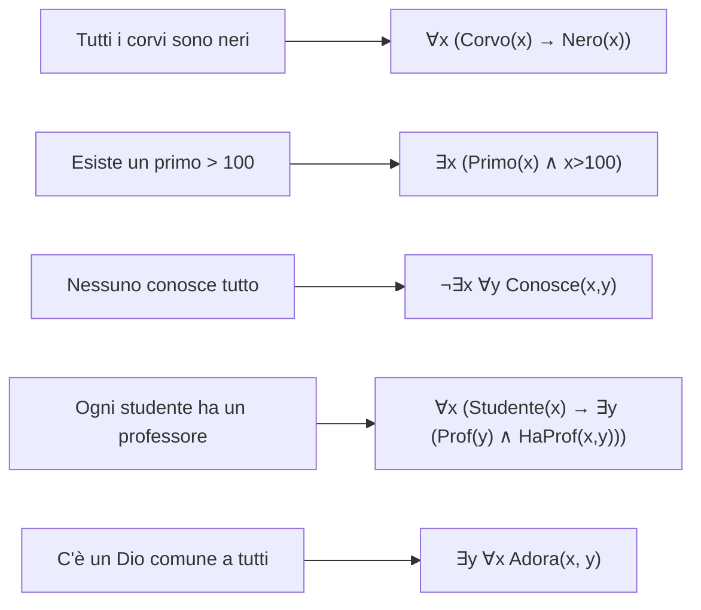

# Logica dei predicati (FOL): sintassi e quantificatori

La logica proposizionale (sez. 7) tratta gli enunciati come scatole nere. "Tutti i corvi sono neri" diventa una semplice lettera $P$: niente impedisce di affermare $P$ e contemporaneamente "questo corvo è bianco" senza che il sistema se ne accorga. La **logica dei predicati del primo ordine** (First-Order Logic, FOL) — sviluppata da Gottlob Frege (1879) e perfezionata da Russell, Whitehead, Hilbert e Tarski nel primo Novecento — sblocca questo livello: spacca l'enunciato in **soggetto** e **predicato**, introduce **variabili** e **quantificatori**, e rende esprimibile praticamente tutta la matematica.

Questa sezione si concentra sulla **sintassi**: come si costruiscono le formule, quali sono i pezzi del linguaggio, cosa significa che una variabile è libera o vincolata, come tradurre frasi italiane in FOL. La **semantica** (modelli, validità, soddisfacibilità) la trattiamo in [sez. 13](13-logica-predicati-semantica.html).

## 1. Il vocabolario della FOL

Un linguaggio del primo ordine $\mathcal{L}$ è costituito da:

**Simboli logici** (fissi, comuni a tutti i linguaggi):

- Variabili: $x, y, z, x_1, x_2, \ldots$ (insieme numerabile)
- Connettivi: $\neg, \wedge, \vee, \rightarrow, \leftrightarrow$
- Quantificatori: $\forall$ (universale), $\exists$ (esistenziale)
- Uguaglianza: $=$ (talvolta opzionale)
- Parentesi: $($, $)$

**Simboli non logici** (specifici del linguaggio):

- **Costanti**: $a, b, c, \ldots$ (es. *Socrate*, $0$, $\pi$)
- **Simboli di funzione** $n$-ari: $f, g, h, \ldots$ (es. $+$ binaria, $\sqrt{\cdot}$ unaria, *padre-di* unaria)
- **Simboli di predicato** $n$-ari: $P, Q, R, \ldots$ (es. *Uomo* unaria, $<$ binaria, *Sta-fra* ternaria)

### Esempi di linguaggi

- **Linguaggio dell'aritmetica**: costanti $0$; funzioni $S$ (successore), $+$, $\cdot$; predicato $=$.
- **Linguaggio della teoria degli insiemi**: nessuna costante (o solo $\emptyset$); predicati $\in$ e $=$.
- **Linguaggio "parentela"**: costanti per persone specifiche; funzioni *padre-di*, *madre-di*; predicati *Maschio*, *Femmina*, *GenitoreDi*.

## 2. Termini e formule

### Termini

Un **termine** denota un oggetto. Costruzione induttiva:

1. ogni variabile è un termine;
2. ogni costante è un termine;
3. se $f$ è simbolo di funzione $n$-aria e $t_1, \ldots, t_n$ sono termini, allora $f(t_1, \ldots, t_n)$ è un termine.

Esempi nel linguaggio dell'aritmetica: $0$, $x$, $S(0)$, $S(S(x))$, $+(x, S(0))$ (di solito scritto $x + S(0)$ in notazione infissa).

### Formule atomiche

Una **formula atomica** è una "asserzione minima":

- $t_1 = t_2$ dove $t_1, t_2$ sono termini;
- $P(t_1, \ldots, t_n)$ dove $P$ è simbolo predicativo $n$-ario.

Esempi: $x = 0$, $\text{Uomo}(\text{Socrate})$, $x < y$, $\text{Padre}(\text{Giovanni}, \text{Mario})$.

### Formule well-formed (WFF)

Costruzione induttiva:

1. ogni formula atomica è una WFF;
2. se $\varphi, \psi$ sono WFF, lo sono $\neg \varphi$, $(\varphi \wedge \psi)$, $(\varphi \vee \psi)$, $(\varphi \rightarrow \psi)$, $(\varphi \leftrightarrow \psi)$;
3. se $\varphi$ è una WFF e $x$ è una variabile, $\forall x\, \varphi$ e $\exists x\, \varphi$ sono WFF.

Tutto il resto **non** è una WFF. Per esempio: $\forall x \forall$ non è una formula (manca tutto dopo il secondo $\forall$); $\forall \text{Socrate}\, P(x)$ non lo è (non si quantifica su costanti).

## 3. Quantificatori: lettura

| Forma                           | Lettura italiana                                  |
|---------------------------------|---------------------------------------------------|
| $\forall x\, P(x)$              | "per ogni $x$, $P(x)$"                            |
| $\exists x\, P(x)$              | "esiste un $x$ tale che $P(x)$"                   |
| $\forall x\, (P(x) \rightarrow Q(x))$ | "ogni $P$ è $Q$" / "tutti i $P$ sono $Q$"   |
| $\exists x\, (P(x) \wedge Q(x))$ | "qualche $P$ è $Q$" / "esiste un $P$ che è $Q$"  |
| $\neg \exists x\, P(x)$         | "non esistono $P$" / "nessun $x$ è $P$"           |
| $\forall x\, \neg P(x)$         | equivalente a $\neg \exists x\, P(x)$             |

**Equivalenze cruciali** (dualità di De Morgan estesa):

$$\neg \forall x\, \varphi(x) \;\equiv\; \exists x\, \neg \varphi(x)$$
$$\neg \exists x\, \varphi(x) \;\equiv\; \forall x\, \neg \varphi(x)$$

Esempio: la negazione di "tutti i politici mentono" non è "tutti i politici non mentono", ma "esiste un politico che non mente". Un errore di traduzione molto comune nelle discussioni quotidiane (vedi anche [Fallacie informali](22-fallacie-informali-presunzione.html)).

## 4. Variabili libere e vincolate

In $\forall x\, P(x, y)$:

- $x$ è **vincolata** (bound) dal quantificatore $\forall$.
- $y$ è **libera** (free) — il quantificatore non la tocca.

Una formula senza variabili libere è una **sentenza** (closed formula). Solo le sentenze hanno valore di verità indipendente da un'assegnazione esterna; le formule con variabili libere sono come funzioni in attesa di argomenti.

### Esempi misti

- $P(x) \wedge \forall y\, Q(x, y)$ — $x$ libera (entrambe le occorrenze), $y$ vincolata.
- $\forall x\, (P(x) \rightarrow Q(x, y))$ — $x$ vincolata, $y$ libera.
- $\forall x\, \exists y\, R(x, y)$ — sentenza, entrambe vincolate.

### Sostituzione e cattura

Sostituire una variabile libera $y$ con un termine $t$ in una formula $\varphi$ si scrive $\varphi[t/y]$. Va fatto con attenzione: se $t$ contiene una variabile $x$ che si trova nell'ambito di un $\forall x$ in $\varphi$, la sostituzione la **cattura** e ne cambia il significato. Soluzione: rinominare le variabili vincolate (α-conversione).

Esempio: in $\forall x\, R(x, y)$ sostituiamo $y$ con $x$. Naïvamente otterremmo $\forall x\, R(x, x)$ — molto diverso! Si rinomina prima: $\forall z\, R(z, y)$, poi si sostituisce $y \mapsto x$, ottenendo $\forall z\, R(z, x)$.

## 5. Tradurre l'italiano in FOL

La traduzione è l'esercizio più importante per imparare la FOL. Pattern fondamentali, assumendo dominio "persone" salvo diversa indicazione:

### "Tutti gli A sono B"

$$\forall x\, (A(x) \rightarrow B(x))$$

**Esempio**: "Tutti i corvi sono neri" → $\forall x\, (\text{Corvo}(x) \rightarrow \text{Nero}(x))$.

> **⚠ Errore comune**: scrivere $\forall x\, (\text{Corvo}(x) \wedge \text{Nero}(x))$ — significherebbe "tutto è un corvo nero", troppo forte.

### "Qualche A è B"

$$\exists x\, (A(x) \wedge B(x))$$

**Esempio**: "Esiste un primo maggiore di 100" → $\exists x\, (\text{Primo}(x) \wedge x > 100)$.

> **⚠ Errore comune**: $\exists x\, (A(x) \rightarrow B(x))$ — banalmente vera appena esiste $x$ non-$A$ (per vacuità dell'implicazione).

### "Nessun A è B"

$$\forall x\, (A(x) \rightarrow \neg B(x)) \;\equiv\; \neg \exists x\, (A(x) \wedge B(x))$$

### Quantificatori annidati (l'ordine conta!)

- "Tutti amano qualcuno" → $\forall x\, \exists y\, \text{Ama}(x, y)$ — ognuno ha *un* qualcuno che ama (può variare).
- "C'è qualcuno che tutti amano" → $\exists y\, \forall x\, \text{Ama}(x, y)$ — esiste *uno specifico* $y$ amato da tutti.

Le due frasi sono *non* equivalenti: la seconda implica la prima, ma non viceversa. Questo è un nodo classico (anche linguistico — vedi [Linguaggio e ambiguità](06-linguaggio-e-ambiguita.html)).

## 6. Diagramma: struttura logica delle frasi tipiche

## 7. Esempio lavorato: tradurre "Ogni studente ama almeno un professore, ma nessun professore ama tutti gli studenti"

Dominio: persone. Predicati: $S(x)$ "x è studente", $P(x)$ "x è professore", $A(x, y)$ "x ama y".

**Decomponiamo**:

1. "Ogni studente ama almeno un professore" → $\forall x\, (S(x) \rightarrow \exists y\, (P(y) \wedge A(x, y)))$
2. "Nessun professore ama tutti gli studenti" → $\neg \exists x\, (P(x) \wedge \forall y\, (S(y) \rightarrow A(x, y)))$, equivalente a $\forall x\, (P(x) \rightarrow \exists y\, (S(y) \wedge \neg A(x, y)))$

Congiunzione:

$$\forall x\, (S(x) \rightarrow \exists y\, (P(y) \wedge A(x, y))) \;\wedge\; \forall x\, (P(x) \rightarrow \exists y\, (S(y) \wedge \neg A(x, y)))$$

## 8. Esercizi

  
Esercizio 1 — traduci "Solo i medici prescrivono farmaci"

"Solo X fa Y" significa "se uno fa Y, allora è X": $\forall x\, (\text{Prescrive}(x) \rightarrow \text{Medico}(x))$.

Attenzione: "solo i medici prescrivono" non implica "tutti i medici prescrivono". Le due direzioni sono distinte.

  
Esercizio 2 — traduci "C'è esattamente un re di Francia"

"Esattamente uno" si esprime con esistenza + unicità:

$$\exists x\, (\text{Re}(x, \text{Francia}) \wedge \forall y\, (\text{Re}(y, \text{Francia}) \rightarrow y = x))$$

Notazione abbreviata: $\exists !x\, \text{Re}(x, \text{Francia})$.

Questa è la struttura delle *descrizioni definite* di Russell (1905, *On Denoting*) — la famosa analisi di "l'attuale re di Francia è calvo".

  
Esercizio 3 — quali variabili sono libere in $\forall x\, (P(x, y) \rightarrow \exists z\, R(y, z, w))$?

- $x$ vincolata da $\forall x$.
- $y$ libera (entrambe le occorrenze).
- $z$ vincolata da $\exists z$.
- $w$ libera.

Per renderla una sentenza bisognerebbe quantificarla con $\forall y \forall w$ o $\exists y \exists w$ in testa.

## Sintesi

- La FOL aggiunge **variabili**, **predicati $n$-ari**, **funzioni** e **quantificatori** $\forall, \exists$ alla logica proposizionale.
- **Termini** denotano oggetti; **formule atomiche** asseriscono predicati; **WFF** si costruiscono induttivamente con connettivi e quantificatori.
- Una variabile è **libera** se non è nell'ambito di un quantificatore che la lega. Le sentenze sono formule senza libere.
- Pattern di traduzione: "tutti gli A sono B" = $\forall x\, (A(x) \rightarrow B(x))$; "qualche A è B" = $\exists x\, (A(x) \wedge B(x))$.
- **L'ordine dei quantificatori conta**: $\forall x \exists y$ non equivale a $\exists y \forall x$.
- Le dualità $\neg \forall \equiv \exists \neg$ e $\neg \exists \equiv \forall \neg$ sono lo strumento più usato in pratica.

## Letture

- Gottlob Frege, *Begriffsschrift* (1879) — atto di nascita della FOL.
- Bertrand Russell, *On Denoting* (Mind, 1905) — descrizioni definite.
- Alfred Tarski, *Introduction to Logic and to the Methodology of Deductive Sciences* (1941).
- Herbert Enderton, *A Mathematical Introduction to Logic* (Academic Press, 2nd ed. 2001).
- Sergio Bernini, *Logica per la matematica* (Carocci) — manuale italiano accessibile.
