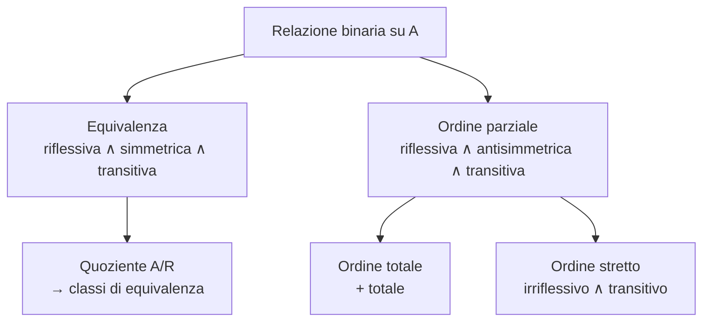
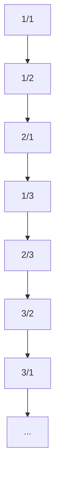

# Insiemi, relazioni, funzioni

La teoria degli insiemi è il *lingua franca* della matematica moderna. Strutture di modelli (sez. 13), dimostrazioni metalogiche (sez. 15), grafi di causalità (sez. 45) — tutto vive su insiemi e funzioni. Georg Cantor, nella seconda metà dell'Ottocento, l'ha letteralmente inventata da zero (*Beiträge zur Begründung der transfiniten Mengenlehre*, 1895-97), aprendo problemi vertiginosi sull'infinito e generando un paradosso che ha terremotato il fondazionalismo all'inizio del Novecento.

Questa sezione presenta la teoria **ingenua** degli insiemi — abbastanza per quasi tutta la matematica applicata e tutto il resto di questo corso — e accenna alle assiomatizzazioni rigorose (Zermelo-Fraenkel) per chi vuole evitare il paradosso di Russell.

## 1. Insiemi e appartenenza

Un **insieme** è una collezione di oggetti (gli **elementi**). La nozione primitiva è l'appartenenza:

$$x \in A \quad \text{("$x$ appartiene ad $A$")}$$

Due insiemi sono uguali sse hanno gli stessi elementi (**estensionalità**):

$$A = B \;\Leftrightarrow\; \forall x\, (x \in A \leftrightarrow x \in B)$$

L'insieme vuoto $\emptyset$ non ha elementi. È unico, per estensionalità.

### Notazioni

- **Elencazione**: $\{1, 2, 3\}$.
- **Comprensione**: $\{x \in U : P(x)\}$ ("gli elementi di $U$ che soddisfano $P$").
- **Insiemi noti**: $\mathbb{N}, \mathbb{Z}, \mathbb{Q}, \mathbb{R}, \mathbb{C}$.

## 2. Operazioni di base

Dati $A, B$ in un universo $U$:

| Operazione        | Notazione    | Definizione                          |
|-------------------|--------------|--------------------------------------|
| Inclusione        | $A \subseteq B$ | $\forall x\, (x \in A \rightarrow x \in B)$ |
| Unione            | $A \cup B$   | $\{x : x \in A \vee x \in B\}$       |
| Intersezione      | $A \cap B$   | $\{x : x \in A \wedge x \in B\}$     |
| Differenza        | $A \setminus B$ | $\{x : x \in A \wedge x \notin B\}$ |
| Complemento       | $A^c$        | $U \setminus A$                      |
| Insieme potenza   | $\wp(A)$     | $\{B : B \subseteq A\}$              |
| Prodotto cartesiano | $A \times B$ | $\{(a, b) : a \in A, b \in B\}$    |

**Cardinalità**: $|\wp(A)| = 2^{|A|}$ per $A$ finito. Esempio: $\wp(\{1, 2\}) = \{\emptyset, \{1\}, \{2\}, \{1, 2\}\}$, quattro elementi.

### Diagramma di Venn

<svg viewBox="0 0 480 240" xmlns="http://www.w3.org/2000/svg" role="img" aria-label="Diagramma di Venn con due insiemi">
  <rect width="480" height="240" fill="#0f0f23"/>
  <rect x="20" y="20" width="440" height="200" fill="none" stroke="#7a7aa0" stroke-dasharray="4 4"/>
  <text x="40" y="40" fill="#7a7aa0" font-size="13" font-family="ui-sans-serif">U</text>
  <circle cx="180" cy="120" r="80" fill="#9a8cf0" fill-opacity="0.18" stroke="#9a8cf0" stroke-width="2"/>
  <circle cx="300" cy="120" r="80" fill="#f0c98c" fill-opacity="0.18" stroke="#f0c98c" stroke-width="2"/>
  <text x="120" y="125" fill="#ecebff" font-size="15" font-family="ui-sans-serif">A</text>
  <text x="360" y="125" fill="#ecebff" font-size="15" font-family="ui-sans-serif">B</text>
  <text x="240" y="125" fill="#ecebff" font-size="13" font-family="ui-sans-serif" text-anchor="middle">A ∩ B</text>
</svg>

Insiemi $A$ e $B$ in un universo $U$. L'intersezione $A \cap B$ è la zona viola+oro al centro; $A \setminus B$ è la mezzaluna viola; $A^c$ è tutto ciò fuori da $A$.

### Leggi importanti

- **Distributività**: $A \cap (B \cup C) = (A \cap B) \cup (A \cap C)$.
- **De Morgan**: $(A \cup B)^c = A^c \cap B^c$, $(A \cap B)^c = A^c \cup B^c$ (cfr. [equivalenze proposizionali](08-equivalenze-forme-normali.html)).
- **Idempotenza**: $A \cup A = A = A \cap A$.

## 3. Coppie ordinate e prodotto cartesiano

La coppia ordinata $(a, b)$ si definisce come $\{\{a\}, \{a, b\}\}$ (Kuratowski 1921): la chiave è $(a, b) = (c, d) \Leftrightarrow a = c \wedge b = d$. La definizione precisa di Kuratowski rende l'identità una *conseguenza* della struttura insiemistica.

Generalizza a $n$-uple: $(a_1, \ldots, a_n)$.

$$A \times B = \{(a, b) : a \in A, b \in B\}$$

$$A^n = \underbrace{A \times A \times \cdots \times A}_{n \text{ volte}}$$

## 4. Relazioni

Una **relazione binaria** $R$ fra $A$ e $B$ è semplicemente $R \subseteq A \times B$. Si scrive $aRb$ per $(a, b) \in R$.

- **Dominio**: $\text{dom}(R) = \{a : \exists b\, aRb\}$.
- **Codominio (immagine, range)**: $\text{rg}(R) = \{b : \exists a\, aRb\}$.

### Proprietà di una relazione su $A$ (cioè $R \subseteq A \times A$)

| Proprietà        | Definizione                                              |
|------------------|----------------------------------------------------------|
| Riflessiva       | $\forall x\, xRx$                                        |
| Irriflessiva     | $\forall x\, \neg xRx$                                   |
| Simmetrica       | $\forall x \forall y\, (xRy \rightarrow yRx)$            |
| Antisimmetrica   | $\forall x \forall y\, (xRy \wedge yRx \rightarrow x = y)$ |
| Transitiva       | $\forall x \forall y \forall z\, (xRy \wedge yRz \rightarrow xRz)$ |
| Totale (connessa)| $\forall x \forall y\, (xRy \vee yRx)$                   |

### Relazione di equivalenza

Riflessiva + simmetrica + transitiva. Partiziona $A$ in **classi di equivalenza** $[a] = \{x : xRa\}$. Esempi:

- Congruenza modulo $n$ sugli interi: $a \equiv b \pmod n$.
- "Avere lo stesso anno di nascita" sugli italiani.
- Identità.

L'insieme delle classi si chiama **quoziente** $A/R$. Strumento potentissimo per costruire nuovi oggetti (es. $\mathbb{Z}/n\mathbb{Z}$, $\mathbb{Q}$ come quoziente di $\mathbb{Z} \times \mathbb{Z}_{\neq 0}$).

### Relazioni d'ordine

- **Ordine parziale**: riflessivo + antisimmetrico + transitivo. Es. $\subseteq$ su $\wp(A)$, divisibilità $\mid$ su $\mathbb{N}$.
- **Ordine totale**: ordine parziale + totale. Es. $\leq$ su $\mathbb{R}$.
- **Ordine stretto**: irriflessivo + transitivo (es. $<$).

## 5. Funzioni

Una **funzione** $f: A \rightarrow B$ è una relazione $f \subseteq A \times B$ tale che per ogni $a \in A$ esiste *un unico* $b \in B$ con $afb$. Scriviamo $f(a) = b$.

- $A$: **dominio**.
- $B$: **codominio**.
- Immagine: $f(A) = \{f(a) : a \in A\} \subseteq B$.

### Tre proprietà fondamentali

| Tipo            | Definizione                                                     | Intuizione                        |
|-----------------|-----------------------------------------------------------------|-----------------------------------|
| **Iniettiva**   | $\forall a_1, a_2\, (f(a_1) = f(a_2) \rightarrow a_1 = a_2)$    | "uno-a-uno"                       |
| **Suriettiva**  | $\forall b \in B\, \exists a \in A\, (f(a) = b)$                | "copre tutto $B$"                 |
| **Biiettiva**   | Iniettiva + suriettiva                                          | corrispondenza perfetta           |

**Esempi**:

- $f: \mathbb{N} \rightarrow \mathbb{N}$, $f(n) = 2n$: iniettiva, non suriettiva.
- $f: \mathbb{Z} \rightarrow \mathbb{N}$, $f(n) = |n|$: suriettiva, non iniettiva.
- $f: \mathbb{Z} \rightarrow \mathbb{Z}$, $f(n) = n + 1$: biiettiva (la sua inversa è $n \mapsto n - 1$).

Una biiezione $A \rightarrow B$ è il modo formale per dire "$A$ e $B$ hanno lo stesso numero di elementi".

### Composizione

$(g \circ f)(x) = g(f(x))$. Associativa. Identità: $\text{id}_A(x) = x$. Una funzione biiettiva ammette inversa $f^{-1}$ tale che $f \circ f^{-1} = \text{id}_B$ e $f^{-1} \circ f = \text{id}_A$.

## 6. Cardinalità: numerabile vs continuo

Cantor estende la nozione di "numero di elementi" a insiemi infiniti via biiezioni.

### Definizioni

- $|A| = |B|$ sse esiste biiezione $A \rightarrow B$.
- $|A| \leq |B|$ sse esiste iniezione $A \rightarrow B$.
- $|A| < |B|$ sse $|A| \leq |B|$ e non $|A| = |B|$.

### Insiemi numerabili

$A$ è **numerabile** sse $|A| \leq |\mathbb{N}|$ (esiste un'enumerazione, eventualmente con ripetizioni).

Risultati di Cantor:

- $\mathbb{Z}$ è numerabile (enumera con $0, 1, -1, 2, -2, \ldots$).
- $\mathbb{Q}$ è numerabile (enumera per "antidiagonali" della tabella $a/b$).
- $\mathbb{N} \times \mathbb{N}$ è numerabile (funzione di accoppiamento di Cantor: $\pi(a, b) = \frac{(a+b)(a+b+1)}{2} + b$).
- Unione numerabile di insiemi numerabili è numerabile.

### Argomento diagonale di Cantor

**Teorema**: $\mathbb{R}$ non è numerabile.

Dimostrazione (1891). Supponiamo per assurdo che $[0, 1]$ sia numerabile e elencabile: $r_1, r_2, r_3, \ldots$ Ogni $r_i$ ha espansione decimale $r_i = 0.d_{i,1} d_{i,2} d_{i,3} \ldots$. Costruiamo $r^* = 0.e_1 e_2 e_3 \ldots$ dove $e_i \neq d_{i,i}$ (per esempio, $e_i = 5$ se $d_{i,i} \neq 5$, altrimenti $e_i = 4$). Allora $r^* \in [0, 1]$ ma differisce da ogni $r_i$ alla cifra $i$-esima — contraddizione. Quindi $[0, 1]$ è **più che numerabile** ($\aleph_1$).

Conseguenza generale: $|\wp(A)| > |A|$ sempre (teorema di Cantor). Le cardinalità transfinite formano una gerarchia $\aleph_0 < \aleph_1 < \aleph_2 < \cdots$. L'**ipotesi del continuo** ($|\mathbb{R}| = \aleph_1$) è indipendente da ZFC (Gödel 1940, Cohen 1963 — vedi [Metalogica](15-metalogica-godel.html)).

## 7. Paradosso di Russell e teoria assiomatica

La teoria ingenua di Cantor permette comprensione **non ristretta**: per ogni proprietà $P$, esiste l'insieme $\{x : P(x)\}$. Bertrand Russell (1901, lettera a Frege) costruisce:

$$R = \{x : x \notin x\}$$

Domanda: $R \in R$? Se sì, allora per definizione $R \notin R$. Se no, allora $R \in R$. Paradosso (vedi anche [Paradossi celebri](46-paradossi-celebri.html)).

La soluzione standard è **Zermelo-Fraenkel** (ZF, 1908-1922): si rimpiazza la comprensione non ristretta con

$$\{x \in A : P(x)\}$$

(comprensione **ristretta** a un insieme già esistente). Più altri assiomi: estensionalità, coppia, unione, potenza, infinito, sostituzione, fondazione. Con l'assioma di scelta si ottiene **ZFC**, lo standard de facto della matematica.

> Una "classe" come $\{x : x = x\}$ (la "classe di tutto") esiste come collezione *informale* (classe propria) ma **non** come insieme in ZFC. Il paradosso di Russell sparisce.

## 8. Esempio lavorato: $|\mathbb{Q}| = |\mathbb{N}|$

Enumeriamo le frazioni $a/b$ in lowest terms su una griglia:

Salendo per antidiagonali della tabella $(\text{numeratore}, \text{denominatore})$ e saltando le frazioni non in lowest terms, si ottiene un'enumerazione di $\mathbb{Q}_{>0}$. Si raddoppia per includere lo zero e i negativi. Conclusione: $|\mathbb{Q}| = |\mathbb{N}| = \aleph_0$.

## 9. Esercizi

  
Esercizio 1 — dimostra che la relazione "ha la stessa età" è di equivalenza

Sia $A$ l'insieme delle persone e $R$ definita da $xRy \Leftrightarrow \text{età}(x) = \text{età}(y)$.

- Riflessiva: $\text{età}(x) = \text{età}(x)$. ✓
- Simmetrica: $\text{età}(x) = \text{età}(y) \Rightarrow \text{età}(y) = \text{età}(x)$. ✓
- Transitiva: $\text{età}(x) = \text{età}(y)$ e $\text{età}(y) = \text{età}(z)$ implicano $\text{età}(x) = \text{età}(z)$. ✓

Le classi di equivalenza sono le coorti annuali.

  
Esercizio 2 — quante funzioni esistono da $\{a, b, c\}$ a $\{0, 1\}$? Quante sono iniettive? Quante suriettive?

Totali: $2^3 = 8$ (ogni elemento del dominio ha 2 scelte indipendenti).

Iniettive: $0$ (servirebbero almeno 3 valori distinti).

Suriettive: $2^3 - 2 = 6$ (tutte tranne le due costanti).

In generale: il numero di suriettive da un insieme $n$ a $k$ è $k! \cdot S(n, k)$ dove $S$ è il numero di Stirling di seconda specie.

  
Esercizio 3 — perché l'argomento diagonale non funziona su $\mathbb{Q}$?

L'argomento diagonale costruisce un decimale infinito $r^*$. Per $\mathbb{Q}$ si dovrebbe garantire che $r^*$ sia razionale (cioè periodico o terminante). Ma scegliendo le cifre in modo adversariale, otteniamo in generale un decimale **non** periodico — un irrazionale, fuori da $\mathbb{Q}$. Quindi $r^*$ esce dall'insieme e non produce contraddizione.

Per $\mathbb{R}$ invece $r^* \in [0, 1] \subset \mathbb{R}$ sempre, e l'argomento funziona.

## Sintesi

- **Insiemi** ed **appartenenza** sono il linguaggio primitivo; l'estensionalità definisce l'uguaglianza.
- Operazioni base: $\cap, \cup, \setminus, \wp, \times$. Leggi di De Morgan duplicano quelle proposizionali.
- **Relazioni**: caratterizzate da proprietà (riflessiva, simmetrica, transitiva, antisimmetrica). Equivalenze partizionano; ordini gerarchizzano.
- **Funzioni**: iniettive, suriettive, biiettive. La biiezione misura cardinalità.
- **Cantor**: $\mathbb{Q}$ è numerabile, $\mathbb{R}$ no (argomento diagonale). Gerarchia transfinita $\aleph_0 < \aleph_1 < \ldots$
- **Paradosso di Russell** (vedi [sez. 46](46-paradossi-celebri.html)) ha imposto il passaggio da set theory ingenua a **ZFC**.

## Letture

- Georg Cantor, *Beiträge zur Begründung der transfiniten Mengenlehre* (1895-97).
- Paul Halmos, *Naive Set Theory* (Springer, 1960) — il classico.
- Thomas Jech, *Set Theory* (Springer, 3rd ed.) — la bibbia.
- Patrick Suppes, *Axiomatic Set Theory* (Dover, 1972).
- Lorenzo Carlucci, *Introduzione alla teoria degli insiemi* (Aracne) — testo italiano accessibile.
