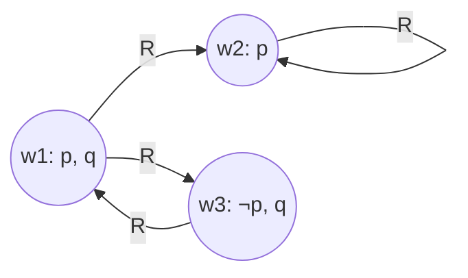

# Logiche modali e mondi possibili

La logica classica risponde solo a "è vero che $p$?". La logica modale estende il linguaggio con due operatori: **$\Box p$** ("è necessario che $p$") e **$\Diamond p$** ("è possibile che $p$"). I due sono duali:

$$\Diamond p \equiv \neg \Box \neg p \qquad \Box p \equiv \neg \Diamond \neg p$$

"È possibile che $p$" = "non è necessario che $\neg p$". "È necessario che $p$" = "non è possibile che $\neg p$".

Le modalità non sono solo aletiche (necessario/possibile). Lo stesso apparato si applica a:

- **Temporale**: "sempre" ($\Box$), "qualche volta" ($\Diamond$).
- **Deontica**: "obbligatorio" ($\Box$), "permesso" ($\Diamond$).
- **Epistemica**: "$a$ sa che $p$" ($K_a p$), "$a$ ritiene possibile $p$".
- **Dinamica**: dopo un'azione $a$, $p$ vale.

Vedi [logiche temporale, deontica, epistemica](17-logiche-temporale-deontica-epistemica.html) per i dettagli.

## 1. La semantica di Kripke (1959–1963)

Saul Kripke, ancora liceale (!), formalizza la semantica dei mondi possibili. Un **frame** è una coppia $(W, R)$ dove:

- $W$ è un insieme di **mondi possibili** (puoi pensarli come "scenari alternativi").
- $R \subseteq W \times W$ è la **relazione di accessibilità**: $wRw'$ significa "dal mondo $w$ il mondo $w'$ è accessibile / pensabile".

Un **modello** è $(W, R, V)$ dove $V$ assegna a ogni variabile proposizionale $p$ l'insieme dei mondi in cui $p$ è V.

Le regole di soddisfacibilità:

$$M, w \models \Box p \iff \forall w': wRw' \Rightarrow M, w' \models p$$

$$M, w \models \Diamond p \iff \exists w': wRw' \wedge M, w' \models p$$

Cioè: $\Box p$ è vero in $w$ se $p$ è vero in *tutti* i mondi accessibili da $w$. $\Diamond p$ se $p$ è vero in *almeno uno* dei mondi accessibili.

## 2. Visualizzazione: un mini-frame

In $w_1$: $p$ è V, $q$ è V. Accessibili da $w_1$: $w_2$ e $w_3$.

- $w_1 \models \Box p$? $p$ è V in $w_2$, F in $w_3$ → no, $w_1 \not\models \Box p$.
- $w_1 \models \Diamond p$? $p$ è V in $w_2$ (accessibile) → sì.
- $w_1 \models \Box q$? $q$ è V in $w_3$, V in $w_2$? Dipende dalla valutazione di $q$ in $w_2$: se non specificato, sì $\Box q$.

## 3. Sistemi modali principali

Ogni sistema impone proprietà alla relazione $R$ e ottiene assiomi modali corrispondenti.

| Sistema | Proprietà di $R$ | Assioma caratteristico | Lettura |
|---|---|---|---|
| K | nessuna | $\Box(p \rightarrow q) \rightarrow (\Box p \rightarrow \Box q)$ | base, sempre vale |
| T | riflessiva | $\Box p \rightarrow p$ | "se necessario, vero" |
| B | rifl. + simmetrica | $p \rightarrow \Box \Diamond p$ | brouweriano |
| S4 | rifl. + transitiva | $\Box p \rightarrow \Box \Box p$ | "necessario di necessario" |
| S5 | rifl. + trans. + simm. (= eq. di equivalenza) | $\Diamond p \rightarrow \Box \Diamond p$ | possibilità è "globale" |

**K** è il sistema più debole: contiene solo la "distribuzione" e il *necessitation rule* (se $\vdash p$ allora $\vdash \Box p$). Ogni sistema modale "ragionevole" è un'estensione di K.

**S5** è il più forte e quello dell'aletica filosofica standard: in S5 le modalità "collassano" (un mondo accessibile da uno accessibile è ancora accessibile da subito).

### 3.1 Perché la riflessività cattura "se necessario, vero"?

$wRw$ significa "il mondo stesso è uno dei suoi mondi accessibili". Allora $\Box p$ in $w$ implica $p$ vero in $w$, perché $w$ è tra i mondi accessibili. T è quasi sempre desiderabile: chiamare $\Box$ "necessario" senza implicare verità reale è strano.

## 4. Esempio classico: il teschio di Amleto

Amleto in $w_1$ tiene il teschio di Yorick. In ogni mondo accessibile da $w_1$ (mondi "possibili" dato lo stato di cose), Yorick è morto. Allora $w_1 \models \Box(\text{Yorick morto})$. Ma esiste $w_2$ accessibile in cui Amleto pure è morto: $w_1 \models \Diamond(\text{Amleto morto})$.

## 5. Necessitismo vs contingentismo

Due posizioni metafisiche emergono dalla scelta tra logiche modali:

- **Necessario è contingente**: alcuni necessari sono tali "per ora", potrebbero cambiare. Es: necessità fisiche.
- **Necessario è massimamente fissato**: ciò che è necessario lo è in ogni mondo possibile (S5).

Kripke nel suo *Naming and Necessity* (1980) introduce la distinzione *a priori*/*a posteriori* da una parte e *necessario*/*contingente* dall'altra, mostrando che i due tagli non coincidono ("acqua = H₂O" è necessario a posteriori).

## 6. Applicazioni

- **Verifica di programmi** (model checking): si usano logiche modali (CTL, LTL) per esprimere proprietà di sistemi concorrenti. Vincitore del Turing Award 2007: Clarke, Emerson, Sifakis.
- **Filosofia analitica**: identità, contingenza, necessità linguistica.
- **AI**: ragionamento su conoscenza e credenza degli agenti.

## Esercizi

  
Esercizio 1 — In un frame in cui $R$ è universale ($\forall w, w': wRw'$), come si comportano $\Box$ e $\Diamond$?

Se ogni mondo accede a ogni altro, $\Box p$ in qualsiasi mondo significa "$p$ vero in tutti i mondi", che è una proprietà *globale*. $\Diamond p$ significa "esiste un mondo in cui $p$". Le modalità non dipendono più dal mondo di partenza. Questo è in pratica S5 con $R$ totale.

  
Esercizio 2 — Verifica che in T (riflessiva) vale $\Box p \rightarrow p$ ma non in K.

In T, $wRw$ sempre. Se $\Box p$ in $w$ (cioè $p$ in tutti gli accessibili), allora in particolare $p$ in $w$. ✓

In K senza riflessività, può esistere $w$ con $\Box p$ (perché $w$ non accede a nessuno, $\Box$ è "vacuamente vero") ma $p$ falso in $w$.

## Sintesi

- $\Box$ (necessario) e $\Diamond$ (possibile) sono duali: $\Diamond p \equiv \neg \Box \neg p$.
- Semantica di Kripke: frame = $(W, R)$, $\Box p$ vero in $w$ ⇔ $p$ vero in tutti i mondi accessibili.
- Sistemi K ⊂ T ⊂ S4 ⊂ S5 (e B, K4, ecc.). Più assiomi ⇒ più vincoli su $R$.
- S5: $R$ è relazione di equivalenza; le modalità si appiattiscono.
- Logiche modali sono il linguaggio di base per logiche temporali, deontiche, epistemiche e per il *model checking*.

## Letture

- Saul Kripke, *Naming and Necessity* (1980).
- Brian Chellas, *Modal Logic: An Introduction* (1980).
- Patrick Blackburn, Maarten de Rijke, Yde Venema, *Modal Logic* (2001) — riferimento moderno.
