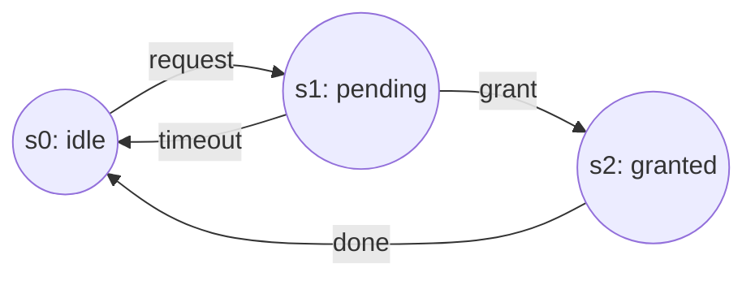
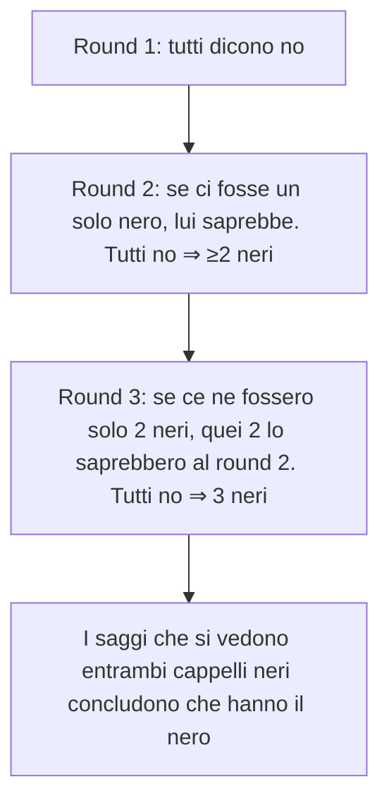

# Logiche temporale, deontica, epistemica

Le logiche modali non sono un esercizio accademico: a seconda dell'interpretazione che dai a $\Box$ e alla relazione di accessibilità, ottieni tre famiglie con applicazioni precise.

## 1. Logica temporale

Sostituisci "mondi possibili" con "istanti di tempo" e $R$ con "viene dopo nel tempo".

### 1.1 Operatori (Prior, 1957; Pnueli, 1977)

Linear Temporal Logic (LTL), su sequenze lineari di stati:

- **$G\varphi$** ("globally"): $\varphi$ vale in tutti gli istanti futuri.
- **$F\varphi$** ("finally"/"eventually"): $\varphi$ vale prima o poi.
- **$X\varphi$** ("next"): $\varphi$ vale nel prossimo istante.
- **$\varphi U \psi$** ("until"): $\varphi$ vale fino a quando $\psi$ diventa vero.

Computation Tree Logic (CTL) aggiunge quantificatori sui rami di un albero del tempo: $A$ (su tutti i futuri), $E$ (su qualche futuro). $AG\varphi$, $EF\varphi$, ecc.

### 1.2 Applicazione: model checking

Specifichi proprietà del software:

- **Safety**: $G \neg \text{deadlock}$ — il sistema non va mai in deadlock.
- **Liveness**: $G(\text{request} \rightarrow F\,\text{response})$ — ogni richiesta riceve risposta.
- **Fairness**: $GF\,\text{access}$ — un processo accede infinite volte.

Tool come SPIN (Holzmann), NuSMV, TLA+ (Lamport) verificano queste proprietà su modelli a stati finiti. Hanno trovato bug critici in protocolli, microcodice CPU, controllo aereo.

Vuoi verificare: $AG(\text{pending} \rightarrow AF\,\text{granted} \vee AF\,\text{idle})$.

## 2. Logica deontica

Studio del *dovere*. Operatori (von Wright, 1951):

- **$O\varphi$**: obbligatorio.
- **$P\varphi$**: permesso.
- **$F\varphi$**: vietato (= $O\neg\varphi$).

Relazione di accessibilità: i mondi "deonticamente ideali" (in cui tutti gli obblighi sono soddisfatti). $O\varphi$ in $w$ ⇔ $\varphi$ in tutti i mondi ideali da $w$.

### 2.1 Paradossi

La logica deontica genera apparenti paradossi che mettono in crisi versioni ingenue.

**Paradosso di Ross**: da $O p$ segue per addizione modale $O(p \vee q)$. Ma "obbligatorio postare la lettera" non implica "obbligatorio postare la lettera o bruciarla". Conclusione: la logica deontica non è banalmente classica + un $\Box$.

**Paradosso di Chisholm (1963)**: "È obbligatorio che John vada ad aiutare". "Se va ad aiutare, è obbligatorio dirlo". "Se non va, è obbligatorio non dirlo". "John non va". Da queste premesse si derivano formule contraddittorie nella deontica standard. Soluzioni: condizionali deontici espliciti, logiche multimodali, *contrary-to-duty obligations* (CTD).

### 2.2 Usi

- Specifica formale di policy (autorizzazioni, GDPR).
- AI etica: come istruire un sistema artificiale a rispettare obblighi.
- Filosofia morale formalizzata.

## 3. Logica epistemica

"$K_a \varphi$" = "$a$ sa che $\varphi$". Introdotta da Jaakko Hintikka, *Knowledge and Belief* (1962).

### 3.1 Assiomi

- **K**: $K_a(\varphi \rightarrow \psi) \rightarrow (K_a\varphi \rightarrow K_a\psi)$ — chiusura logica della conoscenza.
- **T**: $K_a\varphi \rightarrow \varphi$ — sapere implica verità (definizione filosofica standard di sapere).
- **4**: $K_a\varphi \rightarrow K_aK_a\varphi$ — introspezione positiva.
- **5**: $\neg K_a\varphi \rightarrow K_a\neg K_a\varphi$ — introspezione negativa (controversa).

Sistema standard: **S5** per agenti idealmente razionali.

### 3.2 Multi-agente: distributed e common knowledge

Più agenti $a_1, \ldots, a_n$.

- **Conoscenza distribuita** $D\varphi$: se gli agenti mettessero insieme tutto, saprebbero $\varphi$.
- **Conoscenza comune** $C\varphi$: tutti sanno $\varphi$, tutti sanno che tutti sanno $\varphi$, e così via ad infinitum.

La conoscenza comune è cruciale per il coordinamento: il "Coordinated Attack Problem" (Halpern & Moses, 1990) mostra che senza common knowledge è impossibile coordinare due eserciti su un canale inaffidabile — risultato fondazionale per i sistemi distribuiti.

### 3.3 Il problema dei tre saggi con cappelli

Tre saggi (Alice, Bob, Carl) con un cappello in testa, ciascuno bianco o nero. Almeno uno è nero. Vedono solo i cappelli degli altri. Il maestro chiede ripetutamente "Sai di che colore è il tuo?". Dopo un certo numero di "no", il primo che capisce risponde correttamente.

Il problema si analizza esattamente con conoscenza epistemica multi-agente: ogni "no" aggiunge informazione comune.

### 3.4 Knowledge vs belief

Per **credenza** ($B_a$) si rinuncia all'assioma T ($B_a\varphi \rightarrow \varphi$): puoi credere falsità. Resta D: $B_a\varphi \rightarrow \neg B_a\neg\varphi$ (coerenza).

## 4. Confronto compatto

| Logica | Operatore | "Necessariamente" significa | Sistema standard |
|---|---|---|---|
| Aletica | $\Box$ | in ogni mondo possibile | S5 |
| Temporale | $G$, $F$, $X$, $U$ | in ogni istante (futuro) | LTL/CTL |
| Deontica | $O$, $P$, $F$ | in ogni mondo ideale | KD (non T!) |
| Epistemica | $K_a$, $B_a$ | in ogni mondo compatibile con la conoscenza di $a$ | S5 / KD45 |
| Dinamica | $[a]$, $\langle a \rangle$ | dopo l'esecuzione di $a$ | PDL |

## Esercizi

  
Esercizio 1 — Esprimi in LTL: "ogni richiesta riceverà eventualmente una risposta e nel frattempo il server non si spegne"

$$G(\text{request} \rightarrow (\neg \text{shutdown} \,U\, \text{response}))$$

  
Esercizio 2 — Mostra che in logica deontica $O p \rightarrow p$ non è desiderabile.

Se $O p$ ("è obbligatorio $p$") implicasse $p$ ("$p$ è vero"), allora il fatto che qualcosa sia obbligatorio garantirebbe la sua realizzazione. Falso: gli obblighi possono essere violati. Per questo la deontica usa KD (assiomi K + D), non KT.

## Sintesi

- LTL/CTL formalizzano "sempre", "prima o poi", "until" sul tempo: base del model checking moderno.
- Deontica: $O$ (obbligatorio), $P$ (permesso), $F$ (vietato). Paradossi di Ross e Chisholm motivano logiche più sofisticate.
- Epistemica: $K_a\varphi$, conoscenza distribuita $D$, conoscenza comune $C$. Sistema S5 per agenti razionali ideali.
- Common knowledge è la condizione per coordinarsi (Halpern & Moses).
- Tutte sono varianti della semantica di Kripke con interpretazione diversa di "mondi" e "accessibilità".

## Letture

- A. N. Prior, *Time and Modality* (1957).
- G. von Wright, *An Essay in Modal Logic* (1951).
- Hintikka, *Knowledge and Belief* (1962).
- Halpern, Moses, Vardi, *Reasoning About Knowledge* (1995).
- Clarke, Grumberg, Peled, *Model Checking* (1999).
