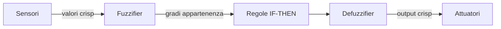

# Logiche non classiche: intuizionista, fuzzy, paraconsistente

La logica classica fa tre assunzioni che sembrano ovvie ma sono filosoficamente controverse: ogni proposizione è vera o falsa (bivalenza), $p \vee \neg p$ è sempre vero (terzo escluso), e da una contraddizione segue qualsiasi cosa (*ex contradictione quodlibet*). Rilassare ciascuna apre un'intera famiglia di logiche.

## 1. Logica intuizionista

Origine: matematica costruttiva di L.E.J. Brouwer (1907) e formalizzazione di Heyting (1930). L'intuizione: una proposizione è vera *solo se hai una costruzione* che la giustifica. Non c'è una verità "esterna" indipendente dalla dimostrazione.

### 1.1 Cosa cambia

**Il terzo escluso $p \vee \neg p$ NON è un teorema**. Per averlo dovresti, dato $p$, esibire o una prova di $p$ o una prova di $\neg p$. In matematica esistono enunciati per cui non hai nessuna delle due (es: ipotesi di Riemann, congettura di Goldbach al momento attuale). Quindi l'intuizionista non li classifica come "veri o falsi a priori".

**La doppia negazione non collassa**: $\neg\neg p \not\equiv p$ in generale. La direzione $p \rightarrow \neg\neg p$ vale, ma $\neg\neg p \rightarrow p$ no — quella richiederebbe il terzo escluso.

**Semantica BHK (Brouwer-Heyting-Kolmogorov)**:

- Una dimostrazione di $p \wedge q$ è una coppia (prova di $p$, prova di $q$).
- Una dimostrazione di $p \vee q$ è (etichetta che dice quale ramo) + prova del ramo.
- Una dimostrazione di $p \rightarrow q$ è una *funzione* che trasforma prove di $p$ in prove di $q$.
- Una dimostrazione di $\neg p$ è una funzione da prove di $p$ a una contraddizione.

Questa è esattamente la lettura computazionale: un'enorme conseguenza è la **corrispondenza Curry-Howard** (vedi [sezione 19](19-curry-howard-type-theory.html)) — dimostrazioni intuizioniste *sono* programmi tipizzati.

### 1.2 Modelli

- **Modelli di Kripke** monotonici: $w \models p$ implica $w' \models p$ per ogni $wRw'$. Come "stati di conoscenza crescente".
- **Topologie**: $p$ vero = aperto del topologico.
- **Lambda-calcolo** tipato: programmi.

### 1.3 Esempio: doppio rifiuto della doppia negazione

In matematica classica, "non è vero che non esiste" dimostra "esiste". In intuizionismo, no: occorre esibire un testimone esplicito. Questo elimina certi argomenti per assurdo "non costruttivi".

## 2. Logica fuzzy (Zadeh, 1965)

Il valore di verità non è binario: vive in $[0,1]$.

### 2.1 Operatori

T-norma (per AND) e t-conorma (per OR) standard:

- **AND** (minimo): $v(p \wedge q) = \min(v(p), v(q))$. Variante prodotto: $v(p) \cdot v(q)$.
- **OR** (massimo): $v(p \vee q) = \max(v(p), v(q))$. Variante somma probabilistica: $v(p) + v(q) - v(p)\cdot v(q)$.
- **NOT**: $v(\neg p) = 1 - v(p)$.

### 2.2 Esempio applicato: controllo lavatrice

Variabili linguistiche: "carico = pesante", "panni = sporchi", "tempo = lungo".

Regole:

- IF (carico pesante) AND (panni molto sporchi) THEN tempo lungo.
- IF (carico leggero) AND (panni poco sporchi) THEN tempo corto.

Funzioni di appartenenza (membership functions) trasformano misure fisiche in valori in $[0,1]$. Il controller fuzzy combina le regole e *defuzzifica* per ottenere un tempo concreto in minuti. Usato in ABS, climatizzatori, fotocamere, metro di Sendai dal 1987.

### 2.3 Critica

Probabilità e fuzziness non sono la stessa cosa. "70% probabile" e "0.7 di vero" hanno semantica diverse. La probabilità riguarda incertezza epistemica; la fuzziness riguarda la *vaghezza intrinseca* di un predicato. "È alto" è vago, non incerto.

## 3. Logiche paraconsistenti

Punto debole della logica classica: **ex contradictione quodlibet** (*ECQ*): da $p \wedge \neg p$ deriva qualsiasi $q$. Una sola incoerenza distrugge l'intero sistema. Inaccettabile in pratica: database reali, enciclopedie, leggi sono pieni di piccole contraddizioni che non rendono "tutto vero".

**Logiche paraconsistenti** (Newton da Costa, 1963; Graham Priest, 1979): rifiutano ECQ. Possono coesistere $p$ e $\neg p$ senza trivializzazione.

Esempio: il sistema $C_1$ di da Costa, o LP (Logic of Paradox) di Priest con tre valori {vero, falso, sia vero che falso}.

### 3.1 Applicazioni

- **Database inconsistenti**: query su DB con dati contraddittori (es. tassa "20%" in un record, "22%" in un altro).
- **Filosofia del cambiamento**: il paradosso del mentitore può essere "vero e falso" senza far esplodere il sistema.
- **AI commonsense**: catalogare credenze contraddittorie senza dover risolverle subito.

### 3.2 Dialetheismo

Posizione filosofica radicale (Priest): esistono vere contraddizioni. Il paradosso del mentitore "questa frase è falsa" è genuinamente vera e falsa. Controversa.

## 4. Logiche many-valued

Jan Łukasiewicz (1920) introduce un terzo valore, $\frac{1}{2}$ ("indeterminato"). Operatori a tre valori:

| $p$ | $q$ | $p \wedge q$ | $p \vee q$ | $\neg p$ |
|---|---|---|---|---|
| 1 | 1 | 1 | 1 | 0 |
| 1 | ½ | ½ | 1 | 0 |
| 1 | 0 | 0 | 1 | 0 |
| ½ | ½ | ½ | ½ | ½ |
| 0 | 0 | 0 | 0 | 1 |

Utile per ragionare su enunciati su futuro contingente (il classico "ci sarà una battaglia navale domani?" di Aristotele).

## 5. Logica lineare (Girard, 1987)

Riformulazione "fine" della logica in cui le ipotesi sono *risorse* da consumare, non verità da riutilizzare. Le formule sono "monete": $p, p \vdash p \wedge p$ vale solo se hai due "copie" di $p$. Usi: gestione di memoria, concorrenza, transazioni. Connettivi rifiniti: tensor $\otimes$ vs $\&$, plus $\oplus$ vs par $⅋$.

## 6. Quadro comparativo

| Logica | Cosa rinuncia | Usata in |
|---|---|---|
| Classica | nulla | matematica standard |
| Intuizionista | terzo escluso, doppia neg | matematica costruttiva, type theory, Coq/Agda |
| Fuzzy | bivalenza | controllo industriale, AI vaghezza |
| Paraconsistente | ECQ | database incoerenti, filosofia |
| Many-valued (Łukasiewicz) | bivalenza | semantica del futuro |
| Lineare | contrazione/indebolimento | concorrenza, transazioni |

## Esercizi

  
Esercizio 1 — Mostra che in intuizionismo $\neg\neg(p \vee \neg p)$ è dimostrabile, ma $p \vee \neg p$ no.

Da una ipotetica prova di $\neg(p \vee \neg p)$, deriviamo contraddizione: $\neg(p \vee \neg p)$ implica $\neg p$ (introducendo $p$ e ottenendo $\neg p$ da impossibilità di $p \vee \neg p$). Poi $\neg(p \vee \neg p)$ con $\neg p$ ci dà $p \vee \neg p$ (da addizione su $\neg p$), contraddicendo. Quindi $\neg\neg(p \vee \neg p)$ è valido.

Ma $p \vee \neg p$ non è dimostrabile perché richiederebbe, per il significato BHK, di esibire o una prova di $p$ o una di $\neg p$, cosa generalmente non costruibile.

  
Esercizio 2 — In fuzzy, calcola $v((p \wedge q) \vee \neg q)$ con $v(p) = 0.7$, $v(q) = 0.4$, usando min/max/1−.

$v(p \wedge q) = \min(0.7, 0.4) = 0.4$.
$v(\neg q) = 1 - 0.4 = 0.6$.
$v((p \wedge q) \vee \neg q) = \max(0.4, 0.6) = 0.6$.

## Sintesi

- **Intuizionista**: una proposizione è vera solo se costruisci una prova. Niente terzo escluso, niente doppia negazione classica. Connessione profonda con la computazione.
- **Fuzzy**: valori in $[0,1]$, AND = min, OR = max. Per vaghezza, non per incertezza.
- **Paraconsistente**: $p \wedge \neg p$ non distrugge il sistema. Per database, AI, filosofia.
- **Many-valued / lineare**: estensioni con più valori o gestione di risorse.
- La "logica giusta" dipende da cosa stai modellando: matematica, controllo industriale, conoscenza incoerente.

## Letture

- Heyting, *Intuitionism: An Introduction* (1956).
- Zadeh, *Fuzzy Sets*, Information and Control (1965).
- Priest, *In Contradiction* (1987) — dialetheismo.
- Girard, *Linear Logic*, TCS (1987).
- Restall, *An Introduction to Substructural Logics* (2000).
