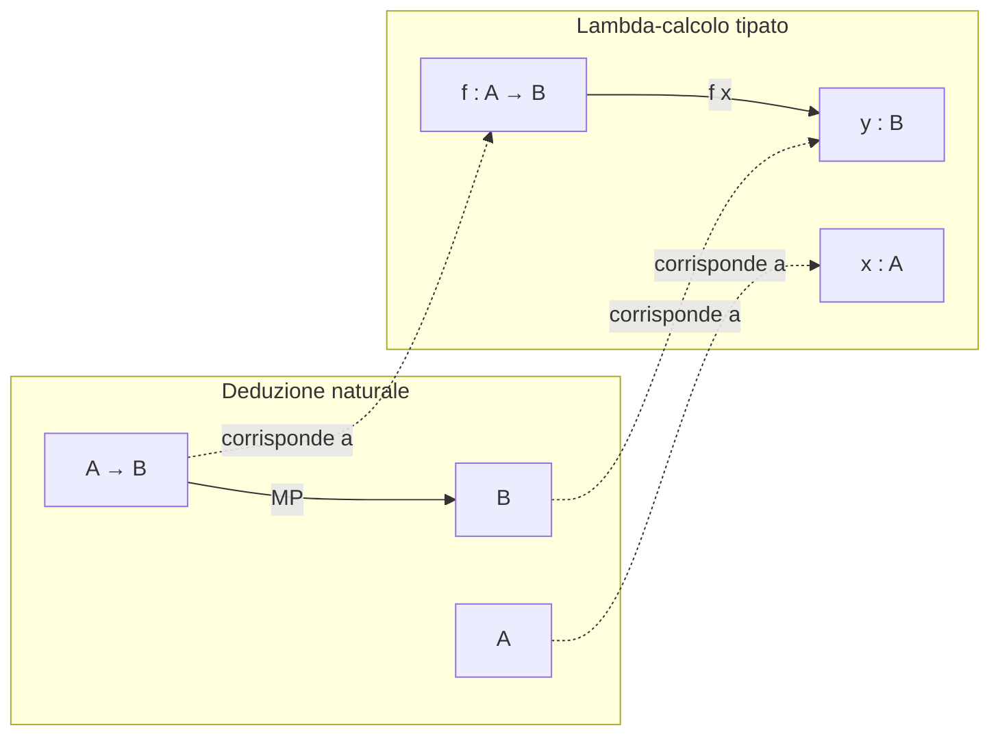
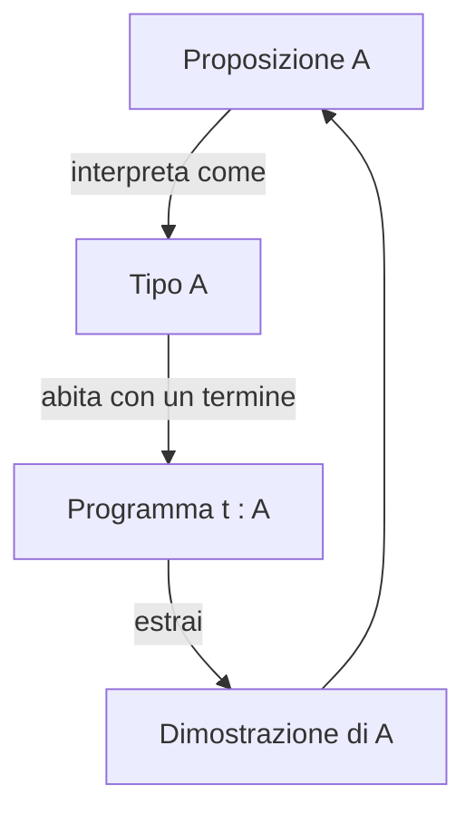

# Curry-Howard e type theory: dimostrazioni come programmi

C'è una scoperta del Novecento talmente bella che molti logici considerano un *miracolo*: **logica e programmazione sono la stessa cosa**. Non per analogia, non per metafora — proprio la stessa cosa, sotto un cambio di vocabolario. Le proposizioni sono tipi, le dimostrazioni sono programmi, l'eliminazione del modus ponens è applicazione di funzione, la normalizzazione di una prova è valutazione di un termine. Questo è l'isomorfismo di **Curry-Howard**, e quando lo si vede per la prima volta è uno di quei momenti in cui la matematica smette di essere una collezione di trucchi e diventa una struttura unica.

Storicamente l'idea germoglia in tre tempi: Haskell B. Curry (anni '30-'50) nota che gli assiomi della logica combinatoria corrispondono ai tipi dei combinatori; William A. Howard la formalizza per la deduzione naturale e il lambda-calcolo tipato in un paper del 1969 (circolato come manoscritto, pubblicato nel 1980); negli anni '70 Per Martin-Löf costruisce la **type theory intuizionista**, che assorbe anche i quantificatori tramite *dependent types*. Da lì discendono Coq (Coquand-Huet 1989, oggi Rocq), Agda (Norell 2007), Lean (de Moura 2013). Philip Wadler ne ha raccontato la storia in *Propositions as Types* (2015) con uno spirito quasi religioso: "this isn't just an analogy, it's an *identity*".

## 1. Il vocabolario dell'isomorfismo

L'idea è semplicissima da enunciare in tabella. Ogni costrutto logico ha un gemello nei tipi.

| Logica (intuizionista)          | Type theory                          | Esempio Haskell                |
|---------------------------------|--------------------------------------|--------------------------------|
| Proposizione $A$                | Tipo $A$                             | `Int`, `Bool`, `a -> b`        |
| Dimostrazione di $A$            | Termine $t : A$                      | `42 :: Int`                    |
| Implicazione $A \to B$          | Tipo funzione $A \to B$              | `f :: Int -> Bool`             |
| Congiunzione $A \wedge B$       | Tipo prodotto $A \times B$           | `(x, y) :: (a, b)`             |
| Disgiunzione $A \vee B$         | Tipo somma $A + B$                   | `Either a b`                   |
| Falso $\bot$                    | Tipo vuoto (`Void`, `Empty`)         | `data Void`                    |
| Vero $\top$                     | Tipo unitario (`()`, `Unit`)         | `()`                           |
| Modus ponens                    | Applicazione di funzione             | `f x`                          |
| Introduzione di $\to$           | Lambda-astrazione                    | `\x -> body`                   |
| Quantificatore $\forall x.\,P(x)$ | Prodotto dipendente $\Pi x:A.\,P(x)$ | (richiede dependent types)     |
| Quantificatore $\exists x.\,P(x)$ | Somma dipendente $\Sigma x:A.\,P(x)$ | (richiede dependent types)     |

La frase chiave: *trovare una dimostrazione di $A \to B$ è equivalente a scrivere un programma che, dato un input di tipo $A$, restituisce un output di tipo $B$*. Se hai il programma, hai la prova; se hai la prova, hai il programma. È letteralmente la stessa cosa scritta in due notazioni.

## 2. Implicazione come funzione: il caso base

Considera la tautologia banale $A \to A$. La sua dimostrazione in deduzione naturale è una riga: assumi $A$, scarica l'assunzione, ottieni $A \to A$ per introduzione di $\to$. Il termine corrispondente nel lambda-calcolo tipato è la **funzione identità**:

$$\lambda x{:}A.\,x \;:\; A \to A$$

In Haskell: `id :: a -> a; id x = x`.

Prendiamo qualcosa di leggermente meno banale: $A \to (B \to A)$, il primo assioma di Hilbert ("K"). La prova: assumi $A$, assumi $B$, scarta $B$, restituisci $A$. Il termine: $\lambda x{:}A.\,\lambda y{:}B.\,x$. In Haskell:

```haskell
k :: a -> b -> a
k x _ = x
```

Questo è il combinatore $K$ di Curry. Lo stesso nome non è un caso: Curry aveva *già* notato che i suoi combinatori avevano tipi che erano teoremi della logica implicazionale. Il combinatore $S = \lambda x.\,\lambda y.\,\lambda z.\,(x\,z)(y\,z)$ ha tipo $(A \to B \to C) \to (A \to B) \to A \to C$, che è un altro assioma classico. $S$ e $K$ generano l'intero lambda-calcolo *e* l'intera logica implicazionale.

## 3. Prodotto, somma, falso

**Congiunzione = prodotto.** Dimostrare $A \wedge B$ significa fornire una prova di $A$ *e* una prova di $B$: la coppia $(p, q)$ dove $p:A$ e $q:B$. Le proiezioni $\pi_1, \pi_2$ corrispondono alle regole di eliminazione di $\wedge$.

**Disgiunzione = somma.** Per dimostrare $A \vee B$ devi fornire una prova di $A$ *oppure* una prova di $B$, etichettata con la scelta. In Haskell:

```haskell
data Either a b = Left a | Right b
```

`Left p` è la prova "via $A$"; `Right q` è la prova "via $B$". L'eliminazione di $\vee$ (analisi per casi) è il `case` di Haskell.

**Falso = tipo vuoto.** $\bot$ è la proposizione senza dimostrazioni; il suo tipo gemello è il tipo `Void` senza costruttori. Da $\bot$ si deriva qualunque cosa (*ex falso quodlibet*): la funzione `absurd :: Void -> a` è la versione programmatica. Non puoi mai chiamarla, perché nessuno può costruire un valore di tipo `Void`. La negazione $\neg A$ diventa $A \to \bot$: una funzione che, se le passi una prova di $A$, ti dà l'assurdo.

```haskell
type Not a = a -> Void
```

## 4. Schema visivo dell'isomorfismo



Sopra: la regola di eliminazione di $\to$ (modus ponens) a sinistra, l'applicazione di funzione a destra. Lo stesso albero, due notazioni.

E sotto un secondo grafico, il ciclo "prova ↔ programma":



## 5. Quantificatori e dependent types

Fin qui abbiamo solo logica proposizionale. I quantificatori richiedono un salto: i tipi devono poter **dipendere da valori**. Un tipo dipendente è qualcosa come `Vec n Int` — vettori di interi di lunghezza esattamente $n$, dove $n$ è un *valore*, non una costante sintattica.

- $\forall x{:}A.\,P(x)$ diventa il **prodotto dipendente** $\Pi x{:}A.\,P(x)$: una funzione che a ogni $x:A$ associa una prova di $P(x)$.
- $\exists x{:}A.\,P(x)$ diventa la **somma dipendente** $\Sigma x{:}A.\,P(x)$: una coppia $(a, p)$ dove $a:A$ e $p:P(a)$.

In Agda o Lean puoi quindi scrivere *teoremi come tipi e dimostrazioni come programmi* anche al primo ordine.

## 6. Mini-esempio in Coq (Rocq)

Il teorema "se $A \to B$ e $A$ allora $B$" come programma:

```coq
Definition modus_ponens (A B : Prop) (f : A -> B) (a : A) : B := f a.

(* Oppure come "Theorem" con tattiche: *)
Theorem mp : forall (A B : Prop), (A -> B) -> A -> B.
Proof.
  intros A B f a. apply f. exact a.
Qed.
```

Sotto il cofano `mp` è esattamente la funzione `modus_ponens`. Le tattiche (`intros`, `apply`, `exact`) costruiscono il termine di prova, che Coq verifica essere ben tipato. Nessun magic: solo type-checking.

Un esempio leggermente più sostanzioso — la commutatività di $\wedge$:

```coq
Theorem and_comm : forall A B : Prop, A /\ B -> B /\ A.
Proof.
  intros A B H. destruct H as [a b]. split.
  - exact b.
  - exact a.
Qed.
```

Il termine sottostante: `fun A B H => match H with conj a b => conj b a end`. Una semplice destrutturazione di una coppia.

## 7. Programmazione e verifica formale

Curry-Howard non è folklore: è il motore di un'intera industria di **verifica formale**.

- **Compilatori certificati**: CompCert (Leroy) è un compilatore C scritto e *dimostrato corretto* in Coq. Il teorema "il binario prodotto è semanticamente equivalente al sorgente" è un termine di tipo enorme ma controllato dalla macchina.
- **Teoremi matematici**: il teorema dei quattro colori (Gonthier 2005) e Feit-Thompson (Gonthier 2012) sono stati formalizzati in Coq. Lean ha la libreria mathlib con centinaia di migliaia di teoremi.
- **Kernel di sistemi operativi**: seL4 (NICTA, 2009) è un microkernel verificato in Isabelle/HOL.
- **Crittografia**: protocolli come TLS sono stati verificati in F\* (HACL\*, miTLS).

In tutti questi casi: una proprietà di sicurezza è una proposizione → un tipo; il programma che la rispetta è un termine di quel tipo; il type-checker è il *proof-checker*.

## 8. Classico vs intuizionista

Curry-Howard, nella forma originale, copre la **logica intuizionista**: niente terzo escluso $A \vee \neg A$ "gratis", niente doppia negazione $\neg\neg A \to A$. Perché? Perché non c'è un programma generale che, dato un tipo $A$, restituisce *o* un valore di $A$ *o* una funzione $A \to \mathit{Void}$. Decidere quale dei due richiederebbe poter risolvere problemi indecidibili.

Per recuperare la logica classica si usa la corrispondenza estesa di **Griffin (1990)**: il terzo escluso corrisponde a operatori di controllo come `call/cc` (call-with-current-continuation). Una prova classica diventa un programma che manipola continuazioni. È un risultato magnifico ma poco intuitivo, e per molto codice "ordinario" la logica intuizionista è già abbondante.

## 9. Esercizio

<details>
  <summary>Esercizio — scrivi i termini di prova per i seguenti teoremi (in Haskell o pseudo-lambda)</summary>

(a) $A \to (B \to (A \wedge B))$

Termine: $\lambda x.\,\lambda y.\,(x, y)$. Haskell:

```haskell
pair :: a -> b -> (a, b)
pair x y = (x, y)
```

(b) $(A \wedge B) \to (B \wedge A)$ (commutatività di $\wedge$)

Termine: $\lambda p.\,(\pi_2\, p,\, \pi_1\, p)$. Haskell:

```haskell
swap :: (a, b) -> (b, a)
swap (x, y) = (y, x)
```

(c) $(A \to B) \to (B \to C) \to (A \to C)$ (composizione = sillogismo ipotetico)

Termine: $\lambda f.\,\lambda g.\,\lambda x.\,g\,(f\,x)$. Haskell: `(.)` rovesciato, ovvero `flip (.)`.

(d) $\neg(A \wedge \neg A)$ (non-contraddizione)

Ricorda $\neg X = X \to \bot$. Cerchiamo un termine di tipo $(A \wedge (A \to \bot)) \to \bot$. Termine: $\lambda p.\,(\pi_2\, p)(\pi_1\, p)$. In Haskell:

```haskell
nonContradiction :: (a, a -> Void) -> Void
nonContradiction (a, notA) = notA a
```

(e) Prova che il *terzo escluso* $A \vee \neg A$ **non** ha un termine ovvio. Spiegazione: dovresti scrivere `lem :: Either a (a -> Void)` polimorficamente in `a`. Ma quale costruttore scegli? `Left` richiede di produrre un `a` dal nulla; `Right` richiede una funzione che falsifichi *qualunque* `a`. Né l'uno né l'altro è possibile senza informazioni su `a`. Questo è precisamente perché il terzo escluso non è intuizionisticamente derivabile.

</details>

## Sintesi

- **Curry-Howard** identifica proposizioni con tipi, dimostrazioni con programmi, normalizzazione con valutazione.
- Implicazione ↔ funzione, congiunzione ↔ prodotto, disgiunzione ↔ somma, falso ↔ tipo vuoto.
- I quantificatori richiedono **dependent types** (Martin-Löf): $\forall$ è $\Pi$, $\exists$ è $\Sigma$.
- **Coq/Rocq, Agda, Lean** sono assistenti di prova basati su questa identità; producono codice eseguibile *e* certificato.
- La corrispondenza originale è **intuizionista**; per la logica classica serve l'estensione di Griffin via continuazioni.
- Verifica formale industriale (CompCert, seL4, mathlib) è Curry-Howard applicata su scala reale.

## Letture

- W. A. Howard, *The formulae-as-types notion of construction* (1969/1980).
- P. Martin-Löf, *Intuitionistic Type Theory* (Bibliopolis 1984).
- P. Wadler, *Propositions as Types* (CACM 2015) — saggio divulgativo eccellente.
- B. Pierce, *Types and Programming Languages* (MIT Press 2002), cap. 9-11.
- Adam Chlipala, *Certified Programming with Dependent Types* (MIT Press 2013) — tutorial Coq.
- *Software Foundations* (Pierce et al., online) — corso interattivo in Coq.
- Cross-link: [Deduzione naturale](10-deduzione-naturale.html), [Logiche non classiche](18-logiche-non-classiche.html), [Metalogica e Gödel](15-metalogica-godel.html).
