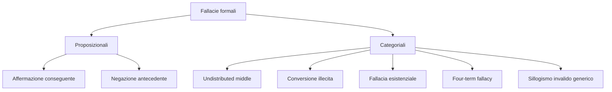

# Fallacie formali: quando la forma del ragionamento mente

Una fallacia **formale** è un argomento la cui struttura logica è invalida: esiste almeno un'assegnazione di valori di verità (o un'interpretazione insiemistica) in cui le premesse sono vere e la conclusione falsa. A differenza delle fallacie informali — che dipendono dal contenuto, dal contesto retorico, dalla psicologia dell'audience — le fallacie formali si smontano con una tabella di verità o un diagramma di Venn. Sono i casi in cui *la forma stessa* del ragionamento è bacata, indipendentemente da quanto le frasi suonino plausibili.

Storicamente le fallacie formali sono state catalogate prima da Aristotele (negli *Analitici primi* e nelle *Confutazioni sofistiche*) e poi raffinate dalla logica medievale (Pietro Ispano, Buridano) e moderna. Il nucleo non è cambiato: continuiamo a chiamare *modus ponens* ciò che Aristotele già usava, e *affermazione del conseguente* la sua sorella malvagia.

In questa sezione vediamo le sette fallacie formali più frequenti, con per ciascuna: schema simbolico, esempio italiano realistico, dimostrazione di invalidità via tabella di verità o controesempio insiemistico.

## 1. Affermazione del conseguente

**Schema:**

$$\frac{P \to Q,\quad Q}{P}$$

Premesse: "se piove, la strada è bagnata"; "la strada è bagnata". Conclusione (sbagliata): "piove".

**Perché è invalida.** La strada può essere bagnata per mille altri motivi: passaggio dello spazzino, perdita d'acqua, qualcuno ha lavato l'auto. La tabella di verità lo conferma: esiste una riga con $P \to Q$ vero, $Q$ vero, $P$ falso.

| P | Q | P→Q | Q | P |
|---|---|-----|---|---|
| V | V | V   | V | V |
| **F** | **V** | **V** | **V** | **F** ← controesempio |
| V | F | F   | F | – |
| F | F | V   | F | – |

Esempio politico italiano (parafrasato dai talk show): "Se un governo aumenta la spesa pubblica, cresce il PIL. Il PIL è cresciuto, quindi questo governo ha aumentato la spesa." Il PIL può essere cresciuto per export, consumi privati, recupero post-crisi. Affermazione del conseguente.

## 2. Negazione dell'antecedente

**Schema:**

$$\frac{P \to Q,\quad \neg P}{\neg Q}$$

"Se sei laureato in medicina, sai cos'è la pressione sistolica. Mario non è laureato in medicina, quindi non sa cos'è la pressione sistolica."

Mario potrebbe essere un infermiere, un paziente iperteso, un farmacista. L'antecedente è una *condizione sufficiente*, non necessaria. Tabella di verità: riga con $P$ falso, $Q$ vero, $P \to Q$ vero.

| P | Q | P→Q | ¬P | ¬Q |
|---|---|-----|----|----|
| **F** | **V** | **V**   | **V**  | **F** ← controesempio |

Affermazione del conseguente e negazione dell'antecedente sono **duali**: confondono la condizione sufficiente con quella necessaria. Le forme valide gemelle sono *modus ponens* ($P \to Q, P \vdash Q$) e *modus tollens* ($P \to Q, \neg Q \vdash \neg P$).

## 3. Sillogismo categorico errato: figure aristoteliche

Aristotele classificò i sillogismi in **figure** (posizione del termine medio) e **modi** (qualità e quantità delle proposizioni). Su 256 combinazioni teoriche, solo 24 modi sono validi. Tutto il resto è fallacia.

Schema generale:

- **Premessa maggiore** contiene il *termine maggiore* (predicato della conclusione)
- **Premessa minore** contiene il *termine minore* (soggetto della conclusione)
- Entrambe condividono il *termine medio*

Esempio invalido: "Tutti i cani sono mammiferi. Tutti i gatti sono mammiferi. Dunque tutti i cani sono gatti." Schema:

- Tutti $A$ sono $M$
- Tutti $B$ sono $M$
- Dunque tutti $A$ sono $B$ — **errato**

Il termine medio $M$ (mammiferi) non è mai *distribuito* in nessuna premessa: parliamo solo di *alcuni* mammiferi (quelli che sono cani o gatti). Questa è la prossima fallacia.

## 4. Undistributed middle (medio non distribuito)

**Schema:**

$$\frac{\text{Tutti gli }A\text{ sono }M;\;\text{Tutti i }B\text{ sono }M}{\text{Tutti gli }A\text{ sono }B}$$

In simboli moderni: da $\forall x(A(x) \to M(x))$ e $\forall x(B(x) \to M(x))$ non segue $\forall x(A(x) \to B(x))$.

**Controesempio insiemistico** (Eulero):

<svg viewBox="0 0 320 200" xmlns="http://www.w3.org/2000/svg" width="100%" style="max-width:520px">
  <ellipse cx="160" cy="100" rx="140" ry="80" fill="#181834" stroke="#9a8cf0" stroke-width="2"/>
  <text x="20" y="30" fill="#ecebff" font-size="14" font-family="serif">M (mammiferi)</text>
  <circle cx="100" cy="110" r="35" fill="#252550" stroke="#9a8cf0" stroke-width="2"/>
  <text x="85" y="115" fill="#ecebff" font-size="14">A (cani)</text>
  <circle cx="220" cy="110" r="35" fill="#252550" stroke="#9a8cf0" stroke-width="2"/>
  <text x="205" y="115" fill="#ecebff" font-size="14">B (gatti)</text>
  
A e B sono entrambi dentro M, ma sono disgiunti. Il "medio" M non è distribuito.

</svg>

Eulero: A e B sono entrambi sottoinsiemi di M, ma disgiunti tra loro.

**Distribuzione**: un termine è *distribuito* quando la proposizione parla di *tutti* gli elementi della sua estensione. "Tutti i cani sono mammiferi" distribuisce "cani" (soggetto universale) ma non "mammiferi" (predicato di una proposizione affermativa). Regola classica: *il termine medio deve essere distribuito almeno una volta*. Violata → fallacia.

Esempio reale italiano: "Tutti i corrotti hanno un conto in Svizzera. Mario ha un conto in Svizzera. Dunque Mario è corrotto." Pessimo. Il "conto in Svizzera" è il medio e non è mai distribuito (non si dice che *tutti* quelli con conto svizzero siano corrotti).

## 5. Fallacia esistenziale

**Schema:**

$$\frac{\forall x(A(x) \to B(x))}{\exists x(A(x) \wedge B(x))}$$

Da "tutti gli A sono B" *non* segue "esiste almeno un A che è B", se A è vuoto. Logica aristotelica assumeva **import esistenziale**: "tutti gli unicorni hanno un corno" implicava che esistessero unicorni. Logica moderna no.

Esempio: "Tutti i centauri sono mortali. Quindi esiste almeno un centauro mortale." Sbagliato — non esistono centauri. Forma valida solo se aggiungi la premessa $\exists x A(x)$.

Curiosità storica: il quadrato aristotelico classico include relazioni di subalternazione (da universale a particolare) che nella logica predicativa moderna *non* sono valide senza assumere il dominio non vuoto per A.

## 6. Conversione illecita

**Schema:**

$$\frac{\text{Tutti gli }A\text{ sono }B}{\text{Tutti i }B\text{ sono }A}$$

"Tutti i medici sono laureati ⇒ tutti i laureati sono medici." Ovviamente falso.

La conversione **lecita** vale solo per proposizioni:

- **E (universale negativa)**: "Nessun A è B" ⟷ "Nessun B è A" — convertibile semplicemente.
- **I (particolare affermativa)**: "Qualche A è B" ⟷ "Qualche B è A" — convertibile semplicemente.

Le **A (universali affermative)** e **O (particolari negative)** *non* sono convertibili semplicemente.

Variante mascherata in italiano giornalistico: "Molti spacciatori sono extracomunitari → molti extracomunitari sono spacciatori." È una conversione illecita su una proposizione I che pretende di mantenere la proporzione: anche quando la I è convertibile, non lo è in *percentuale*. Su questa fallacia campano molti titoli sui giornali.

## 7. Four-term fallacy (quaternio terminorum)

Un sillogismo ben formato ha **tre** termini distinti (maggiore, minore, medio). Se ne usi quattro — di solito per omonimia o equivocazione — l'inferenza salta.

**Esempio classico:**

- Tutti gli uccelli hanno le ali.
- Il pollo Felipe è un uccello.
- Dunque il pollo Felipe vola.

Il termine "uccello" è usato in due accezioni: nella maggiore "uccello = animale piumato in genere", nella minore "uccello = membro della classe biologica Aves". L'inferenza richiederebbe in più "tutti gli animali con ali volano", che è falsa per polli, pinguini, struzzi. C'è un quarto termine implicito ("volare") non collegato dalla catena.

In Italia il quaternio si presenta spesso via **equivocazione politica**: "Tutti i cittadini hanno diritto alla casa. Mario è cittadino. Dunque Mario ha diritto a *quella* casa." Il termine "casa" oscilla tra "diritto generico all'abitazione" e "diritto a un immobile specifico".

## 8. Schema d'insieme

## 9. Esempio lavorato: smontare un argomento

> *"Se i vaccini fossero pericolosi, ci sarebbero molti morti. Ci sono dei morti, quindi i vaccini sono pericolosi."*

Schematizziamo: $P$ = "i vaccini sono pericolosi", $Q$ = "ci sono dei morti".

- Premessa 1: $P \to Q$
- Premessa 2: $Q$
- Conclusione: $P$

Affermazione del conseguente. La gente muore per tantissime cause; trovare cadaveri non è prova della pericolosità del vaccino. Per validare l'argomento servirebbe una doppia implicazione $P \leftrightarrow Q$ oppure un'inferenza statistica (eccesso di mortalità correlato a esposizione), che è cosa diversa dalla logica deduttiva.

## 10. Esercizi

  
Esercizio 1 — Identifica la fallacia in 4 mini-argomenti

(a) "Se uno è ricco, ha la macchina di lusso. Andrea ha la Porsche, dunque Andrea è ricco." — **Affermazione del conseguente**. (Andrea potrebbe averla in leasing aziendale, ereditata, comprata svendendo casa, ecc.)

(b) "Tutti i mafiosi sono siciliani. Mario non è siciliano. Quindi Mario non è mafioso." — Doppiamente sbagliato: la premessa è falsa (esistono mafiosi non siciliani: 'ndrangheta, camorra, ecc.) e la forma è **negazione dell'antecedente** anche assumendo la premessa vera. Mario potrebbe non essere siciliano e però far parte di un'altra organizzazione.

(c) "Tutti gli atleti sono allenati. Tutti i militari sono allenati. Quindi tutti gli atleti sono militari." — **Undistributed middle**. Atleti e militari sono entrambi sottoinsiemi di "allenati" ma disgiunti (in larga misura).

(d) "Tutti i numeri primi sono dispari. Quindi qualche dispari è primo… aspetta, quindi 2 deve essere dispari." — Ben quattro errori in pochi caratteri. Il primo è falso (2 è primo e pari). Il "quindi 2 dispari" è un **quaternio terminorum** che mescola "primo" e "pari/dispari" come se l'inclusione si rovesciasse arbitrariamente.

  
Esercizio 2 — Dimostra via tabella di verità che modus tollens è valido

Modus tollens: $P \to Q, \neg Q \vdash \neg P$.

| P | Q | P→Q | ¬Q | ¬P |
|---|---|-----|----|----|
| V | V | V   | F  | F  |
| V | F | F   | V  | F  |
| F | V | V   | F  | V  |
| F | F | V   | V  | V  |

Cerchiamo righe in cui entrambe le premesse ($P \to Q$ e $\neg Q$) siano vere: solo la riga 4. In quella riga $\neg P$ è vero. Quindi ogni qual volta le premesse sono vere, lo è anche la conclusione. Valido.

## Sintesi

- Le **fallacie formali** sono invalide per struttura: tabella di verità o controesempio insiemistico le smontano.
- **Affermazione del conseguente** e **negazione dell'antecedente** confondono sufficiente e necessario.
- **Undistributed middle**: il termine medio del sillogismo deve essere distribuito almeno una volta.
- **Fallacia esistenziale**: dal "tutti" non segue "qualche" se il dominio può essere vuoto.
- **Conversione illecita**: A e O non si convertono semplicemente; solo E e I sì.
- **Four-term fallacy**: due termini con stesso nome ma significati diversi rompono la catena.

## Letture

- Aristotele, *Analitici primi* e *Confutazioni sofistiche*.
- I. Copi, C. Cohen, K. McMahon, *Introduction to Logic* (Routledge, ed. 14ª), cap. 6-7.
- W. Salmon, *Logica* (il Mulino) — manuale italiano standard.
- G. Vailati, *Scritti di metodologia della scienza* (per la tradizione italiana di Peano-Vailati).
- Cross-link: [Fallacie informali di rilevanza](21-fallacie-informali-rilevanza.html), [Fallacie informali di presunzione](22-fallacie-informali-presunzione.html), [Regole di inferenza](09-regole-inferenza.html).
