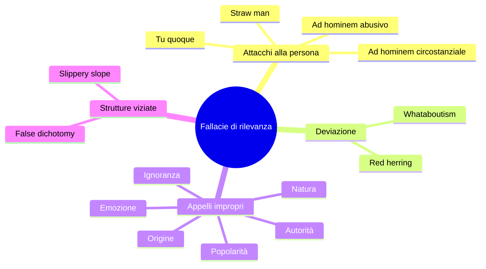

# Fallacie informali di rilevanza: distrarre invece di argomentare

Le fallacie informali, a differenza di quelle formali, non si smontano con una tabella di verità: il problema non è la *struttura* dell'inferenza ma il suo *contenuto*. Nelle fallacie di **rilevanza** la premessa che viene offerta in realtà non è pertinente alla conclusione: argomenta su qualcosa di diverso, sposta l'attenzione, fa appello a emozioni o autorità invece che a evidenza.

Aristotele ne aveva già parlato nelle *Confutazioni sofistiche* come *ignoratio elenchi*: argomentare per la conclusione sbagliata. Il catalogo moderno è cresciuto enormemente — Bentham, Schopenhauer (*Dialettica eristica*), Whately, fino ai manuali contemporanei (Walton, Tindale, Hamblin) — ma la diagnosi è la stessa: chi commette una fallacia di rilevanza *finge* di rispondere all'argomento dell'avversario mentre ne sta affrontando un altro, di solito più comodo.

Le esamineremo in tre cluster: **attacchi alla persona** (ad hominem, straw man), **deviazioni del fuoco** (red herring), **appelli impropri** (autorità, popolarità, emozione, ignoranza, natura, origine, whataboutism, false dichotomy, slippery slope).

## 1. Ad hominem (tre varianti)

L'ad hominem attacca chi parla invece di ciò che dice. Ne esistono tre forme:

**(a) Abusivo**: insulto puro. *"Non ascolto Tizio sul nucleare: è un imbecille."* Anche se Tizio fosse stupido, ciò non rende falsa la sua argomentazione. La verità di una proposizione non dipende dalla simpatia del relatore.

**(b) Circumstantial (circostanziale)**: attacca le circostanze personali. *"Certo che il farmacologo sostiene l'efficacia del farmaco, lavora per la casa farmaceutica."* Le circostanze possono giustificare *prudenza* (conflitto d'interessi reale → richiedere replica indipendente) ma non *falsificare* automaticamente l'argomento. Anche un dipendente Pfizer può dire la verità su un vaccino; bisogna controllarne i dati.

**(c) Tu quoque ("e tu pure")**: *"Mi dici che non dovrei fumare? Ma fumavi anche tu!"* L'ipocrisia del consigliere non rende cattivo il consiglio. Se il medico fumatore mi dice di smettere, ha comunque ragione.

Eccezione: l'attacco alla credibilità del *testimone* (non dell'argomentatore) è legittimo in contesti giudiziari e giornalistici. Se Tizio è stato condannato per falsa testimonianza, è lecito metterne in dubbio le dichiarazioni *future come testimone*. Ma se Tizio porta argomenti deduttivi, la sua biografia è irrilevante.

## 2. Straw man (uomo di paglia)

Costruisci una versione caricaturale dell'argomento avversario, la demolisci e dichiari vittoria. Esempio italiano da talk show:

> A: "Bisognerebbe regolare i flussi migratori con quote programmate annuali."
> B: "Quindi tu vuoi chiudere le frontiere e lasciare morire i bambini in mare!"

A non ha detto nulla del genere. B ha costruito uno straw man.

**Antidoto**: il **principio di carità** di Donald Davidson. Quando interpreti un argomento, scegli sempre la versione più ragionevole che il proponente potrebbe accettare. Poi attaccala. È più faticoso ma è l'unico modo per discutere onestamente.

## 3. Red herring (aringa rossa)

Una traccia falsa per distrarre il cane (l'aringa salata, dall'odore forte, distoglie i segugi). Si introduce un argomento collaterale che assomiglia abbastanza all'originale da sembrare pertinente ma non lo è.

> Giornalista: "Ministro, come spiega l'aumento del debito pubblico nel suo mandato?"
> Ministro: "Il vero scandalo è il debito ereditato dai governi precedenti negli anni '80."

Cambio di scena. Risposta apparentemente sul tema ma in realtà su un altro periodo, un altro governo, un'altra responsabilità.

## 4. Appeal to authority (argomentum ad verecundiam)

Citi un'autorità per sostenere una tesi. Quando è **legittimo**? Walton (*Appeal to Expert Opinion*, 1997) elenca cinque condizioni:

1. L'autorità è **effettivamente esperta** del campo in questione.
2. L'affermazione cade **nel suo campo specifico**.
3. C'è **consenso fra gli esperti** del campo.
4. L'autorità è **affidabile** (non in conflitto d'interesse evidente).
5. L'argomento dell'autorità è in linea di principio **riproducibile/falsificabile**.

L'appello è **improprio** quando manca una di queste condizioni.

- *"Einstein credeva in Dio."* (Anche se vero, Einstein non era un teologo né i suoi argomenti erano fisici.)
- *"Premio Nobel afferma che…"* (Nobel in cosa? In chimica? E parla di nutrizione?) Linus Pauling sulla vitamina C è il caso archetipico: due Nobel, ma fuori dal suo campo, smentito dai trial.
- *"Lo dice un medico."* (Quale medico? Su quale dato?)

In Italia, durante la pandemia, abbiamo visto autorità mediche su temi non immunologici (cardiologi sulle vaccinazioni, ortopedici sull'epidemiologia): formalmente medici, sostanzialmente fuori campo.

## 5. Appeal to popularity (ad populum / bandwagon)

*"Lo pensano tutti, quindi è vero."* O peggio: *"Lo pensano 2 milioni di follower."*

La popolarità non è prova. Galilei aveva tutti contro, e aveva ragione. La Terra resta sferica anche se aumentano i terrapiattisti. L'unico caso in cui il consenso conta è quando è **consenso informato di esperti** (e allora rientra nell'appeal to authority ben fatto).

## 6. Appeal to emotion

Sostituisci l'argomento con uno stimolo emotivo. Sottocategorie classiche:

- **Ad metum** (paura): *"Se non voti X, l'Italia sprofonderà nel caos."*
- **Ad misericordiam** (pietà): *"Pensate ai bambini malati che senza questa legge moriranno."*
- **Ad superbiam** (vanità): *"Un italiano intelligente come te capisce che…"*
- **Ad odium** (odio/disprezzo): *"Solo gli ingenui possono credere a questo."*

Le emozioni non sono *sempre* fallaci — un giudizio morale spesso si basa su empatia. Diventa fallacia quando l'emozione **sostituisce** l'argomentazione invece di accompagnarla.

## 7. Appeal to ignorance (ad ignorantiam)

*"Nessuno ha mai dimostrato che X sia falso, quindi X è vero."* (O viceversa.)

Esempi:

- *"Nessuno ha dimostrato che gli UFO non esistano, quindi esistono."*
- *"Nessuno ha provato che il farmaco causi danni a lungo termine, quindi è sicuro."*

L'assenza di prova non è prova di assenza, tranne in casi limitati (es. "se ci fosse un elefante nel mio salotto, lo vedrei: non lo vedo, quindi non c'è" — qui l'assenza *è* informativa perché ci aspetteremmo prove). Russell ne fece l'esempio della **teiera orbitale**: nessuno può dimostrare che non ci sia una teiera in orbita fra Terra e Marte, ma l'onere della prova spetta a chi afferma.

## 8. Appeal to nature

*"È naturale, quindi è buono. È artificiale, quindi è cattivo."*

L'arsenico è naturale, la chemioterapia è artificiale. Il vaiolo era naturalissimo. La distinzione natura/artificio non coincide con quella bene/male. G. E. Moore ha dato il colpo grosso a questo schema chiamandolo *naturalistic fallacy* (*Principia Ethica*, 1903): non si deriva un "dovere" da un "essere".

In Italia il claim "100% naturale" sui prodotti alimentari è quasi sempre un appello fallace mascherato: il claim *legittimo* sarebbe "controllato e sicuro", non "naturale".

## 9. Genetic fallacy

Giudichi un'idea dalla sua **origine** invece che dal suo merito.

- *"La selezione naturale fu proposta da Darwin, un inglese vittoriano: pieno di pregiudizi di classe, quindi la teoria è viziata."*
- *"La psicoanalisi nasce da Freud, che era ossessionato dal sesso, quindi è inutile."*

L'origine di un'idea può essere euristicamente sospetta, ma non determina la sua verità. Il modello di Bohr dell'atomo nasce da un'analogia con il sistema solare: l'analogia è limitata, ma il modello è giudicabile sui suoi predicati empirici.

## 10. Whataboutism

Risposta a una critica con un'altra critica, di solito diretta a un avversario. Tecnica nota nella propaganda sovietica (*"And what about the lynchings in the South?"* quando si parlava di gulag), oggi onnipresente sui social.

> A: "Il governo italiano dovrebbe ridurre il debito."
> B: "E gli Stati Uniti? Hanno un debito tre volte il nostro!"

La situazione altrui non rende meno vero il problema. È formalmente un *tu quoque* aggregato — sposta il discorso da "il mio governo" a "ma quell'altro è peggio".

## 11. False dichotomy (falso dilemma)

Presenti due alternative come se fossero le uniche, mentre ce ne sono altre.

- *"O sei con noi, o sei contro di noi."*
- *"O accetti il TAV o sei contro lo sviluppo."*
- *"O credi nella scienza o credi in Dio."*

L'antidoto: cercare il *tertium*. Spesso un terzo, quarto, quinto livello esiste — semplicemente non è venduto nell'argomento.

## 12. Slippery slope (china scivolosa)

*"Se permettiamo A, finiremo necessariamente in Z, che è terribile, quindi non permettiamo A."*

- *"Se legalizziamo l'eutanasia per malati terminali, finiremo con l'uccidere i depressi e poi tutti gli anziani."*
- *"Se concediamo il matrimonio gay, finiremo per legalizzare la poligamia con animali."*

Lo slippery slope è fallace quando la catena di causazioni A → B → C → … → Z è **assunta senza prove**. Diventa argomento legittimo se la catena è dimostrabilmente operante (es. "se introduciamo questa norma fiscale, gli altri stati la copieranno, è già successo nel 2008 con X"). Linea sottile: il fattore decisivo è la qualità delle evidenze sulle transizioni intermedie.

## 13. Schema visivo

## 14. Esempio lavorato: smontare un commento da social

Commento reale (parafrasato): *"I climatologi vogliono che paghiamo più tasse, quindi le loro previsioni sono inattendibili. Tra l'altro, Greta è una ragazzina, cosa ne sa? E poi, anche se il clima cambia, è sempre cambiato — è naturale. Se davvero fosse un problema, la Cina farebbe qualcosa. Quindi smettiamola con questa storia delle emissioni."*

Catalogo:

- *"I climatologi vogliono più tasse"* → **ad hominem circostanziale** (motivazione attribuita).
- *"Greta è una ragazzina"* → **ad hominem abusivo** (irrilevante l'età, rilevanti gli argomenti).
- *"È sempre cambiato"* → **appeal to nature** + irrilevanza (le variazioni geologiche hanno cause diverse da quella antropica).
- *"Anche la Cina"* → **whataboutism**.
- *"Smettiamola con le emissioni"* → conclusione non supportata da nessuno degli argomenti precedenti.

Cinque fallacie in cinque righe. È normale che si ammucchino: la persuasione "a effetto" preferisce quantità a qualità.

## 15. Quando l'appello all'autorità è invece legittimo

Per non passare per *iper-scettico*: ci sono moltissime situazioni in cui *dobbiamo* fidarci di un'autorità competente (non possiamo riderivare ogni teorema, ogni trial clinico, ogni statistica). La regola pratica:

1. **Verifica le credenziali** (formazione, pubblicazioni nel campo specifico).
2. **Verifica il consenso** (esiste una review sistematica? Un panel come IPCC? Una linea guida ISS?).
3. **Verifica i conflitti d'interesse**, senza inferire automaticamente menzogna.
4. **Cerca dissenso qualificato**: se l'autorità è opposta da altre autorità altrettanto credenziali, la questione è aperta.

Citare un esperto rispettando questi criteri **non è fallacia**: è normale epistemologia sociale. Ne parleremo in [Epistemologia](42-epistemologia.html).

## 16. Esercizi

  
Esercizio — Identifica la/e fallacia/e in ciascun argomento

(a) *"Questo libro lo ha scritto Salvini, quindi è un'idiozia."* — **Genetic fallacy** + ad hominem abusivo.

(b) *"Tutti comprano l'iPhone, quindi è il miglior smartphone."* — **Ad populum**.

(c) *"Se accetti che gli studenti scelgano il loro programma, presto ci diranno che vogliono solo videogiochi a scuola."* — **Slippery slope**.

(d) *"O ridurre le tasse o lo Stato fallisce. Quindi riduciamo le tasse."* — **False dichotomy** (esistono altre opzioni: aumentare entrate, ridurre spese specifiche, ecc.).

(e) *"Non ci sono prove che il pesticida X provochi tumori, quindi è sicuro."* — **Appeal to ignorance**. (L'assenza di studi non equivale a prova di innocuità.)

(f) *"Lo zenzero è efficace contro la nausea: è naturale, quindi sicuro."* — **Appeal to nature** (anche se zenzero contro nausea ha qualche evidenza, l'argomento "naturale = sicuro" è fallace; l'aconito è naturale e mortale).

## Sintesi

- Le fallacie di rilevanza **cambiano oggetto** dell'argomentazione, anziché smontarla.
- **Ad hominem** in tre forme (abusivo, circumstantial, tu quoque): attacca chi parla, non ciò che dice.
- **Straw man**: fraintendi caricaturalmente; antidoto = principio di carità.
- **Red herring** e **whataboutism**: distrazione.
- **Appeal to authority/popularity/emotion/ignorance/nature/origin**: sostituzioni indebite di evidenza.
- **False dichotomy** e **slippery slope**: forzano l'argomento in un imbuto fittizio.
- L'appello all'autorità è legittimo se l'autorità è competente, in campo, consensuale, riproducibile.

## Letture

- Schopenhauer, *L'arte di ottenere ragione (Dialettica eristica)* — catalogo cinico delle scorrettezze.
- D. Walton, *Informal Logic* (Cambridge UP) e *Appeal to Expert Opinion* (Penn State 1997).
- I. Copi, *Introduction to Logic*, cap. 5 sulle informali.
- F. Cassano, *Approssimazione* (per riflessione sull'argomentare italiano).
- Cross-link: [Fallacie informali di presunzione](22-fallacie-informali-presunzione.html), [Retorica e persuasione](39-retorica-persuasione.html), [Propaganda e manipolazione](50-propaganda-manipolazione.html).
