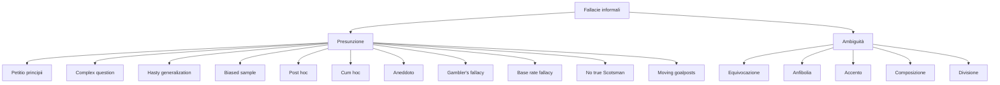

# Fallacie informali di presunzione e ambiguità

Le fallacie informali si dividono tradizionalmente in tre famiglie (Aristotele, *Confutazioni sofistiche*; Whately, *Elements of Logic*, 1826): **rilevanza** (trattata nella sezione precedente), **presunzione** (assumere quanto si dovrebbe dimostrare o estrapolare oltre le evidenze), **ambiguità** (sfruttare l'equivocità del linguaggio per far passare conclusioni indebite).

In questa sezione esploriamo le ultime due. Sono fallacie *sottili*: spesso il parlante non se ne rende conto, perché si annidano nelle assunzioni implicite o nelle pieghe semantiche. Riconoscerle richiede pazienza analitica più che istinto polemico.

## 1. Petitio principii (begging the question, circular reasoning)

**Schema:** la conclusione è già contenuta — esplicitamente o sinonimamente — in una delle premesse.

> "Dio esiste perché lo dice la Bibbia, che è la parola di Dio."

Per accettare che la Bibbia sia parola di Dio bisogna prima accettare che Dio esista. Il cerchio si chiude su sé stesso.

**Esempio più sottile:** *"L'astrologia funziona, perché molti casi confermano le previsioni degli astrologi."* (Confermati come? Solo i casi che corrispondono al pronostico, ignorando i fallimenti. Si assume l'efficacia per *selezionare* le conferme.)

Hamblin (*Fallacies*, 1970) osserva che la *petitio* è una fallacia "dialettica" più che logica: in senso stretto $P \to P$ è valido. Quello che la rende fallacia è il contesto argomentativo: stai chiedendo all'interlocutore di concedere come premessa quanto è in discussione.

## 2. Complex question (domanda complessa / loaded question)

Una domanda formulata in modo da contenere un assunto contestabile, che viene "smerciato" insieme alla risposta.

- *"Smetterai mai di bere la sera?"* (Assume che tu beva la sera.)
- *"Perché il governo italiano spreca i nostri soldi?"* (Assume che li sprechi.)
- *"Hai già confessato il delitto?"* (Versione giudiziaria classica.)

Tecnicamente è una **presupposizione pragmatica** non concordata. La risposta — sì/no — è una trappola. L'unica risposta corretta è *rifiutare la presupposizione*: "non bevo la sera", "non darei per scontato che spreca".

## 3. Hasty generalization (generalizzazione affrettata)

Inferi una regola universale da pochi casi.

- *"Ho conosciuto due napoletani disonesti, quindi i napoletani sono disonesti."*
- *"Tre miei amici ingegneri sono single, quindi gli ingegneri non si sposano."*

La statistica esige campioni di taglia adeguata. Vedremo in [Probabilità: fondamenti](32-probabilita-fondamenti.html) e seguenti perché il margine di errore decresce solo come $1/\sqrt{n}$: passare da $n=3$ a $n=300$ riduce l'errore di circa 10 volte.

## 4. Biased sample (campione viziato)

Generalizzazione corretta in apparenza ma su campione non rappresentativo. È diverso da hasty generalization: qui il campione può essere anche grande, ma è raccolto male.

- Sondaggio telefonico fisso nel 2024 → escludi i giovani.
- Sondaggio online su Twitter → escludi i non-Twitter.
- "I lettori del nostro giornale al 90% approvano il nostro editoriale" → autoselezione spettacolare.

Caso storico: nel 1936 il *Literary Digest* previde la vittoria di Landon su Roosevelt sondando 2.4 milioni di persone — un campione enorme, ma estratto da liste di abbonati al telefono e proprietari di automobile, escludendo la maggioranza povera che votò Roosevelt. Errore di 19 punti.

## 5. Post hoc ergo propter hoc

*Dopo questo, dunque a causa di questo.* Confondi successione temporale con causazione.

- *"Ho preso l'oroscopo del giorno e dopo è successo X."*
- *"Da quando questa azienda ha cambiato CEO, il fatturato è salito: il nuovo CEO è geniale."*

Il rooster crede di causare l'alba perché canta prima del sorgere del sole. Hume (*Trattato sulla natura umana*, 1739) ha analizzato in modo definitivo l'inferenza causale: la sequenza temporale + contiguità + costanza forniscono solo *aspettative* psicologiche, non garanzia causale. La causalità statistica moderna (Pearl, [Causalità](45-causalita-pearl.html)) richiede *controlli*, *interventi*, o almeno *assunzioni esplicite* sul DAG causale.

## 6. Cum hoc ergo propter hoc

Variante: *insieme a questo, dunque a causa di questo.* Confondi correlazione con causazione, anche senza precedenza temporale chiara.

- *"I paesi con più consumo di cioccolato hanno più premi Nobel."* (Reale: Messerli, *NEJM* 2012, paper semi-scherzoso). Probabile confondente: ricchezza nazionale.
- *"I bambini con piedi grandi leggono meglio."* Confondente: età.
- *"Le città con più chiese hanno più crimini."* Confondente: popolazione.

Una correlazione $r=0.7$ è suggestiva ma non risolutiva: serve eliminare confondenti, considerare causazione inversa, casualità. Strumento principe: il *randomized controlled trial*.

## 7. Anecdotal evidence

Generalizzi da aneddoti personali ignorando i dati statistici.

- *"A mia nonna ha funzionato l'omeopatia, quindi funziona."*
- *"Conosco uno che ha guadagnato 100k con il trading, quindi è facile."*

Le storie singole sono cognitivamente potenti (vedere [Bias cognitivi](23-bias-cognitivi.html): availability heuristic) ma statisticamente deboli. Un singolo caso è $n=1$ con varianza enorme.

## 8. Gambler's fallacy

*"Sono usciti cinque rossi di fila alla roulette, ora deve uscire nero."*

In eventi indipendenti, la sequenza passata non influenza il prossimo lancio. La probabilità di nero resta 18/37 alla roulette europea, indipendentemente dalla storia. Origine famosa: Monte-Carlo 1913, 26 neri di fila, scommettitori in bancarotta ad ogni giro convinti che il rosso fosse "dovuto".

Specchio: la **hot hand fallacy** (Gilovich-Vallone-Tversky 1985 sui canestri NBA) — credere che dopo successi consecutivi il prossimo sia più probabile (in eventi *indipendenti*; per eventi non-indipendenti il giudizio è più sfumato).

## 9. Base rate fallacy

Trascuri la **probabilità a priori** (base rate) confrontandola con un test diagnostico. È un caso bayesiano (→ [Teorema di Bayes](33-teorema-bayes.html)).

Esempio canonico: una malattia colpisce 1 su 1000 persone. Un test ha sensibilità 99% e specificità 99%. Sei positivo. Probabilità di essere malato?

Intuizione comune: 99%. Calcolo bayesiano:

$$P(\text{malato} \mid +) = \frac{P(+ \mid \text{malato}) P(\text{malato})}{P(+)} = \frac{0{,}99 \cdot 0{,}001}{0{,}99 \cdot 0{,}001 + 0{,}01 \cdot 0{,}999} \approx \frac{0{,}00099}{0{,}011} \approx 9\%$$

Solo il 9%. La base rate (0.1%) domina il calcolo. Ignorarla è la *base rate fallacy*. È la stessa fallacia dietro il **prosecutor's fallacy** ("DNA match 1 su un milione, dunque l'imputato è colpevole al 99.9999%") — formalmente identica.

Vedi anche [Paradossi probabilistici](34-paradossi-probabilistici.html) per il paradosso del falso positivo.

## 10. Equivocazione

Stesso termine usato in due sensi diversi, contando sul fatto che il lettore non se ne accorga.

> "La fede sposta le montagne. La fede è una credenza religiosa. Quindi una credenza religiosa sposta le montagne."

"Fede" nel primo senso è retorica/metaforica; nel secondo è dottrinale.

Esempio italiano: *"Le leggi della natura sono inviolabili. Quindi nessuno può violare le leggi della natura. La legge del 1990 sulla privacy è una legge. Quindi nessuno può violarla."* Quattro usi di "legge" mescolati.

## 11. Amphibolia (anfibolia)

Ambiguità non lessicale ma **sintattica**: una frase ammette due strutture grammaticali.

- *"Vidi un uomo con un cannocchiale."* (Lui aveva il cannocchiale, o io l'ho visto con il mio?)
- Titolo di giornale: *"Spara al padre e fugge in autostrada con la madre."* (Chi fugge? Chi è in autostrada?)
- Croesus: "Se attraverserai l'Halys, distruggerai un grande regno." (Erodoto. Croesus attraversò e distrusse il *proprio* regno.)

## 12. Accento

Ambiguità da **enfasi**.

> *"Non dovremmo parlare male **dei nostri** amici."* (Implica: degli altri sì.)
> *"**Non** ho rubato i soldi a Marco."* (Lo ha fatto qualcun altro? O lui ha rubato altro?)

In contesti scritti, l'accent fallacy si manifesta in **citazioni decontestualizzate** che cambiano il senso sottolineando o tagliando.

## 13. Composition fallacy

Inferi una proprietà del **tutto** da una proprietà delle **parti**.

- *"Ogni atomo è invisibile, quindi qualunque oggetto fatto di atomi è invisibile."*
- *"Ogni giocatore della squadra è bravo, quindi la squadra è la migliore."* (Falso: chimica di squadra, ruoli, complementarità.)
- *"Ogni famiglia che risparmia diventa più ricca; se tutte le famiglie risparmiassero, lo stato sarebbe più ricco."* (Errore: paradosso del risparmio keynesiano.)

## 14. Division fallacy

L'opposto: inferi una proprietà delle parti da una proprietà del tutto.

- *"L'orchestra suona magnificamente, quindi il triangolista è un virtuoso."*
- *"L'Italia è un paese ricco, quindi gli italiani sono ricchi."*

Composition e division sono duali: entrambe ignorano l'**emergenza** (proprietà del tutto non riducibili a quelle delle parti) e i **fenomeni di aggregazione** (proprietà delle parti che non si sommano linearmente).

## 15. No true Scotsman

Salvi una generalizzazione ridefinendone i termini quando incontri un controesempio.

> A: "Nessun vero scozzese mette zucchero nel porridge."
> B: "Mio zio è scozzese e mette zucchero nel porridge."
> A: "Allora non è un *vero* scozzese."

L'argomento diventa **immunizzato** contro la falsificazione restringendo arbitrariamente il dominio. Popper lo collegherebbe alla **non-falsificabilità**: una teoria che si difende così smette di essere scientifica.

Esempio politico: *"Nessun vero socialista appoggerebbe questa misura. Tizio è socialista e l'appoggia. Allora non è un vero socialista."* Oppure: *"Nessun vero cristiano si comporterebbe così."*

## 16. Moving the goalposts

Ridefinisci i criteri di prova quando le evidenze sono soddisfatte.

> A: "Non c'è alcuna prova che il farmaco funzioni."
> B: "Ecco tre trial clinici randomizzati positivi."
> A: "Sì, ma non sono multicentrici."
> B: "Ecco due multicentrici."
> A: "Sì, ma non in popolazione anziana."
> B: "Ecco uno in popolazione anziana."
> A: "Sì, ma non a lungo termine."

Ogni volta che B soddisfa il criterio, A ne fissa uno nuovo. La discussione diventa interminabile e A è strutturalmente immune alla persuasione.

Variante speculare onesta: una richiesta legittima di evidenze convergenti. Linea sottile: se i criteri sono *dichiarati in anticipo*, è metodo; se *aggiunti dopo*, è moving the goalposts.

## 17. Schema visivo

## 18. Esercizi: identifica la fallacia in 8 mini-testi

  
Mostra mini-testi + soluzioni

(1) *"Tutti i grandi musicisti sono morti giovani: Mozart, Hendrix, Cobain. Quindi se vuoi essere un grande musicista, è destino che muori giovane."*
→ **Hasty generalization** + selezione (sopravvivenza inversa): ignori i mille grandi musicisti longevi (Verdi, Stravinsky, Sondheim).

(2) *"Da quando hanno costruito quella torre del 5G, in paese c'è stato un caso di tumore. Il 5G provoca tumori."*
→ **Post hoc ergo propter hoc** + $n=1$ (aneddoto).

(3) *"Lei sostiene che la giustizia è importante. Ma allora ammette che le sue critiche sono ingiustizie verso il governo?"*
→ **Equivocazione** su "giustizia" (concetto generale vs giudizio politico specifico).

(4) *"Sono uscite cinque pari di fila alla roulette. Adesso esce dispari, quasi sicuro."*
→ **Gambler's fallacy**.

(5) *"Ha smesso di picchiare sua moglie?"*
→ **Complex question**.

(6) *"Ogni cellula del mio corpo è leggera, quindi il mio corpo è leggero."*
→ **Composition fallacy**.

(7) *"Il test ha sensibilità 99%, sei positivo: sei malato al 99% di probabilità."*
→ **Base rate fallacy** (manca la prevalenza).

(8) *"Quella scrittrice è famosa solo perché è la figlia di un editore."*
→ **Genetic fallacy** (sezione 21) o, se vista come tentativo di immunizzazione retorica, una sfumatura di **no true Scotsman** se diventa "non è una *vera* scrittrice".

## Sintesi

- **Presunzione**: dare per scontato l'oggetto della disputa (petitio, complex question) o estrapolare da basi insufficienti (hasty generalization, biased sample, aneddoto, post hoc, cum hoc, gambler's, base rate).
- **Ambiguità**: sfruttare imprecisioni lessicali (equivocazione), sintattiche (anfibolia), enfatiche (accento) o di livello (composizione/divisione).
- **No true Scotsman** e **moving the goalposts**: tecniche di immunizzazione.
- L'inferenza causale richiede più della successione temporale: controllo dei confondenti, idealmente RCT.
- Le fallacie statistiche (base rate, gambler's, hasty generalization) vivono nel tuo cervello: vedremo perché in [Bias cognitivi](23-bias-cognitivi.html).

## Letture

- C. L. Hamblin, *Fallacies* (Methuen 1970) — testo seminale.
- D. Walton, *A Pragmatic Theory of Fallacy* (Alabama UP 1995).
- A. Tversky, D. Kahneman, *Judgment under Uncertainty* (Cambridge UP 1982).
- T. Gilovich, *How We Know What Isn't So* (Free Press 1991).
- P. Odifreddi, *Il Vangelo secondo la scienza* (Einaudi) — esempi italiani di fallacie storiche.
- Cross-link: [Fallacie informali di rilevanza](21-fallacie-informali-rilevanza.html), [Bias cognitivi](23-bias-cognitivi.html), [Teorema di Bayes](33-teorema-bayes.html), [Paradossi probabilistici](34-paradossi-probabilistici.html).
