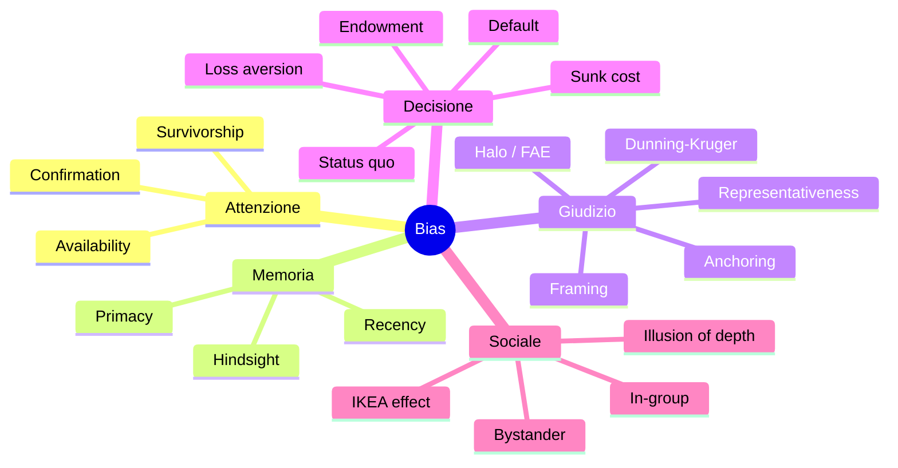

# Bias cognitivi: catalogo ragionato

Nel 1974 Daniel Kahneman e Amos Tversky pubblicano su *Science* "Judgment under Uncertainty: Heuristics and Biases". L'idea rivoluzionaria: la mente umana non sbaglia "a caso" — sbaglia in *modi sistematici e prevedibili*. Da allora la letteratura ha catalogato centinaia di bias. Qui ne ordino i più importanti per famiglie funzionali. Non è un elenco da imparare a memoria — è una checklist da consultare quando sospetti di star ragionando male.

I bias derivano per la maggior parte dal **Sistema 1** (vedi [dual process](24-dual-process.html)): scorciatoie veloci che sono adattive in media, ma sistematicamente distorte in certi contesti.

## 1. Bias di attenzione e raccolta di evidenze

### 1.1 Confirmation bias

Cerchi e ricordi preferibilmente informazioni che confermano ciò che già credi. Wason 1960: i soggetti, dati i numeri "2, 4, 6" e chiesti di indovinare la regola, propongono ipotesi *e poi cercano solo conferme* invece di test che potrebbero confutarle. Mitigazione: chiedi attivamente "cosa mi farebbe cambiare idea?" (steelmanning, vedi [sez. 40](40-dibattito-dialettica.html)).

### 1.2 Attentional bias

Vedi più frequentemente ciò a cui sei sensibilizzato. Comprare una macchina rossa e all'improvviso "tutti hanno la rossa". Detto anche **Baader-Meinhof phenomenon**.

### 1.3 Availability heuristic

Stimi la frequenza di un evento dalla facilità con cui esempi vengono alla mente. Dopo una notizia di plane crash, sovrastimi il rischio di volare. Tversky & Kahneman 1973. Mitigazione: cerca **base rates statistiche**.

### 1.4 Sopravvivenza (survivorship bias)

Studi solo i sopravvissuti, ignorando chi non c'è più. Esempio canonico: gli aerei della WWII rientrati avevano fori nelle ali — Abraham Wald capì che andavano blindati nei *punti senza fori*, perché chi era stato colpito lì non era tornato. Si applica a "i CEO di successo hanno tutti dropoutato l'università": ignori i milioni di dropout falliti.

## 2. Bias di memoria

### 2.1 Recency bias

Le informazioni recenti pesano più di quelle vecchie. Il manager valuta il dipendente sull'ultima settimana, non sull'anno.

### 2.2 Primacy effect

L'opposto in certi contesti: le prime informazioni costituiscono l'"ancora" mentale. Asch 1946: persone descritte come "intelligente, industrioso, impulsivo, critico, testardo, invidioso" vengono valutate diversamente da chi legge la stessa lista in ordine invertito.

### 2.3 Hindsight bias ("lo sapevo")

Dopo l'esito, lo ritieni inevitabile e prevedibile. Fischhoff 1975: nessuno aveva previsto la caduta del muro, ma dopo "era ovvio".

### 2.4 Misattribution

Ricordi correttamente il fatto ma ne dimentichi la fonte. Crea problemi a giudici e testimoni.

## 3. Bias di giudizio e stima

### 3.1 Representativeness

Giudichi probabilità per somiglianza a uno stereotipo, ignorando le base rates. Caso Linda (Tversky-Kahneman 1983): Linda, "filosofa, attivista femminista". La maggior parte risponde che è più probabile che sia *bancaria e femminista* invece di *bancaria*. Violazione formale: $P(A \wedge B) \le P(B)$. È la **conjunction fallacy**.

### 3.2 Anchoring

Un valore di partenza, anche irrelevante, sposta le stime successive. Tversky & Kahneman: la "ruota della fortuna" influenza la stima della percentuale di nazioni africane all'ONU. Sales, negoziazione, prezzo iniziale di un'asta: tutto si basa su anchoring.

### 3.3 Framing

Stessa informazione presentata diversamente genera scelte diverse. "10% di mortalità" vs "90% di sopravvivenza": stesso numero, decisioni cliniche diverse. Tversky & Kahneman 1981.

### 3.4 Halo effect

Una caratteristica positiva (es. bellezza) contamina la valutazione di altre (intelligenza, onestà). Thorndike 1920. L'opposto è il **horns effect**.

### 3.5 Fundamental attribution error (FAE)

Spieghi il comportamento altrui con il carattere ("è cattivo"), il proprio con la situazione ("ero stanco"). Ross 1977. Asimmetria adattiva ma distorta. Versione attenuata: actor-observer asymmetry.

### 3.6 Dunning-Kruger effect

Le persone meno competenti sovrastimano la propria competenza; le più competenti la sottostimano (anche per assumere che gli altri capiscano). Kruger & Dunning 1999. Va distinto dal dato statistico di regressione alla media: parte dell'effetto originale è artefatto. Ma esiste come fenomeno qualitativo.

## 4. Bias di decisione

### 4.1 Loss aversion

Perdere 100€ duole circa **2× il piacere di guadagnare 100€**. Cuore della prospect theory (vedi [sez. 35](35-teoria-decisione.html)).

### 4.2 Sunk cost fallacy

Continui un investimento perdente per "non sprecare ciò che hai già speso". Il sunk cost è irrecuperabile: irrilevante per la decisione futura. Marito triste che resta sposato "perché ci ho dedicato 20 anni" — i 20 anni sono andati, la decisione è sui prossimi 20.

### 4.3 Status quo bias

Preferisci lo stato attuale, anche quando un cambiamento migliorerebbe la situazione. Samuelson & Zeckhauser 1988.

### 4.4 Endowment effect

Valuti un oggetto di più quando lo possiedi. Esperimento canonico: tazza Cornell (Kahneman-Knetsch-Thaler 1990) — chi la riceve la rivende per ~7$, chi non l'ha la compra per ~3$.

### 4.5 Choice overload

Troppe opzioni paralizzano. Iyengar & Lepper 2000: 24 marmellate → meno vendite di 6 marmellate.

### 4.6 Default effect

Le opzioni "preselezionate" vengono accettate sproporzionatamente. Donazione di organi opt-in vs opt-out: differenza dell'80% nelle iscrizioni in Europa. Lo sfruttamento commerciale dei default è massiccio (privacy, abbonamenti).

## 5. Bias sociali e di gruppo

### 5.1 In-group bias

Tratti il proprio gruppo meglio dell'out-group, anche quando il gruppo è arbitrario (paradigma dei "gruppi minimi" di Tajfel).

### 5.2 Illusion of explanatory depth

Credi di capire come funziona una zip / bicicletta / governo, e all'esame di spiegarne il funcionamento crolli. Rozenblit & Keil 2002. Mitigazione: provare a spiegare a un bambino (tecnica Feynman).

### 5.3 IKEA effect

Valuti di più ciò che hai costruito tu, anche se mediocre. Norton-Mochon-Ariely 2012.

### 5.4 False consensus

Sovrastimi quanti la pensano come te. Ross-Greene-House 1977.

### 5.5 Bystander effect

In gruppo è meno probabile che intervieni in un'emergenza (diffusione della responsabilità). Caso Kitty Genovese 1964, esperimenti di Latané & Darley.

## 6. Diagramma riassuntivo

## 7. Tabella compatta con esperimento originale

| Bias | Esperimento canonico | Anno |
|---|---|---|
| Confirmation | Wason 2-4-6 task | 1960 |
| Availability | Death from disease vs accident estimates | 1973 |
| Anchoring | Wheel of fortune + UN nations | 1974 |
| Representativeness | "Linda the bank teller" | 1983 |
| Framing | Asian disease problem | 1981 |
| Loss aversion | Coin flip 50/50 +200 / −100 | 1979 |
| Endowment | Cornell mug experiment | 1990 |
| Hindsight | Nixon's China visit predictions | 1975 |
| Sunk cost | Mexico vs Wisconsin ski trip | 1985 |
| Default | Organ donation rates EU | 2003 |

## 8. Mitigazione: cosa funziona davvero?

La maggior parte dei "debiasing training" hanno effetti modesti o nulli. Cosa funziona meglio:

- **Algoritmi/checklist**: sostituire il giudizio con una procedura quando i bias sono prevedibili. Atul Gawande *The Checklist Manifesto*: chirurghi con checklist riducono mortalità del 40%.
- **Pre-mortem**: prima di una decisione, immagina che vada male e chiediti perché. Klein 2007.
- **Outside view**: invece di valutare il caso specifico, cerca la base rate del riferimento di classe (Kahneman-Lovallo 1993).
- **Cambia incentivi**: i bias spariscono quando le persone hanno *skin in the game* (es. mercati di previsione).
- **Aggregati**: la saggezza della folla riduce i bias individuali in molti casi (Surowiecki).

## Esercizi

  
Esercizio 1 — In un test medico ben fatto si dice "20 dei tuoi vicini di città hanno avuto il vaccino e nessuno è morto: è sicuro". Quale bias?

**Survivorship bias** + sample size estremamente piccolo. Anche **availability**: gli esempi sotto gli occhi pesano più della base rate (dato che in popolazioni di milioni alcuni effetti rari sono attesi).

  
Esercizio 2 — Identifica il bias: "Ho già investito 3 anni in questa relazione, non posso mollare adesso."

**Sunk cost fallacy**. I 3 anni sono passati, indipendentemente da cosa fai ora. La decisione razionale è basata sul valore atteso futuro.

## Sintesi

- I bias sono distorsioni *sistematiche*, non errori casuali.
- Cinque famiglie: attenzione, memoria, giudizio, decisione, sociale.
- Quelli più "killer" nella vita pratica: confirmation, anchoring, loss aversion, sunk cost, default effect.
- Sapere che un bias esiste non basta — devi cambiare il contesto/procedure per mitigarlo.
- Strategie efficaci: checklist, pre-mortem, outside view, incentivi, aggregazione.

## Letture

- Kahneman, *Thinking Fast and Slow* (2011) — sintesi divulgativa di 40 anni di ricerca.
- Tversky & Kahneman, *Judgment under Uncertainty: Heuristics and Biases* (1974) — il paper fondazionale.
- Gawande, *The Checklist Manifesto* (2009).
- Klein, *Sources of Power* (1998) — visione complementare: euristiche utili.
