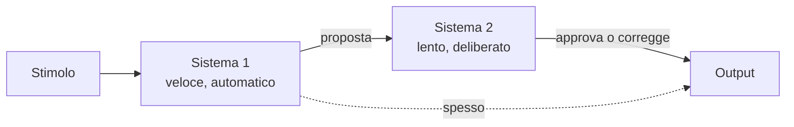

# Sistema 1 e Sistema 2: dual process theory

L'idea che la mente abbia *due modalità di pensiero* circola dagli anni '70 (Wason & Evans 1974, Schneider & Shiffrin 1977). Daniel Kahneman ne dà la formulazione popolare in *Thinking Fast and Slow* (2011), attribuendo i termini "Sistema 1" e "Sistema 2" a Stanovich & West.

## 1. Le due modalità

### 1.1 Sistema 1 (S1)

**Veloce, automatico, intuitivo, parallelo, emotivamente connotato, error-prone in modi sistematici.**

Esempi di operazioni di S1:

- Riconoscere un volto arrabbiato.
- Rispondere "cuore" alla domanda "qual è il muscolo che pompa il sangue?".
- Guidare l'auto su una strada vuota.
- Capire una frase semplice.
- $2 + 2 = ?$ — la risposta arriva.

S1 è sempre attivo. Non puoi spegnerlo. Lavora con associazioni, schemi pre-confezionati, euristiche. È il risultato dell'evoluzione: la maggior parte delle decisioni quotidiane sono routine in cui pensare a fondo costerebbe troppo.

### 1.2 Sistema 2 (S2)

**Lento, deliberato, sequenziale, faticoso, consuma glucosio, gestisce conflitti.**

Esempi:

- $17 \times 24 = ?$ — devi *fare* il calcolo.
- Compilare la dichiarazione dei redditi.
- Parcheggiare a culo in un posto stretto.
- Concentrarsi su un libro tecnico.
- Resistere alla tentazione di una seconda fetta di torta.

S2 ha **capacità limitata**: una sola cosa difficile alla volta. Sotto sforzo, la pupilla si dilata (misura fisiologica). È il "supervisore razionale", ma è pigro — quando S1 propone una risposta plausibile, S2 spesso la accetta senza controllare.

## 2. Caratteristiche a confronto

| Caratteristica | Sistema 1 | Sistema 2 |
|---|---|---|
| Velocità | rapidissimo | lento |
| Sforzo | nessuno | alto |
| Volontarietà | involontario | volontario |
| Capacità | grande, parallela | limitata, sequenziale |
| Tipo di elaborazione | associativa, euristica | regola-based, logica |
| Errori | sistematici (bias) | calcolo o stanchezza |
| Esempi adattivi | riconoscere predatori, leggere espressioni | pianificare, risolvere problemi nuovi |

## 3. Il diagramma

## 4. Heuristic substitution (sostituzione di euristica)

Quando S2 è di fronte a una domanda difficile, S1 spesso fornisce la risposta a una *domanda più facile*, simile ma non identica. S2, pigro, accetta.

Esempio:

- Domanda difficile: "Quanto sono felice in vita?"
- Domanda facile sostituita da S1: "Sono di buon umore in questo momento?"

Schwarz et al. 1991: studenti rispondono in modo diverso sulla soddisfazione di vita a seconda che il sondaggio segua o preceda la domanda "quanti appuntamenti hai avuto nell'ultimo mese?". L'umore di S1 contamina la risposta che dovrebbe richiedere riflessione S2.

## 5. Cognitive Reflection Test (CRT)

Shane Frederick (2005) propone tre domande che misurano la *tendenza* a usare S2 invece di accettare la prima risposta di S1.

**Domanda 1 (la più famosa)**: "Una mazza e una palla costano 1,10€ in totale. La mazza costa 1€ più della palla. Quanto costa la palla?"

S1 dice: 10 centesimi. È sbagliato.

  
Soluzione corretta

Se la palla costa $x$, la mazza costa $x + 1$. Totale: $2x + 1 = 1{,}10$, quindi $x = 0{,}05$ = **5 centesimi**. La mazza costa 1,05€.

Verifica: 1,05 + 0,05 = 1,10. La mazza (1,05) costa 1€ più della palla (0,05). ✓

**Domanda 2**: Se 5 macchine fanno 5 prodotti in 5 minuti, quanto tempo per 100 macchine a fare 100 prodotti? (S1: 100 min. Corretto: 5 min.)

**Domanda 3**: Un giglio raddoppia ogni giorno e copre il lago in 48 giorni. In quanti copre metà? (S1: 24. Corretto: 47.)

Risultato sperimentale: solo il 17% delle persone risponde correttamente a tutte e tre. Persino studenti di MIT e Harvard sbagliano frequentemente.

## 6. Bias come prodotti di S1

I bias del [catalogo](23-bias-cognitivi.html) sono in larga parte spiegabili come euristiche di S1:

- **Availability** = S1 stima la frequenza dalla facilità di richiamo.
- **Representativeness** = S1 valuta probabilità per somiglianza a uno stereotipo.
- **Anchoring** = S1 si aggancia al primo numero disponibile.
- **Affect heuristic** = S1 valuta rischio e beneficio in base all'emozione associata.

S2, quando attivato, può correggere. Ma è raramente abbastanza attento.

## 7. Critica e versioni alternative

### 7.1 Stanovich (2009): la tripartizione

Stanovich distingue:

- **Autonomous mind** (≈ S1): processi automatici.
- **Algorithmic mind** (≈ S2 "potenza"): efficienza nei processi controllati. Misura ≈ QI.
- **Reflective mind**: disposizione a impegnare S2. Misura ≈ CRT, "actively open-minded thinking".

Le ultime due sono distinte: persone intelligenti possono essere pigre riflessivamente (alta capacità S2 ma poca volontà di usarla — fa luce sul perché tanti laureati cadono in trappole semplici).

### 7.2 Evans (2011): dual process è troppo schematico

Non c'è prova che esistano *due* sistemi neurali distinti. Quello che esiste è uno spettro di processi più o meno automatici. Il "Sistema 1 / Sistema 2" è metafora utile, non architettura del cervello.

### 7.3 Bias temperati: Gigerenzer (2007)

Gerd Gigerenzer (Max Planck) sottolinea che molte euristiche di S1 sono *fast and frugal* e producono buone decisioni in domini ecologicamente realistici. "Take the best", "recognition heuristic". La narrativa Kahneman è troppo pessimista sulle intuizioni.

## 8. Implicazioni pratiche

- **Decisioni importanti, lente**: dai a S2 il tempo di lavorare. Dormici sopra. Scrivile.
- **Dove S1 sbaglia sistematicamente**: introduci procedure (checklist, scoring) — non basta "fare attenzione".
- **Disposizione riflessiva si allena**: tecniche come "Steel man your view", pre-mortem, attivamente cercare prove contro.
- **Cognitive load conta**: sotto stress, deprivazione di sonno, multitasking, S2 è offline e prevale S1.

## 9. Quando S1 batte S2

Non sempre S2 è meglio. Espertise consolidata (vigili del fuoco veterani, scacchisti grandmaster) opera principalmente in S1 con risultati superiori a S2 lento (Klein, *Sources of Power*, 1998). L'intuizione esperta è S1 ben allenato.

## Esercizi

  
Esercizio 1 — Quale sistema interviene? "Riconosci un amico in foto dopo 0,2 secondi."

S1 puro: riconoscimento di volti è la quintessenza di S1, dedicato dall'area fusiforme delle facce (FFA) del cervello.

  
Esercizio 2 — "In un sondaggio, il 70% sceglie A invece di B; tu sceglieresti A?" Quale bias rischi se rispondi sì senza riflettere?

**Bandwagon / social proof** (di S1). S2 dovrebbe valutare: i 70% sanno qualcosa che io non so? È una scelta morale o di gusto? Le maggioranze possono sbagliare (vedi Asch sui conformismi).

## Sintesi

- Due modalità di pensiero: S1 (rapido, automatico, intuitivo) e S2 (lento, deliberato, faticoso).
- S1 è sempre attivo; S2 deve essere reclutato e si stanca.
- Bias cognitivi = sottoprodotti di euristiche di S1 non corrette da S2.
- Cognitive Reflection Test misura quanto sei propenso a sopprimere la risposta intuitiva di S1.
- Critiche: non c'è dualismo neurale stretto; S1 esperto può battere S2 lento; euristiche frugal funzionano in ambienti realistici.

## Letture

- Kahneman, *Thinking Fast and Slow* (2011).
- Stanovich, *Rationality and the Reflective Mind* (2011).
- Gigerenzer, *Gut Feelings* (2007).
- Frederick, *Cognitive Reflection and Decision Making*, JEP (2005).
