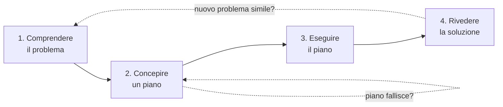

# Polya: come risolvere un problema (4 step)

George Pólya (1887–1985) era un matematico ungaro-americano che insegnava a Stanford. Notò che gli studenti non imparavano *come* affrontare un problema nuovo: applicavano formule meccanicamente o si paralizzavano. Nel 1945 pubblicò *How to Solve It*, un libretto di 200 pagine diventato il classico del problem solving. Le sue quattro fasi non sono una "ricetta" — sono uno scheletro di domande che obbliga a non saltare passaggi mentali.

## 1. Le quattro fasi

Ogni fase ha le sue domande di controllo.

## 2. Fase 1 — Comprendere il problema

**Domande di Pólya**:

- Cosa è dato (i dati)?
- Cosa cerchi (l'incognita)?
- Quale condizione lega i dati all'incognita?
- È risolvibile? La condizione è sufficiente, ridondante, contraddittoria?
- Puoi formularlo a parole tue? Puoi disegnarlo?

Errore tipico: leggere il problema una volta e iniziare a calcolare. Il tempo speso a comprendere si ripaga 10×.

### 2.1 Esempio matematico

> "Trova due numeri consecutivi la cui somma è 25."

- Dati: somma = 25; sono *consecutivi*.
- Incognita: due numeri $x, x+1$.
- Condizione: $x + (x+1) = 25$.
- Sufficiente? Sì, una sola equazione in una incognita.

### 2.2 Esempio extra-matematico

> "Devo decidere se accettare un'offerta di lavoro a Milano."

- Dati: stipendio attuale e proposto, costo della vita di Milano, situazione familiare, prospettive di carriera.
- Incognita: una decisione sì/no, ma il vero "incognito" è la *funzione di utilità* personale.
- Condizione: tradurre dati eterogenei in un giudizio coerente con i propri obiettivi.

Comprendere bene il problema include identificare *l'obiettivo vero*: non è "guadagnare più soldi" ma "vivere meglio".

## 3. Fase 2 — Concepire un piano

È il passo creativo. Pólya elenca **euristiche** che possono aiutare:

- Conosci un problema simile?
- Conosci un teorema correlato?
- Puoi risolverlo per casi più semplici?
- Puoi risolverlo se cambi l'incognita?
- Puoi *trasformare* il problema in uno equivalente?
- Puoi lavorare *all'indietro* dalla soluzione?
- Puoi spezzarlo in sotto-problemi?

Vedi [euristiche di problem solving](26-euristiche-problem-solving.html) per il dettaglio.

### 3.1 L'analogia come motore

Pólya insiste sul potere dell'analogia. "Hai mai risolto un problema con la stessa struttura?" Spesso un problema nuovo è la riedizione di uno classico. Il riconoscimento richiede esperienza accumulata — per questo gli esperti vedono soluzioni che ai novizi sfuggono.

### 3.2 Esempio: la somma 1+2+...+100

Il piccolo Gauss avrebbe applicato l'euristica "lavoro all'indietro": sommando la serie crescente e decrescente:

$$S = 1+2+\ldots+100$$
$$S = 100+99+\ldots+1$$
$$2S = 101 \cdot 100 \Rightarrow S = 5050$$

Trick = euristica di simmetria + accoppiamento. Una volta vista, è ovvia. La prima volta no.

## 4. Fase 3 — Eseguire il piano

Esegui i passi del piano controllando ognuno. Se inciampi, torna in fase 2. Verifica le sotto-conclusioni.

Domande di controllo:

- Vedi chiaramente che ogni passo è corretto?
- Puoi dimostrare che lo è?

Disciplina formale: scrivi i passaggi. Non improvvisarli in testa. Anche per problemi pratici (non solo matematici), mettere su carta una bozza di soluzione fa emergere passi mancanti.

## 5. Fase 4 — Rivedere

Questa è la fase che la gente salta sempre — ed è quella che produce apprendimento.

Domande di Pólya:

- Puoi controllare il risultato?
- Puoi controllarlo in modo diverso?
- Puoi ottenerlo in altra maniera?
- Puoi vedere a colpo d'occhio?
- Puoi usare il risultato o il metodo per un altro problema?

Lo scopo è duplice: **verificare** la correttezza e **generalizzare** la lezione per problemi futuri.

Esempio: hai risolto la somma di Gauss. Adesso chiediti: la stessa tecnica funziona per $1 + 3 + 5 + \ldots + (2n-1)$? Sì: $n^2$. E per la somma di una progressione geometrica? Diversa, ma c'è un trucco analogo (moltiplicare per la ragione, sottrarre).

## 6. Mini-esempio completo

> Una stanza è larga 5 m e lunga 8 m. Quante mattonelle quadrate da 50 cm di lato servono per pavimentarla?

**Comprendere**: area stanza = 5×8 = 40 m². Mattonella = 0,5×0,5 = 0,25 m². Vogliamo $N$ = numero di mattonelle.

**Pianificare**: $N = \text{area stanza} / \text{area mattonella} = 40 / 0{,}25$.

**Eseguire**: $40 / 0{,}25 = 160$.

**Rivedere**: 
- Sanità: 160 mattonelle, ognuna 0,25 m², totale = 40 m². ✓
- Generalizzazione: per stanza $L \times W$ m con mattonelle quadrate $s$ m: $N = LW/s^2$.
- Caveat reali (non chiesto ma utile): bisogna considerare ritagli e scarti — di solito si compra il 10% in più.

## 7. Limiti del framework

Pólya non è una "ricetta". È:

- Uno **scheletro di domande** che ti rallenta abbastanza da non saltare passi.
- Una **lista di euristiche** da provare quando sei bloccato.

Non è:

- Un algoritmo garantito (i wicked problems — vedi [sez. 48](48-wicked-problems.html) — non hanno soluzione "corretta").
- Sostituto della **conoscenza di dominio**: la fase 2 funziona solo se conosci abbastanza problemi simili. Esperti vedono pattern; novizi no.

## 8. Equivalenti moderni

- **TRIZ** (Altshuller): orientato a inventiva ingegneristica.
- **Design thinking**: orientato a problemi human-centered.
- **PDCA** (Plan-Do-Check-Act, Deming): qualità industriale.
- **OODA** (Observe-Orient-Decide-Act, Boyd): decisioni rapide militari.
- **5 Whys** (Toyota): per problemi causali.

Tutti varianti dello stesso schema "capisci → progetta → esegui → impara".

## Esercizi

  
Esercizio 1 — Applica Pólya a: "Voglio imparare il francese in un anno, parto da zero. Come?"

**Comprendere**: dati (tempo disponibile/giorno, motivazione, risorse economiche), incognita (un piano di apprendimento), obiettivo (definire "imparare il francese" — A2? B1? B2? livello di conversazione? scritto?).

**Pianificare**: problema simile? Sì, l'apprendimento di altre lingue. Euristica: spezza in sotto-obiettivi (vocabolario base 500 parole, grammatica essenziale, comprensione orale, produzione scritta, parlato). Tecniche conosciute: Spaced Repetition (Anki), immersione, lezioni con tutor, podcast, lettura graduata.

**Eseguire**: piano concreto (es. 30 min Anki + 30 min lettura + 1 lezione tutor/sett.) per 3 mesi, poi riverifica.

**Rivedere**: ai 3 mesi controlla: ho raggiunto il sotto-obiettivo? Cosa ha funzionato? Cosa no? Rigenerare il piano per i 3 mesi successivi.

  
Esercizio 2 — Risolvi: "In una festa 20 persone si stringono la mano a coppie. Quante strette di mano in totale?"

**Comprendere**: $n = 20$. Ogni stretta coinvolge 2 persone.

**Pianificare**: cerco un problema simile? Sì: la combinazione $\binom{n}{2}$ — "scegliere 2 da n". Altrimenti: ogni persona stringe a $n-1$ altri, totale "incontri ordinati" $n(n-1)$, ma ogni stretta è contata 2×, quindi $/2$.

**Eseguire**: $\binom{20}{2} = \frac{20 \cdot 19}{2} = 190$.

**Rivedere**: in piccolo, 3 persone: 3 strette (A-B, A-C, B-C). $\binom{3}{2}=3$. ✓. Generalizzazione: $\binom{n}{2}$ vale per qualsiasi interazione "una volta sola fra coppie distinte".

## Sintesi

- Quattro fasi: comprendere, pianificare, eseguire, rivedere.
- Ogni fase ha domande-chiave; il valore è nel rallentamento metodico.
- Pólya è scheletro, non algoritmo: serve conoscenza di dominio per la fase 2.
- La fase 4 (revisione) produce apprendimento e va saltata raramente.
- Versioni moderne: design thinking, PDCA, OODA, TRIZ, 5 Whys — tutte parenti.

## Letture

- George Pólya, *How to Solve It* (1945) — l'originale, breve, eccellente.
- Pólya, *Mathematics and Plausible Reasoning* (1954) — versione più ampia.
- Schoenfeld, *Mathematical Problem Solving* (1985) — verifica empirica del framework.
