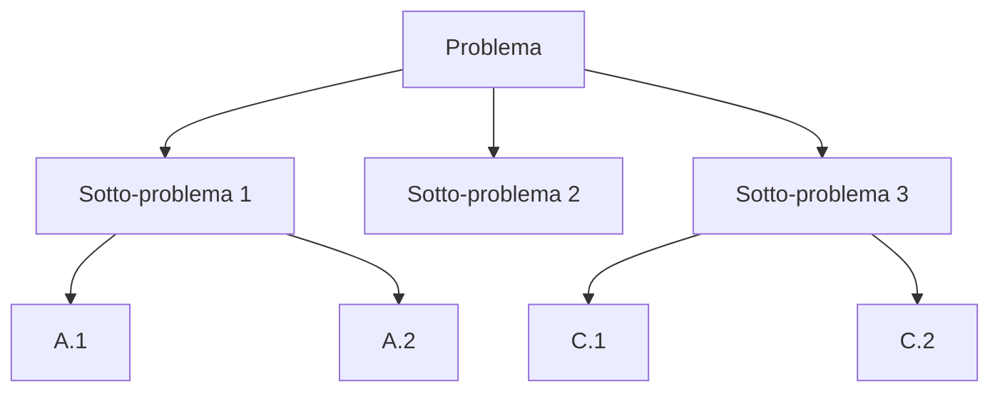

# Euristiche del problem solving

Polya elenca le euristiche in una appendice di *How to Solve It*. Newell & Simon le formalizzano nel General Problem Solver (1957–60), il primo programma di AI che ne sfruttò alcune. Le euristiche non garantiscono la soluzione: aumentano la probabilità di trovarla. Sono "stelle polari".

## 1. Means-Ends Analysis (MEA)

Riduci la distanza tra stato corrente e stato obiettivo, scegliendo a ogni passo l'operatore che la diminuisce di più.

**Schema**:

1. Cosa serve per andare da qui all'obiettivo?
2. Quale azione $A$ riduce la differenza maggiore?
3. Se le precondizioni di $A$ non sono soddisfatte, applica ricorsivamente MEA per soddisfarle.

Esempio: scrivere una tesi → manca capitolo 3 → manca dataset → manca codice di parsing → scrivo codice prima del capitolo. La struttura è ricorsiva: ogni "manca" diventa un sotto-obiettivo MEA.

## 2. Working Backwards

Parti dall'obiettivo e ragiona a ritroso fino a ciò che hai.

**Esempio classico** (Pappo, ~300 a.C.): per dimostrare un teorema, assumi la tesi e cerca premesse che la implicano. Quando trovi premesse che sono assiomi o teoremi già dimostrati, hai finito (e la dimostrazione va "letta in avanti").

**Esempio pratico**: vuoi laurearti tra 2 anni. Cosa serve? 60 crediti. Cosa significa? 6 esami all'anno. Cosa significa? 1 esame ogni 2 mesi. Indietro fino a "che cosa faccio domani mattina?".

## 3. Decomposizione in sotto-obiettivi

Divide et impera. Spezzi il problema in parti più piccole, risolvi ciascuna, ricomponi.

Funziona se i sotto-problemi sono **indipendenti** o solo debolmente accoppiati. Se sono fortemente accoppiati, la decomposizione introduce vincoli incoerenti.

Diagramma classico:

## 4. Analogia

"Hai mai visto un problema simile?". L'analogia richiede di estrarre la **struttura** dal contenuto: due problemi che superficialmente sembrano diversi possono avere la stessa forma.

**Esempio**: la torre di Hanoi e il problema delle "Missionari e Cannibali" sono problemi di pianificazione con vincoli sullo stato. Le tecniche per il primo (induzione, ricorsione) si applicano al secondo.

## 5. Generalizzazione e specializzazione

- **Specializzare**: il problema generale è troppo difficile? Risolvi un caso particolare ($n=1, 2, 3$) e cerca pattern.
- **Generalizzare**: a volte il problema generale è più facile! Es: dimostrare l'identità di Vandermonde è più semplice nel caso generale che in casi specifici.

## 6. Disegnare una figura

Per problemi geometrici è ovvio. Ma anche per problemi non geometrici una rappresentazione visiva può sbloccare il pensiero: diagrammi di Venn, tabelle, grafi, alberi decisionali.

## 7. Casi estremi

Cosa succede se $n=0$? $n=1$? $n \to \infty$? Spesso i casi degeneri rivelano la struttura del problema o eliminano ipotesi.

**Esempio**: la conjectura di Collatz è facile per $n$ piccoli (la verifichi). Per $n$ grandi non si sa. I casi estremi danno intuizione ma non sempre dimostrazione.

## 8. Cerca invarianti

Una **invariante** è una proprietà che resta vera durante l'esecuzione di un'azione/algoritmo.

**Esempio**: scacchiera 8×8 con due caselle opposte rimosse. Puoi coprirla con 31 domino 2×1?
**Risposta**: no. Invariante: ogni domino copre 1 casella bianca e 1 nera. Le due caselle opposte tolte sono dello stesso colore (es. entrambe bianche). Restano 30 nere e 32 bianche (o viceversa) — disparità di parità impossibile.

## 9. Argomenti di parità

Quasi-corollario degli invarianti: contare modulo 2 (o modulo $k$) spesso esclude soluzioni.

**Esempio**: in una stanza con tre interruttori che controllano 3 lampadine in un'altra stanza (non sai quale controlla quale), come identifichi quale interruttore va con quale lampadina entrando una sola volta? Soluzione: accendi A per 5 min, spegnilo, accendi B, vai. La lampadina accesa = B. La spenta calda = A. La spenta fredda = C. Tre "stati" (acceso, calda, fredda) per tre interruttori — non parità in senso stretto ma stesso schema: distinguere 3 oggetti con un canale a 2 valori richiede un'extra dimensione (calore).

## 10. Pigeonhole principle (cassetti)

Se metti $n+1$ oggetti in $n$ cassetti, almeno un cassetto contiene 2 oggetti.

**Esempio**: a Roma ci sono almeno due persone con lo stesso numero di capelli. (Capelli umani < ~150k. Romani > 2 milioni.) Il pigeonhole sembra banale; in versione "forte" (probabilistica, generalizzata) è una bestia di tecnica matematica.

## 11. Induzione

Dimostrare $P(n)$ per ogni $n \ge 0$:

1. Base: $P(0)$ vale.
2. Passo: se $P(n)$ vale, allora $P(n+1)$ vale.

Conclusione: $P(n)$ per ogni $n$.

Varianti:
- **Induzione forte**: assumi $P(k)$ per ogni $k \le n$ per dimostrare $P(n+1)$.
- **Induzione strutturale**: induzione su strutture ricorsive (alberi, formule).
- **Induzione transfinita**: oltre i naturali.

L'induzione è uno strumento di dimostrazione, ma anche di **costruzione di soluzioni**: se sai risolvere $n$ usando la soluzione di $n-1$, hai un algoritmo ricorsivo.

## 12. Hill climbing e ricerca sistematica

- **Hill climbing**: a ogni passo, scegli la mossa che migliora di più la funzione obiettivo. Veloce, ma può bloccarsi in massimi locali.
- **Random restart**, **simulated annealing**, **tabu search**: tentativi di sfuggire ai massimi locali.
- **Ricerca sistematica** (BFS, DFS, A*): garantisce di trovare la soluzione (se esiste e lo spazio è enumerabile), a costo computazionale potenzialmente esponenziale.

Vedi [algoritmi e strategie](28-algoritmi-strategie.html) per il dettaglio.

## 13. Esempio integrato: Torre di Hanoi

3 dischi su 3 paletti, devi spostarli dal paletto A al C senza mai mettere un disco grande su uno piccolo.

**Strategia**: sotto-obiettivo + ricorsione.
- Per spostare $n$ dischi da A a C: prima sposta $n-1$ dischi da A a B (usando C come appoggio), poi sposta il disco grande da A a C, poi sposta $n-1$ dischi da B a C.
- Base: $n=1$, sposti direttamente.

Numero di mosse: $T(n) = 2T(n-1) + 1$ con $T(1)=1$ → $T(n) = 2^n - 1$.

## Esercizi

  
Esercizio 1 — In una stanza ci sono 13 persone. Mostra che almeno due hanno il compleanno nello stesso mese.

12 mesi, 13 persone → pigeonhole. Almeno due nello stesso mese.

  
Esercizio 2 — Dimostra per induzione che $1+3+5+\ldots+(2n-1) = n^2$.

Base $n=1$: $1 = 1^2$. ✓
Passo: assumi $1+3+\ldots+(2n-1)=n^2$. Allora aggiungendo $(2n+1)$: $n^2 + 2n + 1 = (n+1)^2$. ✓

  
Esercizio 3 — Per il problema "non spostare un cavallo di scacchi su tutte le caselle visitando ognuna esattamente una volta", quale euristica usi?

Backtracking + Warnsdorff (variante greedy: vai sempre alla casella con meno successori). È un tour Hamiltoniano: in generale NP-hard, ma Warnsdorff lo risolve velocemente in pratica.

## Sintesi

- MEA, working backwards, sotto-obiettivi, analogia, generalizzazione/specializzazione, figura, casi estremi, invarianti, parità, pigeonhole, induzione, hill climbing — il kit base.
- Le euristiche non garantiscono la soluzione, ma cambiano sistematicamente le probabilità.
- Espertise = grande catalogo di problemi simili + scelta rapida dell'euristica giusta.

## Letture

- Pólya, *How to Solve It*, appendice.
- Newell & Simon, *Human Problem Solving* (1972).
- Engel, *Problem-Solving Strategies* (1998) — manuale per olimpiadi matematiche.
- Schoenfeld, *Mathematical Problem Solving* (1985).
