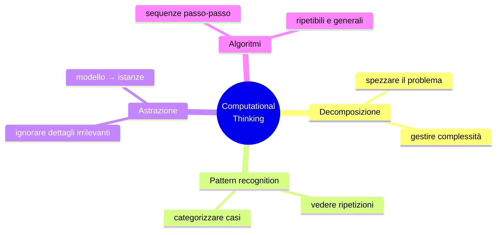

# Pensiero computazionale

Jeannette Wing pubblica *Computational Thinking* su *Communications of the ACM* nel 2006: un articolo programmatico che sostiene che il modo di pensare degli informatici è una competenza generale, non solo per chi scrive codice. Una "skill fondamentale come leggere, scrivere e fare aritmetica".

Pensare computazionalmente NON significa "saper programmare". Significa **formulare problemi in modo che una macchina (umana o artificiale) possa risolverli sistematicamente**. È un modo di pensare; il codice è solo un'opzione di output.

## 1. I quattro pilastri



### 1.1 Decomposizione

Spezzare un problema complesso in parti gestibili. Già visto in [Pólya](25-polya-problem-solving.html) e [euristiche](26-euristiche-problem-solving.html). Tipicamente top-down.

Esempio: organizzare una festa.

```
Festa
├── Invitati
│   ├── Lista
│   ├── Conferme
│   └── Allergie / preferenze
├── Cibo
│   ├── Menu
│   ├── Spesa
│   └── Cottura
├── Spazio
│   ├── Pulizia
│   ├── Disposizione
│   └── Musica
└── Tempistiche
    ├── Inviti (T-3 sett)
    ├── Spesa (T-1)
    └── Setup (T-1 giorno)
```

Decomporre rivela:

- Dipendenze (non puoi fare la spesa prima del menu).
- Parallelizzazioni (musica e cibo sono indipendenti).
- Sotto-problemi delegabili.

### 1.2 Riconoscimento di pattern

Vedere similarità tra problemi diversi (per copiare la soluzione) o ripetizioni nello stesso problema (per fattorizzarle in una procedura).

Esempio: il calcolo della tassa per N redditi diversi è "stesso calcolo" applicato N volte → un ciclo.

Esempio extra-IT: organizzare un viaggio in 5 città. Pattern comune: "prenotare hotel, treno, visite". Quindi una *funzione "prenota in X"* da applicare a ogni città.

Pattern recognition è anche la base del Machine Learning: l'algoritmo "trova" pattern statistici nei dati. Ma non bisogna confondere: la ML *implementa* il pattern recognition; il pattern recognition come pilastro CT è la *competenza cognitiva* dell'umano che progetta o usa il sistema.

### 1.3 Astrazione

Ignorare i dettagli che non sono rilevanti per il problema corrente.

**Mappa della metropolitana** è il caposcuola: distanze e direzioni cartografiche sono distorte; viene preservata la sola informazione topologica (quali stazioni sono collegate, l'ordine, gli scambi). Per il navigatore della metro è tutto ciò che serve.

**Programmazione**: una funzione `sort(lista)` astrae l'algoritmo interno. Chi la usa non deve sapere se è merge sort o quick sort.

**Pensiero quotidiano**: nel pianificare la festa, non importa il colore dei piatti se non hai preferenze estetiche — *astrai* su "stoviglie" come categoria omogenea.

L'astrazione è il pilastro più sfuggente. Costa molto sforzo cognitivo decidere *cosa* sia rilevante. Sbagliare l'astrazione = costruire una mappa che lascia fuori la stazione dove devi scendere.

### 1.4 Algoritmi

Una sequenza finita di passi non ambigui che porta da un input a un output.

Caratteristiche:

- **Finitezza**: termina dopo un numero finito di passi.
- **Determinatezza**: ogni passo è univocamente definito.
- **Generalità**: funziona su una classe di input, non su un solo esempio.
- **Effettività**: ogni passo è eseguibile.

Esempio dialogo: una ricetta è un algoritmo (con tolleranze: "salate q.b." è imprecisione che può essere accettabile). Le istruzioni di montaggio IKEA sono un algoritmo (a volte male specificato).

## 2. Pensare computazionalmente fuori dall'informatica

### 2.1 Lista della spesa ottimizzata

Decomposizione: prodotti per reparto (frutta, latticini, ecc.).
Pattern: ogni settimana stessi 10 prodotti "base".
Astrazione: lista in formato "categoria-prodotto-quantità" (non "marca specifica").
Algoritmo: percorrere il supermercato seguendo le categorie nell'ordine fisico, evitando di tornare indietro.

### 2.2 Ordinare un mazzo di carte

Algoritmo "insertion sort" che fai senza saperlo:
1. Prendi la prima carta in mano.
2. Per ogni carta successiva, inseriscila al posto giusto nelle carte già ordinate.
3. Fine quando finisce il mazzo.

Complessità: $O(n^2)$ nel caso peggiore. Per pochi mazzi: ok. Per ordinare un archivio di 10⁶ documenti, devi conoscere alternative ($O(n \log n)$ — merge sort, quick sort).

### 2.3 Debugging come scienza forense

Un bug è un mistero. Il debugging è applicare il metodo scientifico:

1. **Osservazione**: cosa fa il sistema? (log, output).
2. **Ipotesi**: cosa potrebbe causare questo?
3. **Test**: riproduco l'errore variando una sola cosa.
4. **Conclusione**: confermata o rifiutata.

È pensiero computazionale + [metodo scientifico](43-metodo-scientifico-popper.html).

## 3. Astrazione vs dettaglio: il livello giusto

Una mappa stradale al 1:1 sarebbe inutile (Borges, *Del rigor en la ciencia*). Una mappa al 1:1000000 forse troppo grossolana. Il "livello giusto" di astrazione dipende dal problema.

Regola di David Wheeler: "tutti i problemi in informatica si risolvono con un altro livello di indirizzamento — tranne il problema di troppi livelli di indirizzamento".

L'astrazione eccessiva diventa indistinguibile dalla nebbia. L'astrazione insufficiente lascia il problema in tutta la sua complessità intrattabile. Trovare il livello giusto è un'abilità che si affina con l'esperienza, non una regola.

## 4. Computational thinking ≠ programmazione

Wing è esplicita. **Saper programmare aiuta** ma non è l'essenza. Pensiero computazionale si insegna anche con:

- CS Unplugged (Tim Bell, Univ. Canterbury): attività senza computer per bambini.
- Algoritmi su carta: ordinamento, ricerca, codifica.
- Modelli matematici: trasformare un problema in equazioni.

## 5. Critiche

Alcuni studiosi (Tedre & Denning 2016) hanno argomentato che "computational thinking" come slogan ha **molte definizioni incompatibili**, e che molto di ciò che si pubblica è semplicemente "problem solving classico" riconfezionato. La critica è giusta: il pensiero computazionale non è né nuovo né esclusivo dell'informatica. È utile come *lente* per riformulare problemi, ma non è una pillola magica.

## Esercizi

<details>
  <summary>Esercizio 1 — Pensa il "preparare un caffè" come algoritmo per un alieno che non l'ha mai visto.</summary>

```
1. PROCEDURA preparaCaffè:
2.   ACCERTA macchina_pulita = true (altrimenti chiama puliziaMacchina)
3.   RIEMPI serbatoio_acqua FINO_A linea_max
4.   INSERISCI capsula_o_polvere in slot_dosatore
5.   POSIZIONA tazza sotto erogatore
6.   PREMI tasto_avvio
7.   ATTENDI fino_a fine_erogazione (≈25 sec)
8.   PRENDI tazza
9.   AGGIUNGI zucchero (se preferenza_utente.zucchero == true)
10.  RESTITUISCI tazza
```

Note di astrazione: ignoriamo "che tipo di macchina"; ignoriamo "che caffè"; ignoriamo la temperatura esatta. Decomposizione: linee 2 e 8 si applicano a sotto-procedure.
</details>

<details>
  <summary>Esercizio 2 — Applica i 4 pilastri a "organizzo un torneo di pallavolo con 8 squadre"</summary>

**Decomposizione**: iscrizioni, sorteggi, calendario, arbitri, classifiche, finale.

**Pattern**: ogni partita ha la stessa struttura (squadra A vs squadra B, vincitore avanza). Ogni giornata = $n$ partite.

**Astrazione**: una "partita" è una funzione `match(A, B) → vincitore`. Una "squadra" è solo un nome e un punteggio cumulativo.

**Algoritmo**: tabellone a eliminazione diretta (8 → 4 → 2 → 1) = 7 partite totali. Oppure girone (28 partite, classifica per somma punti). Scegli in base a tempo disponibile.
</details>

## Sintesi

- Pensiero computazionale = decomposizione + pattern + astrazione + algoritmi.
- Non è programmazione, ma le condivide la mentalità.
- L'astrazione è il pilastro più impegnativo: bilanciare semplicità e completezza.
- Applicabile a vita quotidiana, debugging, organizzazione, decisioni — non solo a sistemi software.
- Critica: rischio di rebranding generico del problem solving. Utile come lente, non come bacchetta magica.

## Letture

- Jeannette Wing, *Computational Thinking*, CACM (2006).
- Tim Bell, *CS Unplugged* (csunplugged.org).
- Tedre & Denning, *The Long Quest for Computational Thinking*, Koli (2016) — critica storica.
- Seymour Papert, *Mindstorms* (1980) — precursore profondo.
