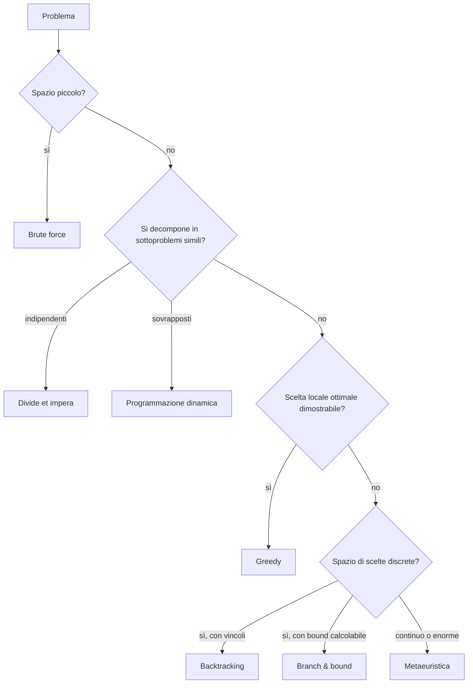

# Algoritmi e strategie di risoluzione

Polya ([sez. 26](26-euristiche-problem-solving.html)) ti insegna come affrontare un problema da matematico: capisci, pianifica, esegui, rivedi. Il pensiero computazionale ([sez. 27](27-pensiero-computazionale.html)) ti insegna a decomporre e astrarre. Manca un pezzo: quando il piano si concretizza in un algoritmo, **quale famiglia di strategie sceglierei?** Brute force? Dividere e conquistare? Provare e tornare indietro? Questa sezione è il catalogo ragionato delle sei famiglie classiche, con criterio di applicabilità, pseudocodice pulito e costo asintotico. Non è un corso completo di algoritmi (per quello c'è Cormen-Leiserson-Rivest-Stein, *Introduction to Algorithms*) ma una mappa per orientarsi prima di cercare la pagina giusta.

## 1. Notazione $O$ grande, in cinque righe

Per confrontare strategie servono i costi. Diciamo che $f(n) = O(g(n))$ se esistono $c > 0$ e $n_0$ tali che $|f(n)| \le c\,|g(n)|$ per ogni $n \ge n_0$. È un *upper bound asintotico*: ignora costanti e termini di ordine inferiore. Scrivere $T(n) = O(n^2)$ significa "cresce al più come $n^2$".

Gerarchia tipica, dal migliore al peggiore:

$$O(1) < O(\log n) < O(n) < O(n \log n) < O(n^2) < O(n^3) < O(2^n) < O(n!)$$

Tutto ciò che è $O(2^n)$ o peggio si chiama **intrattabile** per $n$ medio-grande. Tutto ciò che è polinomiale ($O(n^k)$) è considerato trattabile (classe P).

## 2. Brute force (forza bruta)

Enumera *tutte* le candidate soluzioni, prova ciascuna, scegli quella che funziona. Funziona sempre — se il problema è ben definito e finito. È la baseline contro cui misurare strategie più astute.

```python
def brute_force_TSP(citta):
    from itertools import permutations
    best = None
    for tour in permutations(citta):
        d = lunghezza(tour)
        if best is None or d < best[1]:
            best = (tour, d)
    return best
```

Per il commesso viaggiatore (TSP): $O(n!)$. Con $n = 15$ servono 1.3 miliardi di permutazioni: minuti su un laptop. Con $n = 20$: 2.4 quintilioni. Anni.

**Quando usarla.** Quando $n$ è piccolo, quando non hai tempo di pensare a strategie astute, come riferimento per testare algoritmi più raffinati.

## 3. Divide et impera

Strategia in tre tempi: (i) **dividi** il problema in sottoproblemi più piccoli e simili, (ii) **conquista** risolvendoli ricorsivamente, (iii) **combina** le soluzioni parziali. Risale a Eulero (problema dei ponti di Königsberg, in forma intuitiva) e fu formalizzata negli anni '60 con il lavoro di Karatsuba sulla moltiplicazione veloce.

**Esempio canonico: mergesort.**

```python
def mergesort(a):
    if len(a) <= 1: return a
    m = len(a) // 2
    L = mergesort(a[:m])
    R = mergesort(a[m:])
    return merge(L, R)

def merge(L, R):
    out = []
    i = j = 0
    while i < len(L) and j < len(R):
        if L[i] <= R[j]: out.append(L[i]); i += 1
        else:            out.append(R[j]); j += 1
    return out + L[i:] + R[j:]
```

Ricorrenza: $T(n) = 2T(n/2) + O(n)$. Per il **teorema master**, $T(n) = O(n \log n)$. Stessa logica per quicksort (in media), trasformata di Fourier veloce (FFT, $O(n \log n)$ invece di $O(n^2)$), moltiplicazione di Karatsuba ($O(n^{1.585})$).

**Quando usarla.** Il problema si spezza naturalmente in due o più pezzi indipendenti e la fase di combine costa poco rispetto ai sottoproblemi.

## 4. Greedy (algoritmi avidi)

Ad ogni passo scegli l'opzione che sembra **localmente** migliore, senza mai tornare indietro. Funziona sorprendentemente spesso, ma non sempre. Richiede dimostrazione di correttezza (di solito un *exchange argument* o un *matroid argument*).

**Esempio canonico: interval scheduling.** Hai $n$ riunioni con orari $[s_i, f_i)$, vuoi accettarne il massimo numero senza sovrapposizioni.

Strategia greedy: ordina per orario di **fine** crescente, prendi la prima, scarta le incompatibili, ripeti.

```python
def interval_scheduling(intervalli):
    intervalli.sort(key=lambda x: x[1])  # ordina per fine
    scelti = []
    fine_corrente = -float('inf')
    for s, f in intervalli:
        if s >= fine_corrente:
            scelti.append((s, f))
            fine_corrente = f
    return scelti
```

Costo: $O(n \log n)$ per l'ordinamento. Si dimostra **ottimo**: nessuna strategia accetta più riunioni di questa.

Altri greedy famosi: Dijkstra per shortest path, Prim/Kruskal per minimum spanning tree, Huffman per codifica ottima.

> **⚠ Attenzione.** Greedy fallisce su molti problemi: change-making con denominazioni non canoniche (con monete $\{1, 3, 4\}$ per fare 6, greedy dà $4+1+1$, ottimo è $3+3$), knapsack 0-1, TSP. Sempre dimostrare correttezza o testare su casi avversari.

## 5. Programmazione dinamica

Quando un problema ha **sottostruttura ottima** (la soluzione ottima si compone di soluzioni ottime di sottoproblemi) e **sottoproblemi sovrapposti** (gli stessi sottoproblemi ricorrono), la programmazione dinamica (DP) li risolve una sola volta e li memorizza. Inventata da Richard Bellman negli anni '50 (il termine "programming" era usato per non irritare i revisori del Dipartimento della Difesa, racconta Bellman nella sua autobiografia).

**Esempio 1: zaino 0-1 (knapsack).** Oggetti con peso $w_i$ e valore $v_i$, capacità $W$. Massimizza il valore senza superare $W$.

Definisci $K[i][c]$ = valore massimo usando i primi $i$ oggetti con capacità $c$. Ricorsione:

$$K[i][c] = \begin{cases} K[i-1][c] & \text{se } w_i > c \\ \max(K[i-1][c],\; v_i + K[i-1][c - w_i]) & \text{altrimenti} \end{cases}$$

```python
def knapsack(pesi, valori, W):
    n = len(pesi)
    K = [[0]*(W+1) for _ in range(n+1)]
    for i in range(1, n+1):
        for c in range(W+1):
            if pesi[i-1] > c:
                K[i][c] = K[i-1][c]
            else:
                K[i][c] = max(K[i-1][c], valori[i-1] + K[i-1][c - pesi[i-1]])
    return K[n][W]
```

Costo: $O(nW)$. È "pseudo-polinomiale" perché $W$ può essere enorme.

**Esempio 2: Longest Common Subsequence (LCS).** Date due stringhe $X$ di lunghezza $m$ e $Y$ di lunghezza $n$, trova la sottosequenza più lunga comune. Sia $L[i][j]$ la LCS dei prefissi $X[1..i]$ e $Y[1..j]$:

$$L[i][j] = \begin{cases} 0 & i=0 \lor j=0 \\ L[i-1][j-1] + 1 & X_i = Y_j \\ \max(L[i-1][j],\; L[i][j-1]) & X_i \ne Y_j \end{cases}$$

Costo: $O(mn)$. È il motore dietro `diff`, allineamento di sequenze biologiche (Needleman-Wunsch), `git merge`.

## 6. Backtracking

Esplori un albero di scelte in profondità; quando una scelta porta a un vicolo cieco torni indietro (*backtrack*) e provi un'altra. È brute force "intelligente": pota i rami che si rivelano impossibili.

**Esempio: sudoku.**

```python
def risolvi(g):
    cella = trova_vuota(g)
    if cella is None: return True       # completo
    r, c = cella
    for v in range(1, 10):
        if ammissibile(g, r, c, v):
            g[r][c] = v
            if risolvi(g): return True
            g[r][c] = 0                  # backtrack
    return False
```

**Esempio: N-queens.** Posiziona $n$ regine su una scacchiera $n \times n$ in modo che nessuna ne minacci un'altra. Posizioni le regine riga per riga; quando una scelta è inconsistente, ritiri l'ultima e provi la successiva.

Il peggio teorico resta esponenziale, ma la potatura in pratica risolve istanze enormi.

## 7. Branch & bound

Variante "informata" del backtracking per problemi di ottimizzazione. Mantieni il valore della **migliore soluzione corrente** (bound). Prima di esplorare un sottoalbero, calcola un upper/lower bound del meglio che vi si può trovare: se è peggiore del bound corrente, **potalo**. Funziona bene per Integer Linear Programming, TSP, knapsack.

## 8. Metaeuristiche (cenno)

Quando il problema è troppo grande anche per branch & bound, si rinuncia all'ottimo e si cerca una buona soluzione con metaeuristiche stocastiche.

- **Simulated annealing** (Kirkpatrick, Gelatt, Vecchi 1983): ispirato alla ricottura dei metalli. Accetta peggioramenti con probabilità $e^{-\Delta E / T}$, $T$ decresce nel tempo. Fugge dai minimi locali.
- **Algoritmi genetici** (Holland 1975): popolazione di soluzioni candidate, selezione, crossover, mutazione. Evoluzione su un fitness landscape.
- **Tabu search**, **ant colony**, **particle swarm**: famiglie affini.

Non sono garantite ottimali. Sono pragmatiche.

## 9. Decidere quale strategia



Connessione a Polya: "comprendere il problema" identifica struttura (è uno scheduling? un knapsack? un cammino?), "pianificare" sceglie famiglia, "eseguire" implementa, "rivedere" verifica complessità.

## 10. Esempio integrato

Vuoi pianificare le visite di un tecnico a $n$ clienti minimizzando il chilometraggio. Con $n = 10$: brute force gira in millisecondi ($10! \approx 3.6$M). Con $n = 25$: brute force impossibile, DP di Held-Karp gira in $O(n^2 \cdot 2^n) \approx 25^2 \cdot 33{\cdot}10^6 \approx 2 \cdot 10^{10}$, ancora possibile in ore. Con $n = 200$: branch & bound (CPLEX, Gurobi) può chiudere all'ottimo; con $n = 2000$, simulated annealing o LKH danno soluzioni entro l'1-2% dall'ottimo in minuti.

<details>
<summary>Esercizio — algoritmo per "monete italiane"</summary>

Hai monete da $\{1, 2, 5, 10, 20, 50, 100, 200\}$ cent. Trovare il numero minimo di monete per dare $C$ cent di resto.

**(a)** Funziona greedy (prendi sempre la moneta più grande $\le$ resto residuo)?

**(b)** Scrivi la versione DP.

**Soluzione (a).** Sì: il sistema monetario euro è "canonico". Dimostrazione per casi (Pearson 2005): per ogni $C$, lo schema greedy coincide con l'ottimo. Per monete $\{1, 3, 4\}$ già visto, $C = 6$ rompe greedy.

**Soluzione (b).** $M[c]$ = numero minimo di monete per fare $c$.

$$M[c] = \min_{m \in \text{monete},\, m \le c} M[c - m] + 1, \quad M[0] = 0$$

```python
def coin_change(C, monete):
    M = [float('inf')] * (C+1)
    M[0] = 0
    for c in range(1, C+1):
        for m in monete:
            if m <= c and M[c-m] + 1 < M[c]:
                M[c] = M[c-m] + 1
    return M[C]
```

Costo: $O(C \cdot |\text{monete}|)$.
</details>

## Sintesi

- Sei famiglie classiche: brute force, divide et impera, greedy, DP, backtracking, branch & bound. Più metaeuristiche per il "post-NP".
- Greedy richiede dimostrazione: localmente ottimo non implica globalmente ottimo.
- DP richiede sottostruttura ottima + sottoproblemi sovrapposti. Memoizzazione top-down o tabulazione bottom-up.
- Backtracking e branch & bound esplorano alberi di scelta con potatura.
- Notazione $O$ grande è il vocabolario universale per parlare di costo: senza, ogni discussione è retorica.
- La scelta della strategia segue dalla struttura del problema, come insegna Polya.

## Letture

- T. Cormen, C. Leiserson, R. Rivest, C. Stein, *Introduction to Algorithms*, MIT Press, 4ª ed. 2022 — il riferimento.
- J. Kleinberg, É. Tardos, *Algorithm Design*, Pearson 2005 — capitoli su greedy e DP straordinariamente chiari.
- R. Bellman, *Dynamic Programming*, Princeton 1957 — il trattato fondante.
- S. Russell, P. Norvig, *Artificial Intelligence: A Modern Approach*, 4ª ed. 2020 — backtracking, CSP, search.
- D. Knuth, *The Art of Computer Programming*, vol. 4 — backtracking come arte.
