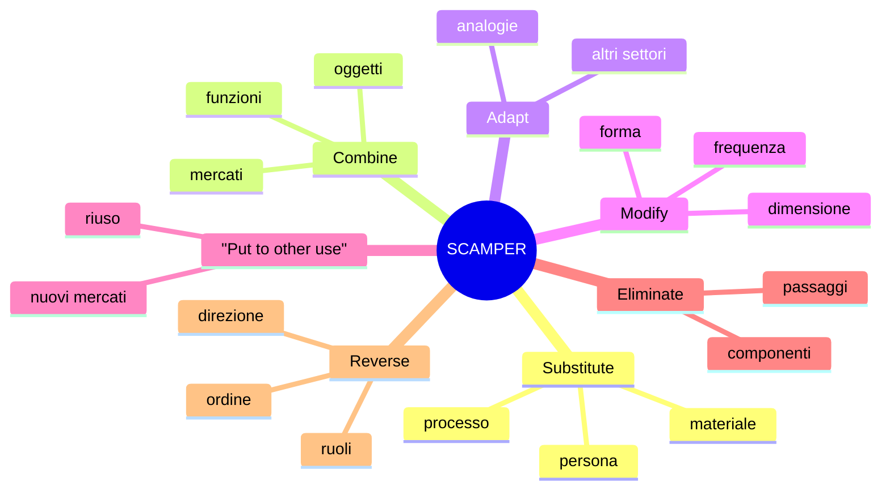
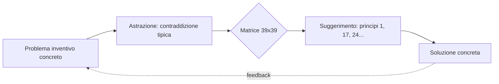

# Pensiero creativo: lateral thinking, TRIZ, SCAMPER

La creatività non è un dono accecante che tocca pochi eletti. È una **disciplina con metodi**, perfezionata nel Novecento da psicologi, ingegneri e formatori che hanno sistematizzato pratiche generative riproducibili. Edward de Bono in Inghilterra, Genrich Altshuller nell'URSS, Bob Eberle e Alex Osborn negli Stati Uniti, Tony Buzan: in trent'anni hanno trasformato l'"ispirazione" in tecniche insegnabili. Questa sezione le presenta come strumenti, non come religioni. Funzionano in modo diverso a seconda del problema e si combinano bene.

Premessa: nessuna di queste tecniche **sostituisce** il pensiero critico. Generano alternative; toccherà ad altri metodi ([standard di Paul-Elder](05-standard-paul-elder.html), [argomentazione di Toulmin](38-argomentazione-toulmin.html), test empirico) decidere quali tenere.

## 1. Edward de Bono: lateral vs vertical thinking

Edward de Bono (medico maltese, 1933-2021) introdusse nel 1967 il termine *lateral thinking*. La distinzione che propone è netta:

- **Vertical thinking** (verticale): selettivo, sequenziale, ogni passo deve essere giusto. Risponde alla domanda corretta in modo ottimale. È il pensiero logico classico.
- **Lateral thinking** (laterale): generativo, salta laterale, ammette passi "sbagliati" purché aprano nuove direzioni. Riformula la domanda.

Esempio canonico di de Bono: una ragazza deve scegliere un sassolino bianco o nero da un sacchetto truccato (entrambi neri) tenuto da un creditore. Vertical thinking → la ragazza ha perso. Lateral → estrae un sassolino, lo lascia "casualmente" cadere fra gli altri, e fa "dedurre" il colore da quello rimasto nel sacchetto. La regola del gioco resta formalmente rispettata.

Tecniche concrete di de Bono:

- **Provocation operator (PO)**: enunci una provocazione assurda ("PO: le automobili hanno ruote quadrate") e *lavori in avanti* a partire da quella, cercando idee utili sul percorso (sospensioni adattive, ruote che si deformano).
- **Random entry**: scegli a caso una parola da un dizionario e la costringi nel problema. Il vincolo arbitrario forza connessioni nuove.
- **Movement value**: invece di giudicare un'idea per il suo valore finale, giudicala per *quanto ti sposta* dallo schema corrente.

## 2. Six thinking hats

Sempre de Bono (*Six Thinking Hats*, 1985): un protocollo per riunioni che separa **modalità** di pensiero. Anziché dibattere tutti insieme su tutti i piani, tutti indossano metaforicamente lo stesso cappello per qualche minuto.

| Cappello | Modalità | Cosa fai |
|----------|----------|----------|
| Bianco | Dati | Solo fatti, numeri, lacune informative |
| Rosso | Emozioni | Intuizioni, sensazioni, gut feeling — senza giustificare |
| Nero | Critica | Rischi, problemi, ciò che può andare male |
| Giallo | Beneficio | Valore, opportunità, "perché potrebbe funzionare" |
| Verde | Creatività | Alternative, idee nuove, provocazioni |
| Blu | Meta | Gestione del processo, agenda, prossimi passi |

Il trucco è il **parallelismo**: in un dibattito tradizionale Alice critica e Bob difende, e nessuno dei due genera. Con il protocollo, in 5 minuti di cappello verde generano insieme; in 5 minuti di nero criticano insieme. Riduce conflitti personali, aumenta diversità di output.

## 3. SCAMPER

Bob Eberle (1971) codificò una checklist mnemonica per trasformare un oggetto/processo esistente:

- **S — Substitute**: sostituisci materiale, persona, processo. *Birra senza alcol.*
- **C — Combine**: combina due oggetti/funzioni. *Smartphone = telefono + fotocamera + browser.*
- **A — Adapt**: adatta un'idea da un altro dominio. *Velcro adattato dai semi di bardana.*
- **M — Modify (o Magnify/Minify)**: cambia forma, dimensione, frequenza. *Mini Cooper, smart TV.*
- **P — Put to other use**: nuovo uso per qualcosa di esistente. *Viagra nasce come farmaco cardiovascolare.*
- **E — Eliminate**: togli un componente. *Cordless, paperless, contactless.*
- **R — Reverse (o Rearrange)**: inverti, riarrangia. *Self-service: il cliente fa il lavoro del cameriere.*

Esempio applicato — "un'aula universitaria":

- Substitute: lavagna → tablet condiviso
- Combine: aula + caffetteria → spazio ibrido
- Adapt: configurazione amphitheatre dei teatri greci
- Modify: lezioni da 90 a 50 minuti
- Put to other use: aula come hub coworking nel weekend
- Eliminate: pareti (open space, aule modulari)
- Reverse: lo studente insegna, il docente ascolta (flipped classroom)

Sette nuove idee in due minuti, partendo da una lista mnemonica.

## 4. TRIZ di Altshuller

Genrich Altshuller (1926-1998), ingegnere sovietico, lavorando nell'ufficio brevetti della Marina analizzò centinaia di migliaia di brevetti cercando regolarità. Sintetizzò TRIZ (*Teorija Reshenija Izobretatel'skich Zadach*, "Teoria della risoluzione dei problemi inventivi") attorno a tre osservazioni:

1. I problemi inventivi sono **ricorrenti** fra domini diversi.
2. Le soluzioni si possono **classificare** in pochi schemi generali.
3. L'invenzione vera nasce dalla **contraddizione**.

**Le contraddizioni.** Una contraddizione tecnica si manifesta quando migliorare una caratteristica peggiora un'altra: rendere un'ala più rigida la rende anche più pesante. Una contraddizione fisica chiede a un parametro di essere "X e non-X" allo stesso tempo: la sedia dovrebbe essere robusta (massa elevata) e leggera da spostare (massa bassa).

**Matrice delle contraddizioni.** Altshuller compilò una matrice $39 \times 39$ (39 parametri tecnici standard) in cui ogni cella suggerisce alcuni dei **40 principi di invenzione** statisticamente più efficaci per quella coppia "migliorare-X / peggiorando-Y".

**Selezione dei 40 principi** (lista parziale):

1. Segmentazione
2. Estrazione
3. Qualità locale
4. Asimmetria
13. Inversione
15. Dinamicità
17. Transizione a un'altra dimensione
24. Mediazione
25. Auto-servizio
35. Cambio di stato della materia
40. Materiali compositi

Esempio del principio 1 (**segmentazione**): trasformare un oggetto unico in oggetti separati, aumentare il grado di frammentazione, renderlo modulare. Applicazioni: navi a doppio scafo, batterie a celle, ufficio open space → cubicoli, JSON → microservizi (sì, anche il software vi rientra), pallet → singoli pacchi.

TRIZ ha avuto fortuna nell'ingegneria russa, poi nell'industria occidentale (Samsung, Boeing, Procter & Gamble) dagli anni '90.

## 5. Brainstorming classico e varianti

Alex Osborn (*Applied Imagination*, 1953) inventò il brainstorming. Quattro regole:

1. Genera **quantità**, non qualità.
2. **Sospendi giudizio** durante la generazione.
3. Accogli idee **strane**.
4. **Combina** e migliora idee altrui ("piggyback").

La ricerca empirica (Diehl & Stroebe, 1987) ha mostrato che il brainstorming **di gruppo** produce meno idee del brainstorming individuale aggregato — *production blocking* (devi aspettare il turno) e *evaluation apprehension* (timore di giudizio) abbassano la produttività. Da qui le varianti:

- **Brainwriting**: ognuno scrive in silenzio, poi si scambiano i fogli e si aggiunge sopra le idee altrui.
- **6-3-5**: 6 persone, 3 idee ciascuno, 5 minuti per round, 6 round → 108 idee teoriche in 30 minuti.
- **Crazy 8s** (design): 8 sketch in 8 minuti, uno per minuto, costringe a non perfezionare.
- **Reverse brainstorming**: "come potremmo peggiorare X?" — spesso più liberatorio, e poi si inverte.

## 6. Mind mapping

Tony Buzan (1974) sistematizzò il mind mapping: parola centrale, rami principali, sotto-rami, con colori e immagini. Il razionale è cognitivo: la memoria episodica e semantica usa strutture associative non lineari, una lista bullet è un letto di Procuste.

Mermaid `mindmap` (vedi diagramma SCAMPER sopra) è una mind map digitale. Strumenti come MindMeister, Miro, Obsidian Canvas integrano la stessa logica.

## 7. Bisociazione (Koestler)

Arthur Koestler (*The Act of Creation*, 1964) propose la **bisociazione** come meccanismo unificato di creatività: l'incontro improvviso di due matrici di pensiero precedentemente non connesse. Una battuta che fa ridere ("L'umore di mia moglie peggiora con la luna piena, come quello dei lupi") collega la matrice "moglie" e la matrice "lupi mannari". Una scoperta scientifica (la struttura del benzene come ouroboros sognato da Kekulé) collega "anello chimico" e "serpente".

La pratica derivata: cerca due matrici molto distanti e forza un ponte. *Random entry* di de Bono è una versione automatizzata.

## 8. Quando usare cosa

| Situazione | Tecnica suggerita |
|------------|-------------------|
| Riunione che si avvita in conflitto | Six hats |
| Devi migliorare un prodotto esistente | SCAMPER |
| Hai una contraddizione ingegneristica precisa | TRIZ |
| Ti serve volume di idee in un'ora | Brainwriting / 6-3-5 |
| Devi mappare un dominio complesso | Mind mapping |
| Bloccato su un problema da settimane | Lateral / PO / random entry |
| Vuoi un meccanismo unificante per spiegare la creatività | Bisociazione |

Esercizio — applica SCAMPER a "il libro di testo scolastico"

Genera almeno 7 idee, una per lettera. Esempio di soluzione:

- **S**ubstitute: testo cartaceo → audiobook
- **C**ombine: testo + quiz interattivi + community → piattaforma sociale
- **A**dapt: stile graphic novel (vedi *La storia in graphic novel* di Zerocalcare per Repubblica)
- **M**odify: capitoli da 30 min letti su pausa caffè
- **P**ut to other use: il testo come libro divulgativo per adulti
- **E**liminate: niente esercizi finali; tutto integrato inline
- **R**everse: gli studenti scrivono il testo del prossimo anno (wiki didattico)

Ora applica TRIZ: c'è una contraddizione "deve essere completo (denso)" vs "deve essere accessibile (snello)"? Suggerisce principio 1 (segmentazione → moduli opzionali) e 17 (transizione a un'altra dimensione → percorso non-lineare con cross-link, esattamente questo sito).

## Sintesi

- Lateral thinking di de Bono rompe lo schema vertical-logico con provocazioni e ingressi casuali.
- Six thinking hats parallelizza modalità anziché contrapporle.
- SCAMPER è una checklist mnemonica veloce per trasformare un oggetto.
- TRIZ formalizza la creatività ingegneristica tramite contraddizioni e 40 principi statisticamente efficaci.
- Brainstorming di gruppo perde contro brainwriting individuale aggregato (Diehl-Stroebe).
- Bisociazione di Koestler: meccanismo unificante (due matrici lontane, un ponte).
- La creatività **genera**; il pensiero critico **filtra**: servono entrambi.

## Letture

- E. de Bono, *Lateral Thinking* (1967) e *Six Thinking Hats* (1985), Penguin.
- G. Altshuller, *The Innovation Algorithm*, Technical Innovation Center 1999.
- A. Osborn, *Applied Imagination*, Scribner 1953.
- A. Koestler, *The Act of Creation*, Hutchinson 1964.
- T. Buzan, *Use Your Head*, BBC Books 1974.
- M. Diehl, W. Stroebe, *Productivity Loss in Brainstorming Groups*, Journal of Personality and Social Psychology, 1987.
