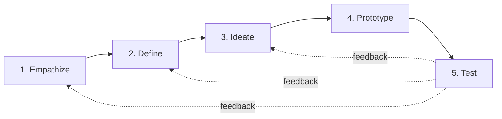
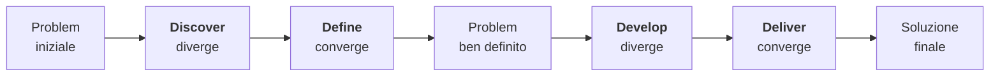

# Design thinking

Il *design thinking* è un protocollo di problem solving centrato sull'utente, codificato negli anni 2000 fra IDEO (l'agenzia di design fondata da David Kelley nel 1991) e la d.school di Stanford. Promette di portare le pratiche del design industriale dentro la business school, il settore pubblico e l'innovazione sociale. La promessa ha avuto un'enorme fortuna — IBM, SAP, Google, persino interi ministeri lo hanno adottato — e ha generato una contro-letteratura critica robusta. Questa sezione spiega il metodo come strumento utile e ne presenta i limiti senza ideologia.

Il punto-chiave del design thinking, distinto da altre tecniche di creatività ([sez. 29](29-pensiero-creativo.html)), è la centralità sistematica dell'**utente reale** e l'iterazione tramite **prototipi tangibili**. Niente specifiche teoriche da cento pagine: si parla con persone, si fa la versione di cartone, si testa, si rifà.

## 1. Origine: IDEO, Stanford, Tim Brown

IDEO nasce a Palo Alto nel 1991 dalla fusione di tre studi di design fondati da David Kelley e Bill Moggridge. Diventa famosa per progetti come il primo mouse Apple (1980), la spazzolina Oral-B per bambini, i carrelli della spesa per *ABC Nightline*. Tim Brown (CEO IDEO) populizza il termine *design thinking* nel libro omonimo (Harvard Business Review Press, 2009): non più una skill per designer professionisti, ma una mentalità trasferibile.

Parallelamente, alla Stanford d.school (Hasso Plattner Institute of Design, 2005, finanziata dal co-fondatore di SAP), Kelley codifica il **modello a 5 fasi** che si è imposto come standard didattico.

## 2. Le cinque fasi

Le frecce di feedback sono **non opzionali**: il design thinking è iterativo. Una "fine" del processo è raramente la fine; più spesso è un ciclo che produce la prossima domanda.

### Fase 1 — Empathize

Capire l'utente nel suo contesto. Non chiedendogli "cosa vuoi" (Henry Ford apocrifo: *"cavalli più veloci"*), ma osservandolo, ascoltandolo, vivendone l'esperienza.

Strumenti:

- **Interviste etnografiche**: domande aperte, contesto naturale, ascolto attivo. Dieci interviste qualitative danno più del 80% degli insight di un sondaggio da mille (Nielsen 1993).
- **Shadowing**: segui l'utente per un giorno.
- **Persona**: archetipo sintetico costruito da pattern delle interviste. Nome, foto, contesto, frustrazioni, obiettivi. "Marco, 47 anni, geometra che usa lo SPID controvoglia per pratiche edilizie".
- **Journey map**: la sequenza temporale di touchpoint dell'utente con il sistema, con emozioni associate ("dolore", "sollievo", "incertezza").
- **Empathy map**: cosa l'utente dice, fa, pensa, sente.

### Fase 2 — Define

Sintetizzare le osservazioni in un **point of view** (POV) e una **problem statement** non banale. Formato canonico:

> *"\[Persona] ha bisogno di \[bisogno verbale] perché \[insight sorprendente]"*

Esempio: *"Marco ha bisogno di sapere a colpo d'occhio se la pratica edilizia avanza, perché non si fida del 'in lavorazione' generico e teme sanzioni se sfora i tempi."*

Strumento centrale: **"How Might We…"** (HMW). Riformulare il problema in domande aperte e ottimistiche.

> *Come potremmo restituire visibilità in tempo reale dello stato della pratica?*
> *Come potremmo dare a Marco controllo senza sovraccaricare il sistema?*

Una buona HMW non è troppo larga ("come migliorare la PA?") né troppo stretta ("come aggiungere un timestamp al log?"): sta nel mezzo.

### Fase 3 — Ideate

Generazione di alternative. Si applicano le tecniche della [sez. 29](29-pensiero-creativo.html): brainstorming, SCAMPER, crazy 8s, brainwriting. Regola d'oro: **quantità prima di qualità**. Una sessione tipica produce 50-200 idee in un'ora.

Selezione: dot voting (ognuno mette tre adesivi sulle proprie preferite), oppure griglia 2×2 (es. fattibilità × impatto).

### Fase 4 — Prototype

"If a picture is worth a thousand words, a prototype is worth a thousand pictures" (David Kelley). Fai la versione **brutta e cheap**:

- *Paper prototyping*: wireframe disegnati a mano, l'utente "clicca" toccando il foglio.
- *Storyboard*: la sequenza dell'esperienza in vignette.
- *Roleplay*: per servizi (sportello, call center), interpretate operatore e utente.
- *Lo-fi digital*: Figma, Balsamiq, semplici click-prototype.

Costo di un prototipo paper: 30 minuti. Costo di un MVP frontend: 2-3 giorni. Costo di un prodotto vero: mesi. Il design thinking insiste sul prototipare ai gradini più bassi della scala il più a lungo possibile.

### Fase 5 — Test

Sottoponi il prototipo a 3-5 utenti reali. Nielsen ha dimostrato (1993, *Mathematical Model of the Finding of Usability Problems*) che con 5 utenti scopri circa l'85% dei problemi di usabilità: il rendimento marginale decresce in fretta. Meglio fare 3 round da 5 utenti che 1 round da 15.

Strumento: **usability test** classico. L'utente prova il prototipo pensando ad alta voce; il facilitatore non aiuta, prende appunti, fa domande aperte alla fine. Si registrano: task completati, errori, tempo, citazioni testuali.

## 3. Double Diamond

Il modello del **Design Council** britannico (2005) propone una variante in due diamanti:

Le due fasi divergenti aprono lo spazio (delle interviste, delle soluzioni); le due convergenti lo chiudono (definizione, scelta finale). La metafora visiva del doppio diamante è più mnemonica delle 5 fasi e fa capire che ogni divergenza esige una convergenza: senza chiusura, paralisi.

## 4. Esempio applicato: ridisegnare il pronto soccorso

Caso reale ispirato a IDEO + Mayo Clinic (2008) e a progetti di service design ospedaliero italiano.

**Empathize.** Cinque settimane di shadowing in tre PS metropolitani. Si scopre che il punto più doloroso *non* è il tempo di attesa medio (3 ore), ma l'**incertezza**: i pazienti non sanno se sono i prossimi, se sono stati dimenticati, se peggiorare li sposterebbe avanti. Le persona emergono: "Maria 73 anni, codice verde, dolore al fianco, ansia per il figlio che la aspetta a casa".

**Define.** HMW: *"Come potremmo dare a Maria la sensazione di essere vista e di sapere dove sta nella coda?"* Non *"come ridurre i tempi"* — quello sarebbe un problema operativo diverso.

**Ideate.** Brainwriting + crazy 8s producono 70 idee. Selezione: app con stato della coda, schermi pubblici con codici e tempi stimati, totem self check-in, "buddy nurse" che ogni 30 minuti passa a confermare la presenza dei verdi, sale d'attesa segmentate per codice triage, cartellini RFID, sale di compostezza con musica calma.

**Prototype.** Paper prototype di app + tabellone pubblico, simulato con un proiettore e un volontario che aggiorna manualmente. Costo: 200 € e tre giorni.

**Test.** Otto pazienti volontari in turno notturno. L'app è meno usata del previsto (anziani non smartphone-native); il tabellone è dirompente; il "buddy" è il singolo strumento più apprezzato. Iteriamo: si torna a Define con il nuovo insight che il bisogno principale è **relazionale**, non informativo.

## 5. Iterazione e mindset

Tre principi trasversali:

- **Bias to action**: meglio una iterazione di prototipo cattivo che un mese di slide.
- **Embrace ambiguity**: stare nel non-sapere senza saltare alla soluzione.
- **Show, don't tell**: comunicare con artefatti, non con descrizioni.

E uno meno enunciato ma altrettanto importante: **radical collaboration** (Kelley). Team multidisciplinari, niente gerarchia rigida nelle fasi divergenti.

## 6. Critiche al design thinking

Negli anni '20 del Duemila è cresciuta una contro-letteratura. Le critiche principali:

1. **Mancanza di evidenza empirica robusta**. Iskander (HBR 2018, *Design Thinking is Fundamentally Conservative*) sostiene che il metodo, centrandosi sull'utente esistente, *conserva* il sistema. Innovazioni radicali (l'iPhone, la stampa) sono nate da visione "spingitiva", non da empatia con utenti che chiedevano "telefoni con tasti migliori".
2. **Soluzionismo**. Morozov critica l'idea che ogni problema sociale (povertà, sanità) sia "design-thinkable". Wicked problems ([sez. 48](48-wicked-problems.html)) resistono per definizione a soluzioni iterative.
3. **Industria del consulting**. Lee Vinsel e Andrew Russell (*The Innovation Delusion*, 2020) accusano il design thinking di essere diventato un prodotto venduto a peso d'oro dai grandi consulenti, con risultati misurabili limitati: la fase di prototyping resta superficiale e raramente porta a innovazione strutturale, perché i clienti chiedono workshop colorati, non cambiamenti dolorosi.
4. **Estetizzazione**. Post-it muri colorati e Stabilo si sostituiscono al lavoro analitico. Una HMW elegante non vale un'analisi causale rigorosa.
5. **Cooptazione neoliberale**. Boltanski-Chiapello (*Le nouvel esprit du capitalisme*, 1999) avevano già descritto come la critica artistica/creativa venga assorbita dal management; il design thinking è un caso da manuale.

La risposta sana è **strumentale**: usare il design thinking dove serve (ridisegno di esperienze utente, servizi pubblici front-end, prodotti consumer maturi), evitarlo dove non serve (sviluppo di algoritmi nuovi, riforme istituzionali profonde, problemi tecnici hard).

Esercizio — applica le 5 fasi all'iscrizione universitaria online

**Empathize.** Identifica 3 persona: "Sara 19 enne fuori sede, iscrive da casa", "Paolo 45 enne lavoratore, master serale", "Aisha 22 enne con titolo estero da convalidare". Per ciascuna, fai 3 domande aperte su frustrazioni nell'iscrizione.

**Define.** HMW iniziale: *"Come potremmo fare in modo che Aisha sappia, prima di pagare le tasse, se il suo titolo sarà accettato?"*

**Ideate.** 20 idee minime. Esempi:
- Chatbot multilingua per pre-check titoli
- Simulatore "se carico questi documenti, è tutto a posto?"
- Video tutorial da 90 secondi per persona
- Job aid PDF da una pagina, no manuale da 40
- Stato pratica con timestamp e "prossimo passo: tu / noi"
- Help desk slot prenotabile

**Prototype.** Disegna a mano lo schermo di un "stato pratica" e un job aid una-pagina.

**Test.** Cinque studenti reali, anche dal vivo all'ingresso della segreteria. Cosa rompe? Quante volte chiedono aiuto? Cosa elogiano?

Itera. Probabile insight: il "prossimo passo: tu / noi" è il più amato; lo si genalizza all'intera app.

## 7. Quando NON è la risposta

| Contesto | Approccio migliore |
|----------|---------------------|
| Algoritmo da rendere $10\times$ più veloce | [Strategie algoritmiche](28-algoritmi-strategie.html) |
| Causa-effetto in epidemiologia | [Causalità di Pearl](45-causalita-pearl.html) |
| Problema sistemico (criminalità, dipendenze) | [Systems thinking](47-systems-thinking.html) + [wicked problems](48-wicked-problems.html) |
| Politica pubblica con stakeholder antagonisti | Negoziazione e [teoria dei giochi](41-negoziazione-teoria-giochi.html) |
| Ottimizzazione misurabile (CTR, conversione) | A/B testing e ottimizzazione statistica |

## Sintesi

- 5 fasi: empathize, define, ideate, prototype, test. Iterative.
- Strumenti per fase: persona, journey map, HMW, crazy 8s, paper prototype, usability test (Nielsen: 5 utenti bastano).
- Double diamond (Design Council): diverge-converge-diverge-converge.
- Funziona meglio su esperienze utente e servizi maturi; fallisce su wicked problems e innovazione visionaria.
- Critiche legittime: conservatorismo, soluzionismo, estetizzazione, industria del consulting.
- Strumento, non religione: usalo quando il problema è centrato sull'utente, lascialo perdere quando non lo è.

## Letture

- T. Brown, *Change by Design*, HarperBusiness 2009.
- D. Kelley, T. Kelley, *Creative Confidence*, Crown Business 2013.
- J. Nielsen, *Usability Engineering*, Academic Press 1993.
- Design Council UK, *Eleven Lessons: Managing Design in Eleven Global Brands* (2005) — origine del double diamond.
- L. Iskander, *Design Thinking is Fundamentally Conservative*, Harvard Business Review, settembre 2018.
- L. Vinsel, A. Russell, *The Innovation Delusion*, Currency 2020.
