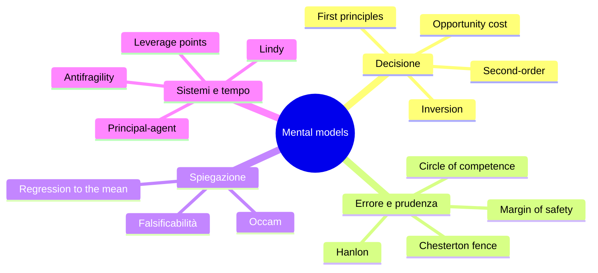

# Mental models: modelli mentali

Charlie Munger (vicepresidente di Berkshire Hathaway, socio di Warren Buffett dal 1978 al 2023) ha reso celebre l'espressione *"latticework of mental models"*: un reticolo di modelli concettuali presi da discipline diverse — fisica, biologia, psicologia, economia, ingegneria — che il ragionatore esperto applica al volo per illuminare problemi reali. La sua tesi, esposta nel discorso *"A Lesson on Elementary, Worldly Wisdom"* (USC Business School, 1994), è che chi conosce uno o due modelli vede ovunque il chiodo per il suo martello (vedi *legge dello strumento* di Maslow), mentre chi padroneggia ottanta o cento modelli ragiona con flessibilità e si arrocca di rado.

La comunità online di **Farnam Street** (Shane Parrish) ha pubblicato dal 2008 una serie di articoli e libri (*The Great Mental Models*, 4 volumi, 2019-2023) che hanno popolarizzato il concetto fino a renderlo una moda di Silicon Valley. Come per il design thinking ([sez. 30](30-design-thinking.html)), serve discernere: alcuni modelli sono solidi e antichi, altri sono brand di consulenti, altri ancora sono utili in piccola dose e tossici se assolutizzati.

Questa sezione presenta **15 modelli** che hanno superato il test del tempo, con esempio applicato e collegamenti al resto del corso.

## 1. First principles (Aristotele → Musk)

**Definizione.** Decomporre un problema fino agli assiomi indubitabili e ricostruire da lì, ignorando convenzioni e analogie.

Aristotele lo chiama *archai* (*Metafisica* IV); Cartesio lo riformula nel *Discorso sul metodo* (1637). Elon Musk lo ha popolarizzato sostenendo di aver progettato i razzi SpaceX scomponendo il costo nei materiali grezzi (alluminio, carbonio, titanio) anziché accettare il prezzo di mercato di un razzo finito.

**Esempio.** *"Perché in ufficio si lavora 9–18?"* Analogia: *"È così che si è sempre fatto."* Primi principi: di cosa ha bisogno un lavoro di conoscenza per produrre? Concentrazione, sincronia con colleghi, riposo. La risposta cambia.

## 2. Second-order thinking

**Definizione.** Chiediti non solo *"cosa succede dopo?"* ma *"…e poi cosa succede?"* per due o tre livelli.

Howard Marks (Oaktree Capital, *The Most Important Thing*, 2011) lo ha codificato per gli investitori. È un antidoto contro le politiche "ovviamente buone" che hanno effetti collaterali distruttivi.

**Esempio.** Sussidiare il prezzo del pane (primo ordine: poveri più sazi) → produttori riducono varietà e qualità (secondo) → mercato nero e razionamento (terzo). Storia ricorrente nell'URSS post-1917 e in Venezuela post-2003.

## 3. Inversion (Jacobi)

**Definizione.** *"Man muss immer umkehren"*, dice Carl Jacobi (matematico, 1804-1851): bisogna sempre invertire. Anziché chiedere "come avere successo?", chiedi "cosa garantirebbe il fallimento?" ed evitalo.

**Esempio.** Vuoi un matrimonio felice? Lista delle cause di matrimoni falliti (slealtà, finanze opache, mancato dialogo). Evitarle è più facile che inseguire la felicità.

Munger lo applica in finanza: *"Tell me where I'm going to die so I'll never go there."*

## 4. Opportunity cost

**Definizione.** Il costo vero di una scelta non è ciò che paghi, è ciò a cui rinunci. Concetto centrale nell'economia austriaca (Wieser, *Der natürliche Werth*, 1889).

**Esempio.** Master da 40.000 € sembra il costo. Aggiungi: due anni di stipendio mancato (60.000 €), opportunità professionali alternative, interessi composti sul risparmio. Costo opportunità reale: 120.000+ €. Solo allora decidi se conviene.

Cross-link: [Teoria della decisione](35-teoria-decisione.html).

## 5. Margin of safety

**Definizione.** Benjamin Graham (*Security Analysis*, 1934): non investire mai quando il margine fra valore intrinseco e prezzo è sottile. Il margine assorbe errori di stima.

In ingegneria si chiama *coefficiente di sicurezza*: un ponte progettato per 100 kN si calcola per 300 kN. In medicina, la dose terapeutica è ben sotto la dose tossica.

**Esempio.** Pianifichi un viaggio dall'aeroporto: tragitto 45 min, partono check-in 60 min prima. Arrivare 60 min prima del check-in dà margine di sicurezza per ingorghi, code, ritardi.

## 6. Circle of competence

**Definizione.** Buffett (Berkshire Hathaway annual letter, 1996): *"You don't have to be an expert on every company, or even many. You only have to be able to evaluate companies within your circle of competence."*

Tre regole: (1) conosci il perimetro del cerchio, (2) resta dentro, (3) espandilo lentamente e con onestà.

**Esempio.** Buffett non investì in Microsoft o Amazon per decenni: fuori dal suo cerchio (capì le banche, le assicurazioni, il consumer goods). Una rinuncia coerente vale molto.

## 7. Hanlon's razor

**Definizione.** *"Mai attribuire alla malizia ciò che è adeguatamente spiegabile dall'incompetenza."* Attribuito a Robert Hanlon (1980) ma anticipato da Goethe, Heinlein, Napoleone (*"never ascribe to malice that which can be explained by stupidity"*).

**Esempio.** Il collega non ha incluso te nella mail importante. Cospirazione? Quasi sempre no: dimenticanza, lista a memoria, distrazione. Reagire come se fosse cospirazione genera profezie autoavveranti.

Cross-link: [Bias cognitivi](23-bias-cognitivi.html) — fundamental attribution error.

## 8. Rasoio di Occam

**Definizione.** Guglielmo di Occam (XIV secolo): *"Entia non sunt multiplicanda praeter necessitatem"*, non moltiplicare gli enti oltre il necessario. Fra ipotesi che spiegano lo stesso fenomeno, preferisci la più parsimoniosa.

Formalizzazione moderna: Minimum Description Length (Rissanen 1978), Solomonoff induction.

**Esempio.** Statua piange. Ipotesi A: condensa di umidità su occhi metallici. Ipotesi B: miracolo + violazione della seconda legge della termodinamica + entità soprannaturali + reasonable doubt circa lo storico Hume. Occam preferisce A.

Attenzione: Occam non dice "la spiegazione semplice è vera". Dice "preferiscila *a parità di potere esplicativo*". Cross-link: [Metodo scientifico di Popper](43-metodo-scientifico-popper.html).

## 9. Chesterton's fence

**Definizione.** G.K. Chesterton (*The Thing*, 1929): se trovi una recinzione in mezzo a un campo e non sai perché stia lì, non rimuoverla. Prima scopri perché qualcuno l'ha messa. *Poi*, magari, rimuovila.

**Esempio.** Refactoring di codice legacy. Il giovane ingegnere vede un blocco "inutile" e lo cancella. Tre settimane dopo si scopre che gestiva un edge case in produzione che capita ogni 800 transazioni. Antidoto: prima capire, poi modificare.

## 10. Antifragilità (Taleb)

**Definizione.** Nassim Taleb (*Antifragile*, 2012) introduce un termine nuovo: *antifragile* è ciò che **guadagna** dallo stress, dalla volatilità, dagli errori. Distinto da:

- *fragile* (peggiora con stress, es. cristallo)
- *robusto/resiliente* (resiste senza migliorare, es. fenice)
- *antifragile* (migliora con stress, es. muscolo, sistema immunitario, evoluzione)

**Esempio.** Una start-up con molti piccoli esperimenti è antifragile (impara dai fallimenti); una start-up monolite "all-in" è fragile. Una città con tante librerie indipendenti è antifragile a una chiusura; con una sola catena, fragile.

Cross-link: [Knightian uncertainty e cigni neri](37-knightian-cigni-neri.html).

## 11. Lindy effect

**Definizione.** Per cose **non deperibili** (libri, idee, tecnologie), l'aspettativa di vita futura è proporzionale all'età. Un libro che si legge da 2000 anni probabilmente si leggerà altri 2000; un libro uscito ieri ha probabilità alta di sparire entro l'anno.

Origine: deli Lindy a New York, articolo di Albert Goldman (1964) sui comici. Formalizzato da Mandelbrot e Taleb.

**Esempio.** Devi imparare un linguaggio di programmazione che durerà. Confronto: SQL (1974, Lindy ≈ decenni) vs il framework hype del mese (Lindy ≈ mesi). Bias verso il vecchio nelle cose immateriali.

## 12. Leverage points (Donella Meadows)

**Definizione.** Donella Meadows (*Thinking in Systems*, 2008) elenca 12 punti di leva in un sistema, dal meno potente al più potente: parametri, magazzini, ritardi, feedback negativi, feedback positivi, struttura informativa, regole, autoorganizzazione, **obiettivi**, paradigma, transcendere i paradigmi.

**Esempio.** Vuoi ridurre il traffico in una città. Modificare il prezzo del parcheggio (leva debole) vs ripensare l'urbanistica (leva forte) vs ripensare se *l'idea stessa* di pendolarismo è desiderabile (leva fortissima, lenta).

Cross-link: [Systems thinking](47-systems-thinking.html).

## 13. Principal-agent problem

**Definizione.** Quando A (*principal*) delega a B (*agent*), l'incentivo di B non è automaticamente allineato a quello di A: ne nasce un costo (agency cost). Studiato da Jensen e Meckling (1976), centrale in corporate governance.

**Esempio.** Azionista (principal) — CEO (agent): il CEO può privilegiare bonus a breve sui dividendi a lungo. Soluzione: stock options vesting a 10 anni. Elettore — politico, paziente — medico, cliente — consulente: stessa struttura. Capirlo cambia il modo di progettare contratti.

## 14. Falsificabilità (Popper)

**Definizione.** Karl Popper (*Logik der Forschung*, 1934): una teoria è scientifica solo se è falsificabile, cioè se esistono osservazioni che, se occorressero, la confuterebbero. Una teoria non falsificabile non è "molto vera": è semplicemente fuori dal dominio della scienza.

**Esempio.** *"Tutti i corvi sono neri"* è falsificabile (basta un corvo bianco). *"Tutto accade per un motivo"* non lo è: ogni esito conferma la tesi.

Trattazione completa: [Metodo scientifico di Popper](43-metodo-scientifico-popper.html).

## 15. Regression to the mean

**Definizione.** Francis Galton (*Regression Towards Mediocrity in Hereditary Stature*, 1886): valori estremi tendono a essere seguiti da valori più vicini alla media.

**Esempio (Kahneman).** Istruttore di volo nota: gli allievi che lodi dopo un atterraggio brillante peggiorano alla volta successiva; quelli che rimproveri dopo uno pessimo migliorano. Conclude (erroneamente) che la lode danneggia e il rimprovero migliora. In realtà: regressione alla media. Performance estreme sono in parte rumore; il valore successivo è atteso più vicino al talento medio dell'allievo.

Cross-link: [Probabilità: fondamenti](32-probabilita-fondamenti.html), [Forecasting](36-forecasting-calibrazione.html).

## Mappa

## Quando un modello mentale diventa moda

Il rischio del culto Farnam Street è citarli senza usarli. Test rapido per distinguere:

| Modello utile | Modello-moda |
|---------------|---------------|
| Cambia ciò che fai questa settimana | Lo posti su LinkedIn |
| Genera predizioni falsificabili | È applicabile sempre, *post hoc* |
| Riduci usi al diminuire della rilevanza | Lo applichi a tutto |
| Hai esempi di volte in cui *non* si applica | È universale per definizione |

Munger stesso avvertiva: il latticework è utile perché **multi-disciplinare**, non perché vasto. Quaranta modelli da otto discipline diverse battono cento modelli tutti dallo stesso libro di management.

Esercizio — analizza una decisione recente con 4 modelli diversi

Prendi una decisione che hai preso o devi prendere (cambiare lavoro, comprare casa, iscriverti a un corso). Analizzala con:

1. **First principles**: quali sono i bisogni primari, separati dalle convenzioni?
2. **Inversion**: cosa garantirebbe il fallimento? Come evitarlo?
3. **Opportunity cost**: a cosa stai rinunciando?
4. **Second-order**: se tutto va come pensi, cosa succede *dopo*?

Tieni il foglio. Tra 6 mesi rileggilo. Annota quale dei quattro è stato il più predittivo per la tua decisione concreta.

Esempio: "cambio lavoro per uno stipendio +20%".
- First principles: ho bisogno di soldi, autonomia, senso, relazioni. +20% indirizza solo i soldi.
- Inversion: cosa garantisce il fallimento? Capo tossico, pendolarismo nascosto, contratto che non rispetta le promesse. Verificare.
- Opportunity cost: rinuncio a colleghi attuali, conoscenza del dominio, vesting di bonus pendenti.
- Second-order: dopo 6 mesi nel nuovo lavoro, dove sarò? Cambierà di nuovo? Sono in carriera o in fuga?

I quattro modelli convergono o divergono? Se divergono, c'è informazione lì.

## Sintesi

- Munger: usa molti modelli da molte discipline, evita il martello unico.
- 15 modelli "che hanno superato il test del tempo": first principles, second-order, inversion, opportunity cost, margin of safety, circle of competence, Hanlon, Occam, Chesterton's fence, antifragility, Lindy, leverage points, principal-agent, falsificabilità, regression to the mean.
- Ogni modello viene da una disciplina con un'eredità seria (filosofia, finanza, statistica, ecologia, fisica).
- Test "utile vs moda": cambia ciò che fai? Genera predizioni falsificabili? Sai quando *non* si applica?
- Il vero potere è la **combinazione**: applicarne 3-4 a una decisione e vedere se convergono.

## Letture

- C. Munger, *Poor Charlie's Almanack*, Donning 2005 (raccolta dei suoi discorsi).
- S. Parrish, R. Beaubien, *The Great Mental Models* (4 volumi), Latticework Publishing 2019-2023.
- N. N. Taleb, *Antifragile*, Random House 2012.
- D. Meadows, *Thinking in Systems*, Chelsea Green 2008.
- B. Graham, *The Intelligent Investor*, HarperBusiness 1949 (per margin of safety).
- D. Kahneman, *Thinking, Fast and Slow*, Farrar Straus and Giroux 2011 (regression to the mean).
