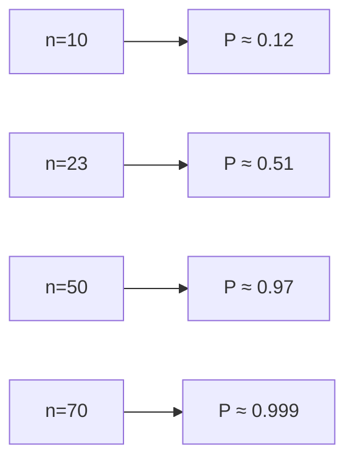

# Probabilità: fondamenti per il ragionamento

La probabilità non è "quante probabilità ci sono". È un'estensione della logica al ragionamento sotto incertezza (Cox 1946, Jaynes 2003). Pensare probabilisticamente è la differenza tra dire "potrebbe accadere" e quantificare quanto.

## 1. Gli assiomi di Kolmogorov (1933)

Lo spazio campionario $\Omega$ è l'insieme di tutti gli esiti possibili. Un **evento** $A \subseteq \Omega$. La probabilità $P$ è una funzione che assegna a ogni evento un numero in $[0,1]$ tale che:

1. **Non-negatività**: $P(A) \ge 0$ per ogni $A$.
2. **Normalizzazione**: $P(\Omega) = 1$.
3. **σ-additività**: per eventi disgiunti $A_1, A_2, \ldots$, $P(\bigcup A_i) = \sum P(A_i)$.

Da questi tre assiomi derivi tutto il resto: $P(\emptyset) = 0$, $P(A^c) = 1 - P(A)$, $P(A \cup B) = P(A) + P(B) - P(A \cap B)$.

## 2. Le quattro interpretazioni

Le formule sono le stesse, ma cosa "significa" $P=0{,}3$?

**Classica (Laplace)**: rapporto fra casi favorevoli e possibili, *quando sono equiprobabili*. Adatta a dadi, mazzi di carte. Circolare in casi reali (chi decide cos'è "equiprobabile"?).

**Frequentista (von Mises, Fisher)**: limite della frequenza relativa su ripetizioni indipendenti. $P(\text{testa}) = 0{,}5$ significa "su infiniti lanci, metà sono teste". Inapplicabile a eventi non ripetibili ("probabilità che pioverà domani").

**Soggettiva / bayesiana (de Finetti, Ramsey, Savage)**: grado di credenza coerente di un agente razionale. $P=0{,}3$ = "sarei indifferente fra una scommessa che paga 1 € se l'evento accade e una che paga 0,3 € sicuri". Operativa via le scommesse di de Finetti.

**Propensità (Popper)**: tendenza fisica di un sistema a produrre un esito. Es: "la moneta è truccata col 60% di tendenza a testa". Più ontologica che operativa.

Le moderne applicazioni in scienza e AI usano principalmente l'interpretazione bayesiana, perché si applica a eventi singoli e ammette aggiornamento (vedi [Bayes](33-teorema-bayes.html)).

## 3. Probabilità condizionale

$$P(A \mid B) = \frac{P(A \cap B)}{P(B)} \quad \text{(se } P(B) > 0\text{)}$$

"Probabilità di $A$ sapendo che $B$ è accaduto". Restringe lo spazio campionario a $B$.

Esempio: lancio due dadi. $P(\text{somma} = 7) = 6/36$. Ma $P(\text{somma} = 7 \mid \text{primo dado} = 4) = 1/6$ (devo ottenere 3 col secondo).

### 3.1 Regola del prodotto

$$P(A \cap B) = P(B) \cdot P(A \mid B) = P(A) \cdot P(B \mid A)$$

Iterando: $P(A_1 \cap \ldots \cap A_n) = P(A_1) \cdot P(A_2 \mid A_1) \cdot P(A_3 \mid A_1 \cap A_2) \cdots$.

### 3.2 Legge della probabilità totale

Se $B_1, \ldots, B_n$ partizionano $\Omega$:

$$P(A) = \sum_i P(A \mid B_i) \cdot P(B_i)$$

Utile per "marginalizzare" sopra una variabile sconosciuta.

## 4. Indipendenza

$A$ e $B$ sono **indipendenti** se $P(A \cap B) = P(A) \cdot P(B)$, equivalentemente $P(A \mid B) = P(A)$.

**Attenzione**: indipendenza ≠ esclusione mutua. Eventi mutuamente esclusivi (non possono accadere insieme) sono al limite massimo di *dipendenza*, non di indipendenza.

Esempio cruciale: l'**indipendenza condizionale**. $A$ e $B$ possono essere dipendenti (correlati) eppure indipendenti dato $C$: $P(A \cap B \mid C) = P(A \mid C) P(B \mid C)$. Vedi [Pearl e causalità](45-causalita-pearl.html): il confounder $C$ spiega via la correlazione tra $A$ e $B$.

## 5. Variabile aleatoria, distribuzione

Una **variabile aleatoria** $X: \Omega \to \mathbb{R}$ è una funzione che assegna un numero a ogni esito. Es: $X$ = somma di due dadi.

**Distribuzione di probabilità**: per il caso discreto, $p(x) = P(X = x)$. Per il continuo, la **funzione di densità** $f(x)$ con $P(a \le X \le b) = \int_a^b f(x)\,dx$.

Distribuzioni canoniche: Bernoulli, binomiale, Poisson, geometrica (discrete); uniforme, normale, esponenziale, beta (continue).

## 6. Valor atteso e varianza

$$\mathbb{E}[X] = \sum_x x \cdot p(x) \quad \text{(discreto)} \qquad \mathbb{E}[X] = \int x \cdot f(x)\,dx \quad \text{(continuo)}$$

Il "valore medio" pesato dalle probabilità. Per il dado: $\mathbb{E}[X] = (1+2+3+4+5+6)/6 = 3{,}5$.

**Varianza**:

$$\text{Var}(X) = \mathbb{E}[(X - \mathbb{E}[X])^2] = \mathbb{E}[X^2] - (\mathbb{E}[X])^2$$

Misura la dispersione attorno alla media. Lo **scarto quadratico medio** $\sigma = \sqrt{\text{Var}(X)}$ ha le stesse unità di $X$.

**Linearità dell'attesa**: $\mathbb{E}[aX + bY] = a\mathbb{E}[X] + b\mathbb{E}[Y]$, sempre, anche se $X, Y$ non indipendenti. La varianza invece NON è lineare: $\text{Var}(X + Y) = \text{Var}(X) + \text{Var}(Y)$ solo se $X, Y$ indipendenti (in generale c'è un termine di covarianza).

## 7. Esempio: il paradosso dei compleanni

In una stanza con $n$ persone, qual è la probabilità che almeno due abbiano lo stesso compleanno?

$$P(\text{collisione}) = 1 - P(\text{tutti diversi}) = 1 - \frac{365 \cdot 364 \cdots (365 - n + 1)}{365^n}$$

Per $n = 23$, la probabilità supera 0,5. Per $n = 50$, è circa 0,97. Contro-intuitivo: la gente stima molto più basso. Vedi [paradossi probabilistici](34-paradossi-probabilistici.html).

## 8. Correlazione ≠ causalità

Due variabili possono essere **correlate** (es. coefficiente di Pearson $\rho \ne 0$) senza che una causi l'altra. La correlazione misura la co-variazione lineare:

$$\rho_{X,Y} = \frac{\text{Cov}(X,Y)}{\sigma_X \sigma_Y} \in [-1, 1]$$

Esempi famosi: vendita di gelati e annegamenti (entrambe causate dall'estate); numero di Nicolas Cage film e annegamenti in piscine (puro caso). Vedi [causalità](45-causalita-pearl.html) per la teoria che separa.

## Esercizi

  
Esercizio 1 — Lancio una moneta equa 3 volte. Probabilità di ottenere almeno una testa?

$P(\text{almeno 1 testa}) = 1 - P(\text{0 teste}) = 1 - (1/2)^3 = 7/8 = 0{,}875$.

  
Esercizio 2 — Estraggo 2 carte da un mazzo di 52 senza reinserimento. Probabilità che entrambe siano assi?

$P = \frac{4}{52} \cdot \frac{3}{51} = \frac{12}{2652} = \frac{1}{221} \approx 0{,}0045$.

  
Esercizio 3 — $X$ è il numero di teste in 4 lanci di moneta equa. Calcola $\mathbb{E}[X]$ e $\text{Var}(X)$.

$X \sim \text{Binomiale}(4, 0{,}5)$. $\mathbb{E}[X] = np = 4 \cdot 0{,}5 = 2$. $\text{Var}(X) = np(1-p) = 4 \cdot 0{,}5 \cdot 0{,}5 = 1$.

## Sintesi

- Tre assiomi (Kolmogorov): non-neg, normalizzazione, σ-additività. Da lì discende tutto.
- Quattro interpretazioni: classica, frequentista, soggettiva (bayesiana), propensità.
- $P(A \mid B) = P(A \cap B)/P(B)$, regola del prodotto, probabilità totale.
- Indipendenza: $P(A \cap B) = P(A)P(B)$. Diversa da esclusione mutua.
- Variabile aleatoria, distribuzione, valor atteso, varianza, σ.
- Correlazione ≠ causalità.

## Letture

- Kolmogorov, *Foundations of the Theory of Probability* (1933).
- Jaynes, *Probability Theory: The Logic of Science* (2003).
- Tijms, *Understanding Probability* (2012) — manuale moderno.
- Ross, *A First Course in Probability* — standard universitario.
